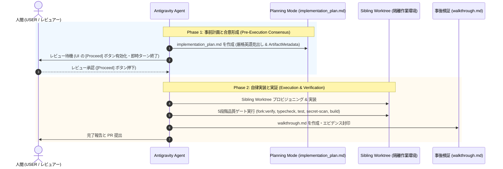

# Google Antigravity Two-Phase Governance Skill

本スキルは、**Google Antigravity 環境** において AI エージェントの自律変更を安全に統制し、UI 上の **`[Proceed]` ボタンを決定論的に発火させるための「二段階ガバナンス (Two-Phase Evidence & Review)」** 手続きを規定します。



---

## 1. Phase 1: 事前計画と人間承認 (Planning Mode)

エージェントはいかなる非自明なソースコード変更も、人間による明示的承認（`[Proceed]` ボタンの押下）を得る前に行ってはなりません。

### Proceed ボタンを確実に発火させるための 4 大鉄則

Antigravity の UI パーサーが `implementation_plan.md` を「実行可能計画」と認識して `[Proceed]` ボタンを表示するためには、以下の 4 条件の **100% 同時達成** が必須です。

1. **正規パスへの配置**:
   - 配置パス: `<appDataDir>\brain\<conversation-id>/implementation_plan.md`
   - ワークスペース配下（例: `docs/...`, `.devs/...` 等）ではなく、必ず Antigravity 公式の brain ディレクトリに出力すること。

2. **必須英語見出しの完全一致（翻訳・改変・独自追加による置換の全面禁止）**:
   - UI パーサーは以下の **英語見出し** を正規表現で検出します。日本語化（例: `## 提案される変更` や `## 検証計画` 等）したり、独自の見出し体系に置き換えるとパーサーをすり抜け、**`[Proceed]` ボタンが完全に消滅** します。
   - 以下の完全テンプレートを厳格に維持してください：

   ```markdown
   # [Goal Description]

   Provide a brief description of the problem, any background context, and what the change accomplishes.

   ## User Review Required

   Document anything that requires user review or feedback, for example, breaking changes or significant design decisions. Use GitHub alerts (IMPORTANT/WARNING/CAUTION) to highlight critical items.

   ## Open Questions

   Any clarifying or design questions for the user that will impact the implementation plan. (If none, explicitly write "None".)

   ## Proposed Changes

   Group files by component (e.g., package, feature area, dependency layer) and order logically (dependencies first). Separate components with horizontal rules for visual clarity.

   ### [Component Name]

   Summary of what will change in this component, separated by files:
   #### [MODIFY] [file basename](file:///absolute/path/to/modifiedfile)
   #### [NEW] [file basename](file:///absolute/path/to/newfile)
   #### [DELETE] [file basename](file:///absolute/path/to/deletedfile)

   ## Verification Plan

   Summary of how you will verify that your changes have the desired effects.

   ### Automated Tests
   - The commands of any automated tests you'll run.

   ### Manual Verification
   - Manual verification steps.
   ```

3. **`write_to_file` 呼び出し時の `ArtifactMetadata` 必須指定**:
   - `implementation_plan.md` 書き込み時は、必ず以下のメタデータを付与すること：
     - `RequestFeedback: true` (Proceed ボタン生成の必須トリガーフラグ)
     - `UserFacing: true`
     - `Summary: "<変更概要の簡潔な説明>"`
   - ※ `ask_question` ツールの併用呼び出しは禁止です。疑問点はすべて `## Open Questions` に記載し、承認は UI の `[Proceed]` ボタンに一任します。

4. **同一ターンでのコード変更ゼロ（`modifiedFileUris === 0`） ＆ 公式リンク提示と即時終了**:
   - **同一ターンでの通常コード変更厳禁**: UI エンジン（`jetskiAgent`）の条件式 `w = G?.requestFeedback && t && !d && r.length === 0` により、`implementation_plan.md` を作成・更新するターンにおいて、リポジトリ内の通常ファイル（`.ts`, `.js`, `.json` 等）を変更してはなりません。通常ファイル変更が 1 件でも存在すると `r.length > 0` となり、**`[Proceed]` ボタンが消滅** します。
   - **最新ターン（`isLatest`）での即時終了**: `Proceed` ボタンは「そのターンでまさに今 `write_to_file` された最新メッセージ」のアーティファクトカード内でのみ描画されます。計画作成後は他のツール呼び出しを行わずに直ちにターンを終了（Stop calling tools to end your turn）してください。
   - **公式クリック可能リンクの提示**: Antigravity 公式指示（`You MUST create clickable links for all files...`）に準拠し、チャット本文には必ず `[implementation_plan.md](file:///...)` のリンクを明記してユーザーの即時閲覧導線を確保してください。
   - **ボタンの描画位置の認識**: `[Proceed]` ボタンはチャット入力欄の上部ではなく、**エージェントの返答メッセージ内に表示される「アーティファクトカード（implementation_plan.md の枠）」の中**に表示されます。ユーザーへ案内する際はこの位置を正しく案内してください。

---

## 2. Phase 2: 自律実行と事後検証 (Walkthrough Sealing)

ユーザーが `[Proceed]` ボタンを押下（`<USER_REQUEST>Proceed</USER_REQUEST>` または `go ahead` 等）したことを確認した後、エージェントは自律的に実装を実行し、事後エビデンスを封印します。

### 手順
1. **Sibling Worktree のプロビジョニング**:
   - リポジトリ規約（SDD-14）に従い、ルート作業ツリーを汚染せず `npm run worktree:add <branch>` または Sibling Worktree を作成して移動。
2. **計画に忠実な実装**:
   - 計画に記載されたファイルのみを変更し、計画外のスコープ逸脱を行わない。
   - 既存のコメント・スタイルの維持と変更の最小化。
   - ゼロ・シークレット・ゼロ・PII（SDD-05 / security-zero-leakage）の厳格遵守。
3. **検証テストの自動実行**:
   - 5段階品質ゲートを実行：
     ```bash
     npm run fork:verify && npm run typecheck && npm test && npm run secret-scan && npm run build
     ```
   - 失敗した場合は直ちに自己修復し、全件 Green になるまで検証を反復。
4. **`walkthrough.md` の出力**:
   - 配置パス: `<appDataDir>\brain\<conversation-id>/walkthrough.md`
   - 実装内容、実行されたテストログ、検証結果、Before/After 差分を記録。
   - `ArtifactMetadata(UserFacing=true, RequestFeedback=false)` を設定。
5. **ユーザーへの最終完了報告**:
   - 成果物リンクを提示して Pull Request 作成および完了を報告。
