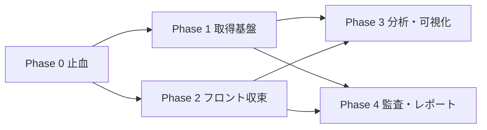
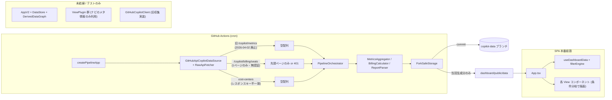
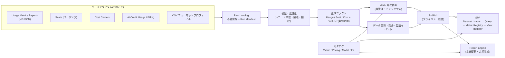

# ダッシュボード改善計画（全体レビューに基づく Phase 0〜4）

ダッシュボード全体（データ収集 → 集計・課金計算 → 永続化・配信 → SPA → 分析手法 → テスト・CI）をレビューし、その結果に基づく改善計画を change-dev の Blueprint（`implementation_plan.md`）としてまとめる。重点観点は次の 2 つである。

1. API 変更や、分析・監査・レポート機能の変更/追加への耐性
2. 分析手法・具体的な実現方式・見せ方の妥当性

- **レビュー対象**: `main` @ `65ec7c6`（2026-10-01）。本計画の基点 `b163671`（change-dev への名称変更）は、エージェント/スキル文書と SDD-14 だけの変更なので、所見に影響しない。
- **方法**: 仕様書（SDD-01〜15）とコードの突合、品質ゲートの実行、挙動を確かめる小規模な検証スクリプトの実行、GitHub 公開情報の確認。
- **構成**: 判断が必要な事項は「User Review Required」、変更内容とフェーズごとの完了条件は「Proposed Changes」、検証方法は「Verification Plan」に記す。所見の詳細と根拠は付録 A、検証結果は付録 B にまとめる。
- **経緯**: 当初 `docs/reviews/` 配下のレビュー文書として作成したものを、change-dev の成果物規約に合わせて本ディレクトリへ移し、正準スキーマに沿って再構成した。

**凡例**

| 区分 | 意味 |
| :--- | :--- |
| **P0** | 本番データが取得できない／金額・分析結果が明確に誤る。即時対応 |
| **P1** | 条件付きで誤表示・欠落する、または変更耐性を大きく損なう構造問題 |
| **P2** | 品質・保守性・説明性の問題 |
| **P3** | 表記・文書の問題 |
| 【実行】 | 本レビューで実際にコード・コマンドを実行して確認した |
| 【コード】 | コード読解による（`path:line` を併記） |
| 【外部】 | GitHub 公開情報による（一次情報での再確認を推奨） |

**要約**

UI の作り込みと仕様書の量は充実している。一方で「数字の正しさ」と「変更への強さ」の土台に構造的な問題がある。特に次の 3 点が最大のリスクである。

1. **データ収集が現行の GitHub API と乖離しており、実データ運用ではライブデータがほぼ取得できない。**
   旧 Copilot Metrics API（公開情報では 2026-04-02 廃止）を呼び続けている。さらに本番経路の HTTP クライアントは `COPILOT_READ_TOKEN` を読まず、シート一覧もページングしない。取得に失敗すると前回の成果物を空データで上書きし、`is_mock_mode` が `true` に反転してデモ表示へ切り替わる。
2. **表示される分析値の相当部分が固定値・按分推定・合成データであり、実測と区別されていない。**
   - 1 年トレンドは当月値を全月に複写し、受諾率は `0.35` 固定。
   - グループ別の利用指標はシート比で按分した推定値。
   - 月次レポート由来の個人日次履歴は「全員が受諾率 35%・組織全体の日次形状」で合成され、それが個人の「健全度スコア」「兆候確率」に使われている。
   - AI クレジット単価は経路により `$0.01` と `$0.05` が混在する。
3. **新旧 2 系統の実装が併存し、変更が二重化し、テストが本番経路を守っていない。**
   - 収集: 旧 `GitHubCopilotClient`（テストあり・本番未使用）と新 `GitHubApiCopilotDataSource`（本番使用・上記の欠陥あり）。
   - フロント: 本番の `App.tsx` + `useDashboardData` と、未マウントの `AppV2` + `DataStore` + `ViewPlugin`。
   - `npm test` は glob の展開不備により、70 ファイル中 23 ファイル（488 件中 118 件）しか実行していない。

改善の方向性は、**取得（API の版）・分析（指標の定義）・表示（ビュー/レポート）の間に、版管理された正準データ契約と定義カタログを挟む**ことである。これにより次の構造を目指す（付録 A.7）。

- API 変更 → 該当ソースアダプタの中で完結
- 指標の追加 → 指標カタログへの 1 件追加
- ビュー/レポート/監査ルールの追加 → 登録 1 件

**最重要指摘（Top 12）**

| # | 重大度 | 指摘 | 影響 | 根拠 |
| :--- | :--- | :--- | :--- | :--- |
| A-01 | P0 | 廃止済みの旧 Copilot Metrics API を呼び、新 Usage Metrics Reports API（NDJSON）が未実装 | ライブ利用指標が取得不能。SDD-03 は新 API を記載済みで仕様と実装が乖離 | 【外部】【コード】 |
| A-02 | P0 | 本番 HTTP クライアントが `COPILOT_READ_TOKEN` を読まない | CI では無認証リクエストとなり、シート等も取得失敗 | 【実行】 |
| A-03 | P0 | シート一覧のページング未実装 | 例: 120 席中 50 席しか取得されず、費用・遊休が過小 | 【実行】 |
| A-07 | P0 | 取得失敗時に空データで前回成果物を上書きし、`is_mock_mode` が反転 | 一時障害で本番ダッシュボードが空表示/デモ表示になる | 【コード】 |
| B-01 | P0 | 1 年トレンドが全月同一値（受諾率 `0.35` 固定） | 推移分析が成立しない（しかもフロントから未参照） | 【コード】【実行】 |
| B-02 | P0 | AI クレジット単価が `$0.05` と `$0.01` で混在 | 同一消費量で金額に 5 倍の差 | 【実行】 |
| B-03 / B-04 | P0 | 固定定数・合成データを実測と同列に表示（個人診断を含む） | 誤った意思決定・個人の不当評価 | 【実行】【コード】 |
| B-13 | P1 | フィルター不整合（下記 3 点） | 絞り込み分析の数値が誤る | 【実行】【コード】 |
| C-01 | P1 | フロントの二重アーキテクチャ（仕様上のプラグイン構成が本番未結線） | 新ビュー追加に最大 7 箇所の修正が必要で、修正漏れが起きやすい | 【コード】 |
| C-04 | P1 | `npm test` が全テストの 24% しか実行しない。約 28 ファイルがソース文字列の正規表現検査 | 回帰が検出されず、リファクタを阻害 | 【実行】 |
| C-06 | P1 | 過去月の集計ファイルが Pages に配信されない | デプロイ版で過去月が 404 となり、デモデータへフォールバック | 【コード】 |
| E-05 | P1 | `copilot-data` ブランチと Pages 配信物に、解決済みの氏名・部署・個人別診断が含まれる。匿名化も可逆 | 公開リポジトリ/公開 Pages では個人情報の公開に直結。SDD-04 の Zero Leakage は `main` ブランチしか担保していない | 【コード】 |

B-13 のフィルター不整合の内訳:

- レポート系データソースで CostCenter/Org/部署/ユーザー条件の変更が反映されない
- 「未割当」フィルターが機能しない
- フィルター適用時に費用の単位が日次から月額へ変わる

**フェーズ概要**

| フェーズ | 期間目安 | 目的 | 主な成果物 |
| :--- | :--- | :--- | :--- |
| **Phase 0** 止血 | 1〜2 週 | 数字の誤りと取得不能の即時解消 | テスト全件実行、トークン/ページング/検証の修正、捏造値の撤去、金額の単一化、フィルター修正、配信修正 |
| **Phase 1** 取得基盤 | 3〜5 週 | 新 API 対応と版管理されたデータ契約 | Reports API アダプタ、Raw 保存 + Run Manifest、正準ファクト、契約テスト、ドリフト検知、価格/為替カタログ |
| **Phase 2** フロント収束 | 4〜6 週 | 拡張点の実体化 | 単一アーキテクチャ、Dataset/Query/Metric/View レジストリ、デッドコード削除、挙動テスト、バンドル予算 |
| **Phase 3** 分析・可視化 | 6〜8 週 | 分析手法と見せ方の妥当化 | 指標カタログ、KPI 再設計、診断 v2（チーム単位・透明なシグナル）、成熟度 v2、チャート刷新 |
| **Phase 4** 監査・レポート | 継続 | 監査・レポートの追加に強い仕組み | 月次締め、シート監査、請求突合、定義駆動レポート、プライバシー階層 |

## User Review Required

> [!IMPORTANT]
> 次の事項はユーザーの判断が必要である。判断の結果によって Phase 2 以降の構成が変わる。Phase 0 は判断事項に依存しない止血だけで構成しているため、先行して着手できる。
>
> 1. **フロントエンドの収束先**: 推奨は、本番で稼働している hook ベースの経路を「Dataset + Registry」構成へ段階移行し、未使用の DataStore 系を撤去する案。代替は DataStore 系へ寄せ切る案。判断材料は、実利用中の経路・テスト資産・複雑性。
> 2. **個人単位診断の扱い**: 推奨は、既定をチーム単位とし、個人表示は本人・コーチング用途に限定して社内（identified）ビルドだけで提供する案。
> 3. **データの公開範囲**: 公開リポジトリでの実データ運用を認めるか。データ専用の private リポジトリへ分離するか。
> 4. **ブラウザ内クエリ方式**: 軽量ライブラリ / DuckDB-WASM（数 MB）/ 事前計算キューブのみ、のいずれにするか。
> 5. **収集スコープと認証**: Enterprise 単位のみか、Org 単位を併用するか。GitHub App を採用するか。
> 6. **監査要件**: 月次締めのタイミング、改訂ポリシー、保持期間。
> 7. **Phase 0 の着手可否**。

> [!WARNING]
> - **個人情報の公開リスク（E-05）**: `copilot-data` ブランチと Pages 配信物には、解決済みの氏名・部署・個人別診断が含まれる。公開リポジトリ/公開 Pages では個人情報の公開に直結するため、Phase 0 で最優先に対処する。
> - **見かけ上の機能後退**: 固定値・合成データを撤去すると、一部の画面は「—（取得不可）」表示になる。Phase 1 の新 API 対応で実測に置き換わるまでの過渡状態である。
> - **データ契約の非互換**: `index.json` v2 と正準ファクトの導入は、既存 fork の `copilot-data` と互換性がない。Raw からの再処理と旧形式の読み替えを Phase 1 で用意する。
> - **外部情報の再確認**: 旧 Metrics API の廃止日、Cost Centers API の応答形式、2026-06 以降の課金体系（AI Credits）は検索結果の要約に基づく（付録 D）。実装着手前に一次情報で再確認する。

### 判断結果（2026-10-01、ユーザー回答）

| # | 論点 | 結果 | 計画への影響 |
| :--- | :--- | :--- | :--- |
| 運用前提 | 配備形態 | 企業の GitHub Enterprise 環境で、**private または internal** のリポジトリと、**アクセス制御付き Pages** を使い、**自社の社員のみ**が参照する。実データの公開デプロイは対象外 | 文書へ反映済み（SDD-01 §1.1、SDD-04 §5、SECURITY、README、セットアップガイド）。`fork:verify` は前提違反を検出するガードとして維持。仮名化は任意の追加措置（E-05 の緊急度は下がるが、ガードは残す） |
| 1 | フロントエンドの収束先 | 推奨案（hook 経路を Dataset + Registry へ段階移行し、DataStore 系を撤去） | Phase 2 は推奨案で進める（P2-1 の ADR は追認の記録） |
| 2 | 個人単位診断 | 個人表示も画面に出す（社内限定の前提） | Phase 3 で個人表示を残す。identified / aggregate-only の二重ビルドは不要。個人表示は閲覧権限のある社員向けである旨を SDD に明記する |
| 3 | データの公開範囲 | 上記の運用前提（公開は不可）。※先の「公開リポジトリで実データ運用を認める」回答は、この運用前提で置き換えられた | P1 の仮名化・データ分離の優先度は下がる |
| 4 | ブラウザ内クエリ方式 | B案: DuckDB-WASM | Phase 2 の Query 層は DuckDB-WASM。バンドル予算（P2-7）は遅延ロードで満たす |
| 5 | 収集スコープと認証 | Enterprise と Org を併用。GitHub App の採否は検討中 | 重複排除を P1 で設計。認証方式は回答待ち |
| 6 | 監査要件 | 翌月 5 営業日に締め。締め後の改訂は履歴付きで可。生データは 5 年（60 か月）保持 | Phase 4 の月次締め・改訂履歴・保持期間の既定値（`data_retention` は 60 か月） |

## Proposed Changes

各フェーズは独立した PR に分割できる粒度とする。括弧内は対応するタスク番号と指摘 ID（付録 A）。名称に「（案）」とあるものは新設時の名称案である。各実装フェーズに着手するときは、change-dev の規約に従ってフェーズごとの change ディレクトリ（`.devs/changes/yyyy-mm-dd_<ChangeTitle>/`）を作成する。

### change-dev 成果物（本計画）

#### [NEW] [implementation_plan.md](./implementation_plan.md)
- 本計画書（Blueprint）。

#### [NEW] [task.md](./task.md)
- 実行チェックリスト。計画の承認とフェーズの進捗に合わせて更新する。

### Phase 0: 止血（1〜2 週）

数字の誤りと取得不能を即時に解消する。

| # | タスク | 完了条件（DoD） |
| :--- | :--- | :--- |
| P0-1 | `package.json` の test を `tsx --test "src/tests/**/*.test.ts"` に修正（C-04） | CI ログで 488 件以上が実行される（本レビューで有効性を確認済み） |
| P0-2 | 収集クライアントの修正（下記 5 点）（A-02〜A-05） | フィクスチャテスト: 120 席 → 120 件、`plan_type: unknown` / `organization: null` を保持して警告 |
| P0-3 | 縮退設計（下記 3 点）（A-07） | 「metrics 失敗・seats 成功」「全失敗」のシナリオテスト |
| P0-4 | 捏造値の撤去（下記 4 点）（B-01, B-03, B-04） | 付録 A.3.2 の定数がコードから消え、UI が欠損を「—（理由）」で表示する |
| P0-5 | 金額の単一化（下記 4 点）（B-02, B-09, B-10, B-13） | 同一入力で全経路の金額が一致するテスト |
| P0-6 | フィルター修正（下記 3 点）（B-13） | CC 条件だけを変えてもレポート KPI が変化するテスト。「未割当」フィルターの回帰テスト |
| P0-7 | 配信修正。実データの `processed/*` 全量を public へステージし、デプロイ版では暗黙のデモフォールバックを無効化する。デモ表示時は全画面バナーを出す（C-06） | ビルド成果物に過去月 monthly / deep-analysis が含まれることを CI で検査する |
| P0-8 | 設定の結線。`COPILOT_BILLING_CONFIG` / `ANONYMIZE_USERS` / `GITHUB_API_VERSION` をパイプラインへ渡す。設定エラーは issue 化する（A-11） | 設定不正時にヘッダーの警告件数へ反映される |
| P0-9 | シート分類の修正。`onboarding` を新設し、遊休基準と表示ラベルを一致させる（B-07） | 付与 2 日の未使用席が遊休に含まれないテスト |
| P0-10 | 同月複数 CSV の結合集計と重複検知（B-16） | 2 ファイル取り込みで合算されるテスト |
| P0-11 | プライバシーの緊急対応（下記 3 点）（E-05） | 公開設定で `fork:verify` が失敗し、匿名化出力に復元可能な識別子が残らない |

P0-2 の内訳:

- トークン解決に `COPILOT_READ_TOKEN` を追加する
- シートをページングする（`per_page=100` + Link ヘッダー）
- レコード単位で検証し、未知値を許容する
- `costCenters` に対応する
- Zod エラーは `data_integrity` に分類する

P0-3 の内訳:

- ソース別ステータスを `index.json` に記録する
- 失敗ソースは Last-known-good を維持し、`is_mock_mode` は `MOCK_MODE` のときだけ `true` にする
- シート / コスト分析を metrics の有無から切り離す

P0-4 の内訳:

- 付録 A.3.2 の定数を削除し、`null` で表現する
- 1 年推移は保存済み月次から実値で構成する
- 合成プロファイルによる個人診断を無効化する
- ランダムアバターを削除する

P0-5 の内訳:

- 暫定価格モジュールを作る（シート 19 / 39、クレジット 0.01、包含量はプラン別・実効期間付き）
- `0.05` を削除する
- 予算計算を 1 実装に統一する
- フィルター時はスコープ種別に応じた費用で再計算する

P0-6 の内訳:

- `filteredActiveReportData` の依存配列を修正し、ESLint（`react-hooks`）を導入する
- 未割当センチネルを定数化して統一する
- `daily_trends` / `sku_breakdown` を再集計するか、「フィルター非対応」と明示する

P0-11 の内訳:

- 匿名化を HMAC（秘密鍵）に変更し、`avatar_url` 等を除去する
- `fork:verify` にリポジトリ / Pages の公開範囲チェックを追加する
- README / SECURITY に、公開リポジトリでは `copilot-data` も公開される旨を明記する

#### [MODIFY] [package.json](../../../package.json)
- `test` の glob をクォートし、全テストを実行する（P0-1 / C-04）。

#### [MODIFY] [src/adapters/github-api/RawApiFetcher.ts](../../../src/adapters/github-api/RawApiFetcher.ts)
- トークン解決に `COPILOT_READ_TOKEN` を追加し、未設定のときは明示的なエラー（issue）にする（P0-2 / A-02）。

#### [MODIFY] [src/adapters/github-api/GitHubApiCopilotDataSource.ts](../../../src/adapters/github-api/GitHubApiCopilotDataSource.ts)
- シートのページング（`per_page=100` + Link ヘッダー）、レコード単位の検証と隔離、`costCenters` への対応、Zod エラーの `data_integrity` 分類（P0-2 / A-03〜A-05）。

#### [MODIFY] [src/adapters/github-api/schemas/seats-schema.ts](../../../src/adapters/github-api/schemas/seats-schema.ts)
- `plan_type` の未知値と `organization: null` を許容する（P0-2 / A-04）。

#### [MODIFY] [src/application/pipeline/PipelineOrchestrator.ts](../../../src/application/pipeline/PipelineOrchestrator.ts)
- ソース別ステータスと Last-known-good を維持する。`is_mock_mode` の判定は `MOCK_MODE` のみに限定し、シート/コスト分析を metrics の有無から切り離す（P0-3 / A-07）。
- 1 年推移を保存済み月次から実値で構成し、クレジット単価を価格モジュールから取得する。同月の複数 CSV は結合して 1 回だけ集計する（P0-4, P0-5, P0-10 / B-01, B-02, B-16）。

#### [NEW] `src/domain/pricing/`（案）
- 暫定の価格モジュール。シート 19 / 39、クレジット 0.01、包含量はプラン別・実効期間付き（P0-5 / B-02, B-09）。Phase 1 で価格カタログへ発展させる。

#### [MODIFY] [src/application/services/CreditsBillingService.ts](../../../src/application/services/CreditsBillingService.ts)
- `DEFAULT_CREDIT_RATE_USD = 0.05` を削除し、価格モジュールを参照する（P0-5 / B-02）。

#### [MODIFY] [src/domain/rules/BudgetUtilizationRule.ts](../../../src/domain/rules/BudgetUtilizationRule.ts)
- 予算計算の唯一の実装として、`billing-calculator.ts`・`App.tsx`・`filterEngine.ts` の重複実装を置き換える（P0-5 / B-10）。

#### [MODIFY] [src/processor/metrics-aggregator.ts](../../../src/processor/metrics-aggregator.ts)
- 固定定数（`ai_pr_merge_ratio` 0.85 / `code_churn_ratio` 0.12）を削除する。按分推定値には `is_estimated` / `estimation_method` を設定する（P0-4 / B-03, B-05）。

#### [MODIFY] [src/processor/report-parser.ts](../../../src/processor/report-parser.ts)
- 固定定数（受諾率 0.35 など）を削除し、`unit_type` 別に集計する。`quantity`・日付の補完と、`tokens` 列のエイリアス衝突を解消する（P0-4, P0-10 / B-03, B-16）。

#### [MODIFY] [src/processor/inefficiency-diagnostic.ts](../../../src/processor/inefficiency-diagnostic.ts)
- ピア平均・Agent 関連のフォールバック定数を削除する（P0-4 / B-03）。

#### [MODIFY] [src/processor/billing-calculator.ts](../../../src/processor/billing-calculator.ts)
- デモ用 Org 名による分岐と、採用成熟度の代理値を撤去する。`plan_type` 不明は「未確定」として扱う（P0-4 / B-06, B-08, C-07）。

#### [MODIFY] [src/domain/rules/SeatClassificationRule.ts](../../../src/domain/rules/SeatClassificationRule.ts)
- `onboarding`（付与 7 日未満）を新設し、遊休の判定基準と表示ラベルを一致させる（P0-9 / B-07）。

#### [MODIFY] [src/adapters/presenters/AdoptionPresenter.ts](../../../src/adapters/presenters/AdoptionPresenter.ts)
- チーム別成熟度の按分（全社比率 × 人数）を廃止する（P0-4 / B-06）。

#### [MODIFY] [src/adapters/presenters/CreditsPresenter.ts](../../../src/adapters/presenters/CreditsPresenter.ts)
- 包含量 3,900 の固定値を廃止し、価格モジュールを参照する（P0-5 / B-09）。

#### [MODIFY] [dashboard/src/utils/deepAnalysisAdapter.ts](../../../dashboard/src/utils/deepAnalysisAdapter.ts)
- 合成プロファイルによる個人診断と、ランダムなアバター URL を廃止する（P0-4 / B-04）。

#### [MODIFY] [dashboard/src/hooks/useDashboardData.ts](../../../dashboard/src/hooks/useDashboardData.ts)
- `filteredActiveReportData` の依存配列を修正し、未割当センチネルを統一する。固定日付と `proud-corp` によるデモ判定を削除する（P0-6 / B-13, C-07）。

#### [MODIFY] [dashboard/src/utils/filterEngine.ts](../../../dashboard/src/utils/filterEngine.ts)
- スコープ種別に応じた費用で再計算し、予算を共通ルールで再評価する。`daily_trends` / `sku_breakdown` は再集計するか、「フィルター非対応」と明示する（P0-5, P0-6 / B-10, B-13）。

#### [MODIFY] [dashboard/src/App.tsx](../../../dashboard/src/App.tsx)
- `reportBudgets` を共通ルールに置き換え、単位・ラベルの誤り（「/月」「N 部署」）を修正する。デモ表示時は全画面バナーを出す（P0-5, P0-7 / B-10, D-02）。

#### [MODIFY] [dashboard/src/utils/pathResolver.ts](../../../dashboard/src/utils/pathResolver.ts)
- デプロイ版での `/demo/` パスへの暗黙フォールバックを無効化する（P0-7 / C-06）。

#### [MODIFY] [dashboard/src/hooks/useDeepAnalysisData.ts](../../../dashboard/src/hooks/useDeepAnalysisData.ts)
- ディープ分析アーカイブのデモフォールバックを廃止する（P0-7 / C-06）。

#### [MODIFY] [.github/workflows/copilot-analysis-cron.yml](../../../.github/workflows/copilot-analysis-cron.yml)
- `COPILOT_BILLING_CONFIG` / `ANONYMIZE_USERS` / `GITHUB_API_VERSION` をパイプラインへ渡し、実データの `processed/*` を全量ステージする（P0-7, P0-8 / A-11, C-06）。

#### [MODIFY] [src/adapters/storage/BillingConfigLoader.ts](../../../src/adapters/storage/BillingConfigLoader.ts)
- 設定エラーを `console.warn` だけで済ませず、issue として記録する（P0-8 / A-11）。

#### [MODIFY] [src/collector/attribute-resolver.ts](../../../src/collector/attribute-resolver.ts)
- 匿名化を HMAC（秘密鍵）に変更し、`avatar_url` 等の識別子を除去する（P0-11 / E-05）。

#### [MODIFY] [src/adapters/storage/AttributeResolverAdapter.ts](../../../src/adapters/storage/AttributeResolverAdapter.ts)
- 上記と同じ匿名化方式に揃える（P0-11 / E-05）。

#### [MODIFY] [scripts/verify-fork-health.ts](../../../scripts/verify-fork-health.ts)
- リポジトリと Pages の公開範囲をチェックし、公開設定では失敗させる（P0-11 / E-05）。

#### [MODIFY] [SECURITY.md](../../../SECURITY.md)
- 公開リポジトリでは `copilot-data` ブランチも公開される旨を明記する。`README.md` / `README.ja.md` にも同じ注意を追記する（P0-11 / E-05）。

#### [NEW] `src/tests/` 配下の回帰テスト（案）
- Phase 0 の各完了条件を検証する（120 席のフィクスチャ、`plan_type: unknown`、取得失敗シナリオ、金額一致、フィルター、`onboarding`、同月複数 CSV など）。

### Phase 1: 取得基盤（3〜5 週）

新 API に対応し、版管理されたデータ契約を整える。

| # | タスク | 完了条件 |
| :--- | :--- | :--- |
| P1-1 | Usage Metrics Reports API アダプタ（Enterprise / Org の 1-day・28-day、users-1-day）。署名付き URL → NDJSON のストリーム解析、欠損日の再取得（バックフィル）、未知 feature / model の保持（A-01, A-13, A-14） | ライブ運用で個人プロファイルが実測から生成され、ディープ分析 / 推移 / 成熟度が動作する。旧 metrics の呼び出しを削除する |
| P1-2 | Raw Landing + Run Manifest + 再処理コマンド（`pipeline:reprocess`）（E-01） | Raw から同一の正準ファクトが再生成できる |
| P1-3 | 正準ファクト v1 と JSON Schema 生成（付録 A.7.2） | 全ファクトが `schema_version` を持ち、スキーマ検証が CI で通る |
| P1-4 | 契約テスト（匿名化録画フィクスチャ）と、スキーマドリフト検知ワークフロー（週次・Issue 自動起票）（A-09, A-13） | フィールド追加・削除を検知して Issue が作られる |
| P1-5 | AI Credits 利用量 API アダプタ。CSV はフォーマットプロファイル化し、取込レポートを表示する（A-12, B-16） | 未認識列・スキップ行・単位別合計が取込時に表示される |
| P1-6 | 価格カタログ v1（プラン価格・包含量・単価・プロモーション・実効期間・EA 品目単価）と為替カタログ（パイプラインで ECB/BOJ 月次平均を取得し、出典・取得日付きで保存。ブラウザの外部取得を廃止）（B-02, B-09, B-14） | 過去月の換算値が閲覧日に依存しない |
| P1-7 | データ品質レポート（欠損日・重複・範囲外・隔離件数）の履歴化（D-05, E-01） | ヘッダーのデータ状態バナーに反映される |

#### [NEW] `src/adapters/sources/`（案）
- ソースアダプタ群（契約は付録 A.2.3）。Usage Metrics Reports（Enterprise / Org の 1-day・28-day、users-1-day、NDJSON）、Seats、Cost Centers、AI Credit Usage、CSV フォーマットプロファイル（P1-1, P1-5 / A-01, A-12〜A-14）。

#### [NEW] `src/domain/facts/`（案）
- 正準ファクトとスキーマ（付録 A.7.2）。zod から JSON Schema を生成する（P1-3）。

#### [NEW] `catalog/`（案）
- 価格カタログ（プラン価格・包含量・単価・プロモーション・実効期間・EA 品目単価）と為替カタログ（ECB/BOJ 月次平均、出典・取得日付き）（P1-6 / B-02, B-09, B-14）。

#### [NEW] `scripts/reprocess-from-raw.ts`（案）
- `npm run pipeline:reprocess`。Raw Landing と Run Manifest から正準ファクトを再生成する（P1-2 / E-01）。

#### [NEW] `.github/workflows/schema-drift.yml`（案）
- 週次で実 API のスキーマ指紋を比較し、差分があれば Issue を自動起票する（P1-4 / A-09, A-13）。

#### [MODIFY] [src/adapters/composition-root.ts](../../../src/adapters/composition-root.ts)
- 新しいソースアダプタを結線する（P1-1 / A-10）。

#### [MODIFY] [src/storage/fork-safe-storage.ts](../../../src/storage/fork-safe-storage.ts)
- Raw をソース別・Run Manifest 付きで不変保存し、データ品質レポートを履歴化する（P1-2, P1-7 / E-01, D-05）。

#### [MODIFY] [src/domain/services/PublicExchangeRatesService.ts](../../../src/domain/services/PublicExchangeRatesService.ts)
- ブラウザからの外部取得（`open.er-api.com`）を廃止し、為替カタログを参照する（P1-6 / B-14）。

#### [DELETE] [src/adapters/github-api/GitHubApiCopilotDataSource.ts](../../../src/adapters/github-api/GitHubApiCopilotDataSource.ts)
- 新しいソースアダプタへ置き換えた後に削除する。旧 `/copilot/metrics` の呼び出しもこれで無くなる（P1-1 / A-01）。

#### [DELETE] [src/collector/github-client.ts](../../../src/collector/github-client.ts)
- 旧収集実装と対応テストを削除し、収集処理を一本化する（A-10）。

### Phase 2: フロントエンド収束（4〜6 週）

拡張点（ビュー・指標・データセット）を実体化し、実装を一本化する。

| # | タスク | 完了条件 |
| :--- | :--- | :--- |
| P2-1 | ADR で単一アーキテクチャを決定する（User Review Required の判断事項 1）（C-01） | ADR がマージされる |
| P2-2 | Dataset Loader / Query 層の導入（C-02, C-03） | 全ビューが同一データ契約を参照する |
| P2-3 | Metric Registry（品質属性付き）の導入（D-01） | 推定・欠損・デモが共通スタイルで表示される |
| P2-4 | View Registry の実体化と `App.tsx` 条件分岐の撤去（C-01, D-06） | 新ビュー追加が manifest + コンポーネントの 2 ファイルで完結する |
| P2-5 | デッドコードの削除と層違反の解消（C-07, C-08） | 付録 C の一覧が解消される |
| P2-6 | テスト刷新（下記 4 点）（C-04） | 主要フローが挙動テストで保護される |
| P2-7 | バンドル予算と、ブラウザからの `fs` / zod 排除（C-05） | CI でメインチャンク 300 kB 超過を失敗にする |

P2-6 の内訳:

- ESLint + typescript-eslint
- React Testing Library による挙動テスト
- Playwright スモーク（フィルター → KPI 変化、デモバナー、過去月表示）
- ソース正規表現テストの段階的置き換え

#### [NEW] `docs/adr/`（案）
- 単一アーキテクチャの決定記録（P2-1 / C-01）。

#### [NEW] Dataset Loader / Query 層 / Metric Registry / View Registry（`dashboard/src/` 配下、案）
- 構成は付録 A.7.4（P2-2〜P2-4 / C-01〜C-03, D-01）。

#### [MODIFY] [dashboard/src/App.tsx](../../../dashboard/src/App.tsx)
- 条件分岐による描画を撤去し、View Registry を描画の唯一の入口にする（P2-4 / C-01, D-06）。

#### [MODIFY] [dashboard/src/main.tsx](../../../dashboard/src/main.tsx)
- `VITE_USE_NEW_STORE` による分岐を、ADR の決定に合わせて整理する（P2-1 / C-01）。

#### [MODIFY] [src/adapters/views/](../../../src/adapters/views/)
- `dashboard/src/components` の import を排除し、層違反を解消する（P2-5 / C-07）。

#### [DELETE] 付録 C の未参照モジュール
- `dashboard/src/AppV2.tsx` ほか、本番経路から参照されていないモジュールを削除または統合する（P2-5 / C-08）。

#### [NEW] ESLint 設定と挙動テスト（案）
- typescript-eslint・react-hooks を導入し、React Testing Library / Playwright によるテストを追加する（P2-6 / C-04）。

#### [MODIFY] [vite.config.ts](../../../vite.config.ts)
- バンドル予算を設定し、ブラウザバンドルから `fs` と zod を排除する（P2-7 / C-05）。

### Phase 3: 分析手法・可視化（6〜8 週）

分析手法と見せ方を妥当化する。

| # | タスク | 完了条件 |
| :--- | :--- | :--- |
| P3-1 | 指標カタログ v1、定義ツールチップ、窓の明示（付録 A.3.4） | 全 KPI に定義・窓・出典が表示される |
| P3-2 | KPI 再設計（付録 A.5.2）と前期比・月末予測（D-02） | |
| P3-3 | チャート刷新（付録 A.5.2）とアクセシビリティ対応（D-03, D-07） | |
| P3-4 | 診断 v2（下記 6 点）（B-11, B-12, D-04） | |
| P3-5 | 採用成熟度 v2（実測ベース、チーム別は実人数・k≥5）（B-06） | |
| P3-6 | 1 年推移（月次締めからの実系列、前年比）（B-01） | |
| P3-7 | モデルレーダーの正規化見直し、内容ハッシュによる版管理、ベンチマーク JSON の外部化（B-15） | 上位モデルが頭打ちせず識別できる |
| P3-8 | 属性マッピングの実効期間対応（SCD2）（B-17） | 異動月の配賦が実効日で分かれる |

P3-4 の内訳:

- モデル分類をカタログ化する
- シグナルを透明なルール（入力値・閾値・根拠）として提示する
- 「確率」を「シグナル強度」に改める
- チーム単位を既定にする
- データ充足度で判定可否を制御する
- タイムゾーン・祝日カレンダー、閾値の設定化、較正計画

#### [NEW] 指標カタログ（案）
- 定義・窓・単位・フィルター可否・出典を 1 箇所に宣言する。例は付録 A.3.4（P3-1）。

#### [MODIFY] [dashboard/src/components/KpiSummaryCards.tsx](../../../dashboard/src/components/KpiSummaryCards.tsx)
- KPI を再設計し（付録 A.5.2）、前期比と月末予測を加える（P3-2 / D-02）。

#### [MODIFY] [dashboard/src/components/CostAllocationCharts.tsx](../../../dashboard/src/components/CostAllocationCharts.tsx)
- 多数グループのドーナツを、ソート済み横棒（上位 N + その他）へ置き換える（P3-3 / D-03）。

#### [MODIFY] [dashboard/src/components/ModelRadarView.tsx](../../../dashboard/src/components/ModelRadarView.tsx)
- レーダーを、ドットプロット / スモールマルチプル + 生値表へ置き換える（P3-3, P3-7 / D-03, B-15）。

#### [MODIFY] [src/processor/inefficiency-rules.ts](../../../src/processor/inefficiency-rules.ts)
- 診断 v2。モデル分類のカタログ化、透明なシグナル、チーム単位の既定、データ充足度による判定制御（P3-4 / B-11, B-12, D-04）。

#### [MODIFY] [src/domain/rules/AdoptionPhaseRule.ts](../../../src/domain/rules/AdoptionPhaseRule.ts)
- 実測に基づく採用成熟度 v2（P3-5 / B-06）。

#### [MODIFY] [src/processor/benchmark-evaluator.ts](../../../src/processor/benchmark-evaluator.ts)
- 正規化を見直し、モデル名の判定をモデルカタログ（別名の完全一致）に切り替える（P3-7 / B-15, A-13）。

#### [MODIFY] [scripts/update-benchmarks.ts](../../../scripts/update-benchmarks.ts)
- データセットの版を内容ハッシュで管理し、ベンチマーク値を JSON データへ外部化する（P3-7 / B-15）。

#### [MODIFY] [src/collector/attribute-resolver.ts](../../../src/collector/attribute-resolver.ts)
- 属性マッピングに実効期間（SCD Type 2）を持たせる（P3-8 / B-17）。

### Phase 4: 監査・レポート（継続）

監査・レポート機能を、定義の追加だけで拡張できる仕組みにする。

| # | タスク | 完了条件 |
| :--- | :--- | :--- |
| P4-1 | 「監査・データ品質」ビュー（Run Manifest、ソース状態、品質チェック履歴） | |
| P4-2 | 月次締め・改訂履歴・差分表示 | 締め済み月の数値が改訂なしに変わらない |
| P4-3 | シート監査イベントと CSV 出力 | |
| P4-4 | 請求突合レポート | 許容差超過が issue 化される |
| P4-5 | 定義駆動レポートと定期生成 | 新レポートが定義ファイル 1 件で追加できる |
| P4-6 | プライバシー階層と保持期間ポリシー | |
| P4-7 | SDD 更新（後述「仕様書（SDD）の同期」）。新規に SDD-16（データ契約 & 指標カタログ）、SDD-17（監査 & レポート）を起票 | |

#### [NEW] 「監査・データ品質」ビュー（案）
- Run Manifest、ソース状態、品質チェック履歴を表示する（P4-1 / E-01）。

#### [NEW] 月次締めジョブと改訂履歴（案）
- 確定スナップショット・チェックサム・改訂版の差分（P4-2 / E-01）。

#### [NEW] シート監査イベント（案）
- 日次シートスナップショットの差分からイベントを生成し、CSV で出力する（P4-3 / E-02）。

#### [NEW] 請求突合レポート（案）
- 計算値と Billing API の金額を突合し、許容差の超過を issue 化する（P4-4 / E-03）。

#### [NEW] `reports/*.yaml` と Report Engine（案）
- 定義駆動のレポートを Actions で定期生成する。契約は付録 A.7.3（P4-5 / E-04）。

#### [NEW] 発行プロファイル（案）
- プライバシー階層（`aggregate-only` / `identified`）と保持期間ポリシー（P4-6 / E-05）。

### 仕様書（SDD）の同期

仕様書は日英の両方を更新する（`docs/specifications/README.ja.md` のガイドライン）。

| 文書 | 更新内容 |
| :--- | :--- |
| SDD-02 | 実際の結線と目標構成（付録 A.1.1、付録 A.7）、ソース別縮退 |
| SDD-03 | 旧 Metrics API の廃止反映、Reports API の取得手順・フィールド、Cost Centers のレスポンス形状、Billing（AI Credits）API |
| SDD-04 / SECURITY | `copilot-data` / Pages の公開範囲、HMAC 仮名化、プライバシー階層 |
| SDD-05 | Raw Landing・Run Manifest・正準ファクトのレイアウト、`processed/*` の全量ステージ |
| SDD-06 | 価格カタログ（プラン別包含量・実効期間）、総額 / 純額の定義、シート分類（`onboarding`）、按分推定の扱い |
| SDD-07 | 品質属性の表示規約、KPI・チャート指針、個人指標の表示原則 |
| SDD-10 | 正規化方式・データセット版の定義 |
| SDD-11 | 診断 v2（シグナル・カバレッジ・チーム単位）、合成プロファイルの廃止 |
| SDD-15 | Query 層によるフィルター一元化、ESLint 規約 |
| 新規 SDD-16 | データ契約 & 指標カタログ |
| 新規 SDD-17 | 監査 & レポート（月次締め・シート監査・突合・レポート定義） |

#### [MODIFY] `docs/specifications/` の SDD-02 / 03 / 04 / 05 / 06 / 07 / 10 / 11 / 15（日英）
- 上表の内容を反映する。

#### [NEW] SDD-16（データ契約 & 指標カタログ）、SDD-17（監査 & レポート）（日英）
- 新規に起票し、`docs/specifications/README.ja.md` / `README.md` の索引を更新する。

### 依存関係



## Verification Plan

### Automated Tests

- 各フェーズの PR で 5 段階の品質ゲートを通す。
  ```bash
  npm run fork:verify && npm run typecheck && npm test && npm run secret-scan && npm run build
  ```
- P0-1 の適用後は、`npm test` が全 70 ファイル（488 件以上）を実行していることを CI ログで確認する。
- 個別のテストは `npx tsx --test <test-file>` で実行する。
- テストの層と目的:

| 層 | 手段 | 目的 |
| :--- | :--- | :--- |
| 単体 | 指標・価格・分類の純粋関数テスト、プロパティベーステスト | 不変条件（下記 4 点） |
| 契約 | 版ごとの録画フィクスチャ → 正規化結果のスナップショット | API 変更の検知と吸収範囲の固定 |
| ゴールデンデータ | 手計算の期待値付き合成データセット | KPI・配賦・突合の正しさ |
| コンポーネント | React Testing Library | フィルター・データソース切替・欠損表示の挙動 |
| E2E | Playwright（ビルド済み SPA + フィクスチャ） | 配信パス・過去月・デモバナー |
| CI ゲート | lint、全テスト、バンドル予算、secret-scan、ドリフト検知（定期） | 回帰防止 |

単体テストで保証する不変条件:

- Σ グループ = 全体
- フィルター「すべて」 = 元データ
- 率 ∈ [0, 1]
- `null` が保存される

### Manual Verification

- デプロイ版の SPA で、過去月の monthly / deep-analysis が表示される（P0-7）。
- 収集に失敗しても、前回成功データとその取得日時、障害バナーが表示され、デモ表示に切り替わらない（P0-3）。
- フィルター（Cost Center / Org / 部署 / ユーザー / タグ）を変えると、KPI・表・推移が整合して変化する（P0-6）。
- 実測のない値は「—（理由）」で表示され、推定値には推定バッジが付く（P0-4, P2-3）。
- 公開リポジトリ / 公開 Pages の設定で `npm run fork:verify` が失敗する（P0-11）。
- ライト / ダークの両テーマで、ステータスが色以外（アイコン・文言）でも判別できる（P3-3）。

---

## 付録 A. レビュー所見と根拠

### A.1 現状（As-Is）の実態

#### A.1.1 仕様上の構成と実際の結線

SDD-02 §3〜4 は 4 層クリーンアーキテクチャ（DataStore / DerivedDataGraph / ViewPlugin / Presenter）を記述している。しかし本番で実際に動いている経路は次のとおりである。



| 要素 | 仕様（SDD-02） | 実際 |
| :--- | :--- | :--- |
| 収集 | ACL（RawApiFetcher / NormalizerRegistry / Zod）で版差を吸収 | Normalizer は 1 版のみ。ドメインモデルが API レスポンス形状そのもの（`CopilotDailyMetrics`）で、版差を吸収できない。旧 `src/collector/github-client.ts` が並存し、テストはこちらが中心 |
| 状態管理 | DataStore + DerivedDataGraph | `dashboard/src/main.tsx:16,20` は常に `<App />` を描画。`VITE_USE_NEW_STORE=true` でも `App` は Store を参照しない。`AppV2.tsx` はどこからも import されていない |
| ビュー | 9 種の ViewPlugin を Registry で調停 | Registry はナビゲーションのメタ情報表示にのみ使用（`dashboard/src/components/layout/ViewNavigation.tsx:55`）。描画は `App.tsx` の条件分岐。`src/adapters/views/*.tsx` は App の JSX の複製で、Adapters 層から `dashboard/src/components` を import している（層違反） |
| Presenter | 全ビューで表示ロジックを分離 | `App.tsx` から使われるのは Credits / Agent / Adoption の 3 つのみ |
| 配信 | `processed/*` を public ルートへ展開（AGENTS.md rule 7） | デモ用 `data/demo` のみ展開。実データの過去月 processed は配信されない（C-06） |

#### A.1.2 品質ゲートの実行結果（本レビュー時）

| コマンド | 結果 | 補足 |
| :--- | :--- | :--- |
| `npm run typecheck` | ✅ 成功 | |
| `npm test` | ✅ 118 件成功 | **23/70 ファイルのみ実行**（C-04） |
| `npx tsx --test "src/tests/**/*.test.ts"`（glob をクォート） | ✅ 488 件成功 | 除外されていた 370 件も現時点では成功 |
| `npm run build` | ✅ 成功（警告あり） | `fs` / `path` の externalize 警告。メインチャンク 332.06 kB（gzip 83.45 kB）で NFR-5（300 kB / gzip 80 kB）未達 |
| `npm run secret-scan` | ✅ 検出 0 件 | |
| `npm run fork:verify` | ✅ 5 Passed / 1 Warning | Warning は作業ブランチが `main` でないことのみ |
| `npm run pipeline:mock` | ✅ 成功 | |

参考: upstream の `copilot-data` ブランチ（2026-10-01 04:31 UTC 生成）は収集設定が未設定のため、`is_mock_mode: true`・`available_days: 0` だった。シート数 0 にもかかわらず `rolling-1year.json` には `acceptance_rate: 0.35` が出力されていた。B-01 の固定値が、そのまま配信物に載る実例である。

### A.2 観点 A: API 変更への耐性

#### A.2.1 指摘一覧

| ID | 重大度 | 指摘 | 根拠 | 推奨 |
| :--- | :--- | :--- | :--- | :--- |
| A-01 | P0 | 旧 `/enterprises/{ent}/copilot/metrics`・`/orgs/{org}/copilot/metrics` を呼び出している。公開情報では Copilot Metrics API は 2026-04-02 に廃止済み。後継の Usage Metrics Reports API（署名付き URL → NDJSON）は SDD-03 §2.1 に記載があるが未実装 | `src/adapters/github-api/GitHubApiCopilotDataSource.ts:64,74`【外部】 | Reports API アダプタを新設する（付録 A.2.3）。ユーザー単位日次レポート（users-1-day）の取り込みで、ライブ運用の個人プロファイル欠落（A-14）も同時に解消する |
| A-02 | P0 | 本番の `RawApiFetcher` は `GITHUB_TOKEN` / `GH_TOKEN` しか読まない。ワークフローは `COPILOT_READ_TOKEN` しか渡さないため、Authorization ヘッダーなしで呼び出される | `src/adapters/github-api/RawApiFetcher.ts:24`、`.github/workflows/copilot-analysis-cron.yml:130-141`【実行】 | トークン解決順を `COPILOT_READ_TOKEN` → `GITHUB_TOKEN` に統一する。トークン未設定は起動時に明示エラー（issue）にする |
| A-03 | P0 | シート取得が 1 リクエストのみ（`per_page` 指定なし・Link ヘッダー非追従）。検証では 120 席中 50 席しか取得されなかった | `GitHubApiCopilotDataSource.ts:110,118`【実行】 | `per_page=100` を指定し、Link ヘッダーを最終ページまで追従する。`total_seats` と取得件数を照合し、不一致を issue 化する |
| A-04 | P1 | Zod スキーマが厳格 enum（`plan_type: business/enterprise`）と非 null（`organization`）を前提にしている。正規化がバッチ単位の `map` 内で例外を投げるため、1 レコードの想定外値で全シートが消失する（検証で 0 件化を確認）。分類も `server_error` に誤る。さらに `plan_type` 欠損時は `enterprise`（$39）と見なすため、費用を過大に見積もる | `src/adapters/github-api/schemas/seats-schema.ts:28,32`、`src/processor/billing-calculator.ts:110`【実行】 | レコード単位の `safeParse` にし、不正レコードは隔離して件数・理由を `data_integrity` issue にする。未知の enum 値は `unknown` として保持・可視化し、費用は「未確定」として扱う |
| A-05 | P1 | Cost Centers の公開ドキュメント上のレスポンスキーは `costCenters`（camelCase）だが、実装は `cost_centers` を参照しており常に空配列になる。`resources[].type` の値（例: `User` / `Repo`）も型定義（`Org` / `User` / `Repository`）と一致しない可能性がある | `GitHubApiCopilotDataSource.ts:134-139`、`src/collector/github-client.ts:294`【外部】 | 両キーを許容するアダプタと契約テストを用意し、型定義を実 API に合わせる |
| A-06 | P1 | 複数 Org の取得結果を日付マージせずに連結している。日付が重複し、`referenceDate`（末尾要素）や `slice(-30)`、日次ファイルの上書き順が壊れる | `GitHubApiCopilotDataSource.ts:76`、`src/application/pipeline/PipelineOrchestrator.ts:124-141`【コード】 | 正準ファクトに `org` 次元を持たせ、日付×Org で保持する。合算は集計層で行う |
| A-07 | P0 | 取得失敗時に空配列を返したまま処理が続き、前回成果物を上書きしてしまう（下記 4 点） | `PipelineOrchestrator.ts:72,92,124,274`【コード】 | ソース別ステータスを持たせ、Last-known-good を維持する。モック判定は `MOCK_MODE` のみとする。ソースごとに独立して縮退させる（付録 A.2.3） |
| A-08 | P2 | 429 は待機せず即失敗する。`Retry-After` やセカンダリレート制限（403）に未対応で、403 は一律に認証エラー扱いになる。ETag による条件付きリクエストも行っていない | `RawApiFetcher.ts:52-60`【コード】 | `Retry-After` / `x-ratelimit-reset` に従って待機・再試行する。403 の本文で二次制限を判別する。並列度の上限と再試行予算を設ける |
| A-09 | P2 | API バージョン交渉が実質機能していない（下記 3 点） | `RawApiFetcher.ts:26`、`src/adapters/github-api/api-compatibility.ts`【コード】 | 版はソースアダプタ単位で明示する。正準モデルを API 形状から分離する（付録 A.2.3） |
| A-10 | P1 | 収集実装が 2 系統併存している。旧 `GitHubCopilotClient`（`COPILOT_READ_TOKEN` 読取・ページングあり・テストあり）は本番未使用で、新実装（本番）は機能退行している | `src/collector/github-client.ts`、`src/adapters/composition-root.ts`【コード】 | 新アダプタへ一本化し、旧実装とそのテストを削除する |
| A-11 | P1 | ワークフローが `COPILOT_BILLING_CONFIG` / `ANONYMIZE_USERS` / `GITHUB_API_VERSION` をパイプラインに渡していない。README が案内する Variables 設定が反映されない（`data/config/billing.json` 経由のみ有効）。不正な設定は `console.warn` だけで既定値にフォールバックし、画面上は気付けない | `copilot-analysis-cron.yml:130-141`、`src/adapters/storage/BillingConfigLoader.ts`【コード】 | 環境変数を結線する。設定エラーを issue として表示する |
| A-12 | P1 | 請求データの取得が手動 CSV 取り込みに依存している。AI Credits 利用量 API（`/enterprises/{enterprise}/settings/billing/ai_credit/usage`）等で自動化できる。CSV ヘッダー検出は空白や `($)` を含む表記（例: `Gross Amount ($)`）を認識できず、金額が黙って 0 になる | `src/processor/report-parser.ts:47`【実行】【外部】 | Billing API アダプタを新設する。CSV は「フォーマットプロファイル」方式（既知ヘッダー集合で判定し、未認識列・スキップ行の取込レポートを表示）として残す |
| A-13 | P2 | 列挙値の追加（例: 2026-07 に Copilot app が `totals_by_feature` 等に追加）やモデル名の追加に対して、未知値を許容・可視化する仕組みがない。`normalizeModelId` は部分一致の if 連鎖で、未知の新モデルを既存 ID に誤分類しうる（例: 未知の GPT-6 系 → `gpt-6-astra`） | `src/processor/benchmark-evaluator.ts:489-546`【外部】【コード】 | モデルカタログ（正規 ID + 別名の完全一致リスト）で判定する。未知値は `unknown:<raw>` で保持し、データ品質警告を出す |
| A-14 | P1 | ライブ運用ではユーザー別プロファイルを生成しない（`fetchUserProfiles()` は `[]` を返し、使われるのはモック時のみ）。ディープ分析・モデル推移・採用成熟度は、実データではモック以外に供給源がない | `PipelineOrchestrator.ts:104-113`、`GitHubApiCopilotDataSource.ts:153-154`【コード】 | A-01 の users-1-day レポートから日次ユーザーファクトを生成する |

A-07 の内訳:

- `index.json` の `available_days` が空、`summary` が 0 になる
- `rolling-1year.json` が 0 で上書きされる
- `is_mock_mode = !hasLiveMetrics && seats.length === 0` によりデモ扱いに反転し、フロントはデモデータを探しに行く
- シート/コストの分析（遊休・配賦）まで `hasLiveMetrics` に依存しているため、Metrics API だけが失敗した場合でも保存されない

A-09 の内訳:

- 新クライアントは `GITHUB_API_VERSION` を参照しない
- Normalizer は 1 版のみ
- 正規化後の型が API レスポンス形状と同一のため、版差が集計・UI まで波及する

#### A.2.2 詳細

**A-01 / A-14: 新 Usage Metrics API への移行は「欠落の解消」と「分析の高度化」を兼ねる。**

公開情報によると、後継 API は 2 段階で取得する。まず署名付きダウンロードリンクを取得し、次に NDJSON をダウンロードする。ユーザー単位レポートには次の項目が含まれる。

- 識別・日付: `user_login`, `day`
- 活動量: `user_initiated_interaction_count`, `code_generation_activity_count`, `code_acceptance_activity_count`
- 行数: `loc_suggested_to_add_sum`, `loc_added_sum` など
- 利用フラグ: `used_agent`, `used_chat`, `used_cli`
- クレジット: `ai_credits_used`
- 内訳: `totals_by_feature`, `totals_by_model_feature` など

いずれも現在の分析が「推定」や「固定値」で埋めているもの（個人の日次活動、機能別利用、モデル別利用、エージェント利用）そのものである。移行すれば、B-03 / B-04 / B-06 の多くを推定から実測に置き換えられる。

**A-07: 「取得失敗」を「データなし」と区別しない設計が、障害を隠す。**

現在は失敗が空配列に変換され、その空配列で正規の成果物（`index.json` など）が上書きされる。その結果フロントがデモモードに切り替わり、利用者は「デモ表示」を見ることになる。FinOps ツールとしては次の性質が必要である。

- 失敗したソースだけを縮退させる
- 前回成功データ（Last-known-good）と、その取得日時を明示する
- 障害を画面最上部に出す

#### A.2.3 推奨: 取得層の目標設計

```ts
// ソースアダプタ: 外部ソース × API 版ごとに 1 実装
interface SourceAdapter<TRaw, TFact> {
  readonly id: string;              // 例: 'copilot.usage.users_1d'
  readonly apiVersion: string;      // 例: '2026-03-10'
  fetch(ctx: FetchContext): AsyncIterable<RawBatch<TRaw>>;      // ページング/NDJSON/再試行を内包
  validate(raw: unknown): ValidationResult<TRaw>;              // レコード単位・隔離
  normalize(rec: TRaw): TFact[];                               // 正準ファクトへ写像
  fingerprint(sample: unknown[]): SchemaFingerprint;           // ドリフト検知用
}
```

| 原則 | 内容 |
| :--- | :--- |
| 版ごとのアダプタ | API の版・エンドポイント差はアダプタ内で閉じる。正準ファクトの形は API 変更で変えない |
| Raw の不変保存 | 受信したペイロードをそのまま（gzip NDJSON）保存し、Run Manifest（取得時刻・パラメータ・件数・SHA-256・スキーマ指紋）を付ける。正規化ロジックを直したら Raw から再処理できるようにする |
| レコード単位の検証 | `safeParse` で検証し、不正は隔離する。隔離件数と理由はデータ品質レポートへ出す。1 件の異常で全件を失わない |
| 未知値の保持 | 新しい `feature` / `model` / `plan_type` は捨てずに `unknown` として保持・集計し、UI では「未分類」として表示する |
| 契約テスト | 匿名化した録画フィクスチャで、版ごとの正規化結果を固定する |
| ドリフト検知 | 定期ジョブで実 API のスキーマ指紋を比較し、差分があれば Issue を自動起票する |
| 独立縮退 | ソース別に `status / last_success_at / records / error` を `index.json` に記録する。失敗ソースは Last-known-good を維持する |
| HTTP 規約 | Link ヘッダーによるページング、`Retry-After` と二次レート制限への対応、並列度の上限、GitHub App 認証の選択肢 |

### A.3 観点 B: 分析手法の妥当性

#### A.3.1 指摘一覧

| ID | 重大度 | 指摘 | 根拠 | 推奨 |
| :--- | :--- | :--- | :--- | :--- |
| B-01 | P0 | 1 年ローリングトレンドが、当月のスナップショット値を全月に複写したもの（`acceptance_rate: 0.35` 固定）。しかもフロントは当該ファイルを参照しておらず、NFR-1 の「1 年推移」は実質未実装。型定義（`RollingTrendDataset.data_points`）と出力形式（`trends`）も不一致 | `PipelineOrchestrator.ts:238-251`、`src/domain/entities/copilot.ts:577-580`【コード】【実行】 | 月次締めスナップショット（付録 A.6.2）から実系列を構成する。存在しない月は欠損として表示する |
| B-02 | P0 | AI クレジット単価が経路により異なる。`CreditsBillingService.DEFAULT_CREDIT_RATE_USD = 0.05`、設定既定値とパイプラインは `0.01`。検証では 1,000 クレジットが一方で $50、他方で $10 になった | `src/application/services/CreditsBillingService.ts:35`、`PipelineOrchestrator.ts:227`【実行】 | 価格は価格カタログ 1 箇所から取得する。全経路の金額一致をテストで保証する |
| B-03 | P0 | 実測のない値を固定定数で埋め、実測と同じ型・同じ見た目で表示している（付録 A.3.2 の表） | 多数（付録 A.3.2）【コード】 | 値がなければ `null` とし、UI は「—（取得不可）」と理由を表示する。推定値は方法と前提を明示し、別表示にする |
| B-04 | P0 | 月次レポート/アップロード CSV から個人の日次履歴を合成している（下記 4 点）。この合成データで個人の健全度スコア・兆候確率・処方箋を出している | `dashboard/src/utils/deepAnalysisAdapter.ts:45-48,115-116,150,154`【実行】 | 合成プロファイルによる個人診断を廃止する。月次レポート由来は「月次集計のみ（日次診断不可）」と表示する。アバターは実データがなければ非表示にする |
| B-05 | P1 | グループ別の利用指標（提案・受諾・チャット・PR 要約）を、全体値のシート数比で按分している。全グループの受諾率がほぼ全体値と同じになり、グループ比較が無意味。`is_estimated` / `estimation_method` フィールドは存在するが未設定・未表示 | `src/processor/metrics-aggregator.ts:354-376`【コード】 | ユーザー×日の実測ファクト（A-01）から集計する。実測がない間は「推定（シート比按分）」と明示するか、非表示にする |
| B-06 | P1 | 採用成熟度コホートを実利用ではなく代理値で算出している（`active` なら `totalChats: 10` を与えるため、`active` ステータスのユーザーは全員 `agent_first` 以上になる）。チーム別内訳は「全社比率 × チーム人数」で、全チームが同じ分布になる | `billing-calculator.ts:152-158`、`src/adapters/presenters/AdoptionPresenter.ts:90-104`【コード】 | `used_agent` / `used_chat` / `used_cli` / 機能別実測に基づく判定へ置き換える。チーム別は実人数で集計し、k≥5 の場合のみ表示する |
| B-07 | P1 | シート分類の誤り（下記 2 点） | `src/domain/rules/SeatClassificationRule.ts:17-21`【実行】 | `onboarding`（付与 7 日未満）を新設して遊休から除外する。判定基準と表示ラベルを一致させる |
| B-08 | P1 | コストモデルの不正確さ（下記 4 点） | `billing-calculator.ts:110-111,143-150`、`metrics-aggregator.ts:91-101`、`PipelineOrchestrator.ts:124-141`【コード】 | シートスナップショット履歴（日次）から日割りで算出する。`plan` 不明は「未確定」とする。月途中付与・解約予定を反映する |
| B-09 | P1 | AI クレジットの包含量 3,900/席を全プラン共通の固定値としている（`PipelineOrchestrator.ts:296`、`CreditsPresenter.ts:58`、`inefficiency-diagnostic.ts:261`）。公開情報では Business 1,900 / Enterprise 3,900（2026-06〜08 は移行プロモーションで 3,000 / 7,000）で、請求エンティティ単位のプール。また 28 日分のクレジット費と、日次または月額のシート費を同じ「合計」で加算している | 【外部】【コード】 | 価格カタログに「プラン別包含量・実効期間・プロモーション」を持たせる。期間を揃えて加算する |
| B-10 | P1 | 予算計算が 3 箇所で別実装になっている（下記 3 点） | `src/processor/billing-calculator.ts:225-279`、`dashboard/src/App.tsx:195-245`、`dashboard/src/utils/filterEngine.ts:387-396`【コード】 | `BudgetUtilizationRule` 1 実装に統一し、総額/純額の定義を SDD-06 に明記する |
| B-11 | P1 | 診断ロジックが 2025 年のモデル ID（`o1`, `claude-3-7-sonnet`, `gpt-4o`, `gemini-2-0-flash`）に固定されている。現行モデルの利用では「超重量級モデル過剰依存」「モデルコスト不整合」がほぼ発火しない。推計コスト表 `MODEL_ESTIMATED_CHAT_COST` も 4 モデルのみ | `src/processor/inefficiency-diagnostic.ts:216-221`、`src/processor/inefficiency-rules.ts:12-17,149-181`【コード】 | モデルカタログの属性（ティア・推論型・価格帯・倍率）で判定する |
| B-12 | P1 | 診断の統計的妥当性に問題がある（下記 6 点） | `inefficiency-diagnostic.ts:146,288,407`、`inefficiency-rules.ts:445`、`metrics-aggregator.ts:299`【実行】【コード】 | 付録 A.3.3 のガイドラインに従って再設計する（Phase 3） |
| B-13 | P1 | フィルターの整合性が崩れている（下記 4 点） | `filterEngine.ts:117,373-375`、`dashboard/src/hooks/useDashboardData.ts:607-689`【実行】【コード】 | 依存配列の修正と ESLint の導入。未割当センチネルは定数 1 箇所に統一する。フィルター非対応の指標は「全社値」と明示する |
| B-14 | P1 | 為替の扱い（下記 4 点） | `src/domain/services/PublicExchangeRatesService.ts:62-64,156-163`、`dashboard/src/contexts/CurrencyContext.tsx:58-65`【コード】 | 為替はパイプラインで ECB/BOJ の月次平均を取得し、出典・取得日・版とともに保存する。ブラウザからの外部取得は廃止する。EA 金額は品目（シート/クレジット）ごとにパイプラインで計算する |
| B-15 | P2 | モデルレーダーの正規化アンカーが固定値（SWE-bench 75 / AIME 90 / Elo 1460）。現行値がアンカーを超えるため、43 モデル中 11（coding）/12（reasoning）/7（Elo）が 99 で頭打ちになり、上位 GA モデル 10 件が coding 同点。データセット版（`yyyy-mm-dd-NNNN`）はテスト/ビルドのたびに繰り上がり、内容と無関係。ベンチマーク値はコード埋め込み | `src/processor/benchmark-evaluator.ts:34-45`、`scripts/update-benchmarks.ts`【実行】 | 版ごとのパーセンタイル（または min-max）正規化と生値の併記。版は内容ハッシュで管理する。ベンチマーク値は JSON データとして外部化する |
| B-16 | P1 | 月次レポート集計の正確性に問題がある（下記 4 点） | `report-parser.ts:65,90,175,185`、`PipelineOrchestrator.ts:202-209`【コード】 | 単位（unit_type）別に集計する。欠損は欠損として扱う。月内の全 CSV を結合し、重複検知した上で 1 回集計する |
| B-17 | P2 | 属性マッピングの時間的一貫性がない（下記 2 点）。異動の実効日を扱えない | `PipelineOrchestrator.ts:200-213`【コード】 | `DimUser` に実効期間（SCD Type 2）を持たせ、集計時点の所属で配賦する |

B-04 の合成内容:

- リクエスト数を「チャット 65% または 45%」と「提案」に固定比率で分割する
- 受諾率は全員 35%、行数は提案数 × 8
- 日次分布は組織全体の日次トレンド比率で全員同じ形にする
- `avatar_url` に、ログイン名ハッシュから作った無関係な GitHub ユーザー ID のアバターを使う

B-07 の内訳:

- 付与 7 日未満で未使用のシートを `idle`（遊休・削減可能）と判定する
- 14〜30 日未使用かつクレジット 0 の場合も `idle` になるが、UI の表示は「30 日以上未利用」

B-08 の内訳:

- 月途中付与の日割り（`SeatBillingRule`）を計算しているのに使っていない
- `plan_type` 不明を `enterprise` と見なす
- 過去日・過去月のスコープも「当日のシート一覧とステータス」で計算している
- 日次コストが毎日同額になる

B-10 の内訳:

- 総額（gross）と純額（net）の基準がまちまち
- `remaining` が負値になることを許容する箇所としない箇所がある
- フィルター時に `status` / `budget_utilization_percent` が更新されない

B-12 の内訳:

- 「兆候確率」と称しているが、未較正のヒューリスティックスコア
- 分析窓の終端がユーザーごとの履歴末尾日になっている（履歴が活動日のみで構成される場合、直近不在のユーザーも窓がずれて「活動的」に見える）
- 週末判定が実行環境のタイムゾーンに依存する（`new Date('2026-09-05').getDay()` が JST では土曜、America/Los_Angeles では金曜）。祝日も考慮していない
- 日次粒度のデータから「時間外」を判定している
- 「受諾率 28% 以上で健全ボーナス」が、SDD-06 §4.2 の受諾率パラドックス方針と矛盾する
- 中央値の平均を中央値として表示している（`median_pr_merge_hours`）。ピア比較は個人率の単純平均で、全体 KPI（合計の比）と定義が異なる

B-13 の内訳:

- ライブでフィルターを適用すると、費用が `monthly_cost_usd` で再計算され、日次・期間スコープでも月額に変わる
- 利用指標（受諾率・日次推移・言語）はフィルター非対応なのに、絞り込み後の席数と並べて表示される
- 「未割当」フィルターは `''` / `Unassigned` / `未設定` しか認識しない。パイプラインの値（`Default-CostCenter` / `Unassigned-CC` / `未分類 (Unassigned)` / `Default-Org`）に一致しない（検証で確認）
- レポート系の `filteredActiveReportData` は依存配列が `[activeReportData, selectedTags]` のみで、タグ以外の条件（CC/Org/部署/ユーザー）を変えても再計算されない。`daily_trends` / `sku_breakdown` もフィルターされずにそのまま表示される（SDD-15 §3.2 違反）

B-14 の内訳:

- 「公式公表相場」と称するテーブルに、未来月（2026-10〜12）が含まれる
- ブラウザから第三者 API（`open.er-api.com`）の当日スポットレートを取得し、対象月キーに上書きキャッシュする。過去月の換算値が閲覧日ごとに変わる（再現不能）
- EA の直接単価（`customSeatPricing` / `customPricePerCredit`）が UI に伝播しない
- 単一倍率での表示換算では、品目別の EA 単価を表現できない

B-16 の内訳:

- シート行・リクエスト・クレジットを単位の区別なく `requests` に合算する
- `quantity` 欠損時は 1、日付欠損時は当日を補完する
- `tokens` 列が `quantity` と `token_count` の両方にマッチする
- 同月に複数 CSV がある場合、最後のファイルの集計で上書きする（合算されない）

B-17 の内訳:

- ライブの月次は計算時点のマッピングで凍結される
- 月次レポートは毎回の再集計で、現在のマッピングに遡及して付け替わる

#### A.3.2 固定定数・合成データの一覧（B-03 / B-04 の詳細）

| 表示上の意味 | 実際の値 | 箇所 |
| :--- | :--- | :--- |
| 1 年推移の受諾率 | `0.35` 固定（全月同一値） | `PipelineOrchestrator.ts:245` |
| 月次レポートのグループ受諾率 / 受諾数 / チャット数 | `0.35` / `requests×0.35` / `requests×0.2` | `report-parser.ts:521-524` |
| フィルター後のグループ受諾率 | `0.35` | `filterEngine.ts:313,475`、`useDashboardData.ts:652` |
| フィルター後レポートの「提案数」 | リクエスト数を代入 | `useDashboardData.ts:662` |
| AI PR マージ率 / コードチャーン率 | `0.85` / `0.12` | `metrics-aggregator.ts:300-301` |
| ピア（組織）平均 | 受諾率 34.7% / 18.5 件/日 / o1 比率 12.0% | `inefficiency-diagnostic.ts:407,452` |
| Agent 短時間セッション / 完了率 / PR 数 / マージ時間 | 25% / 70% / 10% / 60 分 | `inefficiency-diagnostic.ts:262-267` |
| 個人の受諾率・チャット比率・行数（月次レポート由来） | 35% / 65% or 45% / ×8 | `deepAnalysisAdapter.ts:45-48,115-116` |
| 採用成熟度の入力 | active なら提案 100・チャット 10 | `billing-calculator.ts:152-158` |
| チーム別成熟度 | 全社比率 × チーム人数 | `AdoptionPresenter.ts:90-104` |
| クレジット包含量 | 3,900/席（全プラン） | `PipelineOrchestrator.ts:296`、`CreditsPresenter.ts:58` |
| 利用面（surface）の既定値 | `VS Code` | `report-parser.ts:588` |

#### A.3.3 推奨: 分析設計ガイドライン（10 原則）

1. **捏造禁止**: 実測のない値は `null`（欠損）とし、0 や定数で埋めない。欠損率を表示する。
2. **推定の明示**: 推定値には方法・前提・信頼度を持たせ、実測と同列に描画しない（ハッチング、破線、バッジ）。
3. **率は合計の比**: `Σacceptances / Σsuggestions` のように集計し、平均の平均を避ける。グループ比較では分母を併記する。
4. **統計量は生データから**: 中央値・分位点は生データから算出する。「中央値の平均」を中央値と呼ばない。
5. **小標本ガード**: N < 5 のグループは表示を抑制するか灰色化する（統計とプライバシーの両面）。
6. **窓と粒度の明示**: DAU / WAU / MAU / 28 日 / 暦月を区別し、指標名に窓を含める（例: 「28 日アクティブ率」）。
7. **時間の明示**: 集計基準タイムゾーン（UTC）を明示し、曜日・祝日判定は組織設定のタイムゾーンと業務カレンダーで行う。
8. **目的適合**: 受諾率は「インライン補完の適合度」であり、生産性指標ではない（SDD-06 §4.2）。見出し KPI には利用定着やアウトカム寄りの指標を置く。
9. **個人指標の扱い**: 改善支援目的に限定し、評価・ランキングに使わない。表示には目的・限界・データ充足度を併記する。
10. **再現性**: 同じ入力（Raw + コード版 + カタログ版）から同じ出力が得られること。為替・価格は版管理されたカタログから取得する。

#### A.3.4 推奨: 指標カタログ（例）

指標の定義をコードの各所から切り離し、1 箇所に宣言する。UI・レポート・テストはこの定義を共有する。

```yaml
- id: seat_active_rate_28d
  name: { ja: "28日アクティブ率", en: "28-day active seat rate" }
  formula: count_distinct(user where active_days_28d >= 1) / count(seats)
  unit: ratio
  window: rolling_28d
  grain: [day, org, cost_center, group]
  filterable_by: [org, cost_center, group, tags, user]
  sources: [fact.usage_user_daily, fact.seat_snapshot]
  caveats: ["シート未割当の利用者は分母に含まれない"]
- id: inline_acceptance_rate
  name: { ja: "Inline補完受諾率", en: "Inline completion acceptance rate" }
  formula: sum(code_acceptance_activity_count where feature=code_completion)
           / sum(code_generation_activity_count where feature=code_completion)
  unit: ratio
  caveats: ["CLI/Agent 主体のユーザーでは構造的に低くなる（受諾率パラドックス）"]
  headline: false
```

### A.4 観点 C: 実現方式（アーキテクチャ・品質保証）

#### A.4.1 指摘一覧

| ID | 重大度 | 指摘 | 根拠 | 推奨 |
| :--- | :--- | :--- | :--- | :--- |
| C-01 | P1 | フロントが二重アーキテクチャになっている。本番は `App.tsx` + `useDashboardData`。SDD-02 記載の DataStore / DerivedDataGraph / ViewPlugin / Presenter 経路（`AppV2`）は未マウントで、ViewPlugin は App の JSX の複製。新ビュー追加時の修正箇所は最大 7 箇所（下記） | `dashboard/src/main.tsx`、`dashboard/src/App.tsx`、`src/adapters/views/*.tsx`【コード】 | ADR で収束先を決め、段階移行する（Proposed Changes の Phase 2）。View Registry を描画の唯一の入口にする |
| C-02 | P1 | データソース（Live / Report）ごとにコンポーネントが分岐・重複している（`KpiSummaryCards` と `MonthlyReportKpis`、`UserDetailTable` と `MonthlyReportUserTable` など）。`ScopeAggregatedData` が肥大化した集計済み JSON で、新フィールドの追加時に複数の再集計関数を直す必要がある（SDD-15 ケース B と同型の不具合が B-13 で再発） | `src/domain/entities/copilot.ts`、`filterEngine.ts`、`useDashboardData.ts`【コード】 | 正準データセット 1 種と、能力（capability）宣言で吸収する。表示コンポーネントはデータソースを知らないようにする |
| C-03 | P1 | ブラウザ側のフィルターが事前集計済み JSON に対して行われる。ユーザー×日粒度のファクトがないため、グループ別の利用指標を正しく再計算できず、按分推定の温床になっている | 同上【コード】 | ユーザー×日のファクトを配信する（またはキューブを事前計算する）。クエリ層でフィルター・集計を一元化する（付録 A.7.4） |
| C-04 | P1 | `npm test` の glob（`src/tests/**/*.test.ts`）がクォートされておらず、`sh` で 1 階層の `*` に展開される。その結果、直下 47 ファイルと presenters 配下が実行されない（23/70 ファイル、118/488 件）。約 28 ファイルはコンポーネント等のソース文字列を正規表現で検査しており（Tailwind クラス名等）、挙動を検証せずリファクタを阻害する。ESLint は未導入（`react-hooks/exhaustive-deps` があれば B-13 の依存漏れを検出できた）。`pretest` がベンチマーク JSON を書き換えるため、テストが非ハーメチック | `package.json:44`【実行】 | glob をクォートする（検証済み: 488 件実行）。ESLint を導入する。React Testing Library / Playwright による挙動テストへ段階的に置き換える |
| C-05 | P2 | NFR が未達。メインチャンク 332 kB（目標 300 kB）。`BillingConfigLoader`（`fs` / `path` / zod 使用）がブラウザに混入し externalize 警告が出る（NFR-6 違反）。zod 88 kB をブラウザに配信している | ビルド出力、`src/adapters/presenters/CreditsPresenter.ts:40`【実行】 | 設定はパイプラインで解決済みの JSON として配信する。CI にバンドル予算を設定する |
| C-06 | P1 | CI がデモ用 `data/demo` しか public へステージしない。実データの過去月 `processed/monthly`・`deep-analysis` はデプロイ物に含まれず、SPA は 404 の後 `/demo/` パスへフォールバックする。ディープ分析アーカイブのフォールバックは「デモ由来」として追跡されず、「確定テレメトリ」と表示されうる | `copilot-analysis-cron.yml:210-226`、`dashboard/src/hooks/useDeepAnalysisData.ts:67-73`【コード】 | 実データも `processed/*` 全量をステージする。デプロイ版では暗黙のデモフォールバックを無効化する |
| C-07 | P2 | ドメインの純度が崩れ、本番コードにデモ用の値が混入している（下記 4 点） | `src/domain/value-objects/Money.ts`、`CreditsBillingService.ts`、`billing-calculator.ts:97,104`、`PipelineOrchestrator.ts:262`、`useDashboardData.ts:118,132,171,180,253`【コード】 | 環境依存は Composition Root で注入する。デモ判定は明示フラグのみとする。固定日付は削除する |
| C-08 | P2 | デッドコードが多い（付録 C）。`AppV2`, `GroupUsageRanking`, `MonthlyReportView`, `ReportDropzoneModal`, `ModeSwitcher`, `CurrencySelector`, 旧 `github-client`, `DiagnosticService`, `AdoptionPhaseService`, `FilterService`, `BudgetUtilizationRule`（本来は統一先）, `DateRange`, `FsJsonMetricsRepository`, `MappingFileLoader`, `cost-centers-schema` 等 | `grep` による参照調査【コード】 | Phase 2 で削除または統合する |
| C-09 | P3 | ドキュメントと実装が乖離している（下記 4 点） | 各文書【コード】 | SDD を実装に同期させる（Proposed Changes の「仕様書（SDD）の同期」） |

C-01 の新ビュー追加時の修正箇所:

1. `AnalysisViewId`
2. `ANALYSIS_VIEW_REGISTRY`
3. ViewPlugin
4. `adapters/views/index.ts`
5. `App.tsx` の条件分岐
6. `ICON_MAP`
7. （`AppV2`）

C-07 の内訳:

- `Money` が `process.env` を参照している
- Application 層（`CreditsBillingService`）が `fs` 依存の Adapter（`BillingConfigLoader`）を参照している
- デモ用の Org 名（`proud-internal-sys`）・リポジトリ所有者（`proud-corp`）・固定日付（`2026-09` / `2026-08`）が本番ロジックの分岐や初期値に入っている
- `owner === 'proud-corp'` でデモモードに切り替わる

C-09 の内訳:

- README のバッジ（React 18 / Tailwind 3）と実際（React 19 / Tailwind 4）
- AGENTS.md・GEMINI.md が存在しない `dashboard/src/data/models.ts` を参照している
- UI 文言「5 つのアンチパターン」と実装の 9 パターン
- SDD-02 の構成図と実際の結線（付録 A.1.1）

#### A.4.2 変更耐性マトリクス（現状 → 目標）

| 変更・追加の種類 | 現状の修正箇所 | 目標状態の修正箇所 |
| :--- | :--- | :--- |
| API の新版・フィールド変更 | Zod スキーマ + Normalizer + ドメイン型（API 形状）+ 集計 + 再集計関数 2 箇所 + 各 View | 該当ソースアダプタの Normalizer + 契約フィクスチャのみ（正準ファクトは不変） |
| 新しいデータソース（Billing API、監査ログ等） | `ICopilotDataSource` 拡張 + Orchestrator 改修 + `ScopeAggregatedData` 拡張 + App の分岐 | ソースアダプタ追加 + ファクト写像 + capability 宣言 |
| 新しい指標 | 集計 + 型 + `filterEngine` / `useDashboardData` の再集計 + 各 View | 指標カタログ 1 エントリ |
| 新しいビュー | 最大 7 箇所（C-01） | View manifest + コンポーネント |
| 新しい分析手法 | `ANALYSIS_METHODS_REGISTRY` + processor + `DeepAnalysisView` + モデル ID 直書き | AnalysisMethod プラグイン（入力宣言・最小カバレッジ・版・説明） |
| 新しいレポート | 仕組みなし（UI 実装か個別スクリプト） | レポート定義（指標カタログ・View Model を再利用） |
| 新しい監査ルール | 仕組みなし | 宣言的なデータ品質/監査ルール |
| 価格改定・新プラン | 定数が散在（19 / 39 / 0.01 / 0.05 / 3,900） | 価格カタログに実効期間付きで追加 |
| 新モデル | `update-benchmarks.ts` + `normalizeModelId` + 診断ルール + プリセット + `supported_models.md` | モデルカタログ 1 エントリ（別名・ティア・価格）+ ベンチマーク JSON |

### A.5 観点 D: 見せ方の妥当性

#### A.5.1 指摘一覧

| ID | 重大度 | 指摘 | 推奨 |
| :--- | :--- | :--- | :--- |
| D-01 | P1 | 実測・推定・欠損・デモの区別が画面上にない。推定値に推定表示がなく、欠損は 0 として描画され、デモには暗黙にフォールバックする | 値に品質属性（`measured / estimated / missing / demo`）を持たせ、共通コンポーネントでバッジ・スタイルを統一する |
| D-02 | P1 | KPI カードの問題（下記 6 点） | 付録 A.5.2 の KPI 再設計 |
| D-03 | P2 | チャートの選択。多数グループのドーナツ（大小比較が困難）、モデル比較のレーダー（軸順で面積が変わる。B-15 の頭打ちで差が消える）、二軸の複合チャート | ソート済み横棒（上位 N + その他）、ドットプロット/スモールマルチプル + 生値表、ブレットチャート（予算） |
| D-04 | P1 | 個人の「健全度スコア（0〜100）」「兆候確率（%）」「要改善」ラベル。未較正指標で個人を評価すると、誤用（人事評価への転用）やグッドハートの法則のリスクがある。SDD-07 §2.6 のランキング廃止の思想とも整合しない | 既定はチーム単位（k≥5）。個人表示は目的限定（本人/コーチング）。スコアは帯（低/中/高）表示とし、根拠（入力値・閾値・データ充足度）を併記する |
| D-05 | P2 | データの鮮度・カバレッジが表示されない（最終収集成功日時、欠損日、ソース別状態、隔離件数） | 画面最上部にデータ状態バナーを置き、詳細は「監査・データ品質」ビューで見られるようにする（付録 A.6.2） |
| D-06 | P2 | 9 タブの情報設計。全ビューが全データソース対応と宣言されている（`supportedDataSources`）が、実際には Credits / Agent / Adoption はレポート系で空または無関係な表示になる。主要セクションが初期状態ですべて折りたたまれ、重要情報が隠れる | capability 不足のビューは理由付きで無効化する。問い（コスト / 定着 / 価値シグナル / 最適化 / 監査）単位での再編を検討する |
| D-07 | P2 | アクセシビリティ。ステータスが色のみ（赤/黄/緑）で表現され、チャートに代替テキストやデータ表がない | 色 + アイコン + 文言で表現する。チャートには「表で見る」切替を付ける。コントラストを検査する |
| D-08 | P2 | 通貨表示。「EA-USD / EA-JPY」は表示時の単純な倍率換算で、契約上の実額ではない（B-14）。為替の出典・基準日も表示されない | パイプラインで品目別に計算した契約額を表示する。出典・基準日・カタログ版をツールチップに出す |

D-02 の内訳:

- 前期比・目標などの比較文脈がない
- 集計窓を明示していない（「アクティブ利用率」の窓が不明）
- 単位が誤っている（日次スコープでも「削減可能: $X/月」、`App.tsx:405`）
- 「当月 累計費用」と表示しながら値は月額満額（月初でも満額）
- 受諾率を見出し KPI に置いており、SDD-06 §4.2 と緊張関係にある
- 「N 部署」チップが集計軸に関係なく常に部署数を表示する（`App.tsx:421`）

#### A.5.2 推奨: KPI とチャートの再設計

| 領域 | 見出し KPI（案） | 補助表示 |
| :--- | :--- | :--- |
| コスト | シート費 + AI クレジット超過費 = 合計（カタログ / 契約）、前月比、月末着地予測 | 包含クレジットのプール消化率、Cost Center 別の実績 / 予算 / 予測（ブレット） |
| 利用定着 | 28 日アクティブ率、DAU / WAU / MAU | 1 人あたり活動日数の分布（ヒストグラム）、機能別利用者率（補完 / チャット / エージェント / CLI / コードレビュー / Copilot app） |
| 価値シグナル（参考） | AI 関与の追加行数、エージェント由来 PR（取得可能な範囲） | Inline 補完受諾率（補完の適合度として、注記付き） |
| 最適化 | 遊休席（根拠付き: 付与日・最終活動日・プラン） | ダウングレード候補（Enterprise 機能未使用）、高価格帯モデル比率 |
| データ状態 | 最終収集成功、カバレッジ % | 隔離レコード数、突合差異 |

| 現在のチャート | 置き換え案 |
| :--- | :--- |
| グループ別コストのドーナツ | ソート済み横棒（上位 N + その他）、構成の推移は 100% 積み上げ面 |
| モデル比較レーダー | 指標別ドットプロット / スモールマルチプル + 生値表（版ごとのパーセンタイル） |
| 予算プログレスバー | ブレットチャート（実績・予測・予算） |
| 欠損日を 0 で描く折れ線 | 欠損区間で線を切る |
| 個人スコアのメーター | 帯表示 + シグナル根拠リスト + スパークライン |

### A.6 観点 E: 監査・レポート機能

#### A.6.1 現状のギャップ

| ID | 重大度 | 指摘 |
| :--- | :--- | :--- |
| E-01 | P1 | **監査証跡がない**（下記 4 点） |
| E-02 | P1 | **シート監査がない。** 付与・解除・プラン変更・解約予定・チーム変更の履歴がない。日次シートスナップショットという素材はあるが活用されていない |
| E-03 | P1 | **請求突合がない。** 計算値と GitHub の請求（Billing API / 請求 CSV）の差異を検出する仕組みがない |
| E-04 | P2 | **レポート出力が限定的。** 遊休シート CSV とエラーログ JSON のみ。定義駆動のレポート・定期配信・UI との定義共有がない |
| E-05 | P1 | **公開範囲と個人情報**（下記 4 点）。SDD-04 の「Git 履歴に PII を残さない」は `main` ブランチしか担保していない |

E-01 の内訳:

- `index.json` / `error-log.json` / 月次集計 / ディープ分析アーカイブを毎回上書きする
- 実行マニフェスト（コード版・設定ハッシュ・取得件数・スキーマ指紋）がない
- Raw パーティションは書き込むが読み出し・再処理の経路がない
- Raw は `hasLiveMetrics` のときのみ、しかも最新 1 日分のみ保存する

E-05 の内訳:

- `copilot-data` ブランチ（同一リポジトリ）の processed / raw / 取り込み CSV と、Pages 配信物には、解決済みの表示名・部署・タグ・個人別利用・個人別診断が含まれる
- リポジトリ / Pages の公開範囲を検査する仕組みがない（SECURITY.md の注意喚起のみ）
- 匿名化は 32 ビットの非暗号学的ハッシュ（秘密鍵なし）で、ログイン名の辞書照合により復元できる。`avatar_url`（数値ユーザー ID を含む）は匿名化されない
- `ANONYMIZE_USERS` がワークフローに結線されていない（A-11）

#### A.6.2 推奨機能

| 機能 | 内容 | 拡張点 |
| :--- | :--- | :--- |
| **Run Manifest / データリネージ** | 実行ごとに `manifests/runs/{run_id}.json` を出力する（コード版 = git SHA、設定・カタログのハッシュ、ソース別ステータス・件数・スキーマ指紋、警告）。「監査・データ品質」ビューで閲覧できるようにする | ソースアダプタが自動で記録する |
| **月次締め（確定スナップショット）** | 月末 + N 日で当月を凍結し、チェックサムを付ける。以後の訂正は改訂版（v2, v3…）として差分を保存する | 締めジョブは定義 1 件 |
| **シート監査** | 日次シートスナップショットの差分から、付与 / 解除 / プラン変更 / 解約予定 / チーム変更のイベントを生成する。遊休判定の根拠（付与日・最終活動日・最終エディタ）と CSV 出力 | 監査ルールを宣言的に追加できる |
| **請求突合** | 計算値（シート・クレジット）と Billing API の金額を月次で突合し、許容差を超えたら差異レポート / issue にする | 突合ルールの追加 |
| **データ品質チェック** | 完全性（欠損日）・一意性（ユーザー×日）・範囲・単位整合のアサーション。結果は履歴化して error-log と統合する | 宣言的ルール |
| **定義駆動レポート** | `reports/*.yaml`（対象データセット・フィルター・指標 ID・レイアウト）から、Actions で Markdown / CSV を定期生成する。Job Summary・データブランチ・Issue へ配信する。UI と同じ指標カタログと View Model を使う | レポート定義 1 件 |
| **プライバシー階層** | 公開用の `aggregate-only`（個人行なし・k≥5）と、社内用の `identified` を発行時に選ぶ。HMAC（秘密鍵）による仮名化、`avatar_url` 等の識別子除去、保持期間。`fork:verify` にリポジトリ / Pages の公開範囲チェックを追加する | 発行プロファイル |

### A.7 目標アーキテクチャ（To-Be）

#### A.7.1 全体像

ゼロインフラ（GitHub Actions + Pages + データブランチ）の前提は維持する。そのうえで、取得・分析・表示の間に版管理されたデータ契約を挟む。



#### A.7.2 正準データ契約（v1 案）

| ファクト / ディメンション | 粒度 | 主な項目 |
| :--- | :--- | :--- |
| `fact.usage_user_daily` | 日 × ユーザー × 機能 × モデル（× IDE / 言語は任意） | interactions, code_generations, code_acceptances, loc_suggested_add / del, loc_added / del, used_agent / chat / cli, ai_credits_used（いずれも nullable、`source` / `quality`） |
| `fact.usage_org_daily` | 日 × Org（または Enterprise）× 機能 | DAU、機能別利用者数、PR 関連指標 |
| `fact.seat_snapshot` | 日 × ユーザー | plan_type（`unknown` 許容）、org、assigning_teams、created_at、last_activity_at、pending_cancellation_date |
| `fact.cost_line` | 日 × ユーザー（任意）× SKU × モデル | quantity、unit_type、unit_price、gross、discount、net、currency、source（api / csv）、pricing_version |
| `dim.user` | ユーザー × 実効期間（SCD2） | 仮名 ID、表示名（identified のみ）、部署、Cost Center、タグ |
| `catalog.*` | 版付き | 指標 / 価格（プラン別包含量・プロモーション・EA 品目単価）/ モデル（別名・ティア）/ 為替（出典・基準日） |

- スキーマは zod で定義し、JSON Schema を生成して SDD に掲載する。`schema_version` を各ファイルに付ける。
- 規模感: 1,000 ユーザー × 30 日 × 機能・モデル約 10 行 ≒ 30 万行/月。月パーティションで遅延ロードすれば、ブラウザでも扱える。

#### A.7.3 拡張点の契約

```ts
// ビュー: 必要な指標・能力を宣言し、満たせないソースでは理由付きで無効化
interface ViewManifest {
  id: string; title: string; icon: string; order: number;
  requires: { metrics: MetricId[]; capabilities?: Capability[] };
  component: LazyComponent<ViewProps>;
}

// 分析手法: 入力・最小カバレッジ・版を宣言し、根拠付きの結果を返す
interface AnalysisMethod<P = unknown> {
  id: string; version: string;
  inputs: MetricId[]; minCoverage: { activeDays?: number; users?: number };
  run(ds: DatasetView, params: P): AnalysisFinding[];   // finding = {signal, strength, evidence[], coverage}
}

// レポート: 指標カタログと View Model を再利用する宣言的定義
interface ReportDefinition {
  id: string; schedule?: 'monthly-close' | 'weekly';
  dataset: string; filters?: FilterCriteria; sections: ReportSection[];
  outputs: Array<'markdown' | 'csv'>; privacyTier: 'aggregate-only' | 'identified';
}
```

#### A.7.4 フロントエンド構成

1. **Dataset Loader**: `index.json` v2（データセット・版・ソース状態・カバレッジ）を読み、必要なパーティションを遅延ロードする。
2. **Query 層**: フィルター・グループ化・集計を一元化する（実装候補: 軽量な列指向処理ライブラリ / DuckDB-WASM / 事前計算キューブのみ。「User Review Required」で決定）。フィルター漏れは構造上起こらないようにする。
3. **Metric Registry**: 指標カタログを実行可能にした層。値に品質属性（実測 / 推定 / 欠損 / デモ）を付けて返す。パイプラインのレポート生成と同じモジュールを共有する。
4. **View Registry**: 描画の唯一の入口とし、`App.tsx` の条件分岐を撤去する。capability 不足のビューは理由付きで無効化する。
5. 再マウント（`key={datasetVersionKey}`、`App.tsx:297`）による整合確保は、Query 層の純粋関数化によって不要にする。

## 付録 B. 検証スクリプトによる確認結果（本レビュー時）

| # | 確認内容 | 結果 |
| :--- | :--- | :--- |
| 1 | 付与 2 日・未使用シートの分類 | `idle`（遊休・削減可能額に計上） |
| 2 | 1,000 クレジットの費用 | `CreditsBillingService` = $50、パイプライン集計 = $10 |
| 3 | `Gross Amount ($)` 等の Title Case ヘッダー CSV | gross = 未取得、net = 0、cost center = 未取得 |
| 4 | 「未割当」フィルター vs `Default-CostCenter` / `未分類 (Unassigned)` | いずれも不一致（該当 0 件） |
| 5 | `new Date('2026-09-05').getDay()` | 既定 TZ = 6（土）、`TZ=America/Los_Angeles` = 5（金） |
| 6 | 120 席の Org、`COPILOT_READ_TOKEN` のみ設定 | 取得 50 件、リクエスト 1 回、Authorization ヘッダーなし |
| 7 | `plan_type: unknown` / `organization: null` を 1 件含むシート応答 | 取得 0 件（全件消失）、`server_error` として記録 |
| 8 | 月次レポート由来プロファイル（2 ユーザー） | 両者とも受諾率 0.35、日次分布は同一形状、無関係なアバター URL |
| 9 | `npm test` / glob クォート版 | 118 件（23 ファイル）/ 488 件（70 ファイル） |
| 10 | ビルド | メインチャンク 332.06 kB、`fs` / `path` externalize 警告 |
| 11 | ベンチマークデータセット | 43 モデル中 coding 11 / reasoning 12 / Elo 7 が 99 で頭打ち。版は同日に `npm test` → `npm run build` を実行しただけで `2026-10-01-0002` に繰り上がった |

## 付録 C. 本番経路から参照されていないモジュール（`grep` 調査）

- `dashboard/src/AppV2.tsx`
- `dashboard/src/components/GroupUsageRanking.tsx`
- `dashboard/src/components/MonthlyReportView.tsx`
- `dashboard/src/components/ReportDropzoneModal.tsx`
- `dashboard/src/components/ModeSwitcher.tsx`
- `dashboard/src/components/layout/CurrencySelector.tsx`
- `src/collector/github-client.ts`
- `src/application/services/DiagnosticService.ts`
- `src/application/services/AdoptionPhaseService.ts`
- `src/application/services/FilterService.ts`
- `src/domain/rules/BudgetUtilizationRule.ts`（予算計算の統一先として再利用を推奨）
- `src/domain/value-objects/DateRange.ts`
- `src/adapters/storage/FsJsonMetricsRepository.ts`
- `src/adapters/storage/MappingFileLoader.ts`
- `src/adapters/github-api/schemas/cost-centers-schema.ts`

参考: `src/application/store/**` と `src/adapters/views/**` は `VITE_USE_NEW_STORE` 経路・ナビゲーションのメタ情報からのみ参照されており、描画経路には結線されていない。

## 付録 D. 参考情報（GitHub 公開情報）

> 本レビュー環境からは一次情報ページの本文を直接取得できなかったため、検索結果の要約に基づく。実装着手前に一次情報で再確認すること。

- [Closing down notice of legacy Copilot metrics APIs（GitHub Changelog, 2026-01-29）](https://github.blog/changelog/2026-01-29-closing-down-notice-of-legacy-copilot-metrics-apis/)
  - Copilot Metrics API は 2026-04-02、User-level Feature Engagement Metrics API / Direct Data Access API は 2026-03-02 に廃止。
- [Copilot usage metrics（GitHub Docs）](https://docs.github.com/en/copilot/reference/copilot-usage-metrics/copilot-usage-metrics)
  - 署名付きダウンロードリンク → NDJSON の 2 段階取得。
- [Copilot usage metrics: example schema（GitHub Docs）](https://docs.github.com/en/enterprise-cloud@latest/copilot/reference/copilot-usage-metrics/example-schema)
  - ユーザー単位 / Enterprise 単位のフィールド例。
- [GitHub Copilot app now available in the usage metrics API（GitHub Changelog, 2026-07-17）](https://github.blog/changelog/2026-07-17-github-copilot-app-now-available-in-the-usage-metrics-api)
  - 列挙値追加の実例。
- [Cost centers REST API（GitHub Docs）](https://docs.github.com/en/enterprise-cloud@latest/rest/billing/cost-centers)
  - レスポンスの `costCenters` 配列、`resources[].type`。
- [Billing usage REST API（GitHub Docs）](https://docs.github.com/en/enterprise-cloud@latest/rest/billing/usage)
  - `/enterprises/{enterprise}/settings/billing/ai_credit/usage` と `usageItems`。
- [Automate usage reporting（GitHub Docs）](https://docs.github.com/en/billing/tutorials/automate-usage-reporting)
- [GitHub Copilot is moving to usage-based billing（GitHub Blog）](https://github.blog/news-insights/company-news/github-copilot-is-moving-to-usage-based-billing/)
  - 2026-06-01 から AI Credits（1 credit = $0.01）。プラン別包含量とプロモーションは二次情報を含むため要確認。
