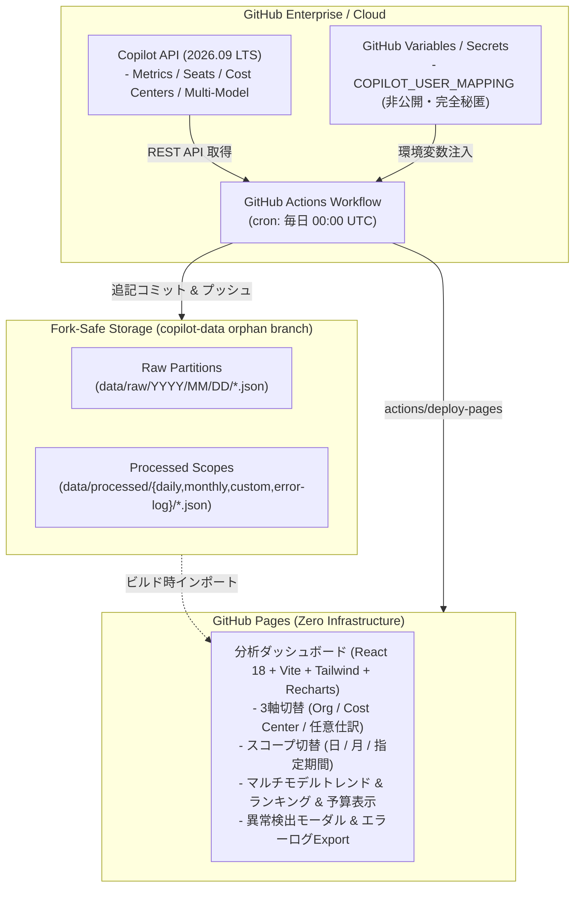

[English](README.md) | [日本語](README.ja.md)

---

# github-copilot-dashboard (2026.09 LTS)

[](https://github.com/sun-flat-yamada/github-copilot-dashboard/actions)
[](https://www.typescriptlang.org/)
[](https://reactjs.org/)
[](https://tailwindcss.com/)
[](LICENSE)
[](docs/specifications/)
[](https://docs.github.com)
[-emerald?style=flat-square)](https://pages.github.com)

[](https://buymeacoffee.com/sun.flat.yamada)

2026年9月時点の最新GitHub仕様（Copilot Metrics, Seats, Cost Centers, Multi-Model Usage, Billing）に完全準拠した、エンタープライズ品質の **GitHub Copilot 使用量・利用料金分析基盤** です。  

**GitHub Organization**、**GitHub Cost Center**、および **任意ユーザー属性情報（表示名・仕訳グループ対応表）** の3軸で多次元集計・コスト按分を行い、自動更新される **GitHub Pages** ダッシュボードとして美しく可視化します。

---

## 🌟 主な特徴 (Key Features)

### 1. 3軸による柔軟な多次元集計 & コスト按分
- **GitHub Organization 軸**: 複数Orgを横断した導入規模・利用率の比較。
- **GitHub Cost Center 軸**: GitHub Enterprise Billing の Cost Center 機能を直接連動。
- **任意仕訳グループ 軸**: 社内の事業部、プロジェクトコード、雇用区分等の独自マッピングに対応。

### 2. 予算管理 & Cost Center Budget モニタリング
- 各 Cost Center の **上限予算額 (Budget Limit)**、**無料枠 (Free Budget)**、**当月実使用額 (Current Usage)** をリアルタイム追跡。
- 予算消化率プログレスバー表示と、80%警告・100%超過アラート機能。

### 3. マルチモデル対応のユーザー別日次トレンド
- 2026年の最新AIモデル（**Claude 3.7 Sonnet**, **GPT-4o**, **o1**, **Gemini 2.0 Flash** 等）ごとの日次利用量（サジェスト数・チャットターン数）を積み上げ棒グラフで可視化。
- 合計推移ライン（Line）との複合チャート（ComposedChart）により、モデル別シフトや利用急増を直感的に把握可能。

### 4. 3軸グループ内使用量ランキング
- 選択した集計軸（Cost Center / Organization / 任意仕訳グループ）の内部で、利用量上位ユーザーを自動ランク付け。
- 日次・月次・指定期間の全スコープと完全連動し、主要な推進者や偏りを特定。

### 5. 堅牢な異常検出 & エラーログ管理
- APIレートリミットや権限不足、データ取得欠損を検知し、Headerに警告/エラーアイコンを即座に表示。
- **80%×80% モーダルウィンドウ**: 1件あたり3行のスマート省略表示（ワンクリックで全文展開）。
- **ErrorLog JSONエクスポート**: 障害調査用ログをワンクリックでダウンロード可能。
- 取得できなかったデータ項目には `データ取得不可` バッジを表示し、ダッシュボード全体がクラッシュせず安全にフォールバック。

### 6. 多層防御 (Defense-in-Depth) シークレット & PII 流出防止機構
- **OWASP / GitGuardian 準拠の `.gitignore`**: 秘密鍵（`*.pem`, `id_rsa`）、証明書、クラウド認証、`.env*` を徹底除外。
- **AI Agent ガードレール (`.agents/rules/`, `GEMINI.md`, `AGENTS.md`)**: エージェントによるトークン・個人情報のハードコードを常時抑止。
- **エージェント監査スキル (`skills/secret-guard/`) & ローカルスキャナー (`npm run secret-scan`)**: コミット前の自律セルフチェック。
- **CI/CD 自動検査 (`.github/workflows/secret-scan.yml`)**: Gitleaks と独自スキャナーによる PR/Push 時の二重遮断ゲート。
- **完全秘匿化**: 氏名や部署情報の対応テーブルは **GitHub Actions Variables / Secrets (`COPILOT_USER_MAPPING`)** に完全隔離。公開コミット履歴に個人情報（PII）や社内組織図が一切混入しません。

### 7. Fork非競合ストレージアーキテクチャ (Fork-Safe Storage)
- メインブランチ（`main`）にデータファイルをコミットせず、**独立データブランチ（`copilot-data`）分離モデル** を採用。
- 日付パーティショニング（`data/raw/YYYY/MM/...`）による追記型（Append-only）保存。
- 本リポジトリが社内で多数Forkされた際にも、Upstreamとの `Sync Fork` や Pull Request でマージ競合が100%発生しません。

### 8. 遊休シート（Idle Seats）最適化アドバイザー
- 過去30日以上未利用のシートを自動検出し、無駄になっているライセンス費用と削減可能額を算出。
- 該当ユーザー一覧のCSVエクスポートに対応。

---

## 🏛️ システムアーキテクチャ



---

## 📁 ディレクトリ構成

```text
github-copilot-dashboard/
├── .github/
│   ├── ISSUE_TEMPLATE/        # GitHub Issue Forms (バグレポート・機能要望・案内)
│   ├── workflows/             # CI/CD & 定周期バッチ (cron実行, Pages自動デプロイ)
│   ├── dependabot.yml         # 依存関係自動更新設定 (npm & GitHub Actions)
│   └── PULL_REQUEST_TEMPLATE.md
├── dashboard/                 # フロントエンド SPA (React + TypeScript + Tailwind)
│   ├── index.html             # エントリHTML
│   └── src/
│       ├── components/        # 分析カード・チャート・モーダルUIコンポーネント群
│       ├── types/             # ダッシュボード用型定義
│       └── App.tsx            # メインアプリケーション
├── data/                      # ローカル実行 / ビルド時データ領域 (.gitignore対象)
│   ├── mock/                  # 2026年仕様シミュレーションモックデータ
│   ├── processed/             # 集計済みスコープデータ (daily, monthly, custom)
│   └── raw/                   # パーティション別Rawデータ
├── docs/specifications/       # SDD (仕様駆動開発) 正式設計仕様書 (01〜11)
├── src/                       # データパイプライン & バックエンドコア
│   ├── cli/                   # パイプライン実行CLI (run-pipeline.ts)
│   ├── collector/             # API/モックデータ収集 & 異常検出ハンドラ
│   ├── processor/             # 3軸集計・按分・マルチモデル・ランキング集計
│   ├── storage/               # 追記型Fork非競合ストレージ
│   └── types/                 # Copilot & ドメイン型定義
├── .editorconfig              # エディタ共通フォーマット設定
├── .gitattributes             # Git LF改行コード正規化設定
├── CONTRIBUTING.md            # コントリビューションガイド
├── CODE_OF_CONDUCT.md        # 行動規範 (Contributor Covenant v2.1)
├── SECURITY.md                # セキュリティポリシー & 脆弱性報告手順
├── SUPPORT.md                 # サポート窓口 & FAQ
└── LICENSE                    # MIT License
```

---

## 📖 SDD (仕様駆動開発) 仕様書一覧

本プロジェクトはすべての機能が **仕様駆動開発 (Specification-Driven Development)** に則り設計されています：

| ドキュメント | タイトル | 概要 |
| :--- | :--- | :--- |
| [SDD-01](docs/specifications/01_requirements_specification.ja.md) | システム要件定義書 | 業務要件、機能要件、セキュリティ・運用要件 |
| [SDD-02](docs/specifications/02_system_architecture.ja.md) | システムアーキテクチャ設計書 | 全体構成図、データフロー、フォールバック設計 |
| [SDD-03](docs/specifications/03_github_copilot_api_spec_2026.ja.md) | GitHub API 仕様書 (2026.09) | Copilot Metrics, Seats, Cost Centers API定義 |
| [SDD-04](docs/specifications/04_user_attribute_mapping_spec.ja.md) | ユーザー属性情報仕様書 | PII秘匿化、Variables注入、バリデーション規約 |
| [SDD-05](docs/specifications/05_data_storage_and_fork_isolation_spec.ja.md) | データ永続化 & Fork非競合仕様書 | orphanブランチ分離、追記型パーティション |
| [SDD-06](docs/specifications/06_aggregation_and_billing_logic_spec.ja.md) | 集計・按分・分析ロジック仕様書 | 3軸按分、マルチモデル日次集計、ランキング、予算計算 |
| [SDD-07](docs/specifications/07_dashboard_ui_ux_spec.ja.md) | ダッシュボード UI/UX 仕様書 | デザインシステム、異常検出モーダル、グラフ仕様 |
| [SDD-08](docs/specifications/08_automation_workflow_spec.ja.md) | 自動化ワークフロー仕様書 | GitHub Actions cron、Pagesデプロイ、エラーハンドリング |
| [SDD-09](docs/specifications/09_monthly_usage_report_mode_spec.ja.md) | Monthly Usage Report 分析モード仕様書 | 月次CSVレポート直接解析・永続化仕様 |
| [SDD-10](docs/specifications/10_ai_model_benchmark_radar_spec.ja.md) | AIモデル特性レーダー & 著名ベンチマーク評価仕様書 | 6軸レーダーチャート、38モデルベンチマーク評価 |
| [SDD-11](docs/specifications/11_deep_analysis_view_spec.ja.md) | 深い分析専用ビュー仕様書 | AI活用非効率パターン診断、AEDP自律駆動深度評価 |

---

## 🚀 クイックスタート & セットアップ

### ステップ 1: リポジトリの Fork
本リポジトリを社内の GitHub Enterprise または Organization に Fork します。

### ステップ 2: GitHub Pages の設定
1. リポジトリの **Settings** > **Pages** に移動します。
2. **Build and deployment** > **Source** を **「GitHub Actions」** に選択します。

### ステップ 3: Actions 権限の付与
1. **Settings** > **Actions** > **General** に移動します。
2. **Workflow permissions** で **「Read and write permissions」** を選択し、**「Allow GitHub Actions to create and approve pull requests」** にチェックを入れます。

### ステップ 4: ユーザー属性マッピングの登録 (Secrets / Variables)
氏名や社内部署情報などの機密属性を、GitHub Actions Variables（またはSecrets）として登録します。

1. **Settings** > **Secrets and variables** > **Actions** > **Variables** タブを開きます。
2. **New repository variable** をクリックし、名前を `COPILOT_USER_MAPPING` とします。
3. 以下のJSON配列を入力して保存します：

```json
[
  {
    "github_user": "taro-tanaka",
    "display_name": "田中 太郎",
    "department": "コア決済基盤チーム",
    "cost_center_override": "FinTech-Division",
    "notes": "正社員 / リード"
  },
  {
    "github_user": "hanako-suzuki",
    "display_name": "鈴木 花子",
    "department": "LLM応用プロダクトG",
    "cost_center_override": "Research-and-AI",
    "notes": "AIリサーチャー"
  },
  {
    "github_user": "alex-partner",
    "display_name": "Alex Rivera",
    "department": "コア決済基盤チーム",
    "notes": "業務委託"
  }
]
```
> [!TIP]
> より高い秘匿性を要する場合は、Variables ではなく **Secrets** (`COPILOT_USER_MAPPING`) として登録することも可能です。

### ステップ 5: 取得スコープと認証トークンの設定
- **Secrets**:
  - `COPILOT_READ_TOKEN`: CopilotおよびBillingの読み取り権限（`manage_billing:copilot`, `read:org`）を持つPAT。
- **Variables**:
  - `COPILOT_ENTERPRISE`: Enterpriseスラッグ（例: `my-enterprise`）。
  - または `COPILOT_ORGS`: カンマ区切りのOrganization名（例: `org-core,org-ai-labs`）。
  - （テスト運用時）`MOCK_MODE`: `true` を指定すると、実際のトークンがなくても2026年仕様のシミュレーションデータでダッシュボードが即座に立ち上がります。

---

## 💻 ローカル開発 & テスト実行

本リポジトリは、GitHub APIトークンがないローカル環境でもフル機能の検証・開発が可能です。

```bash
# 1. 依存ライブラリのインストール
npm install

# 2. TypeScript 型チェック
npm run typecheck

# 3. 単体テスト & パイプラインテストの実行
npm test

# 4. シークレット & 個人情報（PII）流出防止スキャンの実行
npm run secret-scan

# 5. 2026年仕様モックデータによる集計パイプライン実行
npm run pipeline:mock

# 6. ローカル開発サーバー起動 (HMR対応)
npm run dev
# -> http://localhost:3000 でインタラクティブダッシュボードが開きます

# 7. プロダクション用ビルド検証
npm run build
```

---

## 🤝 コントリビューション & サポート

コントリビューションやフィードバックを歓迎します！もしこのツールが役に立ちましたら、継続的な開発支援をご検討いただけますと幸いです。

[](https://buymeacoffee.com/sun.flat.yamada)

プルリクエストや Issue の起票を歓迎します！  
コントリビューションの前に以下のガイドラインをご一読ください：

- [コントリビューションガイド (CONTRIBUTING.md)](CONTRIBUTING.md)
- [行動規範 (CODE_OF_CONDUCT.md)](CODE_OF_CONDUCT.md)
- [セキュリティポリシー (SECURITY.md)](SECURITY.md)
- [サポートガイド (SUPPORT.md)](SUPPORT.md)

---

## 📄 ライセンス

本プロジェクトは [MIT License](LICENSE) の下で公開されています。  
Copyright (c) 2026 sun-flat-yamada (Youhei Yamada)
