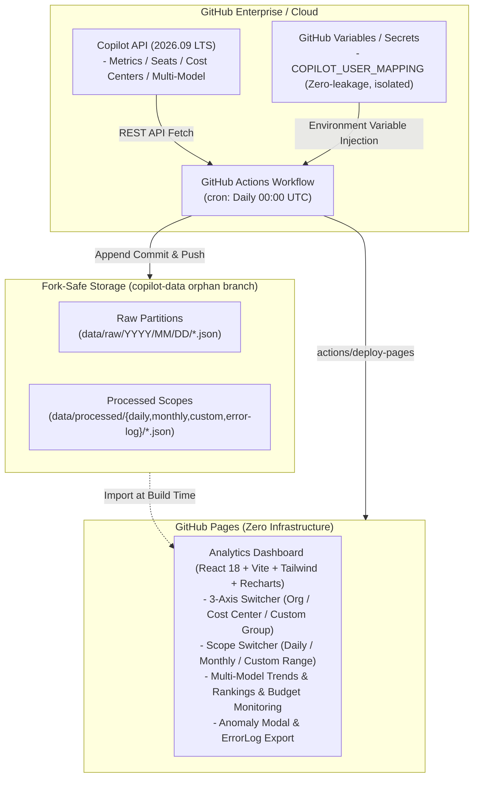

[English](README.md) | [日本語](README.ja.md)

---

# github-copilot-dashboard (2026.09 LTS)

[](https://github.com/sun-flat-yamada/github-copilot-dashboard/actions)
[](https://www.typescriptlang.org/)
[](https://reactjs.org/)
[](https://tailwindcss.com/)
[](LICENSE)
[](docs/specifications/)
[](https://docs.github.com)
[-emerald?style=flat-square)](https://pages.github.com)

[](https://buymeacoffee.com/sun.flat.yamada)

An enterprise-grade **GitHub Copilot Usage & Cost Analytics Platform** fully compliant with the latest GitHub specifications as of September 2026 (Copilot Metrics, Seats, Cost Centers, Multi-Model Usage, and Billing).

Performs multidimensional aggregation and cost allocation across 3 primary axes — **GitHub Organization**, **GitHub Cost Center**, and **Arbitrary User Attributes (display name / department mapping)** — beautifully visualized as an auto-updating **GitHub Pages** dashboard.

---

## 🌟 Key Features

### 1. Flexible 3-Axis Multidimensional Aggregation & Cost Allocation
- **GitHub Organization Axis**: Compare adoption scale and activity rates across multiple organizations.
- **GitHub Cost Center Axis**: Direct integration with GitHub Enterprise Billing Cost Center functionality.
- **Arbitrary Allocation Group Axis**: Custom mapping to internal business divisions, project codes, employment types, etc.

### 2. Budget Management & Cost Center Budget Monitoring
- Real-time tracking of each Cost Center's **Budget Limit ($B_{\text{limit}}$)**, **Free Budget ($B_{\text{free}}$)**, and **Current Usage ($S_{\text{current}}$)**.
- Budget consumption progress bars with 80% warning and 100% exceeded alert indicators.

### 3. Multi-Model Per-User Daily Trends
- Visualizes daily usage volume (suggestions and chat turns) for latest 2026 AI models (**Claude 3.7 Sonnet**, **GPT-4o**, **o1**, **Gemini 2.0 Flash**, etc.) as stacked bar charts.
- ComposedChart overlay with total activity trend line enables intuitive identification of model shifts and usage surges.

### 4. Intra-Group Usage Rankings Across 3 Axes
- Automatically ranks top users within any selected aggregation axis (Cost Center / Organization / Custom Allocation Group).
- Fully synchronized across Daily, Monthly, and Custom Date Range scopes to identify key champions and usage disparities.

### 5. Robust Anomaly Detection & Error Log Management
- Detects API rate limits, permission shortages, and data retrieval gaps, immediately surfacing warning/error indicators in the header.
- **80%×80% Modal Window**: Smart 3-line truncation per incident with one-click full expansion.
- **ErrorLog JSON Export**: One-click download of diagnostic logs for troubleshooting.
- Displays `Unavailable` badges for missing data points, ensuring graceful fallbacks without crashing the dashboard.

### 6. Defense-in-Depth Secret & PII Leak Prevention
- **OWASP / GitGuardian Compliant `.gitignore`**: Rigorously excludes private keys (`*.pem`, `id_rsa`), certificates, cloud credentials, and `.env*`.
- **AI Agent Guardrails (`.agents/rules/`, `GEMINI.md`, `AGENTS.md`)**: Continuously prevents AI agents from hardcoding tokens or personal identities.
- **Agent Audit Skill (`skills/secret-guard/`) & Local Scanner (`npm run secret-scan`)**: Autonomous pre-commit self-checks.
- **CI/CD Automated Inspection (`.github/workflows/secret-scan.yml`)**: Dual-layer interception gate on PR/Push via Gitleaks and custom scanner.
- **Zero PII Leakage**: User and department mapping tables are isolated exclusively in **GitHub Actions Variables / Secrets (`COPILOT_USER_MAPPING`)**. Zero personally identifiable information (PII) or internal org charts ever enter Git commit history.

### 7. Fork-Safe Storage Architecture & Maintenance Platform
- Zero data files committed to `main`; employs a dedicated **isolated orphan data branch (`copilot-data`)**.
- Append-only persistence partitioned by date (`data/raw/YYYY/MM/...`).
- Guaranteed 100% conflict-free `Sync Fork` and Pull Request operations when forks are shared across internal enterprise teams.
- Equipped with **Fork Health Verification Tool (`npm run fork:verify`)**, automated synchronization skill (`skills/fork-sync-ops/`), and full operational guide ([SDD-12](docs/specifications/12_fork_sync_and_customization_ops_spec.md)).

### 8. Idle Seat Optimization Advisor
- Automatically flags seats unused for 30+ days, calculating wasted license expenses and potential savings.
- Supports one-click CSV export of candidate users for license reclamation or reassignment.

---

## 🏛️ System Architecture



---

## 📁 Directory Structure

```text
github-copilot-dashboard/
├── .github/
│   ├── ISSUE_TEMPLATE/        # GitHub Issue Forms (Bug, Feature Request, Inquiry)
│   ├── workflows/             # CI/CD & Scheduled Batches (cron, Pages deploy)
│   ├── dependabot.yml         # Dependency update configuration (npm & Actions)
│   └── PULL_REQUEST_TEMPLATE.md
├── dashboard/                 # Frontend SPA (React + TypeScript + Tailwind)
│   ├── index.html             # Entry HTML
│   └── src/
│       ├── components/        # UI components (KPI cards, charts, modals)
│       ├── types/             # Dashboard TypeScript types
│       └── App.tsx            # Main application component
├── data/                      # Local execution & build data area (.gitignored)
│   ├── mock/                  # 2026 specification simulation mock data
│   ├── processed/             # Precomputed scope data (daily, monthly, custom)
│   └── raw/                   # Partitioned raw API responses
├── docs/specifications/       # SDD (Specification-Driven Development) Specs (01–13)
├── src/                       # Data Pipeline & Backend Core
│   ├── cli/                   # Pipeline runner CLI (run-pipeline.ts)
│   ├── collector/             # API / Mock collector & anomaly handler
│   ├── processor/             # 3-axis aggregation, billing, multi-model, rankings
│   ├── storage/               # Append-only fork-safe storage engine
│   └── types/                 # Copilot & domain type definitions
├── .editorconfig              # Editor format configuration
├── .gitattributes             # Git LF line-ending normalization
├── CONTRIBUTING.md            # Contribution guidelines
├── CODE_OF_CONDUCT.md        # Contributor Covenant Code of Conduct v2.1
├── SECURITY.md                # Security policy & vulnerability reporting
├── SUPPORT.md                 # Support channels & FAQ
└── LICENSE                    # MIT License
```

---

## 📖 SDD (Specification-Driven Development) Specifications

Every feature in this project is engineered in strict accordance with **Specification-Driven Development (SDD)**:

| Specification | Title | Overview |
| :--- | :--- | :--- |
| [SDD-01](docs/specifications/01_requirements_specification.md) | Requirements Specification | Business, functional, security, and operational requirements |
| [SDD-02](docs/specifications/02_system_architecture.md) | System Architecture Specification | Overall topology, data flows, and fallback architecture |
| [SDD-03](docs/specifications/03_github_copilot_api_spec_2026.md) | GitHub Copilot API Specification (2026.09) | Metrics, Seats, and Cost Centers API definitions |
| [SDD-04](docs/specifications/04_user_attribute_mapping_spec.md) | User Attribute Mapping Specification | PII isolation, Variables injection, and schema rules |
| [SDD-05](docs/specifications/05_data_storage_and_fork_isolation_spec.md) | Data Storage & Fork Isolation Specification | Orphan branch segregation and append-only partitioning |
| [SDD-06](docs/specifications/06_aggregation_and_billing_logic_spec.md) | Aggregation & Billing Logic Specification | 3-axis allocation, multi-model daily trends, rankings, budgets |
| [SDD-07](docs/specifications/07_dashboard_ui_ux_spec.md) | Dashboard UI/UX Specification | Design system, anomaly modal, and chart specifications |
| [SDD-08](docs/specifications/08_automation_workflow_spec.md) | Automation & CI/CD Workflow Specification | GitHub Actions cron, Pages deployment, and error handling |
| [SDD-09](docs/specifications/09_monthly_usage_report_mode_spec.md) | Monthly Usage Report Mode Specification | Direct parsing & persistent storage for monthly CSV reports |
| [SDD-10](docs/specifications/10_ai_model_benchmark_radar_spec.md) | AI Model Benchmark Radar Specification | 6-axis radar charts and evaluations across 38 frontier models |
| [SDD-11](docs/specifications/11_deep_analysis_view_spec.md) | Deep Analytics View Specification | Inefficient AI pattern diagnostics and AEDP autonomy depth |
| [SDD-12](docs/specifications/12_fork_sync_and_customization_ops_spec.md) | Fork Synchronization & Operations Specification | Upstream sync runbooks (Web UI/CLI/Actions), dual-branch model, health audit |
| [SDD-13](docs/specifications/13_fork_restricted_environment_setup_guide.md) | Fork-Restricted Environment Setup Guide | Mirror-based duplication procedure for EMU / policy-restricted organizations that cannot use GitHub Fork |

---

## 🚀 Quick Start & Setup

### Step 1: Fork the Repository
Fork this repository into your enterprise GitHub Organization or Enterprise account.

> [!NOTE]
> **Can't fork into your organization?** If your account is a GitHub Enterprise Managed User (EMU) or your organization's policy blocks forking from outside accounts, see [SDD-13: Fork-Restricted Environment Setup Guide](docs/specifications/13_fork_restricted_environment_setup_guide.md) for a mirror-based duplication procedure that doesn't require Fork.

### Step 2: Configure GitHub Pages
1. Navigate to **Settings** > **Pages** in your repository.
2. Under **Build and deployment** > **Source**, select **"GitHub Actions"**.

### Step 3: Grant Workflow Permissions
1. Navigate to **Settings** > **Actions** > **General**.
2. Under **Workflow permissions**, select **"Read and write permissions"** and check **"Allow GitHub Actions to create and approve pull requests"**.

### Step 4: Register User Attribute Mapping (Secrets / Variables)
Register sensitive user attributes (such as employee names and internal departments) as a GitHub Actions Variable or Secret.

1. Open **Settings** > **Secrets and variables** > **Actions** > **Variables** tab.
2. Click **New repository variable** and name it `COPILOT_USER_MAPPING`.
3. Input the JSON array and save:

```json
[
  {
    "github_user": "taro-tanaka",
    "display_name": "Taro Tanaka",
    "department": "Core Platform Team",
    "cost_center_override": "FinTech-Division",
    "notes": "Full-time / Tech Lead"
  },
  {
    "github_user": "hanako-suzuki",
    "display_name": "Hanako Suzuki",
    "department": "LLM Product Group",
    "cost_center_override": "Research-and-AI",
    "notes": "AI Researcher"
  },
  {
    "github_user": "alex-partner",
    "display_name": "Alex Rivera",
    "department": "Core Platform Team",
    "notes": "Contractor"
  }
]
```
> [!TIP]
> If higher confidentiality is required, you can store this mapping as a **Secret** (`COPILOT_USER_MAPPING`) instead of a Variable.

### Step 5: Configure Scope and Authentication Tokens
- **Secrets**:
  - `COPILOT_READ_TOKEN`: Personal Access Token (PAT) with Copilot and Billing read permissions (Fine-grained PAT or `manage_billing:copilot`, `read:org`).
- **Variables**:
  - `COPILOT_ENTERPRISE`: Enterprise slug (e.g., `my-enterprise`).
  - Or `COPILOT_ORGS`: Comma-separated list of organization names (e.g., `org-core,org-ai-labs`).
  - (Testing / Demo) `MOCK_MODE`: Set to `true` to immediately spin up the dashboard using 2026 simulation data without real credentials.

### Step 6: Synchronize with Upstream & Run Health Audit
When upstream releases new features or models, keep your fork synchronized and verified:

```bash
# 1. Run automated pre-flight health audit
npm run fork:verify

# 2. Fetch and fast-forward upstream main
git fetch upstream main
git merge upstream/main --ff-only

# 3. Update dependencies and verify quality gates
npm ci
npm run typecheck && npm test && npm run secret-scan && npm run build

# 4. Push updates to your fork
git push origin main
```
> [!TIP]
> For complete procedures (1-click Web UI sync, dual-branch custom code architecture, and troubleshooting), refer to [SDD-12 (Fork Synchronization & Operations Specification)](docs/specifications/12_fork_sync_and_customization_ops_spec.md) and the dedicated skill (`skills/fork-sync-ops/`).

---

## 💻 Local Development & Testing

Full development, verification, and testing can be conducted locally without any live GitHub tokens:

```bash
# 1. Install dependencies
npm install

# 2. Pre-flight fork health & sync audit
npm run fork:verify

# 3. TypeScript typecheck
npm run typecheck

# 4. Run unit & pipeline tests
npm test

# 5. Run secret & PII leak audit scanner
npm run secret-scan

# 6. Execute aggregation pipeline with 2026 mock data
npm run pipeline:mock

# 7. Start local development server (with HMR)
npm run dev
# -> Opens interactive dashboard at http://localhost:3000

# 8. Production build verification
npm run build
```

---

## 🤝 Contribution & Support

Contributions are welcome! If you find this tool useful, please consider supporting its development.

[](https://buymeacoffee.com/sun.flat.yamada)

Pull requests and issues are warmly welcomed!
Please review our community guidelines before contributing:

- [Contribution Guide (CONTRIBUTING.md)](CONTRIBUTING.md)
- [Code of Conduct (CODE_OF_CONDUCT.md)](CODE_OF_CONDUCT.md)
- [Security Policy (SECURITY.md)](SECURITY.md)
- [Support Guide (SUPPORT.md)](SUPPORT.md)

---

## 📄 License

This project is licensed under the [MIT License](LICENSE).
Copyright (c) 2026 sun-flat-yamada (Youhei Yamada)
