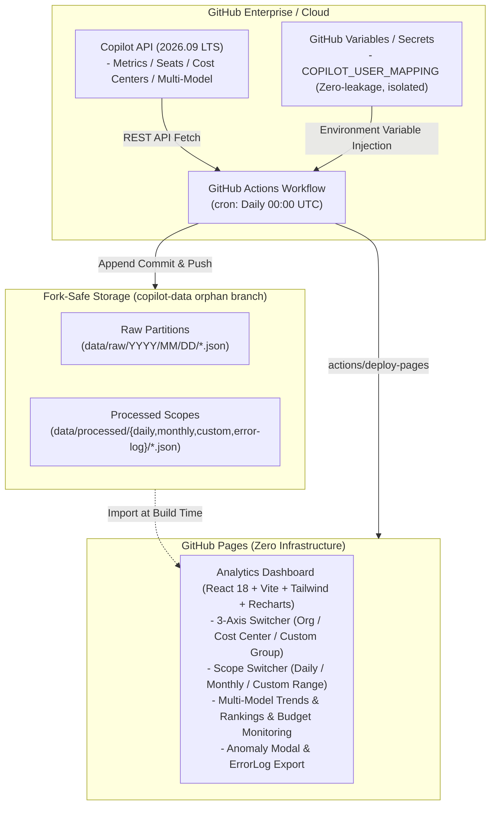

[English](README.md) | [日本語](README.ja.md)

---

# github-copilot-dashboard (2026.09 LTS)

[](https://github.com/sun-flat-yamada/github-copilot-dashboard/actions)
[](https://www.typescriptlang.org/)
[](https://reactjs.org/)
[](https://tailwindcss.com/)
[](LICENSE)
[](docs/specifications/)
[](https://docs.github.com)
[-emerald?style=flat-square)](https://pages.github.com)

[](https://buymeacoffee.com/sun.flat.yamada)

An enterprise-grade **GitHub Copilot Usage & Cost Analytics Platform** fully compliant with the latest GitHub specifications as of September 2026 (Copilot Metrics, Seats, Cost Centers, Multi-Model Usage, and Billing).

Performs multidimensional aggregation and cost allocation across 3 primary axes — **GitHub Organization**, **GitHub Cost Center**, and **Arbitrary User Attributes (display name / department mapping)** — beautifully visualized as an auto-updating **GitHub Pages** dashboard.

---

## 🌟 Key Features

### 1. Flexible 3-Axis Multidimensional Aggregation & Cost Allocation
- **GitHub Organization Axis**: Compare adoption scale and activity rates across multiple organizations.
- **GitHub Cost Center Axis**: Direct integration with GitHub Enterprise Billing Cost Center functionality.
- **Arbitrary Allocation Group Axis**: Custom mapping to internal business divisions, project codes, employment types, etc.

### 2. Budget Management & Cost Center Budget Monitoring
- Real-time tracking of each Cost Center's **Budget Limit ($B_{\text{limit}}$)**, **Free Budget ($B_{\text{free}}$)**, and **Current Usage ($S_{\text{current}}$)**.
- Budget consumption progress bars with 80% warning and 100% exceeded alert indicators.

### 3. Multi-Model Per-User Daily Trends
- Visualizes daily usage volume (suggestions and chat turns) for latest 2026 AI models (**Claude 3.7 Sonnet**, **GPT-4o**, **o1**, **Gemini 2.0 Flash**, etc.) as stacked bar charts.
- ComposedChart overlay with total activity trend line enables intuitive identification of model shifts and usage surges.

### 4. Intra-Group Usage Rankings Across 3 Axes
- Automatically ranks top users within any selected aggregation axis (Cost Center / Organization / Custom Allocation Group).
- Fully synchronized across Daily, Monthly, and Custom Date Range scopes to identify key champions and usage disparities.

### 5. Robust Anomaly Detection & Error Log Management
- Detects API rate limits, permission shortages, and data retrieval gaps, immediately surfacing warning/error indicators in the header.
- **80%×80% Modal Window**: Smart 3-line truncation per incident with one-click full expansion.
- **ErrorLog JSON Export**: One-click download of diagnostic logs for troubleshooting.
- Displays `Unavailable` badges for missing data points, ensuring graceful fallbacks without crashing the dashboard.

### 6. Defense-in-Depth Secret & PII Leak Prevention
- **OWASP / GitGuardian Compliant `.gitignore`**: Rigorously excludes private keys (`*.pem`, `id_rsa`), certificates, cloud credentials, and `.env*`.
- **AI Agent Guardrails (`.agents/rules/`, `GEMINI.md`, `AGENTS.md`)**: Continuously prevents AI agents from hardcoding tokens or personal identities.
- **Agent Audit Skill (`skills/secret-guard/`) & Local Scanner (`npm run secret-scan`)**: Autonomous pre-commit self-checks.
- **CI/CD Automated Inspection (`.github/workflows/secret-scan.yml`)**: Dual-layer interception gate on PR/Push via Gitleaks and custom scanner.
- **Zero PII Leakage**: User and department mapping tables are isolated exclusively in **GitHub Actions Variables / Secrets (`COPILOT_USER_MAPPING`)**. Zero personally identifiable information (PII) or internal org charts ever enter Git commit history.

### 7. Fork-Safe Storage Architecture & Maintenance Platform
- Zero data files committed to `main`; employs a dedicated **isolated orphan data branch (`copilot-data`)**.
- Append-only persistence partitioned by date (`data/raw/YYYY/MM/...`).
- Guaranteed 100% conflict-free `Sync Fork` and Pull Request operations when forks are shared across internal enterprise teams.
- Equipped with **Fork Health Verification Tool (`npm run fork:verify`)**, automated synchronization skill (`skills/fork-sync-ops/`), and full operational guide ([SDD-12](docs/specifications/12_fork_sync_and_customization_ops_spec.md)).

### 8. Idle Seat Optimization Advisor
- Automatically flags seats unused for 30+ days, calculating wasted license expenses and potential savings.
- Supports one-click CSV export of candidate users for license reclamation or reassignment.

---

## 🏛️ System Architecture



---

## 📁 Directory Structure

```text
github-copilot-dashboard/
├── .github/
│   ├── ISSUE_TEMPLATE/        # GitHub Issue Forms (Bug, Feature Request, Inquiry)
│   ├── workflows/             # CI/CD & Scheduled Batches (cron, Pages deploy)
│   ├── dependabot.yml         # Dependency update configuration (npm & Actions)
│   └── PULL_REQUEST_TEMPLATE.md
├── dashboard/                 # Frontend SPA (React + TypeScript + Tailwind)
│   ├── index.html             # Entry HTML
│   └── src/
│       ├── components/        # UI components (KPI cards, charts, modals)
│       ├── types/             # Dashboard TypeScript types
│       └── App.tsx            # Main application component
├── data/                      # Local execution & build data area (.gitignored)
│   ├── mock/                  # 2026 specification simulation mock data
│   ├── processed/             # Precomputed scope data (daily, monthly, custom)
│   └── raw/                   # Partitioned raw API responses
├── docs/                      # Central Documentation Portal
│   ├── README.md              # Documentation portal & index
│   ├── setup_guide.md         # Comprehensive setup, GPG encryption & auth guide
│   ├── models_pricing.md      # Copilot supported AI models & token pricing reference
│   └── specifications/        # SDD Specifications (01–13) & Domain Index
├── src/                       # Data Pipeline & Backend Core
│   ├── cli/                   # Pipeline runner CLI (run-pipeline.ts)
│   ├── collector/             # API / Mock collector & anomaly handler
│   ├── processor/             # 3-axis aggregation, billing, multi-model, rankings
│   ├── storage/               # Append-only fork-safe storage engine
│   └── types/                 # Copilot & domain type definitions
├── .editorconfig              # Editor format configuration
├── .gitattributes             # Git LF line-ending normalization
├── CONTRIBUTING.md            # Contribution guidelines
├── CODE_OF_CONDUCT.md        # Contributor Covenant Code of Conduct v2.1
├── SECURITY.md                # Security policy & vulnerability reporting
├── SUPPORT.md                 # Support channels & FAQ
└── LICENSE                    # MIT License
```

---

## 📖 SDD (Specification-Driven Development) Specifications

Every feature, data pipeline, and security control in this project is engineered in strict accordance with **Specification-Driven Development (SDD)** across six core engineering domains:

1. **Requirements & Core Architecture**: [SDD-01](docs/specifications/01_requirements_specification.md) (System Requirements) & [SDD-02](docs/specifications/02_system_architecture.md) (Architecture Topology)
2. **Copilot APIs & Ingestion**: [SDD-03](docs/specifications/03_github_copilot_api_spec_2026.md) (2026.09 API Definitions) & [SDD-09](docs/specifications/09_monthly_usage_report_mode_spec.md) (Monthly CSV Usage Reports)
3. **Privacy & Data Isolation**: [SDD-04](docs/specifications/04_user_attribute_mapping_spec.md) (Zero-PII User Mapping & GPG Encryption) & [SDD-05](docs/specifications/05_data_storage_and_fork_isolation_spec.md) (Orphan Branch Storage)
4. **Analytics Engine & Frontier AI**: [SDD-06](docs/specifications/06_aggregation_and_billing_logic_spec.md) (3-Axis Cost Allocation & Budgets), [SDD-10](docs/specifications/10_ai_model_benchmark_radar_spec.md) (38 Frontier Models Benchmark Radar), & [SDD-11](docs/specifications/11_deep_analysis_view_spec.md) (AEDP Deep Diagnostics)
5. **Dashboard User Interface**: [SDD-07](docs/specifications/07_dashboard_ui_ux_spec.md) (Design System, Anomaly Modals & Composed Charts)
6. **Automation & Fork Lifecycle**: [SDD-08](docs/specifications/08_automation_workflow_spec.md) (CI/CD & Cron), [SDD-12](docs/specifications/12_fork_sync_and_customization_ops_spec.md) (Fork Sync & Dual-Branch Strategy), & [SDD-13](docs/specifications/13_fork_restricted_environment_setup_guide.md) (EMU Mirror Duplication)

> [!TIP]
> For the complete table of all 13 specifications, language editions, and role-based reading paths, consult the **[📖 SDD Specifications Catalog (docs/specifications/README.md)](docs/specifications/README.md)** or the central **[📚 Documentation Portal (docs/README.md)](docs/README.md)**.

---

## 🤖 Supported Models & Token Pricing

This platform tracks and visualizes daily consumption across 38+ frontier models (GPT-6 Astra, GPT-5.6 Sol/Terra, Claude 5 Opus/Sonnet, Gemini 3.8 Flash, etc.):
- **Token Pricing Reference**: Detailed cost per 1M tokens across input, cached, cache write, and output is documented in **[docs/models_pricing.md](docs/models_pricing.md)**.
- **Benchmark Radar**: 6-axis capability ratings (Coding, Reasoning, Math, Agentic, Speed, Cost Efficiency) are detailed in **[SDD-10](docs/specifications/10_ai_model_benchmark_radar_spec.md)**.

---

## 🚀 Quick Start & Setup

Deploy your auto-updating dashboard to GitHub Pages in 4 steps:

### Step 1: Fork or Mirror the Repository
- **Standard**: Click **Fork** to copy this repository to your enterprise organization.
- **EMU / Restricted**: If your organization blocks cross-org forking, follow [SDD-13: Fork-Restricted Environment Setup Guide](docs/specifications/13_fork_restricted_environment_setup_guide.md) for mirror duplication.

### Step 2: Configure GitHub Pages
1. Go to **Settings** > **Pages** in your repository.
2. Under **Build and deployment** > **Source**, select **"GitHub Actions"**.

### Step 3: Enable Actions Permissions
1. Navigate to **Settings** > **Actions** > **General**.
2. Under **Workflow permissions**, select **"Read and write permissions"** and check **"Allow GitHub Actions to create and approve pull requests"**.

### Step 4: Configure Credentials & User Mapping
Register your configuration under **Settings** > **Secrets and variables** > **Actions**:
- **Secrets**:
  - `COPILOT_READ_TOKEN`: Personal Access Token with `manage_billing:copilot` (or Copilot read permissions) and `read:org`.
- **Variables**:
  - `COPILOT_ENTERPRISE`: Enterprise slug (e.g., `my-enterprise`), or `COPILOT_ORGS`: Comma-separated org list.
  - `COPILOT_USER_MAPPING`: JSON array mapping GitHub logins to internal departments:
    ```json
    [
      { "github_user": "octocat-lead", "display_name": "Taro Tanaka", "department": "Platform Engineering", "cost_center_override": "FinTech-Division" }
    ]
    ```
  - *(Testing / Demo)* `MOCK_MODE`: Set to `true` to immediately spin up the dashboard using 2026 synthetic simulation data.

> [!NOTE]
> For advanced setup options — including **CSV mapping format**, **GPG encryption for mappings > 48KB**, **graceful credentials degradation**, and **fork synchronization runbooks** — refer to the **[🚀 Complete Setup & Configuration Guide (docs/setup_guide.md)](docs/setup_guide.md)**.

---

## 💻 Local Development & Testing

Full development, verification, and testing can be conducted locally without any live GitHub tokens:

```bash
# 1. Install dependencies
npm install

# 2. Pre-flight fork health & sync audit
npm run fork:verify

# 3. TypeScript typecheck
npm run typecheck

# 4. Run unit & pipeline tests
npm test

# 5. Run secret & PII leak audit scanner
npm run secret-scan

# 6. Execute aggregation pipeline with 2026 mock data
npm run pipeline:mock

# 7. Start local development server (with HMR)
npm run dev
# -> Opens interactive dashboard at http://localhost:3000

# 8. Production build verification
npm run build
```

---

## 🤝 Contribution & Support

Contributions are welcome! If you find this tool useful, please consider supporting its development.

[](https://buymeacoffee.com/sun.flat.yamada)

Pull requests and issues are warmly welcomed!
Please review our community guidelines before contributing:

- [Contribution Guide (CONTRIBUTING.md)](CONTRIBUTING.md)
- [Code of Conduct (CODE_OF_CONDUCT.md)](CODE_OF_CONDUCT.md)
- [Security Policy (SECURITY.md)](SECURITY.md)
- [Support Guide (SUPPORT.md)](SUPPORT.md)

---

## 📄 License

This project is licensed under the [MIT License](LICENSE).
Copyright (c) 2026 sun-flat-yamada (Youhei Yamada)
