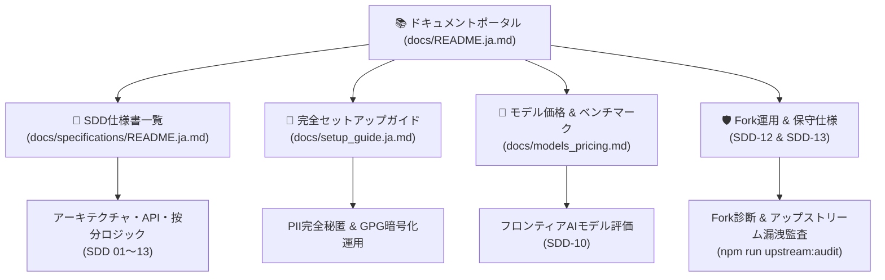

# 📚 GitHub Copilot Dashboard ドキュメントポータル

[English](README.md) | [日本語](README.ja.md)

**github-copilot-dashboard** の総合ドキュメントポータルへようこそ。本ディレクトリでは、正式なシステム設計仕様書、導入・セットアップマニュアル、モデル価格表、および運用手順書を体系的に整理・提供しています。

---

## 🧭 ドキュメント構成図

---

## 📑 主なドキュメントカテゴリ

### 1. [📖 SDD (仕様駆動開発) 設計仕様書一覧](specifications/README.ja.md)
本リポジトリの全機能およびデータ規約は、**仕様駆動開発 (Specification-Driven Development)** に則り設計されています：
- **[仕様書カタログ](specifications/README.ja.md)**: 全13件の正式仕様書一覧（要件定義、アーキテクチャ、Copilot API仕様、按分・集計ロジック、UI/UX設計、データ分離）。
- **[ロール別リーディングパス](specifications/README.ja.md#🧭-ロール別推奨リーディングパス)**: プラットフォーム管理者、FinOps担当、セキュリティ監査人、開発者向けの推奨閲覧順序。

### 2. [🚀 完全セットアップ & 環境構築ガイド](setup_guide.ja.md)
エンタープライズ組織での本番稼働に向けた完全手順書：
- **完全無料の GitHub Pages**: 追加のクラウド費用・サーバー運用ゼロでの自動配信。
- **個人情報秘匿とユーザー属性マッピング**: `COPILOT_USER_MAPPING` の設定、CSV形式対応、および48KB超過時のGPG暗号化運用。
- **USD常時基本表示 & サブ表示通貨・契約課金設定**: `COPILOT_BILLING_CONFIG`（為替レート、EAボリュームディスカウント、AI Credits契約単価）の設定とUI通貨切替。
- **認証とデータ取得スコープ**: Fine-grained PAT、Enterprise単位／複数Org単位、認証フォールバック機能。
- **EMU・Fork制限組織向け手順**: GitHub Fork を使えない組織向けのミラー複製方式 ([SDD-13](specifications/13_fork_restricted_environment_setup_guide.ja.md))。

### 3. [🤖 AIモデル & トークン単価リファレンス](models_pricing.md)
2026年最新の GitHub Copilot サポートAIモデル一覧とトークン単価表：
- **OpenAI シリーズ**: GPT-6 Astra, GPT-5.6 (Sol/Terra/Luna), GPT-5.5, GPT-5.4, GPT-5.3-Codex, GPT-5 mini
- **Anthropic シリーズ**: Claude 5 (Opus/Sonnet/Fable), Claude 4.8, Claude 4.7, Claude 4.6, Claude 4.5 Haiku
- **Google シリーズ**: Gemini 3.8 Flash, Gemini 3.7 Flash, Gemini 3.6 Flash, Gemini 3.5 Flash
- **著名ベンチマークレーダー評価**: 38モデルの6軸レーダーチャート評価 ([SDD-10](specifications/10_ai_model_benchmark_radar_spec.ja.md))

### 4. [🌿 Fork運用保守 & 2層ブランチ運用](specifications/12_fork_sync_and_customization_ops_spec.ja.md)
- **100%マージ非競合**: `copilot-data` 独立データブランチ分離により、本家更新とのコンフリクトをゼロ化。
- **2層ブランチアーキテクチャ**: 社内独自カスタマイズを `fork/custom` で維持しつつ、本家 `main` を追従。
- **健全性事前診断**: 健全性監査ツール (`npm run fork:verify`) および本家PR提出時の漏洩監査 (`npm run upstream:audit`)。

### 5. [🔒 セキュリティ & ゼロ流出ポリシー](../SECURITY.md)
- 多層防御シークレット検出 (`npm run secret-scan`)。
- AIエージェント開発規約 ([`AGENTS.md`](../AGENTS.md), [`GEMINI.md`](../GEMINI.md), [`.agents/rules/`](../.agents/rules/security-zero-leakage.md))。
- 実データ・個人情報を `main` ブランチへコミットさせない厳格なデータ隔離規約。
