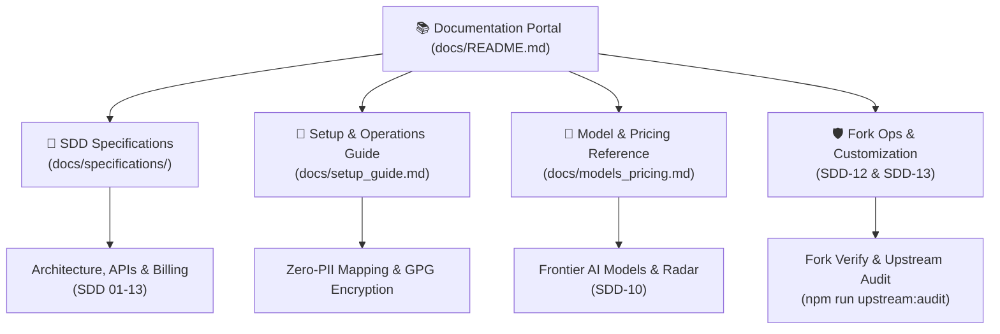

# 📚 GitHub Copilot Dashboard Documentation Portal

[English](README.md) | [日本語](README.ja.md)

Welcome to the central documentation hub for **github-copilot-dashboard**. This portal organizes formal engineering specifications, configuration and deployment manuals, model pricing references, and operational runbooks.

---

## 🧭 Documentation Map

---

## 📑 Core Documentation Categories

### 1. [📖 SDD Specifications Index](specifications/README.md)
Every feature and data contract in this project is engineered using **Specification-Driven Development (SDD)**:
- **[SDD Specifications Catalog](specifications/README.md)**: Full list of 13 specifications (requirements, architecture, Copilot APIs, billing logic, UI/UX, and fork isolation).
- **[Reading Paths](specifications/README.md#🧭-recommended-reading-paths)**: Tailored guides for Platform Operators, FinOps Analysts, Compliance Officers, and Frontend Developers.

### 2. [🚀 Complete Setup & Configuration Guide](setup_guide.md)
Step-by-step instructions for deploying and operating the dashboard in enterprise environments:
- **Zero-Cost GitHub Pages**: Automated hosting without cloud infrastructure.
- **Privacy & User Mapping**: Configure `COPILOT_USER_MAPPING`, CSV format, and GPG encryption for mappings > 48KB.
- **Permanent USD & Secondary Sub-Currency Display**: Configure `COPILOT_BILLING_CONFIG` (exchange rates, EA discounts, AI Credits unit prices) and interactive UI switcher.
- **Authentication & Scopes**: Personal Access Tokens, Enterprise vs. Organization scopes, and Graceful Credentials handling.
- **EMU & Fork-Restricted Orgs**: Mirror duplication procedures without GitHub Fork ([SDD-13](specifications/13_fork_restricted_environment_setup_guide.md)).

### 3. [🤖 AI Models & Token Pricing Reference](models_pricing.md)
Official 2026 reference prices and token cost metrics for all supported models:
- **OpenAI Family**: GPT-6 Astra, GPT-5.6 (Sol/Terra/Luna), GPT-5.5, GPT-5.4, GPT-5.3-Codex, GPT-5 mini.
- **Anthropic Family**: Claude 5 (Opus/Sonnet/Fable), Claude 4.8, Claude 4.7, Claude 4.6, Claude 4.5 Haiku.
- **Google Family**: Gemini 3.8 Flash, Gemini 3.7 Flash, Gemini 3.6 Flash, Gemini 3.5 Flash.
- **Frontier Benchmark Radar**: 6-axis performance ratings across 38 frontier models ([SDD-10](specifications/10_ai_model_benchmark_radar_spec.md)).

### 4. [🌿 Fork Synchronization & Dual-Branch Operations](specifications/12_fork_sync_and_customization_ops_spec.md)
- **100% Conflict-Free Sync**: Append-only storage on `copilot-data` guarantees `main` stays pristine.
- **Dual-Branch Architecture**: Maintaining custom code in `fork/custom` while tracking upstream `main`.
- **Pre-Flight Health Audit**: Automated verification tool (`npm run fork:verify`) and upstream data-leak prevention audit (`npm run upstream:audit`).

### 5. [🔒 Security & Zero-Leakage Standards](../SECURITY.md)
- Defense-in-depth secret detection (`npm run secret-scan`).
- Agent governance rules ([`AGENTS.md`](../AGENTS.md), [`GEMINI.md`](../GEMINI.md), [`.agents/rules/`](../.agents/rules/security-zero-leakage.md)).
- Data isolation policy prohibiting raw customer metrics on `main`.
