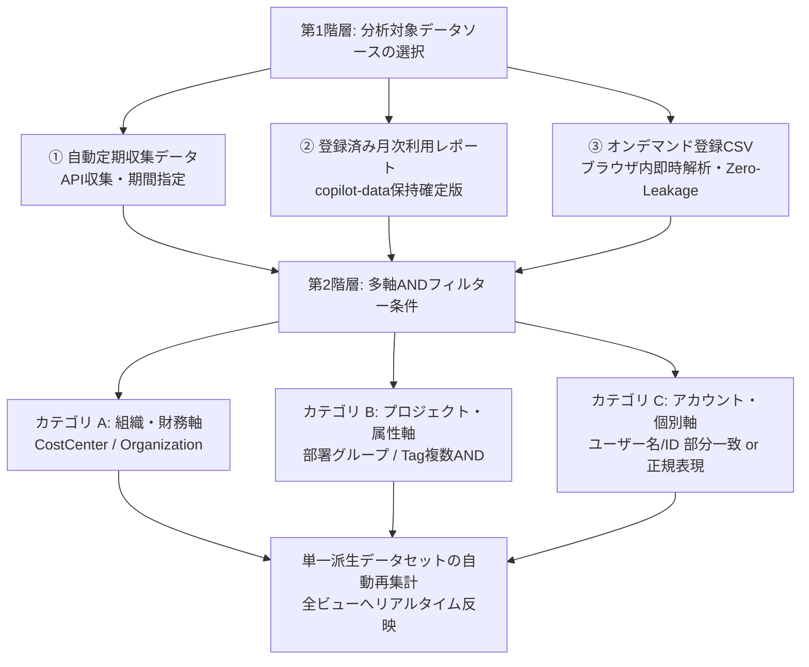

# 分析対象データ選択 & ANDフィルター利用ガイド

本ガイドでは、GitHub Copilot Enterprise Dashboard における**分析対象データの特定（2階層データ特定モデル）**および**多軸ANDフィルター**の利用方法を解説します。

---

## 1. 概要と基本コンセプト

本ダッシュボードでは、膨大なCopilot利用実績データの中から「誰の、いつの、どの範囲の利用状況を分析するか」を直感的かつ厳密に特定するため、**「2階層データ特定モデル」**を採用しています。

### 表示更新（リアクティビティ）の構造的保証
データソースやフィルター条件を変更すると、ダッシュボード内部のフィルタリングエンジン（`filterEngine`）がすべての集計値（概要KPI、ユーザー明細、部署・コストセンター集計、AIモデル利用内訳など）を純粋関数として完全再計算します。
また、一意なバージョンキー（`datasetVersionKey`）により、**全ビュー（Overview, Users, Trend, Budget, Deep Analysis, Model Radar）の表示更新がソフトウェア構造で自動的に保証**されます。特定画面だけ古いデータが残ることはありません。

---

## 2. ヘッダー表示（ActiveDataSelector）

ヘッダー中央に常時配置されているバッジボタンから、現在の選択状態を一目で確認できます。

*(※ 画面イメージはUI設計に基づく)*

### バッジの構成
1. **ソースインジケーター & 名称**:
   - `● 自動収集データ`（エメラルド緑・パルス）
   - `● 月次利用レポート`（ティール緑）
   - `● オンデマンドCSV`（シアン青）
2. **選択期間 / ファイル名**:
   - スコープキー（例: `2026-09`、`2026-09-26`、アップロードCSV名）
3. **フィルター要約ピル**:
   - 未適用時: `フィルタなし (全体: 120名)`
   - 適用時: 適用条件がチップ形式で要約表示（例: `[CC: DX推進]` `[backend]` `(+1)` `(14名)`）
4. **ワンクリック全解除ボタン (`[✕]`)**:
   - フィルター適用時のみバッジ横に赤い `[✕]` ボタンが表示され、1クリックですべての絞り込みを解除して全体表示に戻せます。

### モーダルの起動
- ヘッダーバッジをクリックする
- キーボードの **`/`** キーを押す（※ テキスト入力欄フォーカス時を除く）
- キーボードの **`Ctrl + K`** （Macでは **`Cmd + K`**）を押す

---

## 3. 第1階層: 分析対象データソースの選択

モーダル左カラム（Step 1）では、3種類のデータソースから1つを選択します。

### ① 自動定期収集データ (API収集)
- **概要**: GitHub REST API から定時ジョブ（GitHub Actions）が自動収集した最新のCopilotメトリクスおよびシート割当データです。
- **期間範囲指定**:
  - **月単位**: ドロップダウンから対象月（例: `2026-09`、`2026-08`）を選択。
  - **日単位**: 直近の日次データ（例: `2026-09-26`、`2026-09-25`）を選択。

### ② 登録済み月次利用レポート (Monthly Usage Report)
- **概要**: GitHub Enterprise / Organization の「Usage Report」からエクスポートされ、リポジトリ（`copilot-data`）にインポート済みの確定版CSVデータです。
- **対象確定月選択**:
  - ドロップダウンから閲覧したい確定月（例: `2026-09`）を選択。
  - 過去月の請求・利用実績を正確に振り返ることができます。

### ③ オンデマンド登録CSV (手元ファイルの即時分析)
- **概要**: 最新のUsage Report CSVを手元のPCから直接読み込ませて分析します。
- **操作方法**:
  - ドロップゾーンに対象の `.csv` ファイルをドラッグ＆ドロップ、またはクリックしてファイルを選択。
- **🔒 Zero-Leakage（高水準セキュリティ）**:
  - ファイルはブラウザの JavaScript メモリ内でのみ解析されます。外部サーバーやクラウドへの送信は一切行われません。一時的な検証や急ぎの確認でも安全に利用できます。

---

## 4. 第2階層: ANDフィルター条件による絞り込み

モーダル右カラム（Step 2）では、3つのカテゴリ軸から複数条件を組み合わせて絞り込みます。すべての条件は **AND（かつ）** で評価されます。

### カテゴリ A: 組織・財務軸
- **CostCenter (コストセンター)**:
  - 「すべて (All)」
  - 「未割当のみ (Unassigned)」: コストセンターが割り当てられていない座席・ユーザーを抽出
  - 登録済みの個別コストセンター名（例: `CC-PLATFORM`, `CC-DEV-AI`）
- **GitHub Organization**:
  - 「すべて (All)」
  - 「未割当のみ (Unassigned)」
  - 対象Organization名（例: `github-enterprise`, `org-core-sys`）

### カテゴリ B: プロジェクト・属性軸
- **ユーザー定義グループ (部署・PJ)**:
  - 企業内の部署コードやプロジェクト区分で絞り込み。
- **Tag 絞り込み (複数選択可)**:
  - ボタンをクリックしてタグを選択・解除。
  - **複数選択時はAND一致**: 例として `[backend]` と `[lead]` を両方選択した場合、**両方のタグを持つユーザーのみ**が対象となります。

### カテゴリ C: アカウント・個別軸
- **ユーザー名 / ID パターン指定**:
  - **通常モード（デフォルト）**:
    - 入力した文字列が `login`（GitHubアカウントID）または `display_name`（氏名）に部分一致するユーザーを抽出（大文字・小文字は区別しません）。
    - 例: `tanaka`、`alice`
  - **正規表現 (RegEx) モード**:
    - 「正規表現 (RegEx) を有効化」にチェックを入れます。
    - 柔軟な正規表現パターンを指定可能（大文字・小文字を区別しない `i` フラグで評価）。
    - 例:
      - `^(dev|sre)-.*`: `dev-` または `sre-` から始まるアカウント
      - `.*(lead|mgr)$`: 末尾に `lead` または `mgr` がつくアカウント
      - `alice|bob|charlie`: 特定の複数メンバーを指定
- **安全機構**:
  - **最大長制限**: 最大 100 文字まで。
  - **構文チェック**: 括弧の閉じ忘れ等のエラーを即時赤字で通知し、適用ボタンを無効化。
  - **ReDoS対策**: サービス停止やブラウザフリーズの原因となる危険なネスト量化子（例: `((a+)+)+`）を検知して遮断。

---

## 5. リアルタイム集計プレビューと適用

モーダル上部ヘッダー部には、選択した条件の安全性を即座に確認するための「選択ユーザー数」プレビュー機能が備わっています。

### 選択ユーザー数プレビュー
- モーダル右上に常時表示され、現在選択中のデータソースとフィルター条件を満たすユーザー数が **`該当: X / 全体 Y 名`** の形式でリアルタイムに計算・表示されます。
- 条件が厳しすぎて **0件** になる場合は、赤色の警告バッジ（`該当 0 件 (条件が厳しすぎます)`）が表示され、誤って空データを適用してしまうのを防止します。

### 適用とキャンセル
- **この条件で分析を適用 (Enter)**:
  - ボタンをクリックするか、キーボードの **`Enter`** キーを押すと、条件がダッシュボード全体に一括適用されモーダルが閉じます。
- **キャンセル (Esc)**:
  - 変更を破棄して直前の状態を維持します。
- **条件リセット**:
  - 右上の「条件リセット」アイコンを押すと、フィルター条件のみを「すべて（初期状態）」に瞬時に戻せます。

---

## 6. キーボードショートカット一覧

| ショートカット | 動作 |
| :--- | :--- |
| **`/`** | モーダルを開く（テキスト入力中を除く） |
| **`Ctrl + K`** / **`Cmd + K`** | モーダルの開閉をトグル |
| **`Enter`** | モーダル内で条件を確定・適用 |
| **`Escape`** | モーダルを閉じる（キャンセル） |

---

## 7. よくある質問 (FAQ)

### Q1. フィルターを適用したのに、AIモデル利用内訳や部署集計が古いままになりませんか？
**A1. なりません。**
本システムは SDD-15（データセントリック・リアクティビティ仕様）に完全準拠しており、フィルター適用時にはすべての派生テーブル・グラフ・KPIが単一の派生データセットとして一括再計算されます。さらに `datasetVersionKey` による再描画保証が組み込まれているため、表示の食い違いは一切発生しません。

### Q2. オンデマンドCSVに機密情報（社員名等）が含まれているか心配です。
**A2. 安全です。**
オンデマンド登録CSVはブラウザのローカルメモリ（FileReader）のみで処理され、サーバーや外部ネットワークへ送信されることはありません（Zero-Leakageアーキテクチャ）。

### Q3. 特定の2つの部署のメンバーを同時に見たい場合はどうすればよいですか？
**A3. アカウント・個別軸の正規表現検索をご活用ください。**
グループが1つしか選べない場合でも、ユーザー名のプレフィックスやID、またはタグを複数選択することで柔軟なグループ横断分析が可能です。

### Q4. 自動収集データの選択パターン（月次・日次・各フィルター）の動作はどのように保証されていますか？
**A4. 網羅的なテストデータマトリクス（`src/tests/fixtures/auto-collected-data-fixtures.ts`）と専用テストスイート（`src/tests/auto-collected-selection-matrix.test.ts`）により、全選択パターンが自動検証されています。**
複数月（`2026-09`, `2026-08`, `2026-07`）、日次（平日・週末）、未割当CostCenter/Org/部署、複数タグAND、各種正規表現パターン（プレフィックス・サフィックス・OR・日本語・否定）、ReDoS遮断、リアルタイムプレビュー件数の計算精度が、CI/CDで常時100%パスするよう保証されています。
