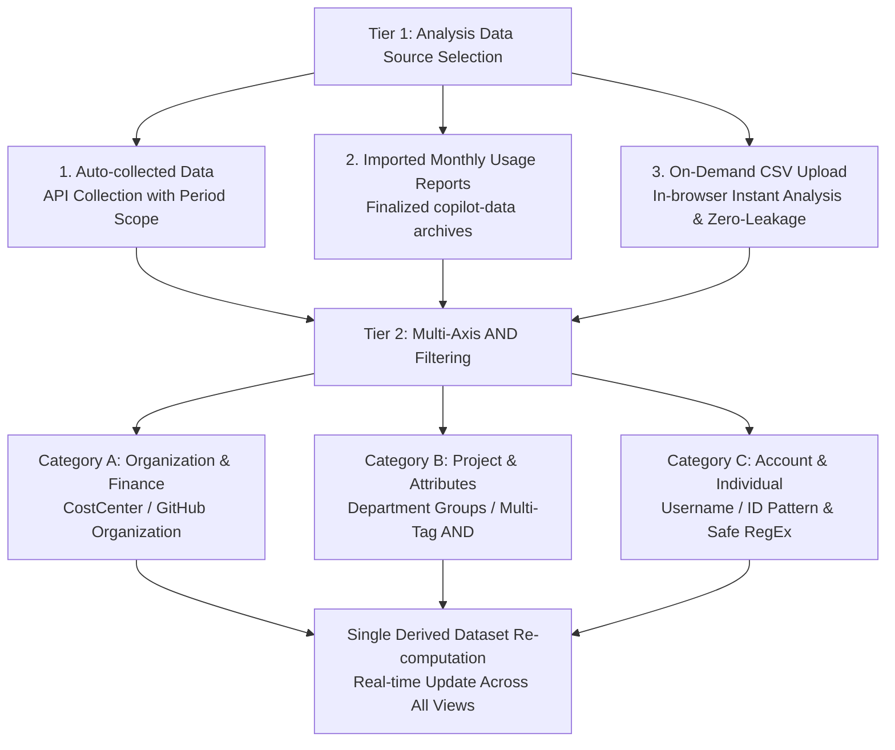

# User Guide: Data Selection & Hierarchical AND Filtering

This guide provides comprehensive instructions on using the **Two-Tier Data Selection Model** and **Multi-Axis AND Filtering** in GitHub Copilot Enterprise Dashboard.

---

## 1. Overview & Core Concept

To allow users to precisely pinpoint and analyze Copilot adoption and usage across large enterprises, this dashboard adopts a **Two-Tier Data Selection Model**:

### Architectural Reactivity Guarantee
When a data source or filter condition changes, the underlying `filterEngine` completely re-aggregates all metrics (Overview KPIs, user details, department/CostCenter rollups, AI model breakdown) as pure functions.
Furthermore, a unique `datasetVersionKey` ensures that **all views (Overview, Users, Trend, Budget, Deep Analysis, Model Radar) re-render immediately through software architecture**, eliminating the risk of stale data.

---

## 2. Header Badge Display (ActiveDataSelector)

The badge button located at the center of the top header provides an instant summary of your current analysis scope.

### Badge Elements
1. **Source Indicator & Label**:
   - `● Auto-collected Data` (Emerald green, pulsing)
   - `● Monthly Usage Report` (Teal green)
   - `● On-Demand CSV` (Cyan blue)
2. **Selected Period / Filename**:
   - Scope key (e.g., `2026-09`, `2026-09-26`, or the uploaded CSV filename)
3. **Filter Summary Pills**:
   - Unfiltered: `No filter (All: 120 users)`
   - Filtered: Summary chips (e.g., `[CC: Platform]` `[backend]` `(+1)` `(14 users)`)
4. **One-Click Clear Button (`[✕]`)**:
   - Appears next to the badge only when filters are active. Clicking resets all filter criteria back to default in one step.

### Opening the Modal
- Click the header badge button
- Press **`/`** on your keyboard (when not focusing text input fields)
- Press **`Ctrl + K`** (or **`Cmd + K`** on macOS)

---

## 3. Tier 1: Analysis Data Source Selection

The left column of the modal (Step 1) allows selecting one of three data source types:

### 1. Auto-collected Data (API Collection)
- **Description**: Automated metric and seat assignment data collected periodically via GitHub REST API by background jobs (GitHub Actions).
- **Scope Options**:
  - **Monthly**: Select a target month (e.g., `2026-09`, `2026-08`).
  - **Daily**: Select a specific recent date (e.g., `2026-09-26`).

### 2. Imported Monthly Usage Reports
- **Description**: Official monthly usage CSVs exported from GitHub Enterprise / Organization settings and committed to the `copilot-data` branch.
- **Scope Options**:
  - Select any finalized month to review reconciled financial and activity metrics.

### 3. On-Demand CSV Upload
- **Description**: Analyze your locally exported Usage Report CSV on demand.
- **How to use**:
  - Drag and drop your `.csv` file into the drop zone, or click to choose from your file browser.
- **🔒 Zero-Leakage Privacy**:
  - Parsed strictly within in-browser JavaScript memory (`FileReader`). Never transmitted to any external server or backend.

---

## 4. Tier 2: Multi-Axis AND Filtering

The right column of the modal (Step 2) allows combining filters across three categories. All criteria are evaluated using **strict AND** logic.

### Category A: Organization & Finance
- **CostCenter**:
  - `All`
  - `Unassigned`: Pinpoint seats/users with no CostCenter assigned
  - Specific CostCenter names (e.g., `CC-PLATFORM`, `CC-DEV-AI`)
- **GitHub Organization**:
  - `All`, `Unassigned`, or specific GitHub organizations

### Category B: Project & Attributes
- **User Defined Groups (Department / Project)**:
  - Custom organizational unit mapping.
- **Tag Filtering (Multi-Select)**:
  - Select one or more tags. **Evaluated as strict AND**: Selecting both `[backend]` and `[lead]` matches only users having **both** tags.

### Category C: Account & Individual
- **Username / ID Pattern**:
  - **Plain Text Mode (Default)**:
    - Case-insensitive substring match against `login` and `display_name`.
    - E.g., `tanaka`, `alice`
  - **Regular Expression (RegEx) Mode**:
    - Check "Enable Regular Expression (RegEx)".
    - Evaluated with case-insensitive `i` flag.
    - Examples:
      - `^(dev|sre)-.*`: Logins beginning with `dev-` or `sre-`
      - `.*(lead|mgr)$`: Logins ending in `lead` or `mgr`
      - `alice|bob|charlie`: Target a specific list of usernames
- **Safety Mechanisms**:
  - **Max length**: 100 characters.
  - **Syntax validation**: Live inline error message with disabled submit button on syntax errors.
  - **ReDoS Prevention**: Blocks nested quantifier patterns (e.g., `((a+)+)+`) that risk catastrophic backtracking.

---

## 5. Real-Time Preview & Applying Changes

The bottom footer provides an instant preview to verify the impact of your filters:

### Live Preview Stats
- Displays **`Matched: X / Y total users`** in real time.
- If criteria are too narrow resulting in **0 matches**, an alert is displayed to prevent empty dashboard applications.

### Confirmation & Reset
- **Apply (Enter)**: Applies the selected dataset and filter criteria across the entire dashboard and closes the modal.
- **Cancel (Esc)**: Discards unapplied changes.
- **Reset Criteria**: Restores all filter dropdowns and inputs to their default "All" state.

---

## 6. Keyboard Shortcuts

| Shortcut | Action |
| :--- | :--- |
| **`/`** | Open modal (when not typing in an input field) |
| **`Ctrl + K`** / **`Cmd + K`** | Toggle modal open / closed |
| **`Enter`** | Apply current selection |
| **`Escape`** | Close modal (Cancel) |

---

## 7. Frequently Asked Questions (FAQ)

### Q1. Will all charts and tables update when I apply a filter?
**Yes.** Under SDD-15 (Data-Centric Reactivity Specification), all views receive the same single derived dataset. The `datasetVersionKey` bound to the main container guarantees that all views re-evaluate immediately.

### Q2. Is my on-demand CSV safe from leakage?
**Yes.** All processing is performed strictly inside your browser's local memory. No data is sent over the network.

### Q3. How is the reliability of auto-collected data selection patterns guaranteed?
**A3. Through an exhaustive test dataset matrix (`src/tests/fixtures/auto-collected-data-fixtures.ts`) and a dedicated test suite (`src/tests/auto-collected-selection-matrix.test.ts`).**
All selection patterns—including multi-month (`2026-09`, `2026-08`, `2026-07`), daily (weekdays vs. weekends), unassigned CostCenters/Orgs/Groups, multi-tag AND combinations, regular expression variations (prefixes, suffixes, OR, Japanese, negative lookaheads), ReDoS prevention, and real-time preview computation—are continuously verified to pass 100% in CI/CD.
