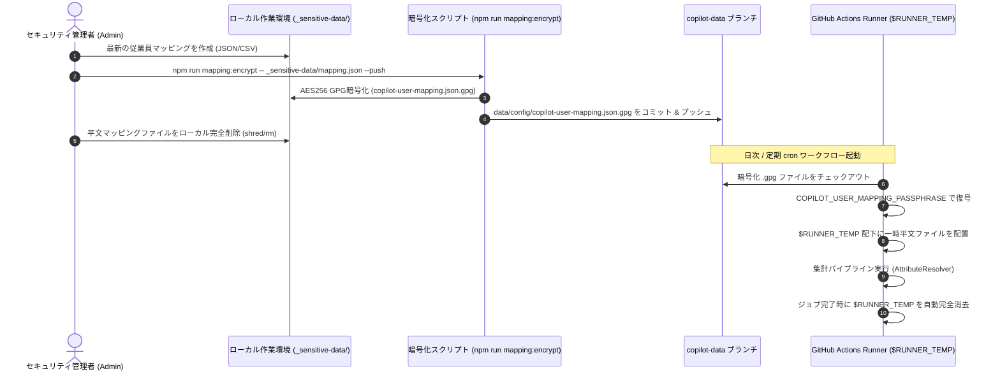

# GPG鍵管理およびユーザー属性マッピング運用標準ガイド

[English](01_gpg_key_management_and_user_mapping_guide.md) | [日本語](01_gpg_key_management_and_user_mapping_guide.ja.md)

- **文書番号**: SEC-GUIDE-001
- **改訂番号**: Rev 2.0 (Post-Clean Architecture)
- **対象バージョン**: 2026.09-LTS 以降
- **セキュリティ分類**: 内部統制・運用標準 (Internal Operational Standard)
- **関連仕様**: [SDD-04 ユーザー属性マッピング仕様](../specifications/04_user_attribute_mapping_spec.ja.md), [SDD-05 データ永続化・フォーク隔離仕様](../specifications/05_data_storage_and_fork_isolation_spec.ja.md)

---

## 1. 目的とセキュリティ基本原則 (Zero-Leakage Mandate)

本ドキュメントは、エンタープライズ環境において GitHub Copilot の利用者を「実名」「社内所属組織」「Cost Center」「雇用形態」に紐付けるユーザー属性マッピングファイル（`copilot-user-mapping.json` / `.csv`）を、**一切の平文漏洩なくセキュアに管理・暗号化・配備・運用するための標準手順書**である。

### 核心原則 (Core Directives)
1. **コードブランチ平文コミット絶対禁止 (Zero Secrets in Main Branch)**:
   - ソースコードブランチ（`main`, `develop`, フィーチャーブランチ等）には、実名・メールアドレス・社内組織構造などの個人特定可能情報（PII）を一切含めてはならない。
2. **暗号化ブロブの隔離保管 (Branch Isolation)**:
   - GPG 暗号化されたファイル（`.gpg`）は、データ専用の孤立ブランチ（`copilot-data`）内の `data/config/` ディレクトリにのみ格納する。
3. **揮発性実行環境でのみ平文復号 (Ephemeral Runtime Decryption)**:
   - GitHub Actions ランナー上での集計実行時、復号ファイルはジョブ終了後に完全消去される一時作業領域（`$RUNNER_TEMP`）にのみ書き出され、コミットや永続アーティファクトへ残存させない。
4. **最小権限・秘密鍵厳格管理 (Least Privilege Secrets Management)**:
   - 復号に必要なパスフレーズは GitHub Actions Secrets (`COPILOT_USER_MAPPING_PASSPHRASE`) にのみ保管し、ログへのマスク出力・露出を完全に防止する。

---

## 2. 暗号方式・暗号強度標準

本システムでは、OpenPGP / GnuPG 2.x 準拠の共通鍵暗号方式（Symmetric Encryption）を採用する。

| 項目 | 採用規格 / パラメータ | 準拠理由・セキュリティ根拠 |
|---|---|---|
| **暗号化アルゴリズム** | AES-256 (Advanced Encryption Standard 256-bit) | NIST SP 800-131A Rev.2 推奨、量子計算機耐性を考慮した高強度共通鍵暗号 |
| **鍵導出関数 (KDF)** | Iterated and Salted S2K (SHA-512) | パスフレーズからの辞書攻撃・ブルートフォース攻撃に対する高ストレッチング耐性 |
| **完全性保護** | MDC (Modification Detection Code) 有効 | 暗号文の改ざん・切り貼り攻撃を検知し復号を即時中断 |
| **パスフレーズエントロピー** | 256-bit 以上 (推奨: 64文字以上の乱数英数字記号) | 高度な分散ハッシュ解析環境に対しても総当たり解読が数学的に不可能 |

---

## 3. 暗号化パスフレーズの生成と GitHub Secrets への登録

### 3.1 推奨パスフレーズの安全な生成

予測不可能な高エントロピー文字列をローカル環境で生成する（パスワードマネージャーまたは乱数ジェネレータを使用）。

```bash
# OpenSSL による高エントロピー (256-bit) Base64 文字列の生成 (推奨)
openssl rand -base64 32
# 出力例 (※例示用の架空文字列です。本番環境では必ず新しく生成した値を使用してください):
# vK7m2X9pQz5Rt1Lw8Yb4Nc3Vf6Jh0Gs2Md5Aq8Ek1Tu=
```

### 3.2 GitHub Actions Secrets への登録

生成したパスフレーズを、リポジトリまたは Organization の Secret として登録する。

#### 方法 A: GitHub CLI (`gh`) を使用した登録 (推奨・クリップボード/シェル履歴非残存)
```bash
# 対話プロンプトから安全に入力
gh secret set COPILOT_USER_MAPPING_PASSPHRASE

# または環境変数経由での登録
export PASSPHRASE="<生成したパスフレーズ>"
gh secret set COPILOT_USER_MAPPING_PASSPHRASE --body "$PASSPHRASE"
unset PASSPHRASE
```

#### 方法 B: Web UI からの登録
1. GitHub リポジトリ（または親 Organization）の **Settings** を開く。
2. **Secrets and variables** > **Actions** を選択。
3. **New repository secret**（または **New organization secret**）をクリック。
4. Name に `COPILOT_USER_MAPPING_PASSPHRASE` を指定。
5. Secret に生成したパスフレーズを入力し、**Add secret** を押下。

---

## 4. マッピングデータの作成・暗号化・配備ライフサイクル

マッピングデータの運用ライフサイクルは、以下の 4 ステップで厳格に管理する。



### 4.1 マッピングファイルの準備 (平文)
平文ファイルは、Git 管理対象外として `.gitignore` に登録されている `_sensitive-data/` ディレクトリ配下に作成する。

```json
[
  {
    "github_user": "developer-taro",
    "display_name": "開発 太郎",
    "department": "コアプラットフォーム開発部",
    "cost_center_override": "Platform-Engineering",
    "notes": "テックリード",
    "tags": ["正社員", "アーキテクト"]
  },
  {
    "github_user": "contractor-hanako",
    "display_name": "業務 花子 (パートナー)",
    "department": "フロントエンド基盤G",
    "cost_center_override": "Frontend-Engineering",
    "notes": "業務委託パートナー",
    "tags": ["業務委託", "リモート"]
  }
]
```

### 4.2 GPG暗号化と `copilot-data` への自動コミット & プッシュ

付属の CLI ツールを使用して暗号化を行う。`--push` フラグを付与すると、一時ワークツリーを利用して `copilot-data` ブランチの `data/config/copilot-user-mapping.json.gpg` へ自動的にコミット＆プッシュされる（`main` ブランチへの誤コミットを物理的に防止）。

```bash
# 対称暗号化 & copilot-data ブランチへ自動プッシュ (対話プロンプトでパスフレーズ入力)
npm run mapping:encrypt -- _sensitive-data/copilot-user-mapping.json --push

# CI / 自動化パイプラインからの非対話暗号化 (環境変数指定モード)
export TEMP_PASS="<パスフレーズ>"
npm run mapping:encrypt -- _sensitive-data/copilot-user-mapping.json --push --passphrase-env TEMP_PASS
unset TEMP_PASS
```

### 4.3 平文ファイルの安全消去
暗号化とプッシュが完了した後は、ローカルの平文ファイルを速やかに安全消去（シュレッディング）する。

```bash
# Linux / macOS
shred -u _sensitive-data/copilot-user-mapping.json

# Windows PowerShell
Remove-Item -Path "_sensitive-data/copilot-user-mapping.json" -Force
```

---

## 5. 鍵ローテーション手順書 (Key Rotation Runbook)

定期的なセキュリティ監査（年次推奨）および緊急時の漏洩インシデント発生時には、以下のランブックに従って鍵ローテーションを実施する。

### 5.1 定期鍵ローテーション（年次実施推奨）

1. **新パスフレーズの生成**:
   ```bash
   openssl rand -base64 32
   ```
2. **既存マッピングのバックアップとローカル復号**:
   現行のパスフレーズを使用して、最新の暗号化ファイルをローカルの `_sensitive-data/` に復号する。
   ```bash
   git fetch origin copilot-data
   git checkout origin/copilot-data -- data/config/copilot-user-mapping.json.gpg
   npm run mapping:decrypt -- data/config/copilot-user-mapping.json.gpg _sensitive-data/temp-mapping.json
   git checkout HEAD -- data/config/copilot-user-mapping.json.gpg
   ```
3. **新パスフレーズによる再暗号化 & プッシュ**:
   新パスフレーズを用いて暗号化し、`copilot-data` へプッシュする。
   ```bash
   npm run mapping:encrypt -- _sensitive-data/temp-mapping.json --push
   ```
4. **GitHub Secrets の更新**:
   GitHub リポジトリの `COPILOT_USER_MAPPING_PASSPHRASE` を新しいパスフレーズで上書き更新する。
   ```bash
   gh secret set COPILOT_USER_MAPPING_PASSPHRASE
   ```
5. **ローカル平文の削除**:
   ```bash
   rm -f _sensitive-data/temp-mapping.json
   ```
6. **テスト実行の確認**:
   GitHub Actions の `copilot-analysis-cron.yml` ワークフローを手動トリガー（`gh workflow run copilot-analysis-cron.yml`）し、復号と集計が正常に完了することを確認する。

### 5.2 緊急時ローテーション（パスフレーズ漏洩・要員退職等のインシデント時）

漏洩の疑いが生じた場合、**15分以内**に上記ステップ 1〜4 を完了させ、古いパスフレーズを即時無効化する。
さらに、GitHub の Audit Log（`Audit log > repo.secret.update`）を確認し、不正なワークフロー実行履歴がないかを検証する。

---

## 6. エンタープライズ・コンプライアンス & 監査チェックリスト

本システムが SOC 2 Type II, ISO/IEC 27001, GDPR などの情報セキュリティ基準を満たしているかを検証するための監査チェックリストである。

| 監査項目 | 検証コマンド / 確認事項 | 合格基準 |
|---|---|---|
| **1. mainブランチ平文ゼロ検証** | `git log -p -S "display_name" main` | ソースコード履歴に氏名・所属のコミットが 0 件であること |
| **2. 自動シークレットスキャン** | `npm run secret-scan` | 320 以上のファイルをスキャンし、Exit Code 0（ゼロ漏洩）で終了すること |
| **3. データブランチ隔離性検証** | `npm run fork:verify` | `main` ブランチにデータファイルが存在せず、`copilot-data` のみが追記型で維持されていること |
| **4. Secrets 露出防止** | GitHub Actions 実行ログ確認 | 復号ステップで `***` としてマスクされ、平文パスフレーズがログ出力されないこと |
| **5. 揮発性ストレージ検証** | `.github/workflows/*.yml` 定義確認 | 復号先パスが `$RUNNER_TEMP` 配下であり、コミット対象外領域であること |

---

## 7. トラブルシューティング & FAQ

### Q1: `gpg: command not found` エラーが発生する
- **原因**: 実行環境に GnuPG がインストールされていない。
- **対処**:
  - Ubuntu / Debian: `sudo apt-get install -y gnupg`
  - macOS (Homebrew): `brew install gnupg`
  - Windows: [Gpg4win](https://www.gpg4win.org/) をインストール、または Git for Windows 付属の `gpg.exe` を PATH に通す。

### Q2: GitHub Actions で `gpg: BAD passphrase` で復号に失敗する
- **原因**: `COPILOT_USER_MAPPING_PASSPHRASE` の Secret の値が暗号化時のパスフレーズと一致していない、または改行コードが含まれている。
- **対処**:
  - `gh secret set COPILOT_USER_MAPPING_PASSPHRASE` で前後の空白や改行を排除して再設定する。
  - ローカルで `npm run mapping:decrypt` を実行し、該当パスフレーズで復号可能かテストする。

### Q3: 復号後の属性がダッシュボード上で「未分類」になる
- **原因**: マッピングファイル内の `github_user` と GitHub API から取得したログイン名の大文字・小文字が異なっている、または JSON スキーマが不正。
- **対処**:
  - `src/collector/attribute-resolver.ts` は大文字小文字を正規化して比較（case-insensitive）するが、余分なスペース（`"tanaka-taro "`）がないか確認する。
  - スキーマが `UserAttributeMapping[]` の配列形式を満たしているか確認する。
