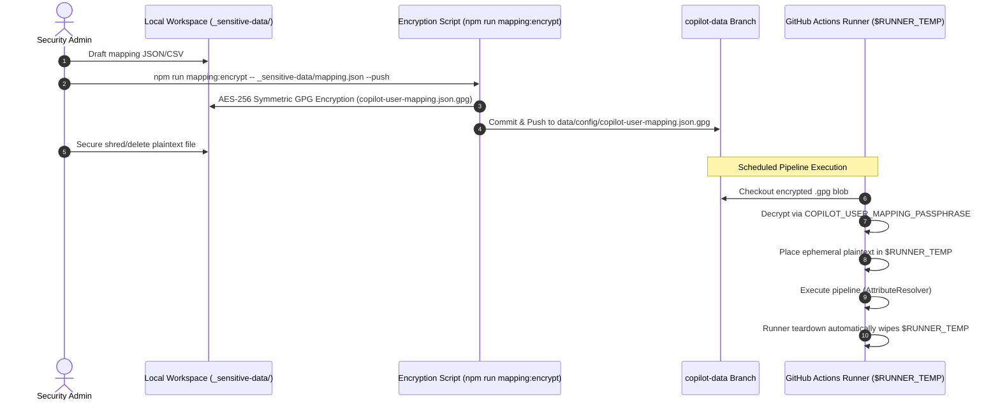

# GPG Key Management & User Attribute Mapping Operational Security Guide

[English](01_gpg_key_management_and_user_mapping_guide.md) | [日本語](01_gpg_key_management_and_user_mapping_guide.ja.md)

- **Document ID**: SEC-GUIDE-001
- **Revision**: Rev 2.0 (Post-Clean Architecture)
- **Target Release**: 2026.09-LTS and newer
- **Classification**: Internal Governance & Operational Security Standard
- **Related Specifications**: [SDD-04 User Attribute Mapping Specification](../specifications/04_user_attribute_mapping_spec.md), [SDD-05 Data Storage & Fork Isolation Specification](../specifications/05_data_storage_and_fork_isolation_spec.md)

---

## 1. Purpose & Zero-Leakage Mandate

This guide establishes the mandatory enterprise operational standard for creating, encrypting, deploying, rotating, and managing user attribute mapping files (`copilot-user-mapping.json` / `.csv`). These files map GitHub usernames to real employee identities, organizational departments, cost centers, and employment classifications while strictly enforcing **Zero PII Leakage in Git History**.

### Core Directives
1. **Zero Secrets / PII in Code Branches**:
   - Under no circumstances shall real employee names, email addresses, or internal organizational charts be committed into source code branches (`main`, `develop`, feature branches).
2. **Dedicated Branch Blob Storage (Branch Isolation)**:
   - Encrypted blobs (`.gpg`) must exclusively reside within the `data/config/` directory on the dedicated orphan branch (`copilot-data`).
3. **Ephemeral Runtime Decryption**:
   - Decryption on GitHub Actions runners is confined strictly to `$RUNNER_TEMP` (an ephemeral directory wiped upon job conclusion). No decrypted plaintext is written to the repository workspace or build artifacts.
4. **Least-Privilege Secret Custody**:
   - The symmetric passphrase must reside exclusively within GitHub Actions Secrets (`COPILOT_USER_MAPPING_PASSPHRASE`), with automated masking in job logs.

---

## 2. Cryptographic Standard & Strength

This system utilizes OpenPGP / GnuPG 2.x symmetric cryptography (password-authenticated cipher).

| Parameter | Specification | Technical Justification |
|---|---|---|
| **Cipher Algorithm** | AES-256 (Advanced Encryption Standard, 256-bit key) | NIST SP 800-131A Rev.2 compliant; resilient against brute force and quantum-assisted search attacks |
| **Key Derivation (KDF)** | Iterated and Salted S2K (SHA-512) | High-count key stretching counteracting GPU/ASIC rainbow table dictionary attacks |
| **Integrity Protection** | MDC (Modification Detection Code) Enabled | Detects ciphertext bit-flipping and splice attacks, instantly aborting decryption |
| **Passphrase Entropy** | ≥ 256-bit entropy (≥ 64 alphanumeric/special chars) | Mathematically intractable to brute-force in distributed cloud compute clusters |

---

## 3. Passphrase Generation & GitHub Secrets Registration

### 3.1 Secure Passphrase Generation

Generate an unpredictable, high-entropy cryptographic string in a secure local terminal:

```bash
# Generate 256-bit cryptographically secure Base64 string via OpenSSL
openssl rand -base64 32
# Example output (demonstration only; always generate a fresh secret for production):
# vK7m2X9pQz5Rt1Lw8Yb4Nc3Vf6Jh0Gs2Md5Aq8Ek1Tu=
```

### 3.2 Registration in GitHub Actions Secrets

Register the generated passphrase as a GitHub Action Secret at the repository or organization level.

#### Option A: GitHub CLI (`gh`) (Recommended; avoids clipboard & shell history retention)
```bash
# Interactive prompt (safest)
gh secret set COPILOT_USER_MAPPING_PASSPHRASE

# Or via environment variable
export PASSPHRASE="<generated_passphrase>"
gh secret set COPILOT_USER_MAPPING_PASSPHRASE --body "$PASSPHRASE"
unset PASSPHRASE
```

#### Option B: GitHub Web UI
1. Navigate to repository **Settings**.
2. Select **Secrets and variables** > **Actions**.
3. Click **New repository secret** (or **New organization secret**).
4. Set Name to `COPILOT_USER_MAPPING_PASSPHRASE`.
5. Enter the generated passphrase in Secret and click **Add secret**.

---

## 4. Mapping File Creation, Encryption, and Deployment Lifecycle

The operational lifecycle follows a 4-step sequence:



### 4.1 Plaintext Mapping Preparation
Create your confidential mapping file under `_sensitive-data/` (configured in `.gitignore` to prevent accidental staging):

```json
[
  {
    "github_user": "developer-taro",
    "display_name": "Taro Yamada",
    "department": "Core Platform Engineering",
    "cost_center_override": "Platform-Engineering",
    "notes": "Tech Lead",
    "tags": ["Full-Time", "Architect"]
  },
  {
    "github_user": "contractor-hanako",
    "display_name": "Hanako Sato (Partner)",
    "department": "Frontend Engineering Group",
    "cost_center_override": "Frontend-Engineering",
    "notes": "External Contractor",
    "tags": ["Contractor", "Remote"]
  }
]
```

### 4.2 GPG Encryption & Direct Push to `copilot-data`

Use the project CLI utility. The `--push` flag handles an isolated temporary worktree to commit and push directly to `copilot-data` without touching `main`:

```bash
# Interactive encryption & push to copilot-data
npm run mapping:encrypt -- _sensitive-data/copilot-user-mapping.json --push

# Non-interactive mode for CI/CD automation
export TEMP_PASS="<passphrase>"
npm run mapping:encrypt -- _sensitive-data/copilot-user-mapping.json --push --passphrase-env TEMP_PASS
unset TEMP_PASS
```

### 4.3 Secure Deletion of Plaintext
Immediately securely delete the local plaintext copy:

```bash
# Linux / macOS
shred -u _sensitive-data/copilot-user-mapping.json

# Windows PowerShell
Remove-Item -Path "_sensitive-data/copilot-user-mapping.json" -Force
```

---

## 5. Key Rotation Runbook

Follow this runbook for scheduled annual rotations and emergency response.

### 5.1 Scheduled Annual Rotation

1. **Generate New Passphrase**:
   ```bash
   openssl rand -base64 32
   ```
2. **Local Decryption of Current Mapping**:
   ```bash
   git fetch origin copilot-data
   git checkout origin/copilot-data -- data/config/copilot-user-mapping.json.gpg
   npm run mapping:decrypt -- data/config/copilot-user-mapping.json.gpg _sensitive-data/temp-mapping.json
   git checkout HEAD -- data/config/copilot-user-mapping.json.gpg
   ```
3. **Re-encrypt with New Passphrase & Push**:
   ```bash
   npm run mapping:encrypt -- _sensitive-data/temp-mapping.json --push
   ```
4. **Update Secret in GitHub**:
   ```bash
   gh secret set COPILOT_USER_MAPPING_PASSPHRASE
   ```
5. **Securely Erase Local Temporary Plaintext**:
   ```bash
   rm -f _sensitive-data/temp-mapping.json
   ```
6. **Trigger Pipeline Verification**:
   ```bash
   gh workflow run copilot-analysis-cron.yml
   ```

### 5.2 Emergency Incident Rotation (Compromise / Unauthorized Departure)

If a passphrase leak is suspected, execute Steps 1–4 within **15 minutes** to revoke and replace the passphrase immediately. Audit the GitHub Action audit log (`repo.secret.update`) to verify no unauthorized job invocations occurred.

---

## 6. Enterprise Compliance & Audit Checklist

Use this audit checklist to demonstrate compliance with SOC 2 Type II, ISO/IEC 27001, and GDPR.

| Audit Control | Verification Command / Check | Acceptance Criterion |
|---|---|---|
| **1. Zero PII in Source Code** | `git log -p -S "display_name" main` | 0 occurrences in commit diffs on `main` |
| **2. Pre-Commit Secret Scan** | `npm run secret-scan` | Scans >320 files with exit code 0 (clean) |
| **3. Branch Isolation Verification** | `npm run fork:verify` | No data files in `main`; `copilot-data` exclusively holds historical state |
| **4. Secret Masking in CI** | Inspect GitHub Actions console logs | Passphrase values replaced with `***`; zero raw output |
| **5. Ephemeral Decryption Path** | Check `.github/workflows/*.yml` | Decryption output targeting `$RUNNER_TEMP` only |

---

## 7. Troubleshooting & FAQ

### Q1: `gpg: command not found` error occurs
- **Remedy**:
  - Ubuntu/Debian: `sudo apt-get install -y gnupg`
  - macOS: `brew install gnupg`
  - Windows: Install [Gpg4win](https://www.gpg4win.org/) or add Git for Windows `gpg.exe` to PATH.

### Q2: `gpg: BAD passphrase` decryption failure in CI
- **Remedy**:
  - Verify that `COPILOT_USER_MAPPING_PASSPHRASE` has no trailing newline (`\n`) or extraneous whitespace.
  - Test locally with `npm run mapping:decrypt` using the exact secret value.

### Q3: User names appear as "Unassigned" after decryption
- **Remedy**:
  - Ensure `github_user` matches the GitHub login casing (comparison is case-insensitive, but verify whitespace).
  - Ensure the JSON file conforms to the array format `UserAttributeMapping[]`.
