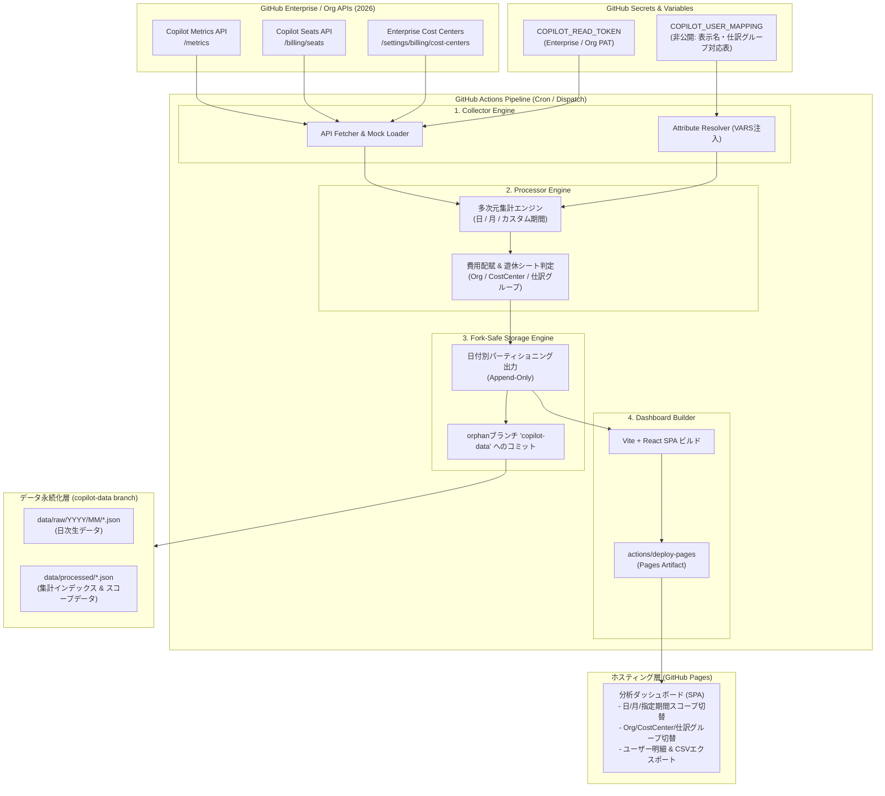

[English](02_system_architecture.md) | [日本語](02_system_architecture.ja.md)

---

# SDD-02: システムアーキテクチャ設計書 (System Architecture)

- **文書番号**: SPEC-COPILOT-002
- **ステータス**: Approved / Active
- **対象バージョン**: 2026.09-LTS
- **作成日**: 2026-09-10

---

## 1. 全体アーキテクチャ概要

本システムは、外部のRDBやクラウドサーバーを一切持たない**「サーバーレス・GitHubネイティブ型」**アーキテクチャを採用する。データ収集、加工・集計、永続化、およびダッシュボード配信をすべてGitHubのエコシステム（Actions, Variables, GitHub Pages）内で完結させる。



---

## 2. コンポーネント詳細

### 2.1 データ収集エンジン (Collector Engine)
- **役割**: GitHub REST API（EnterpriseまたはOrganizationスコープ）から、メトリクス・シート情報・Cost Center情報を取得する。
- **耐障害性**: レートリミット（429/403）時の指数バックオフと再試行、ページネーションの自動追従。
- **モックモード**: 環境変数 `MOCK_MODE=true` 時は、実APIを呼び出さずに2026年仕様準拠の擬似データを生成（ローカル開発・テスト・デモ環境用）。

### 2.2 属性解決エンジン (Attribute Resolver)
- **役割**: GitHub Actions Variable `COPILOT_USER_MAPPING` からJSON/CSVを安全に読み込み、ユーザーのGitHubログインIDを元に `display_name`, `department (仕訳グループ)`, `cost_center_override` などを動的解決する。
- **情報漏洩防止**: マッピングデータはGitリポジトリの履歴（コミット）に絶対に書き出さず、集計処理中のメモリ内でのみ結合（Join）する。

### 2.3 多次元集計・費用配賦エンジン (Aggregator & Billing Engine)
- **役割**:
  1. シート割当情報とメトリクス情報を突合し、各ユーザーの利用ステータス（Active / Inactive）を判定。
  2. 3軸（Organization, Cost Center, 任意仕訳グループ）での多次元集計を実行。
  3. 日次・月次・任意期間における按分費用（Business: \$19/月、Enterprise: \$39/月）を計算。
  4. 14日/30日以上未利用の「遊休シート」を検出し、削減可能コストを算出。

### 2.4 Fork非競合ストレージエンジン (Fork-Safe Storage Engine)
- **役割**:
  - `main` ブランチを汚染せず、独立した orphan ブランチ（`copilot-data`）にのみ集計成果物を保存。
  - 日付単位（`YYYY/MM/DD`）のイミュータブル・パーティショニングによる追記型永続化。
  - リポジトリ識別メタデータ（`repository_id`, `schema_version`）を付与。

### 2.5 GitHub Pages ダッシュボード (SPA)
- **役割**:
  - ブラウザ上で完全動作する高速SPA。
  - 集計済みJSON（日次・月次・期間インデックス）をFetchしてレンダリング。
  - 期間スコープセレクタ（日 / 月 / 指定期間）、グループセレクタ（Org / Cost Center / 任意仕訳グループ）、フィルター、CSVダウンロード機能を提供。

---

## 3. クリーンアーキテクチャ 4層設計 (Clean Architecture & DIP)

2026.09 LTS では、保守性・テスタビリティ・拡張性を飛躍的に高めるため、以下の 4 層 Clean Architecture を導入している。

```mermaid
flowchart TD
    subgraph Domain["1. Domain Layer (純粋TS・ゼロ外部依存)"]
        Entities["Entities\n- copilot.ts / deep-analysis.ts\n- model-benchmark.ts / views.ts"]
        VO["Value Objects\n- Money / HealthScore / DateRange"]
        Rules["Business Rules\n- SeatClassification / BudgetUtilization\n- AdoptionPhaseRule / SeatBillingRule"]
        Ports["Ports (Interfaces)\n- ICopilotDataSource / IStorageWriter\n- IAttributeResolver / IMetricsRepository\n- IViewPluginManifest"]
    end

    subgraph Application["2. Application Layer (ユースケース・ステート)"]
        Services["Application Services\n- ScopeManager / FilterService\n- CacheService / DiagnosticService\n- DemoModeService / AdoptionPhaseService"]
        Store["Reactive DataStore & DerivedDataGraph\n- DataStore / Reducer / State\n- DAG (トポロジカルソート・メモ化)"]
        Views["View System\n- ViewPluginRegistry / ViewOrchestrator"]
        Pipeline["Pipeline\n- PipelineOrchestrator"]
    end

    subgraph Adapters["3. Interface Adapters (入出力変換・Presenter)"]
        ACL["Anti-Corruption Layer (ACL)\n- RawApiFetcher (リトライ & カレンダーヘッダー)\n- ResponseNormalizer / NormalizerRegistry\n- Zod Schemas"]
        DataSources["Data Sources\n- GitHubApiCopilotDataSource\n- MockCopilotDataSource\n- StaticJsonMetricsRepository"]
        StorageAdapters["Storage Adapters\n- ForkSafeStorageWriter\n- AttributeResolverAdapter / DemoAttributeResolver"]
        Presenters["Presenters (DOM非依存)\n- Overview / Users / Trend\n- Budget / DeepAnalysis / ModelRadar\n- Credits / Agent / Adoption"]
        ViewPlugins["View Plugins (全9種)\n- Overview / Users / Trend\n- Budget / DeepAnalysis / ModelRadar\n- Credits / Agent / Adoption"]
    end

    subgraph Frameworks["4. Frameworks & Drivers (React & CLI & Web)"]
        ReactUI["React Dashboard SPA\n- DashboardProvider / useStoreSelector\n- useStoreDispatch / useViewPlugin\n- App.tsx / AppV2.tsx"]
        CLI["CLI Entrypoint\n- run-pipeline.ts -> createPipelineApp()"]
    end

    Frameworks --> Adapters
    Adapters --> Application
    Application --> Domain
    Adapters --> Domain
```



### 3.1 レイヤー責務
1. **Domain Layer (`src/domain/`)**: フレームワーク（React / CLI）や外部ライブラリに一切依存しない純粋なビジネスエンティティ、値オブジェクト（`Money`, `HealthScore`）、不変ビジネスルール、および抽象ポート（Interfaces）。
2. **Application Layer (`src/application/`)**: ユースケース、リアクティブ状態管理（`DataStore`）、派生データ計算グラフ（`DerivedDataGraph`）、およびビューオーケストレーション（`ViewOrchestrator`, `ViewPluginRegistry`）。
3. **Interface Adapters (`src/adapters/`)**: 外部API（GitHub REST API）のスキーマ防壁（ACL: `RawApiFetcher`, Zod Schemas）、ストレージアダプタ、および表示ロジックを純粋関数化する Presenters（DOM非依存・単体テスト可能）。
4. **Frameworks & Drivers (`src/frameworks/`, `dashboard/`, `src/cli/`)**: React Context (`DashboardProvider`)、カスタムフック (`useViewPlugin`, `useStoreSelector`)、CLI エントリポイント。

---

## 4. フロントエンドの状態管理原則 (Reactive DataStore & View Plugins)

### 4.1 Reactive DataStore + DerivedDataGraph
ダッシュボードは `DataStore` と `DerivedDataGraph` による単方向データフローを採用している。
- **トポロジカルソート & 循環検出**: 派生ノード（`filteredScopeData`, `filteredReportData`, `diagnosticResults` 等）は依存関係に基づきトポロジカル順に自動計算される。
- **入力ハッシュメモ化**: 依存ステートや上流派生データに変更がない場合、キャッシュされた計算結果を再利用し、無駄な再計算を完全防止。

### 4.2 View Plugin System & Presenter 分離
全9種の分析ビュー（Overview, Users, Trend, Budget, DeepAnalysis, ModelRadar, Credits, Agent, Adoption）は `IViewPluginManifest` を実装した独立プラグインとして定義される。
- **ViewOrchestrator**: 表示条件（`canRender`）および派生データの準備状況（`requiredDerivedData`）を検証し、表示可能ビューの切り替えを安全に調停。
- **Presenter**: ビュー表示に必要なフォーマット・計算（通貨表記、比率、ソート、フィルタ結果等）を React / DOM から完全に切り離した純粋 TypeScript クラスとして実装し、ブラウザ不要の高速単体テストを実現。

### 4.3 FinOps 常時USD基本表示 & サブ表示通貨・EA契約単価サブシステム
企業の Enterprise Agreement (EA) 契約や多国籍通貨管理に対応した動的課金計算レイヤーを装備する：
- **常時USD基本表示 & サブ表示通貨併記**: 全9分析画面・KPI・チャート・テーブルにおいて、USD（`$`）が常時基本通貨として表示され、オプションで日本円（JPY）やユーロ（EUR）などのサブ通貨がカッコ書きで併記される（例: `$2,975.00 (¥461,125)`）。
- **`CurrencyContext` & `CurrencySelector`**: 画面上部ヘッダーのセレクターから、閲覧者自身がリアルタイムにサブ表示通貨（USDのみ / USD+JPY / USD+EUR）を切り替え可能（ブラウザの `localStorage` に保持）。
- **`EnterpriseBillingConfig`**: 通貨定義（USD基本、任意の `subCurrency` JPY/EUR等）、為替レート、ボリュームディスカウント率（0-100%）、および直接契約単価（`customPricePerCredit`: 例 `1.273円 / AIC`、`customSeatPricing`）を管理。直接指定時はそれを最優先適用。
- **`Money` Value Object**: USD基本とサブ通貨を統合フォーマットする `formatWithSubCurrency`、構造化出力を返す `formatDual`、任意精度フォーマット、割引適用を一元提供。
- **`BillingConfigLoader`**: 環境変数 `COPILOT_BILLING_CONFIG` または `data/config/billing.json` から安全にロードし、未指定時は標準 USD レートへ自動フォールバック。

### 4.4 フロントエンド Code Splitting & バンドル最適化アーキテクチャ
ブラウザ初期表示パフォーマンスを極大化するため、以下のコード分割アーキテクチャを適用：
- **純粋ブラウザ Repository 分離**: `HttpJsonMetricsRepository`（`fetch` のみ使用）と `FsJsonMetricsRepository`（Node.js `fs` 使用）を物理分離し、ブラウザバンドルから Node.js モジュール解決を完全排除（Vite externalize 警告 0 件）。
- **On-demand View Lazy Loading**: 重量級 View（Model Radar, Deep Analysis, Credits, Agent Activity, Adoption Maturity）を `React.lazy` および `<Suspense>` で非同期分割。
- **UI スケルトン保護**: チャンク読み込み中のチラつき・レイアウトシフトを抑止するパルススケルトン（`ViewSkeleton`）を配備。
- **Rollup Manual Chunks**: `vendor-react`, `vendor-charts`, `vendor-icons`, `vendor-zod` にベンダーライブラリを適切に分離し、メイン JS チャンクを **300 kB 以下 (gzip 80 kB 以下)** に抑制。

### 4.5 セキュリティ & GPG 鍵管理ガバナンス
48KB を超える大規模ユーザーマッピングの安全運用のため、AES-256 GPG 対称暗号化ワークアラウンドを採用：
- 暗号化ブロブは `copilot-data` ブランチの `data/config/` にのみ格納。
- 実行時のみ `$RUNNER_TEMP` に平文復号され、ジョブ終了時にランナーごと完全破棄。
- 鍵ローテーション手順書およびコンプライアンス監査基準は [GPG鍵管理およびユーザー属性マッピング運用標準ガイド](../security/01_gpg_key_management_and_user_mapping_guide.ja.md) を参照。

---

## 5. ディレクトリ構成仕様

```
.
├── .github/
│   └── workflows/                      # GitHub Actions ワークフロー
├── docs/
│   ├── security/                       # セキュリティ運用標準ガイド (GPG鍵管理等)
│   └── specifications/                 # SDD仕様書群 (01〜15)
├── src/
│   ├── domain/                         # Layer 1: Domain
│   │   ├── entities/                   # エンティティ (copilot, views, billing-config 等)
│   │   ├── value-objects/              # 値オブジェクト (Money, HealthScore, DateRange 等)
│   │   ├── rules/                      # ビジネスルール (SeatClassification, AdoptionPhase 等)
│   │   └── ports/                      # ポート (ICopilotDataSource, IStorageWriter 等)
│   ├── application/                    # Layer 2: Application
│   │   ├── store/                      # DataStore, Reducer, State, DerivedDataGraph
│   │   ├── services/                   # ScopeManager, FilterService, CreditsBillingService 等
│   │   ├── views/                      # ViewPluginRegistry, ViewOrchestrator
│   │   └── pipeline/                   # PipelineOrchestrator
│   ├── adapters/                       # Layer 3: Adapters
│   │   ├── github-api/                 # ACL, RawApiFetcher, Normalizers, Zod Schemas
│   │   ├── storage/                    # HttpJsonMetricsRepository, FsJsonMetricsRepository, BillingConfigLoader
│   │   ├── presenters/                 # Overview, Users, Trend, Budget, DeepAnalysis, ModelRadar, Credits, Agent, Adoption
│   │   ├── views/                      # ViewPlugin 定義 & レジストリ登録 (全9種、lazy分割対応)
│   │   └── composition-root.ts         # バックエンド Composition Root (createPipelineApp)
│   ├── frameworks/                     # Layer 4: Frameworks
│   │   ├── react/                      # DashboardProvider, useStoreSelector, useViewPlugin
│   │   ├── composition-root.ts         # フロントエンド Composition Root (HttpJsonMetricsRepository注入)
│   │   └── cli-composition-root.ts     # CLI Composition Root (FsJsonMetricsRepository注入)
│   └── cli/
│       └── run-pipeline.ts             # CLI実行エントリポイント (createPipelineApp経由)
├── dashboard/                          # フロントエンド SPA (Vite + React + Tailwind)
│   └── src/
│       ├── components/                 # UIコンポーネント & Viewコンポーネント
│       │   └── common/ViewSkeleton.tsx # Suspense用統一スケルトン
│       ├── App.tsx                     # メインSPAコンポーネント (React.lazy + Suspense)
│       └── main.tsx
└── package.json
```


