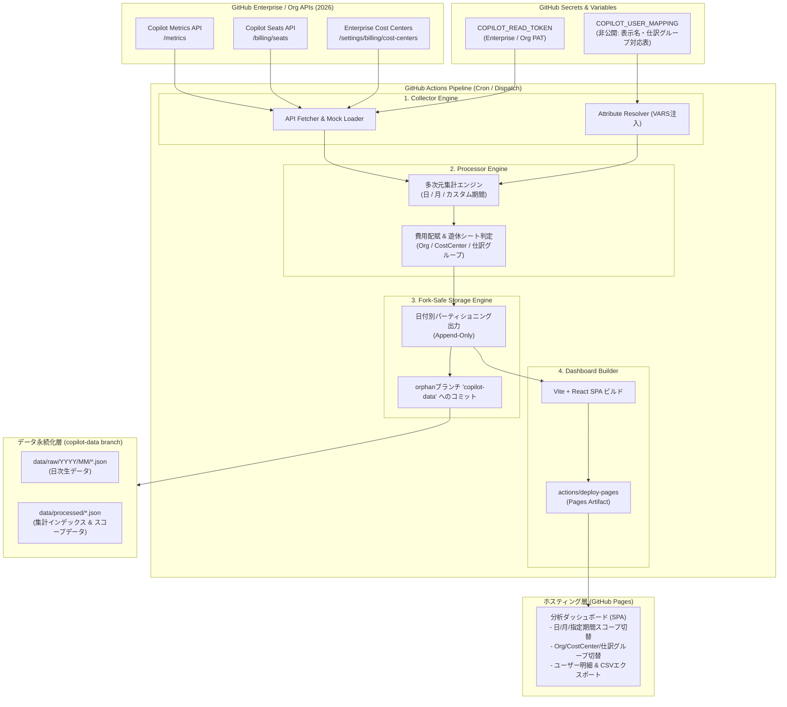

[English](02_system_architecture.md) | [日本語](02_system_architecture.ja.md)

---

# SDD-02: システムアーキテクチャ設計書 (System Architecture)

- **文書番号**: SPEC-COPILOT-002
- **ステータス**: Approved / Active
- **対象バージョン**: 2026.09-LTS
- **作成日**: 2026-09-10

---

## 1. 全体アーキテクチャ概要

本システムは、外部のRDBやクラウドサーバーを一切持たない**「サーバーレス・GitHubネイティブ型」**アーキテクチャを採用する。データ収集、加工・集計、永続化、およびダッシュボード配信をすべてGitHubのエコシステム（Actions, Variables, GitHub Pages）内で完結させる。



---

## 2. コンポーネント詳細

### 2.1 データ収集エンジン (Collector Engine)
- **役割**: GitHub REST API（EnterpriseまたはOrganizationスコープ）から、メトリクス・シート情報・Cost Center情報を取得する。
- **耐障害性**: レートリミット（429/403）時の指数バックオフと再試行、ページネーションの自動追従。
- **モックモード**: 環境変数 `MOCK_MODE=true` 時は、実APIを呼び出さずに2026年仕様準拠の擬似データを生成（ローカル開発・テスト・デモ環境用）。

### 2.2 属性解決エンジン (Attribute Resolver)
- **役割**: GitHub Actions Variable `COPILOT_USER_MAPPING` からJSON/CSVを安全に読み込み、ユーザーのGitHubログインIDを元に `display_name`, `department (仕訳グループ)`, `cost_center_override` などを動的解決する。
- **情報漏洩防止**: マッピングデータはGitリポジトリの履歴（コミット）に絶対に書き出さず、集計処理中のメモリ内でのみ結合（Join）する。

### 2.3 多次元集計・費用配賦エンジン (Aggregator & Billing Engine)
- **役割**:
  1. シート割当情報とメトリクス情報を突合し、各ユーザーの利用ステータス（Active / Inactive）を判定。
  2. 3軸（Organization, Cost Center, 任意仕訳グループ）での多次元集計を実行。
  3. 日次・月次・任意期間における按分費用（Business: \$19/月、Enterprise: \$39/月）を計算。
  4. 14日/30日以上未利用の「遊休シート」を検出し、削減可能コストを算出。

### 2.4 Fork非競合ストレージエンジン (Fork-Safe Storage Engine)
- **役割**:
  - `main` ブランチを汚染せず、独立した orphan ブランチ（`copilot-data`）にのみ集計成果物を保存。
  - 日付単位（`YYYY/MM/DD`）のイミュータブル・パーティショニングによる追記型永続化。
  - リポジトリ識別メタデータ（`repository_id`, `schema_version`）を付与。

### 2.5 GitHub Pages ダッシュボード (SPA)
- **役割**:
  - ブラウザ上で完全動作する高速SPA。
  - 集計済みJSON（日次・月次・期間インデックス）をFetchしてレンダリング。
  - 期間スコープセレクタ（日 / 月 / 指定期間）、グループセレクタ（Org / Cost Center / 任意仕訳グループ）、フィルター、CSVダウンロード機能を提供。

---

## 3. ディレクトリ構成仕様

```
.
├── .github/
│   └── workflows/
│       ├── copilot-analysis-cron.yml   # 日次定期実行・Pagesデプロイ
│       └── test-and-preview.yml        # CIビルド・テスト検証
├── docs/
│   └── specifications/                 # SDD仕様書群
│       ├── 01_requirements_specification.md
│       ├── 02_system_architecture.md
│       ├── 03_github_copilot_api_spec_2026.md
│       ├── 04_user_attribute_mapping_spec.md
│       ├── 05_data_storage_and_fork_isolation_spec.md
│       ├── 06_aggregation_and_billing_logic_spec.md
│       ├── 07_dashboard_ui_ux_spec.md
│       └── 08_automation_workflow_spec.md
├── src/
│   ├── types/                          # 型定義 (API, Metrics, Mapping, Aggregation)
│   │   └── copilot.ts
│   ├── collector/                      # API収集・モック生成・属性リゾルバ
│   │   ├── github-client.ts
│   │   ├── mock-generator.ts
│   │   └── attribute-resolver.ts
│   ├── processor/                      # 費用計算・多次元集計エンジン
│   │   ├── billing-calculator.ts
│   │   └── metrics-aggregator.ts
│   ├── storage/                        # Fork安全ストレージ・インデックス生成
│   │   └── fork-safe-storage.ts
│   └── cli/                            # CLI実行エントリポイント
│       └── run-pipeline.ts
├── dashboard/                          # GitHub Pages SPA (Vite + React + Tailwind)
│   ├── src/
│   │   ├── components/
│   │   │   ├── ScopeSelector.tsx
│   │   │   ├── GroupingSelector.tsx
│   │   │   ├── KpiSummaryCards.tsx
│   │   │   ├── CostAllocationCharts.tsx
│   │   │   ├── UsageMetricsCharts.tsx
│   │   │   ├── UserDetailTable.tsx
│   │   │   └── IdleSeatAdvisor.tsx
│   │   ├── App.tsx
│   │   └── main.tsx
│   ├── index.html
│   ├── vite.config.ts
│   └── tailwind.config.js
├── package.json
├── tsconfig.json
└── README.md
```

---

## 4. フロントエンドの状態管理原則 (データセントリック・リアクティビティ)

`dashboard/` 配下のSPAは、`useDashboardData` フックを**唯一の情報源 (Single Source of Truth)** とし、アクティブデータソース・スコープ・タグフィルターに応じたフィルター適用済みの派生データ（`currentData`, `currentReportData` 等）のみを各Viewコンポーネントへ供給する。

グローバルなコントロールバー（`ActiveDataSelector` / `ScopeSelector` / `TagFilterBar`）は `App.tsx` 内で各Viewコンポーネントの外側の兄弟要素として配置されるため、フィルター変更はViewを再マウントしない。したがって各Viewは、マウント時の一度きりの計算ではなく、派生データの参照変化に追従する実装（`useMemo` / `useEffect` の依存配列設計）を必須とする。この原則（データセントリック・リアクティビティ）の詳細な設計方針・実装規約・既知のアンチパターンは [SDD-15 データセントリック・リアクティビティ設計仕様書](15_data_centric_reactivity_design_spec.ja.md) に定める。

