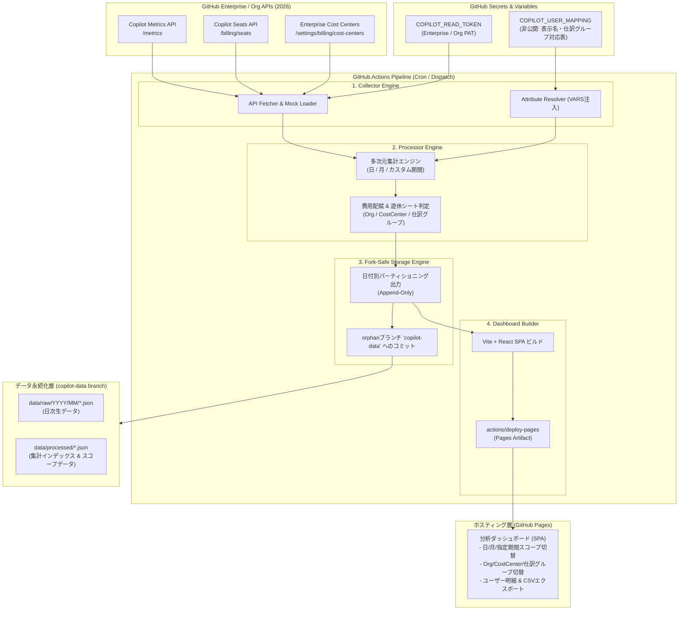
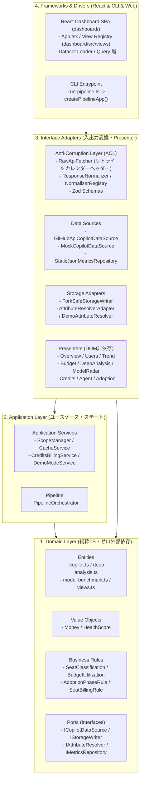

[English](02_system_architecture.md) | [日本語](02_system_architecture.ja.md)

---

# SDD-02: システムアーキテクチャ設計書 (System Architecture)

- **文書番号**: SPEC-COPILOT-002
- **ステータス**: Approved / Active
- **対象バージョン**: 2026.09-LTS
- **作成日**: 2026-09-10 (2026-10-01 改訂: 収集の耐障害性、ソース別縮退、実際の結線、配信ステージング)

---

## 1. 全体アーキテクチャ概要

本システムは、外部のRDBやクラウドサーバーを一切持たない**「サーバーレス・GitHubネイティブ型」**アーキテクチャを採用する。データ収集、加工・集計、永続化、およびダッシュボード配信をすべてGitHubのエコシステム（Actions, Variables, GitHub Pages）内で完結させる。


```mermaid
flowchart TB
    subgraph GitHub_API_2026["GitHub Enterprise / Org APIs (2026)"]
        API_Metrics["Copilot Metrics API\n/metrics"]
        API_Seats["Copilot Seats API\n/billing/seats"]
        API_CostCenter["Enterprise Cost Centers\n/settings/billing/cost-centers"]
    end

    subgraph GitHub_Variables["GitHub Secrets & Variables"]
        VAR_Mapping["COPILOT_USER_MAPPING\n(非公開: 表示名・仕訳グループ対応表)"]
        SEC_Token["COPILOT_READ_TOKEN\n(Enterprise / Org PAT)"]
    end

    subgraph GitHub_Actions["GitHub Actions Pipeline (Cron / Dispatch)"]
        subgraph Step1["1. Collector Engine"]
            Collector["API Fetcher & Mock Loader"]
            Resolver["Attribute Resolver (VARS注入)"]
        end
        subgraph Step2["2. Processor Engine"]
            Aggregator["多次元集計エンジン\n(日 / 月 / カスタム期間)"]
            BillingEngine["費用配賦 & 遊休シート判定\n(Org / CostCenter / 仕訳グループ)"]
        end
        subgraph Step3["3. Fork-Safe Storage Engine"]
            Storage["日付別パーティショニング出力\n(Append-Only)"]
            BranchSync["orphanブランチ 'copilot-data' へのコミット"]
        end
        subgraph Step4["4. Dashboard Builder"]
            Builder["Vite + React SPA ビルド"]
            Deploy["actions/deploy-pages\n(Pages Artifact)"]
        end
    end

    subgraph Storage_Branch["データ永続化層 (copilot-data branch)"]
        RawData["data/raw/YYYY/MM/*.json\n(日次生データ)"]
        AggData["data/processed/*.json\n(集計インデックス & スコープデータ)"]
    end

    subgraph GitHub_Pages["ホスティング層 (GitHub Pages)"]
        Dashboard["分析ダッシュボード (SPA)\n- 日/月/指定期間スコープ切替\n- Org/CostCenter/仕訳グループ切替\n- ユーザー明細 & CSVエクスポート"]
    end

    %% データフロー
    API_Metrics --> Collector
    API_Seats --> Collector
    API_CostCenter --> Collector
    SEC_Token --> Collector
    VAR_Mapping --> Resolver

    Collector --> Aggregator
    Resolver --> Aggregator
    Aggregator --> BillingEngine
    BillingEngine --> Storage
    Storage --> BranchSync
    BranchSync --> Storage_Branch

    Storage --> Builder
    Builder --> Deploy
    Deploy --> Dashboard
```

---

## 2. コンポーネント詳細

### 2.1 データ収集エンジン (Collector Engine)
- **役割**: GitHub REST API（EnterpriseまたはOrganizationスコープ）から、メトリクス・シート情報・Cost Center情報を取得する。
- **認証**: トークンは 明示指定 → `COPILOT_READ_TOKEN` → `GITHUB_TOKEN` → `GH_TOKEN` の順に解決する。トークンが無い場合は、無認証でリクエストせず、明示的な理由を付けてソースを失敗として記録する (§2.6)。
- **耐障害性**: レートリミット（429/403）時の指数バックオフと再試行、ページネーションの自動追従（`per_page=100` と `Link` ヘッダー。先頭ページ以降のシートが欠落しない）。
- **レコード単位の検証 (ACL)**: レスポンスはレコード単位で検証する (`src/adapters/github-api/schemas/` の Zod スキーマ)。未知の列挙値や不正なレコードはレスポンス全体を失敗させず**隔離** (除外して件数を記録) する。未知の `plan_type` は `unknown` として保持する。Cost Center は 2026-03-10 のレスポンス形状 (`costCenters` キー) 用の専用ノーマライザーで処理する。API バージョンは `GITHUB_API_VERSION` で指定する (SDD-03 §1.1)。
- **利用状況メトリクス**: Usage Metrics Reports API (`users-1-day`、署名付き URL → NDJSON) から、Enterprise **と** 設定された各 Organization について取得し、ユーザーで重複排除する。ユーザー別プロファイルも同じ行から作る (SDD-03 §2.1)。旧 `/copilot/metrics` エンドポイントは呼ばない。シートも Enterprise と Organization の和集合とし、ログイン名ごとに 1 席とする。
- **モックモード**: 環境変数 `MOCK_MODE=true` 時は、実APIを呼び出さずに2026年仕様準拠の擬似データを生成（ローカル開発・テスト・デモ環境用）。出力は `is_mock_mode: true` とし、`is_mock_mode` が true になるのは**この場合だけ**である。

### 2.2 属性解決エンジン (Attribute Resolver)
- **役割**: GitHub Actions Variable `COPILOT_USER_MAPPING` からJSON/CSVを安全に読み込み、ユーザーのGitHubログインIDを元に `display_name`, `department (仕訳グループ)`, `cost_center_override` などを動的解決する。
- **情報漏洩防止**: マッピングデータはGitリポジトリの履歴（コミット）に絶対に書き出さず、集計処理中のメモリ内でのみ結合（Join）する。
- **仮名化**: `ANONYMIZE_USERS=true` のとき、ログイン名・表示名・部署・チーム・プロジェクトを、秘密鍵付きの HMAC-SHA256 仮名に置き換える (`Pseudonymizer`、`src/collector/pseudonymizer.ts`、秘密鍵 `ANONYMIZE_SECRET` は 16 文字以上。未設定・短い場合は実行を**失敗** (fail closed) とする)。Raw 層も同様にマスクし、このモードでは元 CSV を保存しない (SDD-04 §5)。`AttributeResolver` はブラウザ (CSV 取り込み) にもバンドルされるため、`Pseudonymizer` は `node:crypto` を遅延ロードする。`process` への直接参照や Node モジュールの静的 import をしてはならない。

### 2.3 多次元集計・費用配賦エンジン (Aggregator & Billing Engine)
- **役割**:
  1. シート割当情報とメトリクス情報を突合し、各ユーザーの利用ステータス（Active / Inactive）を判定。
  2. 3軸（Organization, Cost Center, 任意仕訳グループ）での多次元集計を実行。
  3. 日次・月次・任意期間における按分費用を、単一の価格カタログ (`src/domain/pricing/pricing-catalog.ts`: Business \$19/月、Enterprise \$39/月、SDD-03 §5.1) から計算。プランが不明なシートの費用は*未確定*とし、合計から除外する。
  4. `SeatClassificationRule` でシートを分類 (Active / Low Active / Idle / Never Used / **Onboarding**、SDD-06 §3) し、遊休シートに限って削減可能コストを算出。

### 2.4 Fork非競合ストレージエンジン (Fork-Safe Storage Engine)
- **役割**:
  - `main` ブランチを汚染せず、独立した orphan ブランチ（`copilot-data`）にのみ集計成果物を保存。
  - 日付単位（`YYYY/MM/DD`）のイミュータブル・パーティショニングによる追記型永続化。
  - リポジトリ識別メタデータ（`repository_id`, `schema_version`）を付与。
  - Pages への配信は **許可リスト方式** (`scripts/pages-staging.ts`: `npm run pages:stage` / `pages:verify`)。`index.json`・`error-log.json`・`processed/*` (当回に限らず全月)・index に載っている日次ファイルだけをコピーし、Raw データ・元 CSV・暗号化マッピングは決してコピーしない。ビルド成果物はアップロード前に検証する (SDD-05 §2.2a)。

### 2.5 GitHub Pages ダッシュボード (SPA)
- **役割**:
  - ブラウザ上で完全動作する高速SPA。
  - 集計済みJSON（日次・月次・期間インデックス）をFetchしてレンダリング。
  - 期間スコープセレクタ（日 / 月 / 指定期間）、グループセレクタ（Org / Cost Center / 任意仕訳グループ）、フィルター、CSVダウンロード機能を提供。
  - 実測・前回値・欠損・デモを画面上で区別する: データ状態バナー、欠損値の「—」表示、明示時のみのデモ方針 (SDD-07 §2.12 / §2.13)。

### 2.6 ソース別縮退と Last-Known-Good (P0-3)

実行は、「空」を実測であるかのように公開してはならない。パイプライン (`PipelineOrchestrator`、`src/application/pipeline/source-status.ts`) は 3 つのソースを独立に取得し、それぞれの結果を記録する:

| ソース (`DataSourceId`) | 内容 |
|:--|:--|
| `metrics` | 利用状況メトリクス (受諾・チャット・PR・日次推移) |
| `seats` | シート割り当て (ライセンス母集団と費用) |
| `cost_centers` | Cost Center のメタデータと予算 |

- **`SourceStatus`** (`index.json` の `source_status[]`): `ok` / `partial` (一部レコードを隔離) / `failed` (`error` と `last_success_at` 付き) / `skipped` (未設定。障害ではない)。
- **失敗したソースが、正常なデータを空で上書きしない**。利用状況セクションは直近に成功した実行から引き継ぎ (`carryOverUsageSections`)、`usage_metrics.availability: carried_over` と `as_of` を付ける。過去に成功実績が無ければ `unavailable` とし「—」で表示する。1 つのソースの失敗は他のソースを止めない。
- **`is_mock_mode` が true になるのは `MOCK_MODE` のときだけ**。「認証情報なし」「データなし」「ソース失敗」では true にしない。認証情報の無い実行はデモデータではなく空のライブ状態を公開する (SDD-05 §3.1)。
- SPA は `source_status` をデータ状態バナーに表示し (SDD-07 §2.12)、問題は `error-log.json` にも書き出す。

### 2.7 実際の結線と目標構成 (2026-10-01 時点)

§3〜§4 は目標とする 4 層アーキテクチャを記述している。現在本番で動いているコードはそれより狭く、目標を稼働中の構成として設計に使わないよう、本書に差分を記録する:

| 要素 | 目標 (§3〜§4) | 現在の本番経路 |
|:--|:--|:--|
| SPA の状態管理 | Dataset Loader + Query 層 | 記述どおり: `main.tsx` が `App.tsx` を描画し、`useDashboardData` が Dataset Loader (`dashboard/src/dataset/`) と Query 層 (`dashboard/src/query/`) を束ねる (SDD-15 §7)。DataStore 経路は P2-5 で撤去した。 |
| ビュー | View Registry | `dashboard/src/views/` が唯一の描画入口。 |
| Presenter | データセット駆動のビューモデル | Credits / Agent / Adoption の Presenter がビューで使われる。他は純粋なビューモデル補助で、テストとともに残す。 |
| パイプライン | `createPipelineApp` → `PipelineOrchestrator` | 記述どおり (これが本番経路)。 |

フロントエンドの単一アーキテクチャへの収束 (および Dataset Loader / Query 層) は**改善計画の Phase 2** であり、決定は [ADR-0001](../adr/0001-single-frontend-architecture.ja.md) に記録した (hook 経路を Dataset + Registry へ移行し、DataStore 経路と `VITE_USE_NEW_STORE` は P2-5 で撤去した)。本番経路には SDD-15 の規約 (フィルターエンジンの単一化、概念ごとの単一定義、lint で強制する Hook 規約) を適用する。

### 2.8 Raw Landing と再処理 (P1-2)

ソースアダプタは `RawApiClient` 契約 (`src/adapters/github-api/RawApiClient.ts`: `fetchRaw` / `fetchRawAllowing` / `fetchPaginated` / `downloadSigned`) だけに依存する。実装は 3 つある。

| 実装 | 役割 |
|:--|:--|
| `RawApiFetcher` | HTTP (再試行、レート制限、Link ページング、認証なしの署名付きダウンロード) |
| `RecordingFetcher` | デコレーター。実クライアントへ委譲し、各応答を保存する (SDD-05 §2.3) |
| `ReplayFetcher` | Run Manifest の応答を返す。通信しない |

`createPipelineApp` はライブのクライアントを `RecordingFetcher` で包む (匿名化・モックのときを除く)。`createReprocessApp` (`npm run pipeline:reprocess`) は、manifest の Enterprise / Org / レポート日と `ReplayFetcher` を、**同じ** `GitHubApiCopilotDataSource` と `PipelineOrchestrator` に結線する。アダプタと集計のコードを共有するので、同期すべき 2 つ目の実装はない。再生した run が収集時の成果物を再現することは、テストで検証している。

---

## 3. クリーンアーキテクチャ 4層設計 (Clean Architecture & DIP)

2026.09 LTS では、保守性・テスタビリティ・拡張性を飛躍的に高めるため、以下の 4 層 Clean Architecture を導入している。


```mermaid
flowchart TD
    subgraph Domain["1. Domain Layer (純粋TS・ゼロ外部依存)"]
        Entities["Entities\n- copilot.ts / deep-analysis.ts\n- model-benchmark.ts / views.ts"]
        VO["Value Objects\n- Money / HealthScore"]
        Rules["Business Rules\n- SeatClassification / BudgetUtilization\n- AdoptionPhaseRule / SeatBillingRule"]
        Ports["Ports (Interfaces)\n- ICopilotDataSource / IStorageWriter\n- IAttributeResolver / IMetricsRepository"]
    end

    subgraph Application["2. Application Layer (ユースケース・ステート)"]
        Services["Application Services\n- ScopeManager / CacheService\n- CreditsBillingService / DemoModeService"]
        Pipeline["Pipeline\n- PipelineOrchestrator"]
    end

    subgraph Adapters["3. Interface Adapters (入出力変換・Presenter)"]
        ACL["Anti-Corruption Layer (ACL)\n- RawApiFetcher (リトライ & カレンダーヘッダー)\n- ResponseNormalizer / NormalizerRegistry\n- Zod Schemas"]
        DataSources["Data Sources\n- GitHubApiCopilotDataSource\n- MockCopilotDataSource\n- StaticJsonMetricsRepository"]
        StorageAdapters["Storage Adapters\n- ForkSafeStorageWriter\n- AttributeResolverAdapter / DemoAttributeResolver"]
        Presenters["Presenters (DOM非依存)\n- Overview / Users / Trend\n- Budget / DeepAnalysis / ModelRadar\n- Credits / Agent / Adoption"]
    end

    subgraph Frameworks["4. Frameworks & Drivers (React & CLI & Web)"]
        ReactUI["React Dashboard SPA (dashboard/)\n- App.tsx / View Registry (dashboard/src/views)\n- Dataset Loader / Query 層"]
        CLI["CLI Entrypoint\n- run-pipeline.ts -> createPipelineApp()"]
    end

    Frameworks --> Adapters
    Adapters --> Application
    Application --> Domain
    Adapters --> Domain
```

### 3.1 レイヤー責務
1. **Domain Layer (`src/domain/`)**: フレームワーク（React / CLI）や外部ライブラリに一切依存しない純粋なビジネスエンティティ、値オブジェクト（`Money`, `HealthScore`）、不変ビジネスルール、および抽象ポート（Interfaces）。
2. **Application Layer (`src/application/`)**: ユースケース（`ScopeManager`, `CreditsBillingService`, `PipelineOrchestrator` 等）。フロントエンドの状態は持たない。SPA の状態は `dashboard/src/`（Dataset Loader、Query 層、View Registry）にある。
3. **Interface Adapters (`src/adapters/`)**: 外部API（GitHub REST API）のスキーマ防壁（ACL: `RawApiFetcher`, Zod Schemas）、ストレージアダプタ、および表示ロジックを純粋関数化する Presenters（DOM非依存・単体テスト可能）。`dashboard/` を import してはならない。
4. **Frameworks & Drivers (`dashboard/`, `src/cli/`)**: React SPA と CLI エントリポイント。

**import 方向**は `src/tests/layer-boundaries.test.ts` で検査する: `src/**` は `dashboard/` を import しない（SPA が `src/` に依存し、逆は不可）。`src/domain/**` は `application/`・`adapters/`・`frameworks/` を import しない。別タスクで解消する既知の違反 (C-07): `CreditsBillingService` → `BillingConfigLoader`（application → adapter）。

---

## 4. フロントエンドの状態管理原則 (Dataset Loader・Query 層・View Registry)

### 4.1 単一の描画経路
ダッシュボードの経路は 1 本: `main.tsx` → `App.tsx` → View Registry (`dashboard/src/views/`)。データは Dataset Loader (`dashboard/src/dataset/`) が取得し、Query 層 (`dashboard/src/query/`) がフィルターする。両者を `useDashboardData` が束ねる (SDD-15 §7)。旧 DataStore / `DerivedDataGraph` 経路（`AppV2.tsx`、`src/application/store/**`、`src/frameworks/**`、`src/adapters/views/**`、`VITE_USE_NEW_STORE`）は P2-5 で撤去した ([ADR-0001](../adr/0001-single-frontend-architecture.ja.md) §5)。

### 4.2 View Registry & Presenter 分離
分析ビューは `dashboard/src/views/defaultRegistry.ts` に登録する（ビューごとに manifest とコンポーネント）。表示ロジックは UI 描画から分離する。
- **Presenter**: ビュー表示に必要なフォーマット・計算（通貨表記、比率、ソート、フィルタ結果等）を React / DOM から完全に切り離した純粋 TypeScript クラスとして実装し、ブラウザ不要の高速単体テストを実現。

### 4.3 FinOps 常時USD基本表示 & サブ表示通貨・EA契約単価サブシステム
企業の Enterprise Agreement (EA) 契約や多国籍通貨管理に対応した動的課金計算レイヤーを装備する：
- **常時USD基本表示 & サブ表示通貨併記**: 全9分析画面・KPI・チャート・テーブルにおいて、USD（`$`）が常時基本通貨として表示され、オプションで日本円（JPY）やユーロ（EUR）などのサブ通貨がカッコ書きで併記される（例: `$2,975.00 (¥461,125)`）。
- **`CurrencyContext` とヘッダーの設定メニュー**: 画面上部ヘッダーの設定メニューから、閲覧者自身がリアルタイムにサブ表示通貨（USDのみ / USD+JPY / USD+EUR）を切り替え可能（ブラウザの `localStorage` に保持）。
- **`EnterpriseBillingConfig`**: 通貨定義（USD基本、任意の `subCurrency` JPY/EUR等）、為替レート、ボリュームディスカウント率（0-100%）、および直接契約単価（`customPricePerCredit`: 例 `1.273円 / AIC`、`customSeatPricing`）を管理。直接指定時はそれを最優先適用。
- **`Money` Value Object**: USD基本とサブ通貨を統合フォーマットする `formatWithSubCurrency`、構造化出力を返す `formatDual`、任意精度フォーマット、割引適用を一元提供。
- **`BillingConfigLoader`**: 環境変数 `COPILOT_BILLING_CONFIG` または `data/config/billing.json` から安全にロードし、未指定時は標準 USD レートへ自動フォールバック。

### 4.4 フロントエンド Code Splitting & バンドル最適化アーキテクチャ
ブラウザ初期表示パフォーマンスを極大化するため、以下のコード分割アーキテクチャを適用：
- **純粋ブラウザ Repository 分離**: `HttpJsonMetricsRepository`（`fetch` のみ使用）と Node.js `fs` 系 Repository を物理分離し、ブラウザバンドルから Node.js モジュール解決を完全排除（Vite externalize 警告 0 件）。
- **On-demand View Lazy Loading**: 重量級 View（Model Radar, Deep Analysis, Credits, Agent Activity, Adoption Maturity）を `React.lazy` および `<Suspense>` で非同期分割。
- **UI スケルトン保護**: チャンク読み込み中のチラつき・レイアウトシフトを抑止するパルススケルトン（`ViewSkeleton`）を配備。
- **Rollup Manual Chunks**: `vendor-react`, `vendor-charts`, `vendor-icons`, `vendor-zod` にベンダーライブラリを適切に分離し、メイン JS チャンクを **300 kB 以下 (gzip 80 kB 以下)** に抑制。

### 4.5 セキュリティ & GPG 鍵管理ガバナンス
48KB を超える大規模ユーザーマッピングの安全運用のため、AES-256 GPG 対称暗号化ワークアラウンドを採用：
- 暗号化ブロブは `copilot-data` ブランチの `data/config/` にのみ格納。
- 実行時のみ `$RUNNER_TEMP` に平文復号され、ジョブ終了時にランナーごと完全破棄。
- 鍵ローテーション手順書およびコンプライアンス監査基準は [GPG鍵管理およびユーザー属性マッピング運用標準ガイド](../security/01_gpg_key_management_and_user_mapping_guide.ja.md) を参照。

---

## 5. ディレクトリ構成仕様

```
.
├── .github/
│   └── workflows/                      # GitHub Actions ワークフロー (copilot-analysis-cron.yml, test-and-preview.yml)
├── docs/
│   ├── security/                       # セキュリティ運用標準ガイド (GPG鍵管理等)
│   └── specifications/                 # SDD仕様書群 (01〜15)
├── scripts/                            # 運用スクリプト (pages-staging.ts, verify-fork-health.ts, import-report.ts 等)
├── eslint.config.js                    # ESLint flat config (react-hooks ルール、SDD-15 §6)
├── src/
│   ├── domain/                         # Layer 1: Domain
│   │   ├── entities/                   # エンティティ (copilot, views, billing-config 等)
│   │   ├── value-objects/              # 値オブジェクト (Money, HealthScore 等)
│   │   ├── pricing/                    # 価格カタログ (価格の唯一の定義元)
│   │   ├── constants/                  # unassigned.ts (フィルター用センチネル), filter-scope.ts (フィルター非対応セクション)
│   │   ├── rules/                      # ビジネスルール (SeatClassification, AdoptionPhase 等)
│   │   └── ports/                      # ポート (ICopilotDataSource, IStorageWriter 等)
│   ├── application/                    # Layer 2: Application
│   │   ├── services/                   # ScopeManager, CacheService, CreditsBillingService 等
│   │   └── pipeline/                   # PipelineOrchestrator, source-status.ts (ソース別縮退)
│   ├── adapters/                       # Layer 3: Adapters
│   │   ├── github-api/                 # ACL, RawApiFetcher, Normalizers, Zod Schemas
│   │   ├── storage/                    # HttpJsonMetricsRepository, BillingConfigLoader
│   │   ├── presenters/                 # Overview, Users, Trend, Budget, DeepAnalysis, ModelRadar, Credits, Agent, Adoption
│   │   └── composition-root.ts         # バックエンド Composition Root (createPipelineApp)
│   ├── collector/                      # 収集補助: attribute-resolver.ts, pseudonymizer.ts (ブラウザ互換: Node の静的 import なし)
│   ├── processor/                      # 集計: metrics-aggregator, billing-calculator, report-parser, rolling-trend, scope-merge, inefficiency-*
│   └── cli/
│       └── run-pipeline.ts             # CLI実行エントリポイント (createPipelineApp経由)
├── dashboard/                          # フロントエンド SPA (Vite + React + Tailwind)
│   └── src/
│       ├── components/                 # UIコンポーネント & Viewコンポーネント
│       │   └── common/ViewSkeleton.tsx # Suspense用統一スケルトン
│       ├── App.tsx                     # メインSPAコンポーネント (React.lazy + Suspense)
│       └── main.tsx
└── package.json
```


