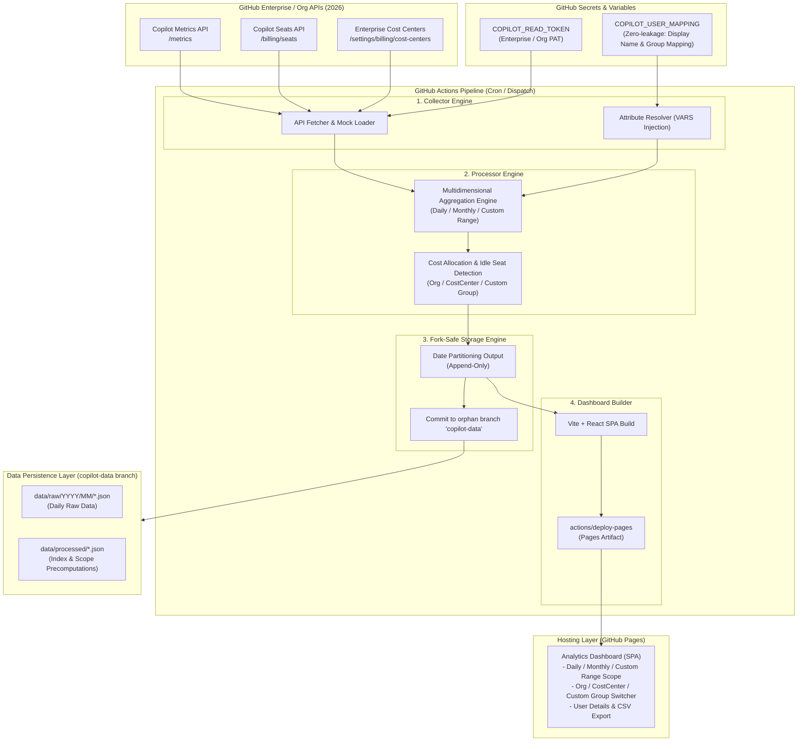

[English](02_system_architecture.md) | [日本語](02_system_architecture.ja.md)

---

# SDD-02: System Architecture Specification

- **Document ID**: SPEC-COPILOT-002
- **Status**: Approved / Active
- **Target Version**: 2026.09-LTS
- **Date**: 2026-09-10

---

## 1. Overall Architectural Overview

This system implements a **"Serverless, GitHub-Native"** architecture requiring zero external databases (RDBs) or cloud servers. Data collection, transformation, aggregation, persistence, and dashboard distribution are executed completely within the GitHub ecosystem (Actions, Variables, and GitHub Pages).



---

## 2. Component Details

### 2.1 Collector Engine
- **Role**: Retrieves metrics, seat assignments, and Cost Center metadata from GitHub REST APIs (Enterprise or Organization scope).
- **Resilience**: Implements exponential backoff and retry for rate limits (429/403), with automatic pagination handling.
- **Mock Mode**: When `MOCK_MODE=true`, generates realistic 2026-spec simulation data without calling external APIs (for local development, CI testing, and demos).

### 2.2 Attribute Resolver
- **Role**: Safely parses JSON/CSV mapping data from GitHub Actions Variable `COPILOT_USER_MAPPING`, dynamically resolving `display_name`, `department` (custom allocation group), and `cost_center_override` using GitHub login IDs.
- **Information Leak Prevention**: Mapping records are never written to Git commits; they are joined exclusively in-memory during aggregation.

### 2.3 Aggregator & Billing Engine
- **Role**:
  1. Correlates seat assignments with metrics to determine active vs. inactive user status.
  2. Executes multidimensional aggregation across 3 axes (Organization, Cost Center, Arbitrary User Group).
  3. Calculates prorated and monthly expenses (Business: \$19/month, Enterprise: \$39/month).
  4. Identifies seats inactive for 14 or 30+ days as "Idle Seats" and computes reducible costs.

### 2.4 Fork-Safe Storage Engine
- **Role**:
  - Keeps the `main` branch 100% clean by isolating data persistence to a dedicated orphan branch (`copilot-data`).
  - Employs append-only date-partitioned storage (`YYYY/MM/DD`).
  - Injects repository identification metadata (`repository_id`, `schema_version`).

### 2.5 GitHub Pages Dashboard (SPA)
- **Role**:
  - Ultra-fast client-side SPA executed entirely in modern web browsers.
  - Fetches and renders precomputed JSON files (daily, monthly, custom ranges, indices).
  - Provides responsive scope switchers, group selectors, multi-model trend charts, anomaly modals, and CSV downloads.

---

## 3. Four-Layer Clean Architecture & Dependency Inversion Principle (DIP)

In 2026.09 LTS, a 4-layer Clean Architecture has been introduced to maximize maintainability, testability, and extensibility:

```mermaid
flowchart TD
    subgraph Domain["1. Domain Layer (Pure TS, Zero Dependencies)"]
        Entities["Entities\n- copilot.ts / deep-analysis.ts\n- model-benchmark.ts / views.ts"]
        VO["Value Objects\n- Money / HealthScore / DateRange"]
        Rules["Business Rules\n- SeatClassification / BudgetUtilization\n- AdoptionPhaseRule / SeatBillingRule"]
        Ports["Ports (Interfaces)\n- ICopilotDataSource / IStorageWriter\n- IAttributeResolver / IMetricsRepository\n- IViewPluginManifest"]
    end

    subgraph Application["2. Application Layer (Use Cases & State)"]
        Services["Application Services\n- ScopeManager / FilterService\n- CacheService / DiagnosticService\n- DemoModeService / AdoptionPhaseService"]
        Store["Reactive DataStore & DerivedDataGraph\n- DataStore / Reducer / State\n- DAG (Topological Sort & Memoization)"]
        Views["View System\n- ViewPluginRegistry / ViewOrchestrator"]
        Pipeline["Pipeline\n- PipelineOrchestrator"]
    end

    subgraph Adapters["3. Interface Adapters (I/O, ACL, Presenters)"]
        ACL["Anti-Corruption Layer (ACL)\n- RawApiFetcher (Retry & Calendar Version)\n- ResponseNormalizer / NormalizerRegistry\n- Zod Schemas"]
        DataSources["Data Sources\n- GitHubApiCopilotDataSource\n- MockCopilotDataSource\n- StaticJsonMetricsRepository"]
        StorageAdapters["Storage Adapters\n- ForkSafeStorageWriter\n- AttributeResolverAdapter / DemoAttributeResolver"]
        Presenters["Presenters (DOM-Independent Pure TS)\n- Overview / Users / Trend\n- Budget / DeepAnalysis / ModelRadar\n- Credits / Agent / Adoption"]
        ViewPlugins["View Plugins (9 Total)\n- Overview / Users / Trend\n- Budget / DeepAnalysis / ModelRadar\n- Credits / Agent / Adoption"]
    end

    subgraph Frameworks["4. Frameworks & Drivers (React & CLI)"]
        ReactUI["React Dashboard SPA\n- DashboardProvider / useStoreSelector\n- useStoreDispatch / useViewPlugin\n- App.tsx / AppV2.tsx"]
        CLI["CLI Entrypoint\n- run-pipeline.ts -> createPipelineApp()"]
    end

    Frameworks --> Adapters
    Adapters --> Application
    Application --> Domain
    Adapters --> Domain
```



### 3.1 Layer Responsibilities
1. **Domain Layer (`src/domain/`)**: Pure business models, immutable value objects (`Money`, `HealthScore`), business rules, and abstract port interfaces with zero dependencies on frameworks or third-party libraries.
2. **Application Layer (`src/application/`)**: Use cases, unidirectional state management (`DataStore`), topologically sorted computation graph (`DerivedDataGraph`), and view lifecycle management (`ViewOrchestrator`).
3. **Interface Adapters (`src/adapters/`)**: External API resilience (`RawApiFetcher`, Zod Schemas), storage adapters, pure presentation logic (`Presenters`), and view plugins.
4. **Frameworks & Drivers (`src/frameworks/`, `dashboard/`, `src/cli/`)**: React Context provider (`DashboardProvider`), custom reactive hooks (`useViewPlugin`, `useStoreSelector`), and CLI entrypoints.

---

## 4. Frontend State Management Principle (Reactive DataStore & View Plugins)

### 4.1 Reactive DataStore & DerivedDataGraph
The dashboard state is managed via `DataStore` and evaluated incrementally through `DerivedDataGraph`.
- **Topological Sorting & Cycle Detection**: Derived nodes (`filteredScopeData`, `filteredReportData`, `diagnosticResults`, etc.) are computed in strictly dependency-ordered sequence.
- **Input Hash Memoization**: Computations are cached based on input state hashes, preventing redundant calculations across view switches.

### 4.2 View Plugin System & Presenter Separation
All 9 analysis views (Overview, Users, Trend, Budget, DeepAnalysis, ModelRadar, Credits, Agent, Adoption) implement `IViewPluginManifest` and decouple presentation formatting from UI rendering:
- **ViewOrchestrator**: Validates rendering prerequisites (`canRender`) and data completeness (`requiredDerivedData`) before activating views.
- **Presenter**: Transforms raw aggregates into display-ready view models completely outside the React render loop, enabling rapid headless unit testing.

### 4.3 FinOps Permanent USD Primary & Optional Sub-Currency Subsystem
Provides enterprise billing computation with permanent USD primary display and localized secondary currency support:
- **Permanent USD Primary & Dual Display**: Enforces permanent USD ($) primary display across all 9 analysis views, KPI summary cards, charts, and user tables, with optional secondary sub-currency display in parentheses (e.g. `$2,975.00 (¥461,125)`).
- **`CurrencyContext` & `CurrencySelector`**: Header dropdown enables real-time sub-currency switching (USD Only / USD + JPY / USD + EUR) with localStorage persistence.
- **`EnterpriseBillingConfig`**: Manages base USD currency, optional `subCurrency` (JPY/EUR), conversion rates, volume discount percentages (0-100%), and direct enterprise contract rates (`customPricePerCredit`: e.g. `1.273 JPY / AIC`, `customSeatPricing`). Direct contract rates override calculated rates with top priority.
- **`Money` Value Object**: Provides unified dual-currency formatting (`formatWithSubCurrency`), structured output (`formatDual`), arbitrary precision, and discount application.
- **`BillingConfigLoader`**: Safely parses configuration from environment variable `COPILOT_BILLING_CONFIG` or `data/config/billing.json`, falling back to standard USD rules when omitted.

### 4.4 Frontend Code Splitting & Performance Architecture
Maximizes initial page load performance via architectural bundle decomposition:
- **Strict Browser Repository Isolation**: Physically separates `HttpJsonMetricsRepository` (pure `fetch` client) from `FsJsonMetricsRepository` (Node.js `fs` client), eliminating Node.js polyfill leaks and eradicating Vite externalization warnings.
- **On-Demand View Lazy Loading**: Asynchronously splits heavy analytical views (Model Radar, Deep Analysis, Credits, Agent Activity, Adoption Maturity) via `React.lazy` and `<Suspense>`.
- **UI Skeleton Protection**: Employs an animated pulsing skeleton component (`ViewSkeleton`) to prevent layout shifts during async chunk arrival.
- **Rollup Chunk Partitioning**: Groups vendor dependencies into `vendor-react`, `vendor-charts`, `vendor-icons`, and `vendor-zod`, keeping the initial entry chunk at **< 300 kB (< 80 kB gzip)**.

### 4.5 Security & GPG Key Management Governance
Enforces AES-256 symmetric GPG encryption for enterprise user mappings exceeding GitHub's 48KB secret limit:
- Encrypted blobs are isolated exclusively to `data/config/` on the `copilot-data` orphan branch.
- Plaintext mapping is reconstituted strictly inside `$RUNNER_TEMP` at runtime and destroyed immediately upon runner exit.
- Refer to [GPG Key Management & Operational Security Guide](../security/01_gpg_key_management_and_user_mapping_guide.md) for key rotation runbooks and compliance audit checklists.

---

## 5. Directory Layout Specification

```
.
├── .github/
│   └── workflows/                      # GitHub Actions workflows
├── docs/
│   ├── security/                       # Operational security guides (GPG key management, etc.)
│   └── specifications/                 # SDD Specifications (01-15)
├── src/
│   ├── domain/                         # Layer 1: Domain
│   │   ├── entities/                   # Domain entities (copilot, views, billing-config, etc.)
│   │   ├── value-objects/              # Value objects (Money, HealthScore, DateRange)
│   │   ├── rules/                      # Business rules (SeatClassification, AdoptionPhase, etc.)
│   │   └── ports/                      # Port interfaces (ICopilotDataSource, IStorageWriter, etc.)
│   ├── application/                    # Layer 2: Application
│   │   ├── store/                      # DataStore, Reducer, State, DerivedDataGraph
│   │   ├── services/                   # ScopeManager, FilterService, CreditsBillingService, etc.
│   │   ├── views/                      # ViewPluginRegistry, ViewOrchestrator
│   │   └── pipeline/                   # PipelineOrchestrator
│   ├── adapters/                       # Layer 3: Adapters
│   │   ├── github-api/                 # ACL, RawApiFetcher, Normalizers, Zod Schemas
│   │   ├── storage/                    # HttpJsonMetricsRepository, FsJsonMetricsRepository, BillingConfigLoader
│   │   ├── presenters/                 # Overview, Users, Trend, Budget, DeepAnalysis, ModelRadar, Credits, Agent, Adoption
│   │   ├── views/                      # ViewPlugin manifests & lazy component loaders (9 plugins)
│   │   └── composition-root.ts         # Backend Composition Root (createPipelineApp)
│   ├── frameworks/                     # Layer 4: Frameworks
│   │   ├── react/                      # DashboardProvider, useStoreSelector, useViewPlugin
│   │   ├── composition-root.ts         # Frontend Composition Root (injects HttpJsonMetricsRepository)
│   │   └── cli-composition-root.ts     # CLI Composition Root (injects FsJsonMetricsRepository)
│   └── cli/
│       └── run-pipeline.ts             # CLI entrypoint via createPipelineApp
├── dashboard/                          # Frontend SPA (Vite + React + Tailwind)
│   └── src/
│       ├── components/                 # UI & view components
│       │   └── common/ViewSkeleton.tsx # Suspense skeleton placeholder
│       ├── App.tsx                     # Main SPA component (React.lazy + Suspense)
│       └── main.tsx
└── package.json
```

