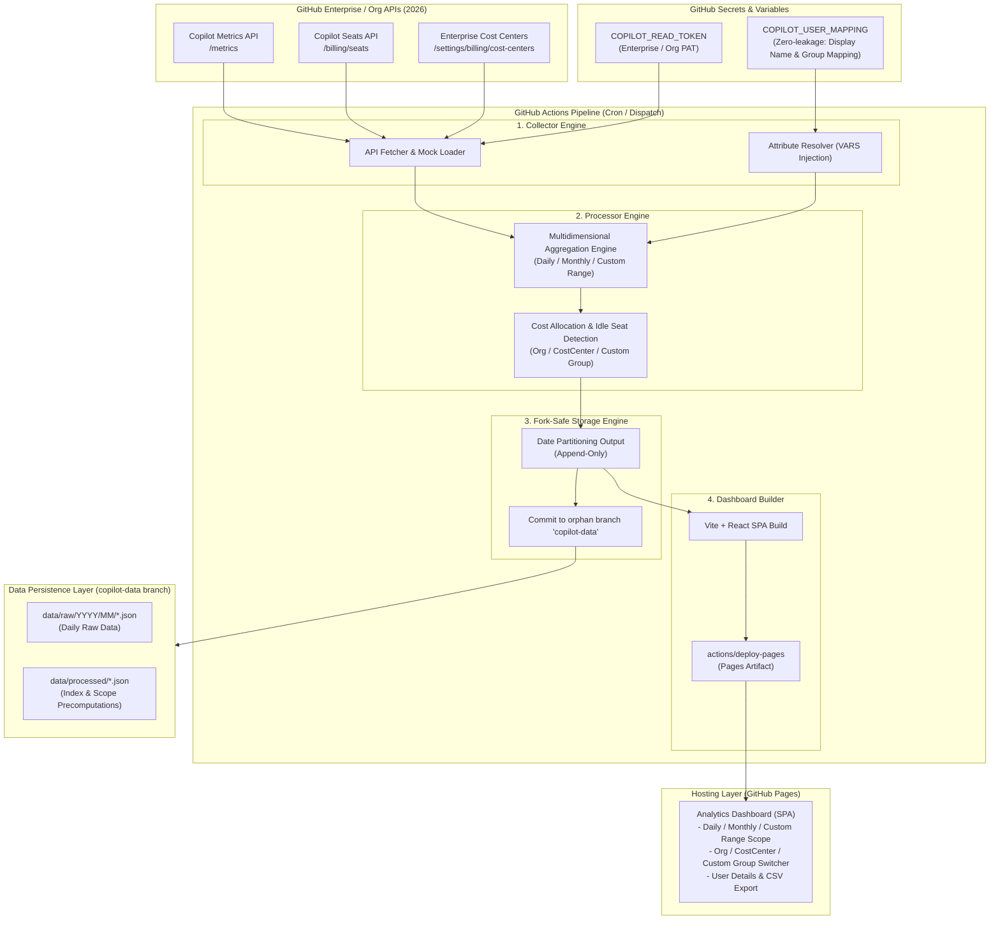

[English](02_system_architecture.md) | [日本語](02_system_architecture.ja.md)

---

# SDD-02: System Architecture Specification

- **Document ID**: SPEC-COPILOT-002
- **Status**: Approved / Active
- **Target Version**: 2026.09-LTS
- **Date**: 2026-09-10

---

## 1. Overall Architectural Overview

This system implements a **"Serverless, GitHub-Native"** architecture requiring zero external databases (RDBs) or cloud servers. Data collection, transformation, aggregation, persistence, and dashboard distribution are executed completely within the GitHub ecosystem (Actions, Variables, and GitHub Pages).



---

## 2. Component Details

### 2.1 Collector Engine
- **Role**: Retrieves metrics, seat assignments, and Cost Center metadata from GitHub REST APIs (Enterprise or Organization scope).
- **Resilience**: Implements exponential backoff and retry for rate limits (429/403), with automatic pagination handling.
- **Mock Mode**: When `MOCK_MODE=true`, generates realistic 2026-spec simulation data without calling external APIs (for local development, CI testing, and demos).

### 2.2 Attribute Resolver
- **Role**: Safely parses JSON/CSV mapping data from GitHub Actions Variable `COPILOT_USER_MAPPING`, dynamically resolving `display_name`, `department` (custom allocation group), and `cost_center_override` using GitHub login IDs.
- **Information Leak Prevention**: Mapping records are never written to Git commits; they are joined exclusively in-memory during aggregation.

### 2.3 Aggregator & Billing Engine
- **Role**:
  1. Correlates seat assignments with metrics to determine active vs. inactive user status.
  2. Executes multidimensional aggregation across 3 axes (Organization, Cost Center, Arbitrary User Group).
  3. Calculates prorated and monthly expenses (Business: \$19/month, Enterprise: \$39/month).
  4. Identifies seats inactive for 14 or 30+ days as "Idle Seats" and computes reducible costs.

### 2.4 Fork-Safe Storage Engine
- **Role**:
  - Keeps the `main` branch 100% clean by isolating data persistence to a dedicated orphan branch (`copilot-data`).
  - Employs append-only date-partitioned storage (`YYYY/MM/DD`).
  - Injects repository identification metadata (`repository_id`, `schema_version`).

### 2.5 GitHub Pages Dashboard (SPA)
- **Role**:
  - Ultra-fast client-side SPA executed entirely in modern web browsers.
  - Fetches and renders precomputed JSON files (daily, monthly, custom ranges, indices).
  - Provides responsive scope switchers, group selectors, multi-model trend charts, anomaly modals, and CSV downloads.

---

## 3. Directory Layout Specification

```
.
├── .github/
│   └── workflows/
│       ├── copilot-analysis-cron.yml   # Scheduled daily batch & Pages deploy
│       └── test-and-preview.yml        # CI build & test suite
├── docs/
│   └── specifications/                 # SDD Specifications
│       ├── 01_requirements_specification.md
│       ├── 02_system_architecture.md
│       ├── 03_github_copilot_api_spec_2026.md
│       ├── 04_user_attribute_mapping_spec.md
│       ├── 05_data_storage_and_fork_isolation_spec.md
│       ├── 06_aggregation_and_billing_logic_spec.md
│       ├── 07_dashboard_ui_ux_spec.md
│       ├── 08_automation_workflow_spec.md
│       ├── 09_monthly_usage_report_mode_spec.md
│       ├── 10_ai_model_benchmark_radar_spec.md
│       └── 11_deep_analysis_view_spec.md
├── src/
│   ├── types/                          # Type definitions (API, Metrics, Mapping, Aggregation)
│   │   └── copilot.ts
│   ├── collector/                      # API collection, mock generator, attribute resolver
│   │   ├── github-client.ts
│   │   ├── mock-generator.ts
│   │   └── attribute-resolver.ts
│   ├── processor/                      # Cost calculation & multi-axis aggregation
│   │   ├── billing-calculator.ts
│   │   └── metrics-aggregator.ts
│   ├── storage/                        # Fork-safe storage & index generation
│   │   └── fork-safe-storage.ts
│   └── cli/                            # CLI pipeline entrypoint
│       └── run-pipeline.ts
├── dashboard/                          # GitHub Pages SPA (Vite + React + Tailwind)
│   ├── src/
│   │   ├── components/
│   │   ├── App.tsx
│   │   └── main.tsx
│   ├── index.html
│   ├── vite.config.ts
│   └── tailwind.config.js
├── package.json
├── tsconfig.json
└── README.md
```

---

## 4. Frontend State Management Principle (Data-Centric Reactivity)

The SPA under `dashboard/` treats the `useDashboardData` hook as the **Single Source of Truth**, supplying each View component only with filter-applied derived data (`currentData`, `currentReportData`, etc.) reflecting the active data source, scope, and tag filters.

Because the global control bar (`ActiveDataSelector` / `ScopeSelector` / `TagFilterBar`) is rendered inside `App.tsx` as a sibling element outside each View component, changing a filter never remounts the View. Every View must therefore be implemented to track changes in the reference identity of the derived data (via `useMemo` / `useEffect` dependency array design), rather than computing once at mount time. The detailed design policy, implementation conventions, and known anti-patterns for this principle (Data-Centric Reactivity) are defined in [SDD-15: Data-Centric Reactivity Design Specification](15_data_centric_reactivity_design_spec.md).

