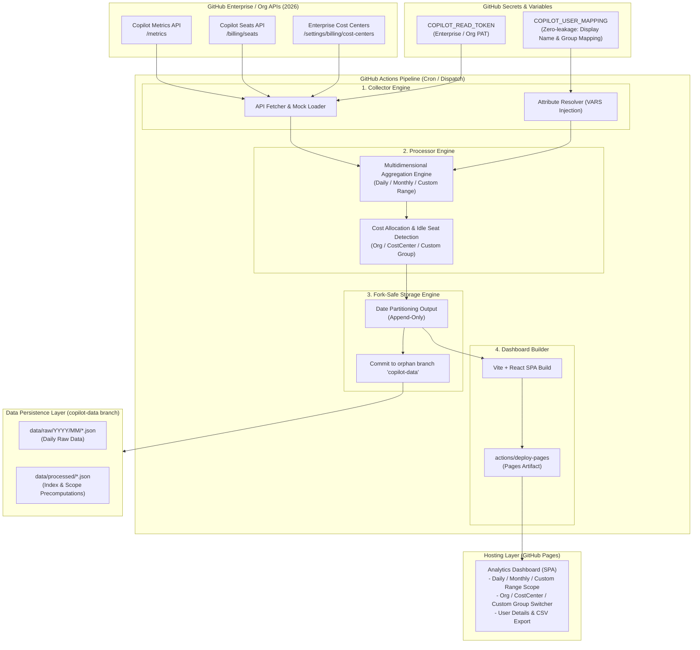

[English](02_system_architecture.md) | [日本語](02_system_architecture.ja.md)

---

# SDD-02: System Architecture Specification

- **Document ID**: SPEC-COPILOT-002
- **Status**: Approved / Active
- **Target Version**: 2026.09-LTS
- **Date**: 2026-09-10 (revised 2026-10-01: collector resilience, per-source degradation, as-built wiring, delivery staging)

---

## 1. Overall Architectural Overview

This system implements a **"Serverless, GitHub-Native"** architecture requiring zero external databases (RDBs) or cloud servers. Data collection, transformation, aggregation, persistence, and dashboard distribution are executed completely within the GitHub ecosystem (Actions, Variables, and GitHub Pages).


```mermaid
flowchart TB
    subgraph GitHub_API_2026["GitHub Enterprise / Org APIs (2026)"]
        API_Metrics["Copilot Metrics API\n/metrics"]
        API_Seats["Copilot Seats API\n/billing/seats"]
        API_CostCenter["Enterprise Cost Centers\n/settings/billing/cost-centers"]
    end

    subgraph GitHub_Variables["GitHub Secrets & Variables"]
        VAR_Mapping["COPILOT_USER_MAPPING\n(Zero-leakage: Display Name & Group Mapping)"]
        SEC_Token["COPILOT_READ_TOKEN\n(Enterprise / Org PAT)"]
    end

    subgraph GitHub_Actions["GitHub Actions Pipeline (Cron / Dispatch)"]
        subgraph Step1["1. Collector Engine"]
            Collector["API Fetcher & Mock Loader"]
            Resolver["Attribute Resolver (VARS Injection)"]
        end
        subgraph Step2["2. Processor Engine"]
            Aggregator["Multidimensional Aggregation Engine\n(Daily / Monthly / Custom Range)"]
            BillingEngine["Cost Allocation & Idle Seat Detection\n(Org / CostCenter / Custom Group)"]
        end
        subgraph Step3["3. Fork-Safe Storage Engine"]
            Storage["Date Partitioning Output\n(Append-Only)"]
            BranchSync["Commit to orphan branch 'copilot-data'"]
        end
        subgraph Step4["4. Dashboard Builder"]
            Builder["Vite + React SPA Build"]
            Deploy["actions/deploy-pages\n(Pages Artifact)"]
        end
    end

    subgraph Storage_Branch["Data Persistence Layer (copilot-data branch)"]
        RawData["data/raw/YYYY/MM/*.json\n(Daily Raw Data)"]
        AggData["data/processed/*.json\n(Index & Scope Precomputations)"]
    end

    subgraph GitHub_Pages["Hosting Layer (GitHub Pages)"]
        Dashboard["Analytics Dashboard (SPA)\n- Daily / Monthly / Custom Range Scope\n- Org / CostCenter / Custom Group Switcher\n- User Details & CSV Export"]
    end

    %% Data Flow
    API_Metrics --> Collector
    API_Seats --> Collector
    API_CostCenter --> Collector
    SEC_Token --> Collector
    VAR_Mapping --> Resolver

    Collector --> Aggregator
    Resolver --> Aggregator
    Aggregator --> BillingEngine
    BillingEngine --> Storage
    Storage --> BranchSync
    BranchSync --> Storage_Branch

    Storage --> Builder
    Builder --> Deploy
    Deploy --> Dashboard
```

---

## 2. Component Details

### 2.1 Collector Engine
- **Role**: Retrieves metrics, seat assignments, and Cost Center metadata from GitHub REST APIs (Enterprise or Organization scope).
- **Authentication**: The token is resolved in the order explicit value → `COPILOT_READ_TOKEN` → `GITHUB_TOKEN` → `GH_TOKEN`. Without a token the source is recorded as failed with an explicit reason (§2.6) instead of sending an unauthenticated request.
- **Resilience**: Exponential backoff and retry for rate limits (429/403), automatic pagination (`per_page=100` + `Link` header, so seats beyond the first page are no longer dropped).
- **Record-level validation (ACL)**: Responses are validated per record (Zod schemas in `src/adapters/github-api/schemas/`). An unknown enum value or a malformed record is **quarantined** (excluded and counted) instead of failing the whole response; an unknown `plan_type` is preserved as `unknown`. Cost Centers use their own normalizer for the 2026-03-10 response shape (`costCenters` key). The API version is taken from `GITHUB_API_VERSION` (SDD-03 §1.1).
- **Usage metrics**: from the Usage Metrics Reports API (`users-1-day`, signed URL → NDJSON) for the Enterprise **and** each configured Organization, de-duplicated by user; per-user profiles are built from the same rows (SDD-03 §2.1). The legacy `/copilot/metrics` endpoints are not called. Seats are likewise the union of the Enterprise and Organization seats, one seat per login.
- **Mock Mode**: When `MOCK_MODE=true`, generates realistic 2026-spec simulation data without calling external APIs (for local development, CI testing, and demos). Output is flagged `is_mock_mode: true` and is the **only** way `is_mock_mode` becomes true.

### 2.2 Attribute Resolver
- **Role**: Safely parses JSON/CSV mapping data from GitHub Actions Variable `COPILOT_USER_MAPPING`, dynamically resolving `display_name`, `department` (custom allocation group), and `cost_center_override` using GitHub login IDs.
- **Information Leak Prevention**: Mapping records are never written to Git commits; they are joined exclusively in-memory during aggregation.
- **Pseudonymization**: With `ANONYMIZE_USERS=true`, logins, display names, departments, teams and projects are replaced by keyed HMAC-SHA256 pseudonyms (`Pseudonymizer`, `src/collector/pseudonymizer.ts`, secret `ANONYMIZE_SECRET`, at least 16 characters; the run **fails closed** without it). The Raw layer is redacted as well and the original CSV is not persisted in this mode (SDD-04 §5). `Pseudonymizer` loads `node:crypto` lazily because `AttributeResolver` is also bundled into the browser (CSV import); it must not touch `process` or import Node modules statically.

### 2.3 Aggregator & Billing Engine
- **Role**:
  1. Correlates seat assignments with metrics to determine active vs. inactive user status.
  2. Executes multidimensional aggregation across 3 axes (Organization, Cost Center, Arbitrary User Group).
  3. Calculates prorated and monthly expenses from the single pricing catalog (`src/domain/pricing/pricing-catalog.ts`: Business \$19/month, Enterprise \$39/month; SDD-03 §5.1). A seat whose plan is unknown has an *unconfirmed* cost and is excluded from totals.
  4. Classifies seats with `SeatClassificationRule` (Active / Low Active / Idle / Never Used / **Onboarding**, SDD-06 §3) and computes reducible costs for idle seats only.

### 2.4 Fork-Safe Storage Engine
- **Role**:
  - Keeps the `main` branch 100% clean by isolating data persistence to a dedicated orphan branch (`copilot-data`).
  - Employs append-only date-partitioned storage (`YYYY/MM/DD`).
  - Injects repository identification metadata (`repository_id`, `schema_version`).
  - Delivery to Pages is an **allow-list** (`scripts/pages-staging.ts`: `npm run pages:stage` / `pages:verify`): `index.json`, `error-log.json`, `processed/*` (all months, not only the current run) and the daily files named in the index are copied; raw data, original CSVs and the encrypted mapping are never copied, and the built artifact is verified before upload (SDD-05 §2.2a).

### 2.5 GitHub Pages Dashboard (SPA)
- **Role**:
  - Ultra-fast client-side SPA executed entirely in modern web browsers.
  - Fetches and renders precomputed JSON files (daily, monthly, custom ranges, indices).
  - Provides responsive scope switchers, group selectors, multi-model trend charts, anomaly modals, and CSV downloads.
  - Distinguishes measured, carried-over, missing and demo data on screen: a data-status banner, "—" for missing values and the explicit-only demo policy (SDD-07 §2.13 / §2.14).

### 2.6 Per-Source Degradation & Last-Known-Good (P0-3)

A run must never publish "empty" as if it were a measurement. The pipeline (`PipelineOrchestrator`, `src/application/pipeline/source-status.ts`) fetches the three sources independently and records the outcome of each:

| Source (`DataSourceId`) | Content |
|:--|:--|
| `metrics` | Usage metrics (acceptance, chats, PRs, daily trend) |
| `seats` | Seat assignments (the licence population and cost) |
| `cost_centers` | Cost Center metadata and budgets |

- **`SourceStatus`** (`index.json` `source_status[]`): `ok` / `partial` (some records quarantined) / `failed` (with `error` and `last_success_at`) / `skipped` (not configured — not a fault).
- **A failed source never overwrites good data with empty data.** Usage sections are carried over from the previous successful run (`carryOverUsageSections`) and marked `usage_metrics.availability: carried_over` with `as_of`; with no earlier success they are `unavailable` and rendered as "—". One failing source does not stop the others.
- **`is_mock_mode` is true only for `MOCK_MODE`** — not for "no credentials", "no data" or "a source failed". A run without credentials publishes an empty live state, not demo data (SDD-05 §3.1).
- The SPA surfaces `source_status` in the data-status banner (SDD-07 §2.13), and the issues are also written to `error-log.json`.

### 2.7 As-Built Wiring vs. Target Architecture (status as of 2026-10-01)

§3–§4 describe the target four-layer architecture. The code that runs in production today is narrower, and this document records the difference so that no one designs against the target as if it were live:

| Element | Target (§3–§4) | Production path today |
|:--|:--|:--|
| SPA state | `DataStore` + `DerivedDataGraph` | `dashboard/src/main.tsx` always renders `App.tsx`; state and filtering come from `useDashboardData` + `dashboard/src/utils/filterEngine.ts`. `AppV2.tsx` is not mounted (`VITE_USE_NEW_STORE` does not change `App`). |
| Views | 9 `ViewPlugin`s mediated by the registry | The registry supplies navigation metadata; rendering is done by conditionals in `App.tsx`. |
| Presenters | All views | Only the Credits / Agent / Adoption presenters are used by `App.tsx`. |
| Pipeline | `createPipelineApp` → `PipelineOrchestrator` | As described (this is the live path). |

Converging the front end on one architecture (and the Dataset Loader / Query layer) is **Phase 2 of the improvement plan** and depends on a pending decision (ADR); until it is made, the rules of SDD-15 (single filter engine, one definition per concept, lint-enforced hook rules) apply to the live path.

---

## 3. Four-Layer Clean Architecture & Dependency Inversion Principle (DIP)

In 2026.09 LTS, a 4-layer Clean Architecture has been introduced to maximize maintainability, testability, and extensibility:


```mermaid
flowchart TD
    subgraph Domain["1. Domain Layer (Pure TS, Zero Dependencies)"]
        Entities["Entities\n- copilot.ts / deep-analysis.ts\n- model-benchmark.ts / views.ts"]
        VO["Value Objects\n- Money / HealthScore / DateRange"]
        Rules["Business Rules\n- SeatClassification / BudgetUtilization\n- AdoptionPhaseRule / SeatBillingRule"]
        Ports["Ports (Interfaces)\n- ICopilotDataSource / IStorageWriter\n- IAttributeResolver / IMetricsRepository\n- IViewPluginManifest"]
    end

    subgraph Application["2. Application Layer (Use Cases & State)"]
        Services["Application Services\n- ScopeManager / FilterService\n- CacheService / DiagnosticService\n- DemoModeService / AdoptionPhaseService"]
        Store["Reactive DataStore & DerivedDataGraph\n- DataStore / Reducer / State\n- DAG (Topological Sort & Memoization)"]
        Views["View System\n- ViewPluginRegistry / ViewOrchestrator"]
        Pipeline["Pipeline\n- PipelineOrchestrator"]
    end

    subgraph Adapters["3. Interface Adapters (I/O, ACL, Presenters)"]
        ACL["Anti-Corruption Layer (ACL)\n- RawApiFetcher (Retry & Calendar Version)\n- ResponseNormalizer / NormalizerRegistry\n- Zod Schemas"]
        DataSources["Data Sources\n- GitHubApiCopilotDataSource\n- MockCopilotDataSource\n- StaticJsonMetricsRepository"]
        StorageAdapters["Storage Adapters\n- ForkSafeStorageWriter\n- AttributeResolverAdapter / DemoAttributeResolver"]
        Presenters["Presenters (DOM-Independent Pure TS)\n- Overview / Users / Trend\n- Budget / DeepAnalysis / ModelRadar\n- Credits / Agent / Adoption"]
        ViewPlugins["View Plugins (9 Total)\n- Overview / Users / Trend\n- Budget / DeepAnalysis / ModelRadar\n- Credits / Agent / Adoption"]
    end

    subgraph Frameworks["4. Frameworks & Drivers (React & CLI)"]
        ReactUI["React Dashboard SPA\n- DashboardProvider / useStoreSelector\n- useStoreDispatch / useViewPlugin\n- App.tsx / AppV2.tsx"]
        CLI["CLI Entrypoint\n- run-pipeline.ts -> createPipelineApp()"]
    end

    Frameworks --> Adapters
    Adapters --> Application
    Application --> Domain
    Adapters --> Domain
```

### 3.1 Layer Responsibilities
1. **Domain Layer (`src/domain/`)**: Pure business models, immutable value objects (`Money`, `HealthScore`), business rules, and abstract port interfaces with zero dependencies on frameworks or third-party libraries.
2. **Application Layer (`src/application/`)**: Use cases, unidirectional state management (`DataStore`), topologically sorted computation graph (`DerivedDataGraph`), and view lifecycle management (`ViewOrchestrator`).
3. **Interface Adapters (`src/adapters/`)**: External API resilience (`RawApiFetcher`, Zod Schemas), storage adapters, pure presentation logic (`Presenters`), and view plugins.
4. **Frameworks & Drivers (`src/frameworks/`, `dashboard/`, `src/cli/`)**: React Context provider (`DashboardProvider`), custom reactive hooks (`useViewPlugin`, `useStoreSelector`), and CLI entrypoints.

---

## 4. Frontend State Management Principle (Reactive DataStore & View Plugins)

### 4.1 Reactive DataStore & DerivedDataGraph
The dashboard state is managed via `DataStore` and evaluated incrementally through `DerivedDataGraph`.
- **Topological Sorting & Cycle Detection**: Derived nodes (`filteredScopeData`, `filteredReportData`, `diagnosticResults`, etc.) are computed in strictly dependency-ordered sequence.
- **Input Hash Memoization**: Computations are cached based on input state hashes, preventing redundant calculations across view switches.

### 4.2 View Plugin System & Presenter Separation
All 9 analysis views (Overview, Users, Trend, Budget, DeepAnalysis, ModelRadar, Credits, Agent, Adoption) implement `IViewPluginManifest` and decouple presentation formatting from UI rendering:
- **ViewOrchestrator**: Validates rendering prerequisites (`canRender`) and data completeness (`requiredDerivedData`) before activating views.
- **Presenter**: Transforms raw aggregates into display-ready view models completely outside the React render loop, enabling rapid headless unit testing.

### 4.3 FinOps Permanent USD Primary & Optional Sub-Currency Subsystem
Provides enterprise billing computation with permanent USD primary display and localized secondary currency support:
- **Permanent USD Primary & Dual Display**: Enforces permanent USD ($) primary display across all 9 analysis views, KPI summary cards, charts, and user tables, with optional secondary sub-currency display in parentheses (e.g. `$2,975.00 (¥461,125)`).
- **`CurrencyContext` & `CurrencySelector`**: Header dropdown enables real-time sub-currency switching (USD Only / USD + JPY / USD + EUR) with localStorage persistence.
- **`EnterpriseBillingConfig`**: Manages base USD currency, optional `subCurrency` (JPY/EUR), conversion rates, volume discount percentages (0-100%), and direct enterprise contract rates (`customPricePerCredit`: e.g. `1.273 JPY / AIC`, `customSeatPricing`). Direct contract rates override calculated rates with top priority.
- **`Money` Value Object**: Provides unified dual-currency formatting (`formatWithSubCurrency`), structured output (`formatDual`), arbitrary precision, and discount application.
- **`BillingConfigLoader`**: Safely parses configuration from environment variable `COPILOT_BILLING_CONFIG` or `data/config/billing.json`, falling back to standard USD rules when omitted.

### 4.4 Frontend Code Splitting & Performance Architecture
Maximizes initial page load performance via architectural bundle decomposition:
- **Strict Browser Repository Isolation**: Physically separates `HttpJsonMetricsRepository` (pure `fetch` client) from `FsJsonMetricsRepository` (Node.js `fs` client), eliminating Node.js polyfill leaks and eradicating Vite externalization warnings.
- **On-Demand View Lazy Loading**: Asynchronously splits heavy analytical views (Model Radar, Deep Analysis, Credits, Agent Activity, Adoption Maturity) via `React.lazy` and `<Suspense>`.
- **UI Skeleton Protection**: Employs an animated pulsing skeleton component (`ViewSkeleton`) to prevent layout shifts during async chunk arrival.
- **Rollup Chunk Partitioning**: Groups vendor dependencies into `vendor-react`, `vendor-charts`, `vendor-icons`, and `vendor-zod`, keeping the initial entry chunk at **< 300 kB (< 80 kB gzip)**.

### 4.5 Security & GPG Key Management Governance
Enforces AES-256 symmetric GPG encryption for enterprise user mappings exceeding GitHub's 48KB secret limit:
- Encrypted blobs are isolated exclusively to `data/config/` on the `copilot-data` orphan branch.
- Plaintext mapping is reconstituted strictly inside `$RUNNER_TEMP` at runtime and destroyed immediately upon runner exit.
- Refer to [GPG Key Management & Operational Security Guide](../security/01_gpg_key_management_and_user_mapping_guide.md) for key rotation runbooks and compliance audit checklists.

---

## 5. Directory Layout Specification

```
.
├── .github/
│   └── workflows/                      # GitHub Actions workflows (copilot-analysis-cron.yml, test-and-preview.yml)
├── docs/
│   ├── security/                       # Operational security guides (GPG key management, etc.)
│   └── specifications/                 # SDD Specifications (01-15)
├── scripts/                            # Operational scripts (pages-staging.ts, verify-fork-health.ts, import-report.ts, ...)
├── eslint.config.js                    # ESLint flat config (react-hooks rules, SDD-15 §6)
├── src/
│   ├── domain/                         # Layer 1: Domain
│   │   ├── entities/                   # Domain entities (copilot, views, billing-config, etc.)
│   │   ├── value-objects/              # Value objects (Money, HealthScore, DateRange)
│   │   ├── pricing/                    # Pricing catalog (the single source of prices)
│   │   ├── constants/                  # unassigned.ts (filter sentinel), filter-scope.ts (non-filterable sections)
│   │   ├── rules/                      # Business rules (SeatClassification, AdoptionPhase, etc.)
│   │   └── ports/                      # Port interfaces (ICopilotDataSource, IStorageWriter, etc.)
│   ├── application/                    # Layer 2: Application
│   │   ├── store/                      # DataStore, Reducer, State, DerivedDataGraph
│   │   ├── services/                   # ScopeManager, FilterService, CreditsBillingService, etc.
│   │   ├── views/                      # ViewPluginRegistry, ViewOrchestrator
│   │   └── pipeline/                   # PipelineOrchestrator, source-status.ts (per-source degradation)
│   ├── adapters/                       # Layer 3: Adapters
│   │   ├── github-api/                 # ACL, RawApiFetcher, Normalizers, Zod Schemas
│   │   ├── storage/                    # HttpJsonMetricsRepository, FsJsonMetricsRepository, BillingConfigLoader
│   │   ├── presenters/                 # Overview, Users, Trend, Budget, DeepAnalysis, ModelRadar, Credits, Agent, Adoption
│   │   ├── views/                      # ViewPlugin manifests & lazy component loaders (9 plugins)
│   │   └── composition-root.ts         # Backend Composition Root (createPipelineApp)
│   ├── collector/                      # Collection helpers: attribute-resolver.ts, pseudonymizer.ts (browser-safe, no static Node imports)
│   ├── processor/                      # Aggregation: metrics-aggregator, billing-calculator, report-parser, rolling-trend, scope-merge, inefficiency-*
│   ├── frameworks/                     # Layer 4: Frameworks
│   │   ├── react/                      # DashboardProvider, useStoreSelector, useViewPlugin
│   │   ├── composition-root.ts         # Frontend Composition Root (injects HttpJsonMetricsRepository)
│   │   └── cli-composition-root.ts     # CLI Composition Root (injects FsJsonMetricsRepository)
│   └── cli/
│       └── run-pipeline.ts             # CLI entrypoint via createPipelineApp
├── dashboard/                          # Frontend SPA (Vite + React + Tailwind)
│   └── src/
│       ├── components/                 # UI & view components
│       │   └── common/ViewSkeleton.tsx # Suspense skeleton placeholder
│       ├── App.tsx                     # Main SPA component (React.lazy + Suspense)
│       └── main.tsx
└── package.json
```

