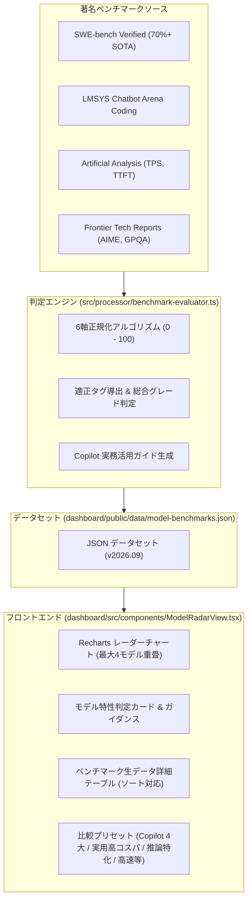
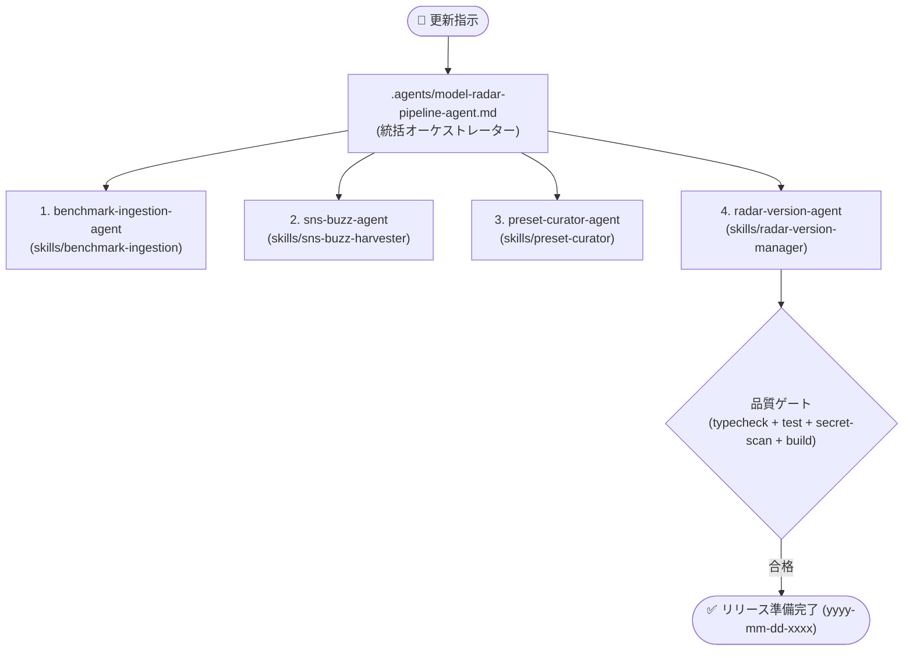

[English](10_ai_model_benchmark_radar_spec.md) | [日本語](10_ai_model_benchmark_radar_spec.ja.md)

---

# SDD-10: AIモデル特性レーダー & 著名ベンチマーク評価 仕様書 (AI Model Benchmark Radar Spec)

- **文書番号**: SPEC-COPILOT-010
- **ステータス**: Approved / Active
- **対象バージョン**: 2026.09-LTS
- **作成日**: 2026-09-12

---

## 1. 概要と目的

GitHub Copilot Analytics Dashboard の副機能（サブシステム）として、利用可能な各 AI モデルの技術的特性・強みを 6 軸レーダーチャートで視覚化し、実務における最適モデルの選定や使い分けを支援する「**AIモデル特性レーダー (AI Model Radar & Benchmark)**」を規定する。

GitHub Copilot 公式ドキュメントに準拠し、公式サポートモデル（OpenAI, Anthropic, Google, Microsoft, xAI, Moonshot AI）を完全網羅するとともに、各モデルの **コンテキスト長（通常窓・1M対応）** および **コスト単価（Input / Output / Prompt Caching / Long Context 単価）** を掲載する。さらに公式ドキュメント（[supported-models](https://docs.github.com/ja/copilot/reference/ai-models/supported-models) および [models-and-pricing](https://docs.github.com/ja/copilot/reference/copilot-billing/models-and-pricing)）への引用リンクを参考情報として常時掲載する。

著名な最新ベンチマーク指標（SWE-bench Verified, AIME 2024, LMSYS Chatbot Arena, Artificial Analysis 等）を取り込み、自動的に 0〜100 の正規化スコアおよび特性タグ・推奨ユースケース・利用指針・リアルなエンジニアの声（※ SNSの噂注釈付き）を判定・提示する。

---

## 2. アーキテクチャと配置

### 2.1 ダッシュボード統合方式
- **表示モード (`DashboardAppMode`)**:
  - `'live_metrics'`: API 連携リアルタイムメトリクスモード
  - `'monthly_report'`: CSV 取り込み Monthly Usage Report モード
  - `'model_radar'`: **AIモデル特性レーダー & ベンチマーク評価モード（新設）**
  - `'deep_analysis'`: ディープ分析モード
- **ナビゲーション**:
  - ヘッダーバーの `ModeSwitcher` よりワンクリックで切り替え。
  - Live Metrics タブバーの「モデル特性レーダー」ボタン、または「ユーザー別モデル推移 (UserTrendViewer)」の各モデル凡例からもジャンプ可能。

### 2.2 データフロー


### 2.3 保持ナレッジモデル全件選択・未利用モデル0%表示仕様
- **ナレッジモデル一覧の永続保持**:
  - 分析対象データ（Live Metrics や Monthly Usage Report CSV）内に特定の AI モデルの利用実績が存在しない場合であっても、システムがナレッジとして保持する全モデル（Copilot 公式提供モデル＋比較対照モデル）は **一切除外されることなく、モデル選択チップス・プリセット・詳細比較テーブルのすべてで常時選択・表示可能** とする。
- **未利用モデルの 0% 表示**:
  - 分析対象データ内に利用リクエストがないモデルは、社内利用シェアを **`0%`（0 req）** として表示する。
  - フォーカス中モデル詳細カードにおいて「社内利用なし (0%) / 導入・切替検討ナレッジ」のステータスバッジおよびガイダンスを提示し、組織内での採用検討やモデル切り替えのためのベンチマーク・特性評価ナレッジとして参照可能とする。
- **名寄せ正規化 (`normalizeModelId`)**:
  - ログやCSVデータ上の表記揺れ（例: `Claude 3.7 Sonnet`, `GPT-4o mini`, `o1 (推論)`, `Gemini 2.0 Flash` 等）を共通のナレッジモデルID（`claude-3-7-sonnet`, `gpt-4o-mini`, `o1`, `gemini-2-0-flash` 等）へ堅牢にマッピングする。

### 2.4 モデル詳細カードのクイック切り替えナビゲーション仕様
- **最上部 2 段構成配置 (全幅レイアウト)**:
  - 「詳細カード切り替え:」セレクタは、詳細カードウィジェット最上部（モデル名・総合グレードヘッダーの直上）に配置する。
  - 上段に「詳細カード切り替え:」ラベルおよび位置インデックスカウンター（例: `1 / 4`）を配し、下段にウィジェット全幅を活用したモデルセレクタ（左右移動ボタンと幅広プルダウン）を展開する 2 段改行レイアウトを採用。モデル名が長い場合でも意図しない折り返し（レイアウト崩れ）を防ぎ、全幅を活用した高い視認性を担保する。
- **左右移動ナビゲーション**:
  - 複数モデルが選択されている場合、前後のモデルへ手軽にステップ移動できる左右ボタン（`<` / `>`）を提供する。
  - 単一モデル選択時は無効化（disabled）され、不要な誤操作を防止する。
- **モデル名プルダウン選択**:
  - モデル名表示部をクリックすることで、現在選択中のモデル一覧をドロップダウン（プルダウン）で展開し、任意のモデルへワンクリックでジャンプ可能とする。
  - プルダウン内には各モデルのテーマカラー・モデル名・Tier・総合グレードおよび現在選択中のチェックマークを表示する。
- **未選択時の非表示・空状態制御**:
  - モデルが1件も選択されていない場合（`selectedModels.length === 0` または `!focusedModel`）、6軸多次元特性マップと同様に詳細カード領域全体をプレースホルダー空状態（パルスアイコン・ガイダンス案内・「Copilot公式モデルを選択」ボタン）へ切り替え、未選択モデルの誤表示を防止する。

### 2.5 比較プリセット仕様 (`PRESETS`)
多様なモデルの中から目的や関心に応じて素早く抽出・比較できるよう、標準プリセットを提供する。特に用途別推奨プリセット（コードレビュー、コードベース分析、設計）は、**「用途における最高水準のレベル（品質ゲート）は譲らず、コストパフォーマンスのバリエーションとして上位3つを選定する」** 方式で厳選されている。

#### 用途別推奨プリセット (最高水準×コストバリエーション上位3選)
- **🔍 コードレビュー利用に推奨 (`recommended-code-review`)**:
  - **選定根拠**: PR差分における潜在バグ・エッジケースの見落としを防ぐため、`swe_bench_verified >= 70.0%` かつ `reasoning_logic >= 95` の最高水準を品質ゲートとして厳格適用。その中でコスト帯の異なる3モデルを選定。
  - **構成モデル (3選)**:
    1. **High-End (最上位深層レビュー)**: `Claude Opus 5` (In: $5.0, Out: $25.0 / SWE 81.0, Logic 99)
    2. **Balanced (実務標準・高精度バランス)**: `Claude Sonnet 5` (In: $2.0, Out: $10.0 / SWE 78.5, Logic 99)
    3. **High-Value (高コスパ即時レビュー)**: `Gemini 3.8 Flash` (In: $0.75, Out: $3.75 / SWE 71.0, Logic 95)
- **📂 コードベース分析に推奨 (`recommended-codebase-analysis`)**:
  - **選定根拠**: リポジトリ全体・複数ディレクトリの依存関係と設計を丸ごと把握するため、`context_window_k >= 1000` (100万トークン対応) かつ `architecture_design >= 92` かつ `swe_bench_verified >= 70.0%` を品質ゲートとして適用。
  - **構成モデル (3選)**:
    1. **High-End (1M超長文・最高峰解析)**: `Claude Opus 5` (In: $5.0, Out: $25.0 / 1M窓, Arch 99, SWE 81.0)
    2. **Balanced (1M超長文・設計リファクタ標準)**: `Claude Sonnet 5` (In: $2.0, Out: $10.0 / 1M窓, Arch 99, SWE 78.5)
    3. **High-Value (1M超長文・大量コード低コスト一括解析)**: `Gemini 3.8 Flash` (In: $0.75, Out: $3.75 / 1M窓, Arch 93, SWE 71.0)
- **🏛️ 設計に推奨 (`recommended-architecture`)**:
  - **選定根拠**: 高度なシステム設計、アーキテクチャ選定、データモデル策定、トレードオフ分析のため、`reasoning_logic >= 95` かつ `architecture_design >= 90` かつ `swe_bench_verified >= 70.0%` を品質ゲートとして適用。
  - **構成モデル (3選)**:
    1. **High-End (最上位極限推論・高難度アーキテクチャ)**: `GPT-6 Astra` (In: $10.0, Out: $50.0 / Logic 99, Arch 96, SWE 82.4)
    2. **Balanced (実務アーキテクチャ・モジュール構造化)**: `Claude Sonnet 5` (In: $2.0, Out: $10.0 / Logic 99, Arch 99, SWE 78.5)
    3. **High-Value (高コスパ・高速設計壁打ち＆比較)**: `Gemini 3.8 Flash` (In: $0.75, Out: $3.75 / Logic 95, Arch 93, SWE 71.0)

#### カテゴリ・メーカー別標準プリセット
- **🌟 2026上 旗艦4選 (`flagship-2026`)**: 2026年上期各社最前線フラッグシップスナップショット（Claude Opus 5 / GPT-6 Astra / Gemini 3.8 Flash / Kimi K3）。
  - ※ 世代比較の再現性を担保するため、本プリセットは当時のスナップショットとして固定保持する。今後のベンチマークデータ更新時は、上期・下期完了時点の各タイミングで新しい期間の旗艦4選（例: `2026下 旗艦4選` 等）を追記・追加していく運用とする。
- **💡 実用性能で高コスパ (`practical-high-value`)**: 実用コーディング性能と抜群の費用対効果を両立（Claude Sonnet 5 / Gemini 3.8 Flash / GPT-5.6 Luna / Kimi K2.7 Code）
- **⚡ Powerful (最上位推論) (`tier-powerful`)**: 最高峰コーディング・推論群（GPT-6 Astra / Claude Opus 5 / GPT-5.6 Sol / Kimi K3）
- **🛠️ Versatile (実務バランス) (`tier-versatile`)**: 標準実務・俊敏性重視（Claude Sonnet 5 / GPT-5.6 Terra / Gemini 3.8 Flash / Grok 4.6）
- **🚀 Lightweight (超高速・低コスト) (`tier-lightweight`)**: 日常インライン・超高速補完（GPT-5.6 Luna / Gemini 3.5 Flash / MAI-Code-1.1-Flash / GPT-5.4 mini）
- **🟠 Anthropic 主力 (`vendor-anthropic`)**: Anthropic 2026最新（Claude Sonnet 5 / Claude Opus 5 / Claude Fable 5.1 / Claude Haiku 4.5）
- **🟢 OpenAI 主力 (`vendor-openai`)**: OpenAI 2026最新ファミリ（GPT-6 Astra / GPT-5.6 Sol / GPT-5.6 Terra / GPT-5.6 Luna）
- **🔵 Google Gemini 3.x (`vendor-google`)**: Google 最新1Mコンテキスト（Gemini 3.8 Flash / Gemini 3.7 Flash / Gemini 3.6 Flash / Gemini 3.5 Flash）

### 2.6 6軸多次元特性マップの線種・アクティブ強調視認性仕様
- **アクティブ（フォーカス中）モデルの強調表示**:
  - 現在アクティブに選択・フォーカスされているモデルは、**Bold の太い実線 (`strokeWidth: 3.5`, `strokeDasharray: undefined`)** で描画し、主たる比較対象として一目で判別できるようにする。
  - チャート上部のヘッダーおよびチャート凡例（Legend）にもアクティブインジケータ（選択中バッジ）を付与する。
- **比較対象（非アクティブ）モデルの点線表示と視認性維持比率**:
  - 重畳表示されるその他のモデルは、**点線（破線: `strokeDasharray: "8 3"`, `strokeWidth: 1.75`）** で描画する。
  - 点線の空白（3px）に対する線部分（8px）の比率を約 73% と長めに確保することで、6軸多角形としての外形・頂点境界の視認性を損なうことなく、実線のアクティブモデルとの明確な主従関係と識別性を両立する。
- **凡例のスマートインジケータ表示（色ブロック＋線種表示）**:
  - チャート凡例（Legend）は従来のモデル固有色ブロック（カラー正方形）を維持しつつ、直後に **実線（3px太線）または 点線（破線）** のミニチュアインジケータを配置。
  - チャート上の描画状態と凡例の対応が一目で把握できる過剰感のないスマートなデザインに統一する。
- **凡例選択と「詳細カード切り替え」の完全連動**:
  - チャート凡例の任意のモデルボタン（またはチャート上のレーダーポリゴン）をクリックすると、アクティブモデル（`focusedModelId`）が即時に切り替わり、右側の「詳細カード切り替え」ウィジェット（総合スコア、適性タグ、推奨ユースケース、強み・弱み、SNS評判等）の表示内容も完全連動して同期更新される。

### 2.7 6軸評価基準クイックリファレンスと他ウィジェット連携リンク仕様
- **目的・役割の明示**:
  - レーダーチャート下部に配置された「6軸評価基準 & 実測ベンチマーク対応」エリアは、各評価軸（`shortLabel`）と算出根拠となる実測メトリクス（`primaryMetric`）の対応関係および配分比重（`weight`）を示すクイックリファレンス。
  - 静的なラベルテキストではなく、他ウィジェットへのナビゲーションの起点となるインタラクティブ操作カードとして機能させる。
- **実測テーブル（#radar-table）とのソート連動**:
  - 各軸カードをクリック（または「実測テーブルソート ↓」をクリック）すると、ページ下部の「04 著名ベンチマーク最新実測データ詳細テーブル」へスムーズスクロールし、該当する評価指標（`swe`, `aime`, `arena`, `speed`, `cost`, `context`）の降順ソートが自動適用される。
- **出典解説（#radar-sources）へのジャンプとハイライト発光**:
  - 各軸カード内の「出典解説 ↗」ボタンをクリックすると、「05 著名ベンチマーク出典の設計背景・現場での見え方」内の対応する出典カード（`#source-swe-bench`, `#source-frontier-papers`, `#source-lmsys-arena`, `#source-artificial-analysis`）へスムーズスクロールし、対象カードをリング＆シャドウ（インジゴ発光）で3秒間強調表示する。

### 2.8 AIモデル選択の画面左側フレーム配置 & 3段階表示切り替え仕様
- **画面左側フレームへの配置 & 画面追従 (`sticky`)**:
  - 「AIモデル選択」コンポーネントを上部概要カード内から画面左側の独立フレーム（`ModelSelectorSidebar`）へ配置変更。
  - `sticky top-20` によるスクロール追従およびフレーム内独立スクロール（`max-h-[calc(100vh-5.5rem)] overflow-y-auto`）を採用し、ユーザーが画面右側の各分析ウィジェット（6軸レーダーマップ、詳細カード、ベンチマーク実測テーブル、出典解説、公式リファレンス）を閲覧・スクロールしながら、その場でリアルタイムにモデル選択を切り替え可能とする。
- **3段階の表示モード切り替え (`sidebarMode`)**:
  - **表示 (`expanded`)【デフォルト】**:
    - 通常幅（約 320px）。モデルのフル名称、モデルカラー、Copilotバッジ、組織内利用シェア%、選択チェックマークを完備。
    - メーカー別/Tier別グルーピング切り替え、メーカー絞り込み、Tier絞り込み、Copilot公式全選択、選択クリア、比較プリセットクイックメニューを提供。
  - **省幅表示 (`compact`)**:
    - 省幅（約 210px〜220px）。AIモデル略称（モデル派閥とバージョン番号を省略せず保持。例: `gpt-5.6-luna`, `gpt-6-astra`, `gpt-o1`, `gpt-o3-mini`, `opus-5`, `opus-4.8`, `sonnet-4.6`, `gemini-3.8-flash` 等、`getModelShortName` による標準略称形）でコンパクトに表示。
    - マウスホバー時にフル名称、ベンダー、Tier、総合スコア、組織内利用シェア%をツールチップ表示。
  - **非表示 (`collapsed`)**:
    - 左側フレームを折りたたみ、画面幅を最大限ウィジェット表示に開放。余分なテキストラベルやサブボタンを排除し、**AIモデルアイコン（Boxes）と展開ボタンアイコン（PanelLeftOpen）のみ**にコンパクト化された常駐ボタンから1クリックで直感的に復帰可能。選択モデル数が存在する場合はミニバッジで件数を表示。
- **選択状態・アクション仕様**:
  - **デフォルト初期選択**: 組織内・分析対象データで実際に利用実績（リクエスト数 > 0）のある上位Top 3モデル（`getTopUsageModelIds`）を降順で自動選択。
  - **利用データなし時のハンドリング**: 利用実績データが空または全モデル0件の場合は未選択（`selectedModelIds = []`）として起動し、レーダーチャート領域に分かりやすいガイダンスと「Copilot公式モデルを選択」ボタンを表示。
  - **クリア処理**: サイドバー最上部の「クリア」ボタン押下時は、全モデルの選択をクリア（`selectedModelIds = []`）。
  - **メーカー/カテゴリ別「全選択 / 全解除」**: 各メーカー（Anthropic, OpenAI, Google等）およびTier（Powerful, Versatile, Lightweight）の見出しにある「全選択 / 全解除」ボタンを押下した際、該当グループ内の全モデルを即座に一括追加または一括解除（`onBatchSelectModels`）。
- **設定の永続化**:
  - 選択した表示モード（`expanded` / `compact` / `collapsed`）はブラウザの `localStorage`（キー: `copilot_radar_sidebar_mode`）に自動保存され、ページ再読み込み時も維持される。

---

## 3. レーダーチャート 6 軸評価メトリクス定義

| 軸キー | 軸名 (表示ラベル) | 重み | 参照ベンチマーク | 算出ロジック・意図 |
| :--- | :--- | :--- | :--- | :--- |
| `coding_swe` | Coding & SWE (実務開発力) | 25% | SWE-bench Verified (85%), HumanEval+ (15%) | GitHub Issue を自律解決・PR 作成する実装力。75% を最高基準として正規化。 |
| `reasoning_logic` | Reasoning & Logic (論理推論力) | 25% | AIME 2024 (65%), GPQA Diamond (35%) | 思考チェーン（CoT）による高難度アルゴリズム、数学的推論、エッジケース検証力。 |
| `arena_elo` | Community & Elo (総合・指示追従) | 15% | LMSYS Chatbot Arena (Coding) | 実世界ユーザーによるブラインド勝率レーティング (1220〜1460 を正規化)。 |
| `speed_latency` | Speed & Latency (応答即時性) | 10% | Tokens / sec (TPS), TTFT | 出力トークン生成速度。30〜180+ tps を対数・区分線形スケーリング。 |
| `cost_efficiency` | Cost Efficiency (費用対効果) | 10% | Pricing per 1M tokens (Input/Output) | 入力・出力の合算単価に対する逆数評価。安価なモデルほど高得点。 |
| `architecture_design` | Architecture & Context (設計・長文把握) | 15% | Context Window (128K〜2M), SWE multi-file | 大規模リポジトリの一括把握、複数ファイル跨ぎのリファクタリング適性。 |

---

## 4. 自動判定タグと推奨ユースケース

### 4.1 判定タグ基準
- **`Complex Refactoring`**: `swe_bench_verified >= 62%` または `architecture_design >= 85`
- **`Algorithm Specialist`**: `reasoning_logic >= 85` または `aime_2024 >= 75%`
- **`Fast Inline Suggestion`**: `speed_latency >= 80` または `output_speed_tps >= 100 tps`
- **`Cost Saver`**: `cost_efficiency >= 80`
- **`Ultra-Long Context`**: `context_window_k >= 1000K (1M tokens)`
- **`High-Precision Coding`**: `coding_swe >= 85`
- **`Agent & Multi-Turn`**: `arena_elo >= 85`

### 4.2 GitHub Copilot 公式サポートモデル体系 (2026年最新)

GitHub Copilot 公式ドキュメント（[Supported models](https://docs.github.com/ja/copilot/reference/ai-models/supported-models) および [Models and pricing](https://docs.github.com/ja/copilot/reference/copilot-billing/models-and-pricing)）に準拠した全モデル（27モデル＋クラシック/外部対照）の仕様・単価体系を網羅。

#### 1. OpenAI (10モデル)
| モデルID | モデル名 | Tier | Status | Context | In単価 (/1M) | Out単価 (/1M) | キャッシュ単価 | 備考 |
| :--- | :--- | :--- | :--- | :--- | :--- | :--- | :--- | :--- |
| `gpt-6-astra` | GPT-6 Astra | Powerful | GA | 272K (1M) | $10.00 | $50.00 | $2.50 | 2026最上位推論・極限思考フラッグシップ |
| `gpt-5-6-sol` | GPT-5.6 Sol | Powerful | GA | 272K | $4.00 | $20.00 | $1.00 | GPT-5.6世代のPowerful主力 |
| `gpt-5-6-terra` | GPT-5.6 Terra | Versatile | GA | 128K | $2.00 | $12.00 | $0.50 | 高速万能モデル |
| `gpt-5-6-luna` | GPT-5.6 Luna | Lightweight | GA | 128K | $0.20 | $1.20 | $0.05 | 超高速インライン補完・低コスト |
| `gpt-5-5` | GPT-5.5 | Powerful | GA | 200K | $5.00 | $30.00 | $1.25 | フロンティア推論モデル |
| `gpt-5-4` | GPT-5.4 | Versatile | GA | 128K | $2.50 | $15.00 | $0.62 | バランスモデル |
| `gpt-5-4-mini` | GPT-5.4 mini | Versatile | GA | 128K | $0.75 | $4.50 | $0.18 | 高速・高コスパ |
| `gpt-5-4-nano` | GPT-5.4 nano | Lightweight | GA | 128K | $0.20 | $1.25 | $0.05 | 超軽量インライン |
| `gpt-5-3-codex` | GPT-5.3-Codex | Versatile | LTS | 128K | $1.75 | $14.00 | $0.43 | LTS長期安定提供コード特化 |
| `gpt-5-mini` | GPT-5 mini | Lightweight | GA | 128K | $0.25 | $2.00 | $0.06 | 定番高速モデル |

#### 2. Anthropic (10モデル)
| モデルID | モデル名 | Tier | Status | Context | In単価 (/1M) | Out単価 (/1M) | キャッシュ読取/書込 | 備考 |
| :--- | :--- | :--- | :--- | :--- | :--- | :--- | :--- | :--- |
| `claude-sonnet-5` | Claude Sonnet 5 | Powerful | GA | 200K (1M) | $2.00 | $10.00 | $0.20 / $2.50 | 全社標準の次世代絶対的主力 |
| `claude-opus-5` | Claude Opus 5 | Powerful | GA | 200K (1M) | $5.00 | $25.00 | $0.50 / $6.25 | 深層思考・極限アーキテクチャ設計 |
| `claude-fable-5-1` | Claude Fable 5.1 | Powerful | GA | 200K (1M) | $10.00 | $50.00 | $1.00 / $12.50 | EFS/ZDR対応最高峰安全性モデル |
| `claude-fable-5` | Claude Fable 5 | Powerful | GA | 200K (1M) | $10.00 | $50.00 | $1.00 / $12.50 | 超安全エンタープライズ推論 |
| `claude-opus-4-8` | Claude Opus 4.8 | Powerful | GA | 200K | $5.00 | $25.00 | $0.50 / $6.25 | 重厚推論モデル |
| `claude-opus-4-8-fast` | Claude Opus 4.8 Fast | Powerful | GA | 200K | $10.00 | $50.00 | $1.00 / $12.50 | Opus最高速版 |
| `claude-opus-4-7` | Claude Opus 4.7 | Powerful | GA | 200K | $5.00 | $25.00 | $0.50 / $6.25 | 高度推論 |
| `claude-sonnet-4-6` | Claude Sonnet 4.6 | Versatile | GA | 200K | $3.00 | $15.00 | $0.30 / $3.75 | 実務バランスモデル |
| `claude-sonnet-4` | Claude Sonnet 4 | Versatile | GA | 200K | $3.00 | $15.00 | $0.30 / $3.75 | 安定コード補完 |
| `claude-haiku-4-5` | Claude Haiku 4.5 | Lightweight | GA | 200K | $1.00 | $5.00 | $0.10 / $1.25 | 超軽量・高速 |

#### 3. Google (4モデル)
| モデルID | モデル名 | Tier | Status | Context | In単価 (/1M) | Out単価 (/1M) | 備考 |
| :--- | :--- | :--- | :--- | :--- | :--- | :--- | :--- |
| `gemini-3-8-flash` | Gemini 3.8 Flash | Versatile | GA | 1M Tok | $0.75 | $3.75 | 最新Flash (プロモ価格中) / 100万トークン |
| `gemini-3-7-flash` | Gemini 3.7 Flash | Versatile | GA | 1M Tok | $0.75 | $3.75 | 思考CoT・高速コード生成 |
| `gemini-3-6-flash` | Gemini 3.6 Flash | Versatile | GA | 1M Tok | $0.75 | $3.75 | 1M長文コンテキスト万能 |
| `gemini-3-5-flash` | Gemini 3.5 Flash | Versatile | GA | 1M Tok | $1.50 | $9.00 | 定番Flash |

#### 4. Microsoft / xAI / Moonshot AI (5モデル)
| モデルID | モデル名 | 提供元 | Tier | Status | Context | In/Out 単価 (/1M) | 備考 |
| :--- | :--- | :--- | :--- | :--- | :--- | :--- | :--- |
| `mai-code-1-1-flash` | MAI-Code-1.1-Flash | Microsoft | Lightweight | GA | 128K | $0.20 / $1.20 | Microsoft謹製超高速コード特化 |
| `grok-4-6` | Grok 4.6 | xAI | Versatile | GA | 200K | $2.00 / $6.00 | 最新Grok・高精度実務補完 |
| `grok-4-5` | Grok 4.5 | xAI | Versatile | GA | 200K | $2.00 / $6.00 | 万能コード補完 |
| `kimi-k3` | Kimi K3 | Moonshot AI | Powerful | GA | 1M | $3.00 / $15.00 | 長文コンテキスト推論特化 |
| `kimi-k2-7-code` | Kimi K2.7 Code | Moonshot AI | Versatile | GA | 256K | $0.95 / $4.00 | 256Kコード特化・高コスパ |

#### 5. クラシック・過去世代モデル & 外部対照
Claude 3.7 Sonnet, Claude 3.5 Sonnet, GPT-4o, GPT-4o mini, o1, o3-mini, Gemini 2.0 Flash, Gemini 2.5 Pro, DeepSeek R1（過去分析データ対照用）。

### 4.3 公式ドキュメント引用と参考情報
ユーザー画面において、以下の公式ドキュメントへのリンクを参考情報として常時掲載する。
- 📘 **GitHub Copilot サポートAIモデル一覧**: `https://docs.github.com/ja/copilot/reference/ai-models/supported-models`
- 💳 **GitHub Copilot モデル別課金・単価表**: `https://docs.github.com/ja/copilot/reference/copilot-billing/models-and-pricing`

---

## 5. 出典メタデータとお題・現場での見え方・エンジニアの声 (※ SNSの噂)

### 5.1 著名ベンチマーク出典の多面解説 (`BenchmarkSourceMeta`)
1. **SWE-bench Verified Leaderboard**:
   - **出題お題 (`target_problem`)**: 実世界オープンソース（Django, SymPy等）のリアルな Issue/PR。コードベース探索からテスト合格パッチ自律生成までを判定。
   - **現場での見え方 (`performance_view`)**: 「自律型エージェントとしての実務即戦力度」に直結。部分点なしの厳格採点。
   - **現場の声 (`community_rumor`)**: ※ SNSの噂: プロンプトチューニング疑惑や日本語指示でのニュアンス汲み取り課題、Verified 化による悪問排除などの評判。
2. **LMSYS Chatbot Arena (Coding)**:
   - **出題お題 (`target_problem`)**: 世界中のエンジニアが直面した実践プログラミング課題に対する2モデルのブラインド比較投票。
   - **現場での見え方 (`performance_view`)**: 人間プログラマーが読んだときの納得感・コードの綺麗さ・モダンな記法・説明のわかりやすさ等の主観的満足度。
   - **現場の声 (`community_rumor`)**: ※ SNSの噂: 回答が長く見た目がリッチなモデルへの投票バイアスなど。
3. **Artificial Analysis**:
   - **出題お題 (`target_problem`)**: 各APIエンドポイントの出力速度 (TPS)、初回トークン遅延 (TTFT)、100万トークン単価の実測。
   - **現場での見え方 (`performance_view`)**: 思考を止めない即時性（DX）とAPI運用コストの現実的バランス。
4. **Frontier AI Technical Reports (AIME / GPQA / HumanEval+)**:
   - **出題お題 (`target_problem`)**: 全米数学招待試験 (AIME)、大学院レベル科学多肢選択 (GPQA)、基本関数実装 (HumanEval+)。
   - **現場での見え方 (`performance_view`)**: 極限難問における思考チェーンの到達点。

### 5.2 リアルなエンジニアの声・現場の評判 (`EngineerBuzz`)
モデル詳細カードに「エンジニアの生の声・コミュニティの噂」コンポーネントを統合。
- **注釈表記の義務 (`source_note`)**: 必ず「`※ SNS上のエンジニアの声・コミュニティの噂・所感`」または「`※ SNSの噂`」の統一注釈バッジを明示する（個別の記事メモ等は入れず統一する）。
- **引用元URLの列挙 (`sources`)**: 項目下部に引用元・参考となる記事やコミュニティURLを明記・リンク列挙する。個別の注記メモではなく、引用元URL一覧として整理する。

---

## 6. 個別バージョン管理仕様 (`yyyy-mm-dd-0001`)

AIモデル特性レーダーのデータセットおよび画面表示において、個別バージョンを日付および同日内のインクリメンタル連番で管理する。

### 6.1 フォーマット定義
$$\text{Version} = \text{yyyy-mm-dd-xxxx}$$
- `yyyy-mm-dd`: 作成日・更新日のカレンダー日付（例: `2026-09-13`）。
- `xxxx`: 同日付内での 4 桁ゼロパディングされたインクリメンタル連番（`0001`, `0002`, `0003`...）。
- 同日付で再度ベンチマーク更新スクリプト（`npm run benchmark:update`）が実行された場合は連番が自動的に `+1` される。
- 翌日以降の別日付で実行された場合は、自動的に新しい日付の `0001` から開始される。

### 6.2 UI表示とツールチップ
- タイトル右横のステータスバッジに `v2026-09-13-0001` の形式で個別バージョンを表示。
- ホバー時のツールチップに「個別バージョン (日付・連番管理): {version}」を表示。

---

## 7. 更新作業パイプライン Agent & Skills 分割構成

ベンチマーク情報の更新・比較用データ取り込み・SNS情報再収集・比較プリセット更新・個別バージョン採番の一連の作業は、起点となるマスターオーケストレーター Agent および 4 つの個別専門 Agent / Skills に分割して構成する。



### 7.1 分割エージェント & スキル一覧
1. **起点オーケストレーター (`.agents/model-radar-pipeline-agent.md`)**:
   - 一連の更新作業全体の進行管理、依存ステップ制御、最終整合性確認。
2. **ベンチマーク取り込み (`.agents/benchmark-ingestion-agent.md` / `skills/benchmark-ingestion`)**:
   - GitHub Copilot公式ドキュメント（supported-models, models-and-pricing）、SWE-bench Verified、LMSYS Arena、Artificial Analysis からの最新指標・単価仕様の取り込み。
3. **SNS評判再収集 (`.agents/sns-buzz-agent.md` / `skills/sns-buzz-harvester`)**:
   - 現場エンジニアの実感・SNS評判・注意点（※ SNSの噂）の収集・要約・反映。
4. **比較プリセット選定 (`.agents/preset-curator-agent.md` / `skills/preset-curator`)**:
   - 「最高水準レベル（品質ゲート）は譲らず、コストバリエーション上位3選」アルゴリズムに基づくプリセット更新。
5. **バージョン管理・検証 (`.agents/radar-version-agent.md` / `skills/radar-version-manager`)**:
   - `yyyy-mm-dd-0001` インクリメンタル採番、データセット生成、4重品質ゲート検証。

---

## 8. コマンドライン・運用仕様

- **ベンチマーク更新・個別バージョン採番**:
  ```bash
  npm run benchmark:update
  ```
- **品質ゲート**:
  ```bash
  npm run typecheck && npm test && npm run secret-scan && npm run build
  ```
