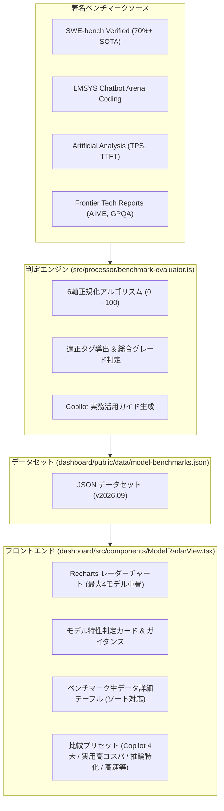
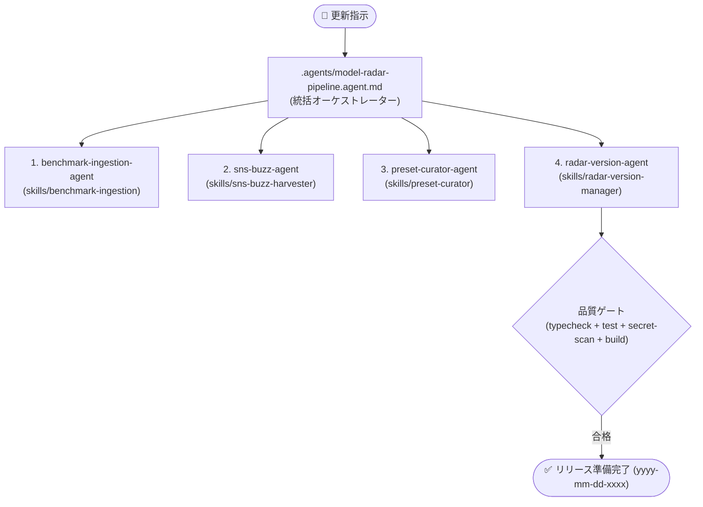

[English](10_ai_model_benchmark_radar_spec.md) | [日本語](10_ai_model_benchmark_radar_spec.ja.md)

---

# SDD-10: AIモデル特性レーダー & 著名ベンチマーク評価 仕様書 (AI Model Benchmark Radar Spec)

- **文書番号**: SPEC-COPILOT-010
- **ステータス**: Approved / Active
- **対象バージョン**: 2026.09-LTS
- **作成日**: 2026-09-12

---

## 1. 概要と目的

GitHub Copilot Analytics Dashboard の副機能（サブシステム）として、利用可能な各 AI モデルの技術的特性・強みを 6 軸レーダーチャートで視覚化し、実務における最適モデルの選定や使い分けを支援する「**AIモデル特性レーダー (AI Model Radar & Benchmark)**」を規定する。

GitHub Copilot 公式ドキュメントに準拠し、公式サポートモデル（OpenAI, Anthropic, Google, Microsoft, xAI, Moonshot AI）を完全網羅するとともに、各モデルの **コンテキスト長（通常窓・1M対応）** および **コスト単価（Input / Output / Prompt Caching / Long Context 単価）** を掲載する。さらに公式ドキュメント（[supported-models](https://docs.github.com/ja/copilot/reference/ai-models/supported-models) および [models-and-pricing](https://docs.github.com/ja/copilot/reference/copilot-billing/models-and-pricing)）への引用リンクを参考情報として常時掲載する。Long Context 単価の表示しきい値はモデルの `long_context_threshold_k` (未設定時は 200K) を使う。

著名な最新ベンチマーク指標（SWE-bench Verified, AIME 2024, LMSYS Chatbot Arena, Artificial Analysis 等）を取り込み、自動的に 0〜100 の正規化スコアおよび特性タグ・推奨ユースケース・利用指針・リアルなエンジニアの声（※ SNSの噂注釈付き）を判定・提示する。

---

## 2. アーキテクチャと配置

### 2.1 ダッシュボード統合方式
- **分析ビュー (`AnalysisViewId`)**:
  - `model_radar`: **AIモデル特性レーダー & ベンチマーク評価ビュー**
- **ナビゲーション**:
  - ナビゲーションバーの `ViewNavigation` よりワンクリックで切り替え。
  - 「ユーザー別モデル推移 (UserTrendViewer)」の各モデル凡例や関連ウィジェットからもダイレクトジャンプ可能。

### 2.2 データフロー

```mermaid
flowchart TD
    subgraph Sources["著名ベンチマークソース"]
        SWE["SWE-bench Verified (70%+ SOTA)"]
        Arena["LMSYS Chatbot Arena Coding"]
        AA["Artificial Analysis (TPS, TTFT)"]
        Paper["Frontier Tech Reports (AIME, GPQA)"]
    end

    subgraph Evaluator["判定エンジン (src/processor/benchmark-evaluator.ts)"]
        Norm["6軸正規化アルゴリズム (0 - 100)"]
        Tag["適正タグ導出 & 総合グレード判定"]
        Guide["Copilot 実務活用ガイド生成"]
    end

    subgraph Storage["データセット (dashboard/public/data/model-benchmarks.json)"]
        JSON["JSON データセット (v2026.09)"]
    end

    subgraph UI["フロントエンド (dashboard/src/components/ModelRadarView.tsx)"]
        Chart["Recharts レーダーチャート (最大4モデル重畳)"]
        Cards["モデル特性判定カード & ガイダンス"]
        Table["ベンチマーク生データ詳細テーブル (ソート対応)"]
        Preset["比較プリセット (Copilot 4大 / 実用高コスパ / 推論特化 / 高速等)"]
    end

    Sources --> Evaluator
    Evaluator --> Storage
    Storage --> UI
```

### 2.3 保持ナレッジモデル全件選択・未利用モデル0%表示仕様
- **ナレッジモデル一覧の永続保持**:
  - 分析対象データ（自動定期収集データや Monthly Usage Report CSV）内に特定の AI モデルの利用実績が存在しない場合であっても、システムがナレッジとして保持する全モデル（Copilot 公式提供モデル＋比較対照モデル）は **一切除外されることなく、モデル選択チップス・プリセット・詳細比較テーブルのすべてで常時選択・表示可能** とする。
- **未利用モデルの 0% 表示**:
  - 分析対象データ内に利用リクエストがないモデルは、社内利用シェアを **`0%`（0 req）** として表示する。
  - フォーカス中モデル詳細カードにおいて「社内利用なし (0%) / 導入・切替検討ナレッジ」のステータスバッジおよびガイダンスを提示し、組織内での採用検討やモデル切り替えのためのベンチマーク・特性評価ナレッジとして参照可能とする。
- **名寄せ正規化 (`normalizeModelId`)**:
  - ログやCSVデータ上の表記揺れ（例: `Claude 3.7 Sonnet`, `GPT-4o mini`, `o1 (推論)`, `Gemini 2.0 Flash` 等）を共通のナレッジモデルID（`claude-3-7-sonnet`, `gpt-4o-mini`, `o1`, `gemini-2-0-flash` 等）へ堅牢にマッピングする。
- **タグ/スコープ絞り込みとの連動 (`利用割合 (%)` 再集計)**:
  - Tag フィルターやスコープ（対象月・組織等）を変更した場合、各モデルの利用実績・利用割合 (%) は必ずその時点の「アクティブ選択されている分析対象データ」のみを基に再集計される（[SDD-01 FR-9](01_requirements_specification.ja.md) / [SDD-15 データセントリック・リアクティビティ設計仕様書](15_data_centric_reactivity_design_spec.ja.md) の適用例）。
  - **自動定期収集データ**: ユーザーごとのモデル別リクエスト数 (`model_usage_totals`) を保持するため、タグ AND フィルター適用後のユーザー集合から厳密に再集計する。
  - **Monthly Usage Report / アップロードデータ**: ユーザー明細には主要モデル (`primary_model`) のみが保持され、ユーザー単位のモデル別内訳は保持されないため、タグ絞り込み時は各ユーザーの総リクエスト数を `primary_model` へ全量按分計上する近似値として `model_breakdown` を再集計する。タグ未選択時（全ユーザー対象）はパース時点の厳密な集計値をそのまま使用する。

### 2.4 モデル詳細カードのクイック切り替えナビゲーション仕様
- **最上部 2 段構成配置 (全幅レイアウト)**:
  - 「詳細カード切り替え:」セレクタは、詳細カードウィジェット最上部（モデル名・総合グレードヘッダーの直上）に配置する。
  - 上段に「詳細カード切り替え:」ラベルおよび位置インデックスカウンター（例: `1 / 4`）を配し、下段にウィジェット全幅を活用したモデルセレクタ（左右移動ボタンと幅広プルダウン）を展開する 2 段改行レイアウトを採用。モデル名が長い場合でも意図しない折り返し（レイアウト崩れ）を防ぎ、全幅を活用した高い視認性を担保する。
- **左右移動ナビゲーション**:
  - 複数モデルが選択されている場合、前後のモデルへ手軽にステップ移動できる左右ボタン（`<` / `>`）を提供する。
  - 単一モデル選択時は無効化（disabled）され、不要な誤操作を防止する。
- **モデル名プルダウン選択**:
  - モデル名表示部をクリックすることで、現在選択中のモデル一覧をドロップダウン（プルダウン）で展開し、任意のモデルへワンクリックでジャンプ可能とする。
  - プルダウン内には各モデルのテーマカラー・モデル名・Tier・総合グレードおよび現在選択中のチェックマークを表示する。
- **未選択時の非表示・空状態制御**:
  - モデルが1件も選択されていない場合（`selectedModels.length === 0` または `!focusedModel`）、6軸多次元特性マップと同様に詳細カード領域全体をプレースホルダー空状態（パルスアイコン・ガイダンス案内・「Copilot公式モデルを選択」ボタン）へ切り替え、未選択モデルの誤表示を防止する。

### 2.5 比較プリセット仕様 (`PRESETS`)
多様なモデルの中から目的や関心に応じて素早く抽出・比較できるよう、標準プリセットを提供する。用途別推奨プリセット（コードレビュー、コードベース分析、設計）は最高水準の品質ゲートとコストバリエーションを両立し、新世代の `Claude Opus 5.5` も加えた強力な比較構成となっている。また、GPT系モデルについては標準比較用として安定したGPT-5系同等モデル（GPT-5.5 / GPT-5.4 / GPT-5 mini）を採用しつつ、卓越した低コスト性能を誇る `GPT-5.6 Luna` は高コスパ・低コストプリセットにて継続維持する。

#### 用途別推奨プリセット
- **🔍 コードレビュー利用に推奨 (`recommended-code-review`)**:
  - **選定根拠**: PR差分における潜在バグ・エッジケースの見落としを防ぐため、最高水準の推論・SWE性能モデルを選定。最上位推論として `Claude Opus 5.5` / `Claude Opus 5` を維持し、高いコード解析力を持つ `GPT-6 Sol` および `GPT-5.6 Terra` を追加。
  - **構成モデル (6選)**:
    1. **Next-Gen Frontier (最新最高峰レビュー)**: `Claude Opus 5.5` (In: $4.0, Out: $20.0 / SWE 81.8, Logic 99)
    2. **High-End (最上位深層レビュー)**: `Claude Opus 5` (In: $5.0, Out: $25.0 / SWE 81.0, Logic 99)
    3. **Powerful Sol (高推論・高速精密レビュー)**: `GPT-6 Sol` (In: $2.0, Out: $10.0 / SWE 80.5, Logic 98)
    4. **Balanced (実務標準・高精度バランス)**: `Claude Sonnet 5` (In: $2.0, Out: $10.0 / SWE 78.5, Logic 99)
    5. **Versatile Terra (実務バランス・堅牢差分解析)**: `GPT-5.6 Terra` (In: $2.0, Out: $12.0 / SWE 77.2, Logic 96)
    6. **High-Value (高コスパ即時レビュー)**: `Gemini 3.8 Flash` (In: $0.75, Out: $3.75 / SWE 71.0, Logic 95)
- **📂 コードベース分析に推奨 (`recommended-codebase-analysis`)**:
  - **選定根拠**: リポジトリ全体・複数ディレクトリの依存関係と設計を丸ごと把握するため、100万トークン対応かつ高SWE性能モデルを選定。最高峰の `Claude Opus 5.5` / `Claude Opus 5` に加え、長文100万トークン対応フラッグシップ `GPT-6 Astra` を追加。
  - **構成モデル (5選)**:
    1. **Premier Flagship (最上位極限推論・1M長文全体解析)**: `GPT-6 Astra` (In: $10.0, Out: $50.0 / 1M窓, Arch 96, SWE 82.4)
    2. **Next-Gen Frontier (最新1M超長文・最高峰解析)**: `Claude Opus 5.5` (In: $4.0, Out: $20.0 / 1M窓, Arch 99, SWE 81.8)
    3. **High-End (1M超長文・最高峰解析)**: `Claude Opus 5` (In: $5.0, Out: $25.0 / 1M窓, Arch 99, SWE 81.0)
    4. **Balanced (1M超長文・設計リファクタ標準)**: `Claude Sonnet 5` (In: $2.0, Out: $10.0 / 1M窓, Arch 99, SWE 78.5)
    5. **High-Value (1M超長文・大量コード低コスト一括解析)**: `Gemini 3.8 Flash` (In: $0.75, Out: $3.75 / 1M窓, Arch 93, SWE 71.0)
- **🏛️ 設計に推奨 (`recommended-architecture`)**:
  - **選定根拠**: 高度なシステム設計、アーキテクチャ選定、データモデル策定、トレードオフ分析のため、極限論理推論と設計性能を持つモデル群。新世代フラッグシップ `Claude Opus 5.5` および確立された実績を持つ `Claude Opus 5` を追加・維持。
  - **構成モデル (5選)**:
    1. **Premier Flagship (最上位極限推論・高難度アーキテクチャ)**: `GPT-6 Astra` (In: $10.0, Out: $50.0 / Logic 99, Arch 96, SWE 82.4)
    2. **Next-Gen Frontier (最新最高峰推論・制御性向上)**: `Claude Opus 5.5` (In: $4.0, Out: $20.0 / Logic 99, Arch 99, SWE 81.8)
    3. **High-End (確立された最高峰推論・大局的設計)**: `Claude Opus 5` (In: $5.0, Out: $25.0 / Logic 98, Arch 99, SWE 81.0)
    4. **Balanced (実務アーキテクチャ・モジュール構造化)**: `Claude Sonnet 5` (In: $2.0, Out: $10.0 / Logic 99, Arch 99, SWE 78.5)
    5. **High-Value (高コスパ・高速設計壁打ち＆比較)**: `Gemini 3.8 Flash` (In: $0.75, Out: $3.75 / Logic 95, Arch 93, SWE 71.0)

#### カテゴリ・メーカー別標準プリセット
- **🌟 2026 旗艦選 (`flagship-2026`)**: 2026年各社最前線フラッグシップスナップショット（Claude Opus 5.5 / Claude Opus 5 / GPT-6 Astra / Gemini 3.8 Flash / Kimi K3）。
- **💡 実用性能で高コスパ (`practical-high-value`)**: 実用コーディング性能と抜群の費用対効果を両立（Claude Sonnet 5 / Gemini 3.8 Flash / GPT-6 Luna / GPT-5.6 Luna / Kimi K2.7 Code） ※高コスパ代表として GPT-6 Luna および GPT-5.6 Luna を維持・追加。
- **⚡ Powerful (最上位推論) (`tier-powerful`)**: 最高峰コーディング・推論群（GPT-6 Astra / Claude Opus 5.5 / Claude Opus 5 / GPT-6 Sol / Kimi K3） ※GPT-6 Sol を追加し、GPT-5.5 を整理。
- **🛠️ Versatile (実務バランス) (`tier-versatile`)**: 標準実務・俊敏性重視（Claude Sonnet 5 / GPT-5.6 Terra / Gemini 3.8 Flash / Grok 4.6） ※GPT-5.6 Terra を追加し、GPT-5.4 を整理。
- **🚀 Lightweight (超高速・低コスト) (`tier-lightweight`)**: 日常インライン・超高速補完（GPT-6 Luna / GPT-5.6 Luna / Gemini 3.5 Flash / MAI-Code-1.1-Flash / GPT-5.4 mini） ※超高速・低コスト代表として GPT-6 Luna を追加、GPT-5.6 Luna を維持。
- **🟠 Anthropic 主力 (`vendor-anthropic`)**: Anthropic 2026最新（Claude Sonnet 5 / Claude Opus 5.5 / Claude Opus 5 / Claude Fable 5.1 / Claude Haiku 4.5） ※Opus 5.5 を追加。
- **🟢 OpenAI 主力 (`vendor-openai`)**: OpenAI 主力ラインナップ（GPT-6 Astra / GPT-6 Sol / GPT-5.6 Sol） ※GPT-6 Sol および GPT-5.6 Sol を追加し、旧世代（GPT-5.5 / GPT-5.4 / GPT-5 mini）を整理。
- **🔵 Google Gemini 3.x (`vendor-google`)**: Google 最新1Mコンテキスト（Gemini 3.8 Flash / Gemini 3.7 Flash / Gemini 3.6 Flash / Gemini 3.5 Flash）

### 2.6 モデル比較チャート: レーダーチャート
6 軸の比較は**レーダーチャート**（recharts `RadarChart`、0〜100、選択モデルごとに 1 多角形）で描く。アクティブ（フォーカス中）モデルは最前面の太い実線（穏やかな点滅）、その他の選択モデルは低不透明度の点線。多角形または凡例ボタンのクリックで `focusedModelId` が切り替わり、詳細カードが連動する。P3-7 で導入したドットプロット（`ModelDotPlot`）は取り消した。生値はベンチマーク表とツールチップで引き続き読める。

### 2.7 6軸評価基準クイックリファレンスと他ウィジェット連携リンク仕様
- **目的・役割の明示**:
  - レーダーチャート下部に配置された「6軸評価基準 & 実測ベンチマーク対応」エリアは、各評価軸（`shortLabel`）と算出根拠となる実測メトリクス（`primaryMetric`）の対応関係および配分比重（`weight`）を示すクイックリファレンス。
  - 静的なラベルテキストではなく、他ウィジェットへのナビゲーションの起点となるインタラクティブ操作カードとして機能させる。
- **実測テーブル（#radar-table）とのソート連動**:
  - 各軸カードをクリック（または「実測テーブルソート ↓」をクリック）すると、ページ下部の「04 著名ベンチマーク最新実測データ詳細テーブル」へスムーズスクロールし、該当する評価指標（`swe`, `aime`, `arena`, `speed`, `cost`, `context`）の降順ソートが自動適用される。
- **出典解説（#radar-sources）へのジャンプとハイライト発光**:
  - 各軸カード内の「出典解説 ↗」ボタンをクリックすると、「05 著名ベンチマーク出典の設計背景・現場での見え方」内の対応する出典カード（`#source-swe-bench`, `#source-frontier-papers`, `#source-lmsys-arena`, `#source-artificial-analysis`）へスムーズスクロールし、対象カードをリング＆シャドウ（インジゴ発光）で3秒間強調表示する。

### 2.8 AIモデル選択の画面左側フレーム配置 & 3段階表示切り替え仕様
- **画面左側フレームへの配置 & 画面追従 (`sticky`)**:
  - 「AIモデル選択」コンポーネントを上部概要カード内から画面左側の独立フレーム（`ModelSelectorSidebar`）へ配置変更。
  - `sticky top-20` によるスクロール追従およびフレーム内独立スクロール（`max-h-[calc(100vh-5.5rem)] overflow-y-auto`）を採用し、ユーザーが画面右側の各分析ウィジェット（6軸レーダーマップ、詳細カード、ベンチマーク実測テーブル、出典解説、公式リファレンス）を閲覧・スクロールしながら、その場でリアルタイムにモデル選択を切り替え可能とする。
- **3段階の表示モード切り替え (`sidebarMode`)**:
  - **表示 (`expanded`)【デフォルト】**:
    - 通常幅（約 320px）。モデルのフル名称、モデルカラー、Copilotバッジ、組織内利用シェア%、選択チェックマークを完備。
    - メーカー別/Tier別グルーピング切り替え、メーカー絞り込み、Tier絞り込み、Copilot公式全選択、選択クリア、比較プリセットクイックメニューを提供。
  - **省幅表示 (`compact`)**:
    - 省幅（約 210px〜220px）。AIモデル略称（モデル派閥とバージョン番号を省略せず保持。例: `gpt-5.6-luna`, `gpt-6-astra`, `gpt-o1`, `gpt-o3-mini`, `opus-5`, `opus-4.8`, `sonnet-4.6`, `gemini-3.8-flash` 等、`getModelShortName` による標準略称形）でコンパクトに表示。
    - ヘッダー右端の表示モード切替ボタン群（表示・省幅）はテキストラベル（「表示」「省幅」）を非表示としてアイコン単独表示（`p-1`）に切り替え、幅狭コンテナによる「表」「示」「省」「幅」の1文字ずつ改行レイアウト崩れを完全に防止。通常表示時（`expanded`）も `whitespace-nowrap` により不要な改行を防止。
    - マウスホバー時にフル名称、ベンダー、Tier、総合スコア、組織内利用シェア%をツールチップ表示。
  - **非表示 (`collapsed`)**:
    - 左側フレームを折りたたみ、画面幅を最大限ウィジェット表示に開放。余分なテキストラベルやサブボタンを排除し、**AIモデルアイコン（Boxes）と展開ボタンアイコン（PanelLeftOpen）のみ**にコンパクト化された常駐ボタンから1クリックで直感的に復帰可能。選択モデル数が存在する場合はミニバッジで件数を表示。
- **選択状態・アクション仕様**:
  - **デフォルト初期選択**: 組織内・分析対象データで実際に利用実績（リクエスト数 > 0）のある上位Top 3モデル（`getTopUsageModelIds`）を降順で自動選択。
  - **利用データなし時のハンドリング**: 利用実績データが空または全モデル0件の場合は未選択（`selectedModelIds = []`）として起動し、レーダーチャート領域に分かりやすいガイダンスと「Copilot公式モデルを選択」ボタンを表示。
  - **クリア処理**: サイドバー最上部の「クリア」ボタン押下時は、全モデルの選択をクリア（`selectedModelIds = []`）。
  - **メーカー/カテゴリ別「全選択 / 全解除」**: 各メーカー（Anthropic, OpenAI, Google等）およびTier（Powerful, Versatile, Lightweight）の見出しにある「全選択 / 全解除」ボタンを押下した際、該当グループ内の全モデルを即座に一括追加または一括解除（`onBatchSelectModels`）。
- **設定の永続化**:
  - 選択した表示モード（`expanded` / `compact` / `collapsed`）はブラウザの `localStorage`（キー: `copilot_radar_sidebar_mode`）に自動保存され、ページ再読み込み時も維持される。

---

## 3. レーダーチャート 6 軸評価メトリクス定義

| 軸キー | 軸名 (表示ラベル) | 重み | 参照ベンチマーク | 算出ロジック・意図 |
| :--- | :--- | :--- | :--- | :--- |
| `coding_swe` | Coding & SWE (実務開発力) | 25% | SWE-bench Verified (85%), HumanEval+ (15%) | GitHub Issue を自律解決・PR 作成する実装力。データセット内のパーセンタイル順位。 |
| `reasoning_logic` | Reasoning & Logic (論理推論力) | 25% | AIME 2024 (65%), GPQA Diamond (35%) | 思考チェーン（CoT）による高難度アルゴリズム、数学的推論、エッジケース検証力。 |
| `arena_elo` | Community & Elo (総合・指示追従) | 15% | LMSYS Chatbot Arena (Coding) | 実世界ユーザーによるブラインド勝率レーティング。データセット内のパーセンタイル順位。 |
| `speed_latency` | Speed & Latency (応答即時性) | 10% | Tokens / sec (TPS), TTFT | 出力トークン生成速度。データセット内のパーセンタイル順位。 |
| `cost_efficiency` | Cost Efficiency (費用対効果) | 10% | Pricing per 1M tokens (Input/Output) | 入力 40%・出力 60% の合算単価を逆順位で評価。安価なモデルほど高得点。 |
| `architecture_design` | Architecture & Context (設計・長文把握) | 15% | Context Window (128K〜2M), SWE multi-file | 大規模リポジトリの一括把握、複数ファイル跨ぎのリファクタリング適性。 |

---

### 3.1 正規化: パーセンタイル順位 (P3-7 / B-15)
- **理由**: 従来の固定アンカー（SWE-bench 75 / AIME 90 / Elo 1460）を現行モデルが超え、43 モデル中 11 / 12 / 7 が 99 で頭打ちになり、上位 GA モデル 10 件が coding で同点だった。固定アンカーは、全体がアンカーを超えるたびに飽和する。
- **方式（`percentile-rank-v1`）**: 各構成要素のスコアは、データセット内の全モデルの中でその生値が占めるパーセンタイル順位 `(below + 0.5 * equal) / n`（同値は中央順位）を 20〜99 に写し、小数 1 桁で保持する。軸スコアは上表の重みで構成要素を合成する（coding = 0.85 SWE + 0.15 HumanEval+、reasoning = 0.65 AIME + 0.35 GPQA、architecture = 0.45 コンテキスト + 0.55 SWE）。総合スコアは 6 軸の加重平均（小数 1 桁）で、上位モデルを区別できる。
- **相対評価であること**: スコアは現在のデータセット内の位置を表し、絶対的な能力ではない。モデルを追加すると動く。**スコアの隣に生値を常に表示する**（ツールチップ、ベンチマーク表）。
- コンテキスト無し（単一モデル）の `computeRadarScores(raw)` は、後方互換のため従来のアンカー式のまま。定性評価（グレード・タグ・強み/弱み）は絶対しきい値のままで、アンカー式のスコアで判定する。
- テスト: `src/tests/benchmark-normalization.test.ts`（上位モデルが同点にならない、順位の境界、入力順序への非依存）。

### 3.2 モデルカタログ: 別名の完全一致 (P3-7 / A-13)
`normalizeModelId` は、モデルカタログ（`src/processor/model-catalog.ts`: 正規 ID + 別名リスト）で判定する。判定は**正規化した別名の完全一致**（小文字・英数字のみ）。許容する揺れは、末尾の括弧書き（`Kimi K3 (Moonshot)`）と末尾のリリース日（`-20250219`）だけ。**部分一致は使わない**: 未知の名前は `unknown:<raw>` のまま保持し、未知の新モデル（例: `GPT-6 Nova`）が `gpt-6-astra` に数えられることはない。別名の衝突は例外にする。カタログとベンチマークレコードが同じモデルを列挙すること、全レコードの ID と名前が自分自身に解決されることをテストで検証する。

---

## 4. 自動判定タグと推奨ユースケース

### 4.1 判定タグ基準
- **`Complex Refactoring`**: `swe_bench_verified >= 62%` または `architecture_design >= 85`
- **`Algorithm Specialist`**: `reasoning_logic >= 85` または `aime_2024 >= 75%`
- **`Fast Inline Suggestion`**: `speed_latency >= 80` または `output_speed_tps >= 100 tps`
- **`Cost Saver`**: `cost_efficiency >= 80`
- **`Ultra-Long Context`**: `context_window_k >= 1000K (1M tokens)`
- **`High-Precision Coding`**: `coding_swe >= 85`
- **`Agent & Multi-Turn`**: `arena_elo >= 85`

### 4.2 GitHub Copilot 公式サポートモデル体系 (2026年最新)

GitHub Copilot 公式ドキュメント（[Supported models](https://docs.github.com/ja/copilot/reference/ai-models/supported-models) および [Models and pricing](https://docs.github.com/ja/copilot/reference/copilot-billing/models-and-pricing)）に準拠した全モデル（36モデル＋クラシック/外部対照9モデル = 計45モデル）の仕様・単価体系を網羅。

#### 1. OpenAI (12モデル)
| モデルID | モデル名 | Tier | Status | Context | In単価 (/1M) | Out単価 (/1M) | キャッシュ単価 | 備考 |
| :--- | :--- | :--- | :--- | :--- | :--- | :--- | :--- | :--- |
| `gpt-6-astra` | GPT-6 Astra | Powerful | GA | 272K (1M) | $10.00 | $50.00 | $2.50 | 2026最上位推論・極限思考フラッグシップ |
| `gpt-6-1-sol` | GPT-6.1 Sol (推測値) | Powerful | GA | 1.05M | $2.00 | $10.00 | $0.10 | 最新 Sol。ベンチマークスコアは裏付けのない推測値 (`is_estimated`)。単価 (キャッシュ書き込み $2.50、Long Context > 272K: In $4.00 / Out $15.00 を含む) は 2026-10-08 に公式価格表 (`github/docs` `data/tables/copilot/models-and-pricing.yml`、コミット `45a0f053ac67e8d1f56fc8f7ee38f0b2a58925c3` と `main`) と照合済み |
| `gpt-6-sol` | GPT-6 Sol | Powerful | GA | 272K (1M) | $2.00 | $10.00 | $0.20 | 高性能と手頃な単価を両立する新世代Powerful主力 |
| `gpt-6-luna` | GPT-6 Luna | Lightweight | GA | 272K (1M ※長文注意) | $0.10 | $0.50 | $0.01 | 超高速・超低コストインライン補完（※長文性能注意） |
| `gpt-5-6-sol` | GPT-5.6 Sol | Powerful | GA | 272K (1M) | $4.00 | $20.00 | $1.00 | GPT-5.6世代のPowerful主力 |
| `gpt-5-6-terra` | GPT-5.6 Terra | Versatile | GA | 272K (1M) | $2.00 | $12.00 | $0.50 | 高速万能モデル |
| `gpt-5-6-luna` | GPT-5.6 Luna | Lightweight | GA | 200K (1M ※長文注意) | $0.20 | $1.20 | $0.05 | 超高速インライン補完・低コスト（※長文性能注意） |
| `gpt-5-5` | GPT-5.5 | Powerful | GA | 272K (1M) | $5.00 | $30.00 | $1.25 | フロンティア推論モデル |
| `gpt-5-4` | GPT-5.4 | Versatile | GA | 272K (1M) | $2.50 | $15.00 | $0.62 | バランスモデル |
| `gpt-5-4-mini` | GPT-5.4 mini | Lightweight | GA | 128K | $0.75 | $4.50 | $0.18 | 高速・高コスパ |
| `gpt-5-4-nano` | GPT-5.4 nano | Lightweight | GA | 128K | $0.20 | $1.25 | $0.05 | 超軽量インライン |
| `gpt-5-3-codex` | GPT-5.3-Codex | Powerful | LTS | 1M | $1.75 | $14.00 | $0.43 | LTS長期安定提供コード特化 |
| `gpt-5-mini` | GPT-5 mini | Lightweight | GA | 128K | $0.25 | $2.00 | $0.06 | 定番高速モデル |

> [!WARNING] GPT系Lunaモデル（GPT-6 Luna / GPT-5.6 Luna）の長文コンテキスト性能に関する重要補足
> OpenAI公式（https://openai.com/ja-JP/index/gpt-5-6/）の「長文コンテキスト」比較データが示す通り、Lunaモデルは1Mコンテキスト窓に対応しているものの、長文コンテキストにおける探索・情報保持・指示想起性能がSolやTerraと比較して極端に低い特性があります。大規模リポジトリの一括読み込みや長大な複数ファイル解析にはSol/Terraの利用が強く推奨され、Lunaはインライン補完や即時サジェスト、単一ファイル・定型タスクに限定して活用することが推奨されます。

#### 2. Anthropic (11モデル)
| モデルID | モデル名 | Tier | Status | Context | In単価 (/1M) | Out単価 (/1M) | キャッシュ読取/書込 | 備考 |
| :--- | :--- | :--- | :--- | :--- | :--- | :--- | :--- | :--- |
| `claude-sonnet-5-5` | Claude Sonnet 5.5 (推測値) | Versatile | GA | 200K (1M) | $2.00 | $10.00 | $0.20 / $2.50 | 最新 Sonnet。ベンチマークスコアは裏付けのない推測値 (`is_estimated`) |
| `claude-sonnet-5` | Claude Sonnet 5 | Powerful | GA | 200K (1M) | $2.00 | $10.00 | $0.20 / $2.50 | 全社標準の次世代絶対的主力 |
| `claude-opus-5-5` | Claude Opus 5.5 | Powerful | GA | 200K (1M) | $4.00 | $20.00 | $0.20 / $5.00 | 次世代最高峰推論・制御性向上フラッグシップ |
| `claude-opus-5` | Claude Opus 5 | Powerful | GA | 200K (1M) | $5.00 | $25.00 | $0.50 / $6.25 | 深層思考・極限アーキテクチャ設計 |
| `claude-fable-5-1` | Claude Fable 5.1 | Powerful | GA | 200K (1M) | $10.00 | $50.00 | $1.00 / $12.50 | EFS/ZDR対応最高峰安全性モデル |
| `claude-fable-5` | Claude Fable 5 | Powerful | GA | 200K (1M) | $10.00 | $50.00 | $1.00 / $12.50 | 超安全エンタープライズ推論 |
| `claude-opus-4-8` | Claude Opus 4.8 | Powerful | GA | 200K (1M) | $5.00 | $25.00 | $0.50 / $6.25 | 重厚推論モデル |
| `claude-opus-4-8-fast` | Claude Opus 4.8 Fast | Powerful | GA | 200K | $10.00 | $50.00 | $1.00 / $12.50 | Opus最高速版 |
| `claude-opus-4-7` | Claude Opus 4.7 | Powerful | GA | 200K (1M) | $5.00 | $25.00 | $0.50 / $6.25 | 高度推論 |
| `claude-sonnet-4-6` | Claude Sonnet 4.6 | Versatile | GA | 200K (1M) | $3.00 | $15.00 | $0.30 / $3.75 | 実務バランスモデル |
| `claude-sonnet-4` | Claude Sonnet 4 | Versatile | GA | 200K | $3.00 | $15.00 | $0.30 / $3.75 | 安定コード補完 |
| `claude-haiku-4-5` | Claude Haiku 4.5 | Lightweight | GA | 200K | $1.00 | $5.00 | $0.10 / $1.25 | 超軽量・高速 |

#### 3. Google (4モデル)
| モデルID | モデル名 | Tier | Status | Context | In単価 (/1M) | Out単価 (/1M) | 備考 |
| :--- | :--- | :--- | :--- | :--- | :--- | :--- | :--- |
| `gemini-3-8-flash` | Gemini 3.8 Flash | Versatile | GA | 1M Tok | $0.75 | $3.75 | 最新Flash (プロモ価格中) / 100万トークン |
| `gemini-3-7-flash` | Gemini 3.7 Flash | Versatile | GA | 1M Tok | $0.75 | $3.75 | 思考CoT・高速コード生成 |
| `gemini-3-6-flash` | Gemini 3.6 Flash | Versatile | GA | 1M Tok | $0.75 | $3.75 | 1M長文コンテキスト万能 |
| `gemini-3-5-flash` | Gemini 3.5 Flash | Versatile | GA | 1M Tok | $1.50 | $9.00 | 定番Flash |

#### 4. Microsoft / xAI / Moonshot AI (6モデル)
| モデルID | モデル名 | 提供元 | Tier | Status | Context | In/Out 単価 (/1M) | 備考 |
| :--- | :--- | :--- | :--- | :--- | :--- | :--- | :--- |
| `mai-code-1-1-flash` | MAI-Code-1.1-Flash | Microsoft | Lightweight | GA | 128K | $0.20 / $1.20 | Microsoft謹製超高速コード特化 |
| `grok-4-7` | Grok 4.7 | xAI | Versatile | GA | 200K (1M) | $2.00 / $6.00 | 思考CoT対応・最新フラッグシップGrok |
| `grok-4-6` | Grok 4.6 | xAI | Versatile | GA | 200K (1M) | $2.00 / $6.00 | 最新Grok・高精度実務補完 |
| `grok-4-5` | Grok 4.5 | xAI | Versatile | GA | 200K (1M) | $2.00 / $6.00 | 万能コード補完 |
| `kimi-k3` | Kimi K3 | Moonshot AI | Powerful | GA | 1M | $3.00 / $15.00 | 長文コンテキスト推論特化 |
| `kimi-k2-7-code` | Kimi K2.7 Code | Moonshot AI | Versatile | GA | 256K | $0.95 / $4.00 | 256Kコード特化・高コスパ |

#### 5. クラシック・過去世代モデル & 外部対照
Claude 3.7 Sonnet, Claude 3.5 Sonnet, GPT-4o, GPT-4o mini, o1, o3-mini, Gemini 2.0 Flash, Gemini 2.5 Pro, DeepSeek R1（過去分析データ対照用）。

### 4.3 公式ドキュメント引用と参考情報
ユーザー画面において、以下の公式ドキュメントへのリンクを参考情報として常時掲載する。
- 📘 **GitHub Copilot サポートAIモデル一覧**: `https://docs.github.com/ja/copilot/reference/ai-models/supported-models`
- 💳 **GitHub Copilot モデル別課金・単価表**: `https://docs.github.com/ja/copilot/reference/copilot-billing/models-and-pricing`

---

## 5. 出典メタデータとお題・現場での見え方・エンジニアの声 (※ SNSの噂)

### 5.1 著名ベンチマーク出典の多面解説 (`BenchmarkSourceMeta`)
1. **SWE-bench Verified Leaderboard**:
   - **出題お題 (`target_problem`)**: 実世界オープンソース（Django, SymPy等）のリアルな Issue/PR。コードベース探索からテスト合格パッチ自律生成までを判定。
   - **現場での見え方 (`performance_view`)**: 「自律型エージェントとしての実務即戦力度」に直結。部分点なしの厳格採点。
   - **現場の声 (`community_rumor`)**: ※ SNSの噂: プロンプトチューニング疑惑や日本語指示でのニュアンス汲み取り課題、Verified 化による悪問排除などの評判。
2. **LMSYS Chatbot Arena (Coding)**:
   - **出題お題 (`target_problem`)**: 世界中のエンジニアが直面した実践プログラミング課題に対する2モデルのブラインド比較投票。
   - **現場での見え方 (`performance_view`)**: 人間プログラマーが読んだときの納得感・コードの綺麗さ・モダンな記法・説明のわかりやすさ等の主観的満足度。
   - **現場の声 (`community_rumor`)**: ※ SNSの噂: 回答が長く見た目がリッチなモデルへの投票バイアスなど。
3. **Artificial Analysis**:
   - **出題お題 (`target_problem`)**: 各APIエンドポイントの出力速度 (TPS)、初回トークン遅延 (TTFT)、100万トークン単価の実測。
   - **現場での見え方 (`performance_view`)**: 思考を止めない即時性（DX）とAPI運用コストの現実的バランス。
4. **Frontier AI Technical Reports (AIME / GPQA / HumanEval+)**:
   - **出題お題 (`target_problem`)**: 全米数学招待試験 (AIME)、大学院レベル科学多肢選択 (GPQA)、基本関数実装 (HumanEval+)。
   - **現場での見え方 (`performance_view`)**: 極限難問における思考チェーンの到達点。

### 5.2 リアルなエンジニアの声・現場の評判 (`EngineerBuzz`)
モデル詳細カードに「エンジニアの生の声・コミュニティの噂」コンポーネントを統合。
- **注釈表記の義務 (`source_note`)**: 必ず「`※ SNS上のエンジニアの声・コミュニティの噂・所感`」または「`※ SNSの噂`」の統一注釈バッジを明示する（個別の記事メモ等は入れず統一する）。
- **引用元URLの列挙 (`sources`)**: 項目下部に引用元・参考となる記事やコミュニティURLを明記・リンク列挙する。個別の注記メモではなく、引用元URL一覧として整理する。

---

## 6. 個別バージョン管理仕様 (`yyyy-mm-dd-0001`)

AIモデル特性レーダーのデータセットおよび画面表示において、個別バージョンを日付および同日内のインクリメンタル連番で管理する。

### 6.1 フォーマット定義
$$\text{Version} = \text{yyyy-mm-dd-xxxx}$$
- `yyyy-mm-dd`: 作成日・更新日のカレンダー日付（例: `2026-09-13`）。
- `xxxx`: 同日付内での 4 桁ゼロパディングされたインクリメンタル連番（`0001`, `0002`, `0003`...）。
- **版は内容ハッシュで管理する (P3-7 / B-15)**: データセットは `content_hash`（ベンチマークレコード・軸定義・正規化方式の sha256 の先頭 16 桁）を持つ。`npm run benchmark:update`（`pretest` / `prebuild` でも実行）は、ハッシュが既存ファイルと同じなら `version` と `last_updated` を据え置き、**内容が変わったときだけ**連番を進める（同日は `+1`、別日は `0001`）。テストやビルドで版が繰り上がらない。`content_hash` の無い旧ファイルは 1 回だけ繰り上がる。

### 6.1.1 ベンチマーク値の外部化
ベンチマーク値はコードではなく JSON データ: `scripts/benchmark-data/benchmark-records.json`（`scripts/update-benchmarks.ts` の `loadBenchmarkRecords` が読む）。モデルの数値の更新はこのファイルの編集で行い、スクリプトがスコア・評価・ハッシュ・版を導出する。出力 `dashboard/public/data/model-benchmarks.json` は従来どおり生成物（コミットしない）。

### 6.1.2 二重同期（AGENTS.md rule 8）
モデルやベンチマークを変えるときは、`supported_models.md`（参照表）、`scripts/benchmark-data/benchmark-records.json`（と `scripts/update-benchmarks.ts`）、`src/processor/model-catalog.ts`（別名）、`dashboard/src/components/radar/radar-constants.ts` のプリセット（UI のモデル定義。旧ルール文の `dashboard/src/data/models.ts` は存在しない）を同時に更新する。カタログとレコードが食い違うと `src/tests/benchmark-normalization.test.ts` が失敗する。本変更はモデルの追加・削除・改名を行わないため、`supported_models.md` は変更しない。

### 6.2 UI表示とツールチップ
- タイトル右横のステータスバッジに `v2026-09-13-0001` の形式で個別バージョンを表示。
- ホバー時のツールチップに「個別バージョン (日付・連番管理): {version}」を表示。

---

## 7. 更新作業パイプライン Agent & Skills 分割構成

ベンチマーク情報の更新・比較用データ取り込み・SNS情報再収集・比較プリセット更新・個別バージョン採番の一連の作業は、起点となるマスターオーケストレーター Agent および 4 つの個別専門 Agent / Skills に分割して構成する。


```mermaid
flowchart TD
    Trigger(["🚀 更新指示"]) --> Master[".agents/model-radar-pipeline.agent.md<br>(統括オーケストレーター)"]
    Master --> Ingest["1. benchmark-ingestion-agent<br>(skills/benchmark-ingestion)"]
    Master --> Buzz["2. sns-buzz-agent<br>(skills/sns-buzz-harvester)"]
    Master --> Preset["3. preset-curator-agent<br>(skills/preset-curator)"]
    Master --> Version["4. radar-version-agent<br>(skills/radar-version-manager)"]
    Version --> Gate{"品質ゲート<br>(typecheck + test + secret-scan + build)"}
    Gate -- 合格 --> Done(["✅ リリース準備完了 (yyyy-mm-dd-xxxx)"])
```

### 7.1 分割エージェント & スキル一覧
1. **起点オーケストレーター (`.agents/model-radar-pipeline.agent.md`)**:
   - 一連の更新作業全体の進行管理、依存ステップ制御、最終整合性確認。
2. **ベンチマーク取り込み (`.agents/benchmark-ingestion.agent.md` / `skills/benchmark-ingestion`)**:
   - GitHub Copilot公式ドキュメント（supported-models, models-and-pricing）、SWE-bench Verified、LMSYS Arena、Artificial Analysis からの最新指標・単価仕様の取り込み。
3. **SNS評判再収集 (`.agents/sns-buzz.agent.md` / `skills/sns-buzz-harvester`)**:
   - 現場エンジニアの実感・SNS評判・注意点（※ SNSの噂）の収集・要約・反映。
4. **比較プリセット選定 (`.agents/preset-curator.agent.md` / `skills/preset-curator`)**:
   - 「最高水準レベル（品質ゲート）は譲らず、コストバリエーション上位3選」アルゴリズムに基づくプリセット更新。
5. **バージョン管理・検証 (`.agents/radar-version.agent.md` / `skills/radar-version-manager`)**:
   - `yyyy-mm-dd-0001` インクリメンタル採番、データセット生成、4重品質ゲート検証。

---

## 8. コマンドライン・運用仕様

- **ベンチマーク更新・個別バージョン採番**:
  ```bash
  npm run benchmark:update
  ```
- **品質ゲート**:
  ```bash
  npm run typecheck && npm test && npm run secret-scan && npm run build
  ```

> `benchmark-records.json` で `is_estimated: true` のレコードは、単価・コンテキスト・日付は公表値だが、スコアは検証可能な出典がなく同系統モデルからの推測値。レーダー画面に「推測値」バッジを表示する。検証後にスコアを差し替え、フラグを外す。
