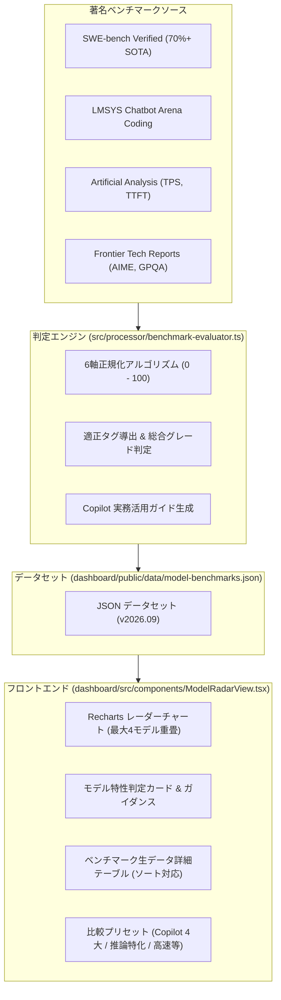

# AIモデル特性レーダー & 著名ベンチマーク評価 仕様書 (10_ai_model_benchmark_radar_spec.md)

## 1. 概要と目的

GitHub Copilot Analytics Dashboard の副機能（サブシステム）として、利用可能な各 AI モデル（Claude 3.7 Sonnet, Claude 3.5 Sonnet, GPT-4o, o1, o3-mini, Gemini 2.0 Flash, Gemini 2.5 Pro, DeepSeek R1 等）の技術的特性・強みを 6 軸レーダーチャートで視覚化し、実務における最適モデルの選定や使い分けを支援する「**AIモデル特性レーダー (AI Model Radar & Benchmark)**」を規定する。

著名な最新ベンチマーク指標（SWE-bench Verified, AIME 2024, LMSYS Chatbot Arena, Artificial Analysis 等）を取り込み、自動的に 0〜100 の正規化スコアおよび特性タグ・推奨ユースケース・利用指針を判定する。

---

## 2. アーキテクチャと配置

### 2.1 ダッシュボード統合方式
- **表示モード (`DashboardAppMode`)**:
  - `'live_metrics'`: API 連携リアルタイムメトリクスモード
  - `'monthly_report'`: CSV 取り込み Monthly Usage Report モード
  - `'model_radar'`: **AIモデル特性レーダー & ベンチマーク評価モード（新設）**
- **ナビゲーション**:
  - ヘッダーバーの `ModeSwitcher` よりワンクリックで切り替え。
  - Live Metrics タブバーの「モデル特性レーダー」ボタン、または「ユーザー別モデル推移 (UserTrendViewer)」の各モデル凡例からもジャンプ可能。

### 2.2 データフロー


---

## 3. レーダーチャート 6 軸評価メトリクス定義

| 軸キー | 軸名 (表示ラベル) | 重み | 参照ベンチマーク | 算出ロジック・意図 |
| :--- | :--- | :--- | :--- | :--- |
| `coding_swe` | Coding & SWE (実務開発力) | 25% | SWE-bench Verified (85%), HumanEval+ (15%) | GitHub Issue を自律解決・PR 作成する実装力。75% を最高基準として正規化。 |
| `reasoning_logic` | Reasoning & Logic (論理推論力) | 25% | AIME 2024 (65%), GPQA Diamond (35%) | 思考チェーン（CoT）による高難度アルゴリズム、数学的推論、エッジケース検証力。 |
| `arena_elo` | Community & Elo (総合・指示追従) | 15% | LMSYS Chatbot Arena (Coding) | 実世界ユーザーによるブラインド勝率レーティング (1220〜1460 を正規化)。 |
| `speed_latency` | Speed & Latency (応答即時性) | 10% | Tokens / sec (TPS), TTFT | 出力トークン生成速度。30〜180+ tps を対数・区分線形スケーリング。 |
| `cost_efficiency` | Cost Efficiency (費用対効果) | 10% | Pricing per 1M tokens (Input/Output) | 入力・出力の合算単価に対する逆数評価。安価なモデルほど高得点。 |
| `architecture_design` | Architecture & Context (設計・長文把握) | 15% | Context Window (128K〜2M), SWE multi-file | 大規模リポジトリの一括把握、複数ファイル跨ぎのリファクタリング適性。 |

---

## 4. 自動判定タグと推奨ユースケース

### 4.1 判定タグ基準
- **`Complex Refactoring`**: `swe_bench_verified >= 62%` または `architecture_design >= 85`
- **`Algorithm Specialist`**: `reasoning_logic >= 85` または `aime_2024 >= 75%`
- **`Fast Inline Suggestion`**: `speed_latency >= 80` または `output_speed_tps >= 100 tps`
- **`Cost Saver`**: `cost_efficiency >= 80`
- **`Ultra-Long Context`**: `context_window_k >= 1000K (1M tokens)`
- **`High-Precision Coding`**: `coding_swe >= 85`
- **`Agent & Multi-Turn`**: `arena_elo >= 85`

### 4.2 主要モデルの判定プロファイル
1. **Claude 3.7 Sonnet (Hybrid Reasoning)**:
   - Grade: **S** (Score: 86)
   - 特性: SWE-bench Verified 70.3% の圧倒的実装力。ハイブリッド思考推論。
   - 推奨: 大規模リファクタリング、複数ファイル改修、Agent モード開発。
2. **OpenAI o1 / o3-mini (Reasoning Specialist)**:
   - Grade: **S / A+** (Score: 86 / 81)
   - 特性: AIME 2024 88.5% の究極推論力。
   - 推奨: 難読バグ特定、アルゴリズム設計、並行・排他制御ロジック検証。
3. **Gemini 2.0 Flash**:
   - Grade: **A+** (Score: 78)
   - 特性: 185 tps の超高速レスポンス、1M コンテキスト、低単価。
   - 推奨: インラインコード補完、大量テスト生成、全社定常利用。
4. **Gemini 2.5 Pro**:
   - Grade: **S** (Score: 87)
   - 特性: 2M 超長文コンテキスト、SWE-bench 66.8% の高精度。
   - 推奨: リポジトリ全体丸ごと読み込みによる設計書からのコード書き起こし。
5. **GPT-4o (Omni)**:
   - Grade: **A** (Score: 75)
   - 特性: 速度・精度の万能バランス。日常的なアプリケーション開発全般。

---

## 5. コマンドライン・運用仕様

- **ベンチマーク更新・再評価**:
  ```bash
  npm run benchmark:update
  ```
  著名ベンチマーク最新値をロードし、評価エンジンにより各モデルのレーダースコア・総合スコア・判定タグを再計算して `dashboard/public/data/model-benchmarks.json` を再生成する。

- **品質ゲート**:
  ```bash
  npm run typecheck && npm test && npm run secret-scan && npm run build
  ```
