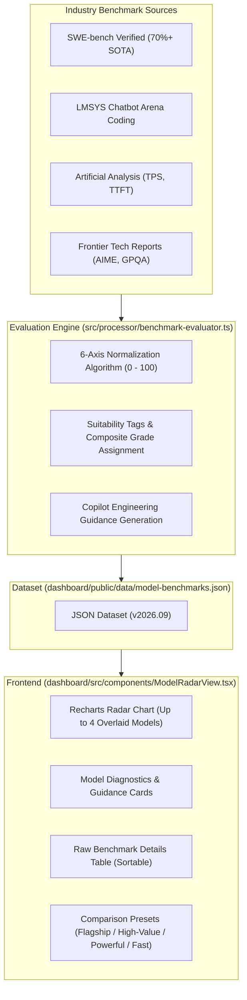
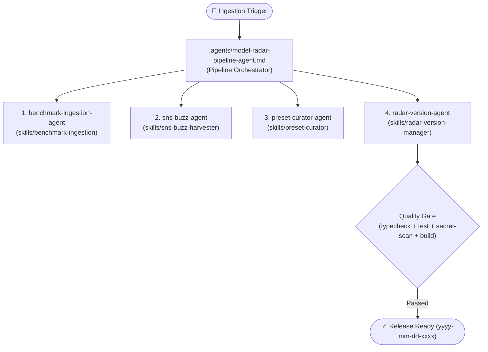

[English](10_ai_model_benchmark_radar_spec.md) | [日本語](10_ai_model_benchmark_radar_spec.ja.md)

---

# SDD-10: AI Model Benchmark Radar Specification

- **Document ID**: SPEC-COPILOT-010
- **Status**: Approved / Active
- **Target Version**: 2026.09-LTS
- **Date**: 2026-09-12

---

## 1. Overview & Objectives

Defines the **AI Model Benchmark Radar (AI Model Radar & Benchmark)** subsystem of the GitHub Copilot Analytics Dashboard. This subsystem visualizes the technical capabilities and characteristics of available AI models across a 6-axis radar chart, assisting teams in selecting optimal models for diverse engineering tasks.

In full compliance with official GitHub Copilot documentation, it comprehensively covers supported models (OpenAI, Anthropic, Google, Microsoft, xAI, Moonshot AI), detailing standard/1M **context windows** and **pricing per 1M tokens (Input / Output / Prompt Caching / Long Context)**. It also persistently provides reference citations to official documentation ([supported-models](https://docs.github.com/en/copilot/reference/ai-models/supported-models) and [models-and-pricing](https://docs.github.com/en/copilot/reference/copilot-billing/models-and-pricing)).

By integrating prominent industry benchmarks (SWE-bench Verified, AIME 2024, LMSYS Chatbot Arena, Artificial Analysis, etc.), the engine normalizes scores on a 0–100 scale, assigning suitability tags, best-practice recommendations, and developer community observations (*with community sentiment disclaimer*).

---

## 2. Architecture & Layout

### 2.1 Dashboard Integration Modes
- **App Modes (`DashboardAppMode`)**:
  - `'live_metrics'`: API live metrics mode
  - `'monthly_report'`: Monthly Usage Report CSV analytics mode
  - `'model_radar'`: **AI Model Benchmark Radar & Evaluation Mode**
  - `'deep_analysis'`: Deep Analytics View mode
- **Navigation**:
  - One-click switching via header `ModeSwitcher`.
  - Contextual jumps from the Live Metrics tab bar and the model legend in `UserTrendViewer`.

### 2.2 Data Flow


### 2.3 Knowledge Model Retention & 0% Share Rendering
- **Persistent Knowledge Retention**:
  Even when analyzed datasets (Live Metrics or Monthly CSV) contain zero requests for a given model, all knowledge-base models remain selectable and visible across model chips, presets, and comparison tables.
- **0% Share for Unused Models**:
  Models with zero internal request volume display an enterprise share of **`0%` (0 req)**, labeled with an "Exploratory / Evaluation Knowledge" badge to guide trial adoption.
- **Identifier Normalization (`normalizeModelId`)**:
  Normalizes label variations (e.g., `Claude 3.7 Sonnet`, `GPT-4o mini`, `o1 (Reasoning)`, `Gemini 2.0 Flash`) to standard knowledge IDs (`claude-3-7-sonnet`, `gpt-4o-mini`, `o1`, `gemini-2-0-flash`).

### 2.4 Quick Navigation in Model Details Card
- **Top-Mounted 2-Tier Full-Width Layout**: Positioned at the very top of the card widget with a dedicated 2-tier row layout: upper tier hosts the label and index counter (`1 / 4`), while the lower tier utilizes the full width of the widget for step navigation buttons (`<` / `>`) and the wide model selector dropdown. This prevents unwanted line wrapping and layout shifting when model names are long.
- **Step Navigation**: `<` and `>` buttons enable swift cycling between selected models (disabled when only 1 model is active).
- **Dropdown Jump**: Clicking the model title reveals a full-width dropdown menu with theme colors, tiers, grades, and an active index counter.

### 2.5 Standard Comparison Presets (`PRESETS`)
Provides instant, pre-configured 3-to-4 model comparisons. Recommended presets enforce an uncompromising quality standard while selecting the top 3 models across the cost-performance spectrum:

#### Use-Case Recommended Presets (Top-Tier Standard with 3-Tier Cost Variation)
- **🔍 Recommended for Code Review (`recommended-code-review`)**:
  - **Rationale**: Strict quality gate (`swe_bench_verified >= 70.0%` and `reasoning_logic >= 95`) to prevent missing subtle PR diff regressions.
  - **Top 3 Models**:
    1. **High-End (Deep Review)**: `Claude Opus 5` (In: $5.0, Out: $25.0 / SWE 81.0, Logic 99)
    2. **Balanced (Production Standard)**: `Claude Sonnet 5` (In: $2.0, Out: $10.0 / SWE 78.5, Logic 99)
    3. **High-Value (Cost-Effective Review)**: `Gemini 3.8 Flash` (In: $0.75, Out: $3.75 / SWE 71.0, Logic 95)
- **📂 Recommended for Codebase Analysis (`recommended-codebase-analysis`)**:
  - **Rationale**: Strict quality gate (`context_window_k >= 1000` 1M tokens, `architecture_design >= 92`, `swe_bench_verified >= 70.0%`) for holistic multi-file understanding.
  - **Top 3 Models**:
    1. **High-End (1M Full-Repo Ingestion)**: `Claude Opus 5` (In: $5.0, Out: $25.0 / 1M ctx, Arch 99, SWE 81.0)
    2. **Balanced (1M Standard Refactor)**: `Claude Sonnet 5` (In: $2.0, Out: $10.0 / 1M ctx, Arch 99, SWE 78.5)
    3. **High-Value (1M High-Volume Low-Cost)**: `Gemini 3.8 Flash` (In: $0.75, Out: $3.75 / 1M ctx, Arch 93, SWE 71.0)
- **🏛️ Recommended for Architecture & Design (`recommended-architecture`)**:
  - **Rationale**: Strict quality gate (`reasoning_logic >= 95`, `architecture_design >= 90`, `swe_bench_verified >= 70.0%`) for complex trade-off analysis and domain modeling.
  - **Top 3 Models**:
    1. **High-End (Extreme Frontier Reasoning)**: `GPT-6 Astra` (In: $10.0, Out: $50.0 / Logic 99, Arch 96, SWE 82.4)
    2. **Balanced (Modular Architecture)**: `Claude Sonnet 5` (In: $2.0, Out: $10.0 / Logic 99, Arch 99, SWE 78.5)
    3. **High-Value (Fast Brainstorming & Trade-offs)**: `Gemini 3.8 Flash` (In: $0.75, Out: $3.75 / Logic 95, Arch 93, SWE 71.0)

#### Category & Vendor Presets
- **🌟 2026 Flagship 4 (`flagship-2026`)**: Claude Opus 5 / GPT-6 Astra / Gemini 3.8 Flash / Kimi K3
- **💡 Practical High-Value (`practical-high-value`)**: Claude Sonnet 5 / Gemini 3.8 Flash / GPT-5.6 Luna / Kimi K2.7 Code
- **⚡ Powerful Reasoning (`tier-powerful`)**: GPT-6 Astra / Claude Opus 5 / GPT-5.6 Sol / Kimi K3
- **🛠️ Versatile Engineering (`tier-versatile`)**: Claude Sonnet 5 / GPT-5.6 Terra / Gemini 3.8 Flash / Grok 4.6
- **🚀 Lightweight & Fast (`tier-lightweight`)**: GPT-5.6 Luna / Gemini 3.5 Flash / MAI-Code-1.1-Flash / GPT-5.4 mini
- **🟠 Anthropic Suite (`vendor-anthropic`)**: Claude Sonnet 5 / Claude Opus 5 / Claude Fable 5.1 / Claude Haiku 4.5
- **🟢 OpenAI Suite (`vendor-openai`)**: GPT-6 Astra / GPT-5.6 Sol / GPT-5.6 Terra / GPT-5.6 Luna
- **🔵 Google Gemini 3.x (`vendor-google`)**: Gemini 3.8 Flash / Gemini 3.7 Flash / Gemini 3.6 Flash / Gemini 3.5 Flash

### 2.6 Radar Chart Line Representation & Active Model Visual Hierarchy
- **Active (Focused) Model Emphasis**:
  - The currently active/focused model is rendered with a **Bold solid stroke (`strokeWidth: 3.5`, `strokeDasharray: undefined`)** to establish immediate visual prominence.
  - An active indicator badge is also provided in the chart header and legend.
- **Comparison Models Dashed Stroke & Legibility Preservation**:
  - Secondary comparison models are rendered with a **dashed stroke (`strokeDasharray: "8 3"`, `strokeWidth: 1.75`)**.
  - By maintaining a high line-to-gap ratio (~73% dash, 27% gap), polygon boundaries and radar vertices remain clearly legible while clearly denoting secondary status.
- **Smart Legend Indicator (Color Block + Line State)**:
  - The chart legend retains the model's signature colored swatch, immediately followed by an inline miniature **solid or dashed line indicator** for seamless visual reference.
- **Bi-directional Focus Synchronization with Detail Card**:
  - Clicking any model entry in the chart legend (or its polygon in the radar chart) immediately synchronizes the active focus state, updating the right-hand "Model Diagnostics & Guidance" detail card in lockstep.

### 2.7 Left-Frame Model Selector & 3-Mode Display State Specification
- **Left-Frame Placement & Viewport Tracking (`sticky`)**:
  - The model selector is repositioned from inside the top overview card to a dedicated left-hand sidebar frame (`ModelSelectorSidebar`).
  - Anchored with `sticky top-20` and internal scrollability (`max-h-[calc(100vh-5.5rem)] overflow-y-auto`), allowing engineers to view and interact with all analysis widgets (radar chart, detail card, benchmark table, background stories) while dynamically toggling model comparisons without having to scroll back to the top.
- **3-Mode Display State Switching (`sidebarMode`)**:
  - **Expanded (`expanded`) [Default]**: Standard width (~320px) featuring full model names, model color swatches, Copilot badges, organization usage percentage, vendor/tier grouping toggles, and filters.
  - **Compact (`compact`)**: Narrow width (~210-220px) displaying model abbreviations preserving model family and version numbers without omission (e.g., `gpt-5.6-luna`, `gpt-6-astra`, `gpt-o1`, `gpt-o3-mini`, `opus-5`, `opus-4.8`, `sonnet-4.6`, `gemini-3.8-flash`) generated via `getModelShortName`, with rich tooltips on hover showing full model identity, grade, tier, and internal usage share.
  - **Collapsed (`collapsed`)**: Frame collapsed with a permanent floating/sticky reopen button (`[▶ Model Selector (X)]`) on the left edge to reclaim 100% horizontal real estate for widgets.
- **State Persistence**:
  - The active mode (`expanded`, `compact`, or `collapsed`) is persisted across sessions in `localStorage` under `copilot_radar_sidebar_mode`.
- **Selection State & Batch Operations**:
  - **Default Initial Selection**: Defaults to the Top 3 models by actual organizational usage requests (`requests > 0`) in descending order via `getTopUsageModelIds`.
  - **Empty Data Handling**: If no usage data exists or all model requests are 0, initializes with empty selection (`selectedModelIds = []`) and renders a helpful guidance overlay in the radar chart with a button to select Copilot native models.
  - **Full Clear**: Clicking "クリア" completely empties the selection (`selectedModelIds = []`).
  - **Vendor / Tier Batch Selection**: "全選択 / 全解除" buttons under each Vendor and Tier heading toggle between selecting all and deselecting all models in that group cleanly (`onBatchSelectModels`).

---

## 3. Radar Chart 6-Axis Evaluation Metrics

| Metric Key | Display Label | Weight | Reference Benchmarks | Logic & Rationale |
| :--- | :--- | :--- | :--- | :--- |
| `coding_swe` | Coding & SWE | 25% | SWE-bench Verified (85%), HumanEval+ (15%) | Autonomous issue resolution and PR creation; normalized against 75% peak. |
| `reasoning_logic` | Reasoning & Logic | 25% | AIME 2024 (65%), GPQA Diamond (35%) | Chain-of-thought mathematical rigor, complex algorithmic reasoning, edge-case coverage. |
| `arena_elo` | Community & Elo | 15% | LMSYS Chatbot Arena (Coding) | Blind user preference rating (normalized between 1220 and 1460). |
| `speed_latency` | Speed & Latency | 10% | Tokens / sec (TPS), TTFT | Output generation velocity (30 to 180+ TPS piecewise log scaling). |
| `cost_efficiency` | Cost Efficiency | 10% | Pricing per 1M tokens (In/Out) | Inverse evaluation of blended token rates; lower cost yields higher scores. |
| `architecture_design` | Architecture & Context | 15% | Context Window (128K–2M), SWE multi-file | Repository-wide codebase comprehension and multi-file refactoring aptitude. |

---

## 4. Suitability Tags & Model Roster (2026 LTS)

### 4.1 Suitability Tag Criteria
- **`Complex Refactoring`**: `swe_bench_verified >= 62%` or `architecture_design >= 85`
- **`Algorithm Specialist`**: `reasoning_logic >= 85` or `aime_2024 >= 75%`
- **`Fast Inline Suggestion`**: `speed_latency >= 80` or `output_speed_tps >= 100 tps`
- **`Cost Saver`**: `cost_efficiency >= 80`
- **`Ultra-Long Context`**: `context_window_k >= 1000K (1M tokens)`
- **`High-Precision Coding`**: `coding_swe >= 85`
- **`Agent & Multi-Turn`**: `arena_elo >= 85`

### 4.2 GitHub Copilot Supported Models Roster (September 2026)

#### 1. OpenAI (10 Models)
| Model ID | Name | Tier | Status | Context | In / 1M | Out / 1M | Cache Read | Highlights |
| :--- | :--- | :--- | :--- | :--- | :--- | :--- | :--- | :--- |
| `gpt-6-astra` | GPT-6 Astra | Powerful | GA | 272K (1M) | $10.00 | $50.00 | $2.50 | 2026 premier deep-reasoning flagship |
| `gpt-5-6-sol` | GPT-5.6 Sol | Powerful | GA | 272K | $4.00 | $20.00 | $1.00 | GPT-5.6 workhorse for complex tasks |
| `gpt-5-6-terra` | GPT-5.6 Terra | Versatile | GA | 128K | $2.00 | $12.00 | $0.50 | High-speed versatile generalist |
| `gpt-5-6-luna` | GPT-5.6 Luna | Lightweight | GA | 128K | $0.20 | $1.20 | $0.05 | Ultra-fast low-cost inline completions |
| `gpt-5-5` | GPT-5.5 | Powerful | GA | 200K | $5.00 | $30.00 | $1.25 | Frontier reasoning model |
| `gpt-5-4` | GPT-5.4 | Versatile | GA | 128K | $2.50 | $15.00 | $0.62 | Balanced engineering model |
| `gpt-5-4-mini` | GPT-5.4 mini | Versatile | GA | 128K | $0.75 | $4.50 | $0.18 | High speed and value |
| `gpt-5-4-nano` | GPT-5.4 nano | Lightweight | GA | 128K | $0.20 | $1.25 | $0.05 | Ultra-lightweight inline assistant |
| `gpt-5-3-codex` | GPT-5.3-Codex | Versatile | LTS | 128K | $1.75 | $14.00 | $0.43 | Long-term support code specialist |
| `gpt-5-mini` | GPT-5 mini | Lightweight | GA | 128K | $0.25 | $2.00 | $0.06 | Established fast completion model |

#### 2. Anthropic (10 Models)
| Model ID | Name | Tier | Status | Context | In / 1M | Out / 1M | Cache Read/Write | Highlights |
| :--- | :--- | :--- | :--- | :--- | :--- | :--- | :--- | :--- |
| `claude-sonnet-5` | Claude Sonnet 5 | Powerful | GA | 200K (1M) | $2.00 | $10.00 | $0.20 / $2.50 | The standard flagship enterprise driver |
| `claude-opus-5` | Claude Opus 5 | Powerful | GA | 200K (1M) | $5.00 | $25.00 | $0.50 / $6.25 | Deep architectural design & reasoning |
| `claude-fable-5-1` | Claude Fable 5.1 | Powerful | GA | 200K (1M) | $10.00 | $50.00 | $1.00 / $12.50 | EFS/ZDR enterprise security tier |
| `claude-fable-5` | Claude Fable 5 | Powerful | GA | 200K (1M) | $10.00 | $50.00 | $1.00 / $12.50 | Enterprise high-assurance reasoning |
| `claude-opus-4-8` | Claude Opus 4.8 | Powerful | GA | 200K | $5.00 | $25.00 | $0.50 / $6.25 | Deep analytical reasoning |
| `claude-opus-4-8-fast` | Claude Opus 4.8 Fast | Powerful | GA | 200K | $10.00 | $50.00 | $1.00 / $12.50 | Fast-mode Opus |
| `claude-opus-4-7` | Claude Opus 4.7 | Powerful | GA | 200K | $5.00 | $25.00 | $0.50 / $6.25 | Advanced reasoning |
| `claude-sonnet-4-6` | Claude Sonnet 4.6 | Versatile | GA | 200K | $3.00 | $15.00 | $0.30 / $3.75 | Versatile balanced coding |
| `claude-sonnet-4` | Claude Sonnet 4 | Versatile | GA | 200K | $3.00 | $15.00 | $0.30 / $3.75 | Reliable code completion |
| `claude-haiku-4-5` | Claude Haiku 4.5 | Lightweight | GA | 200K | $1.00 | $5.00 | $0.10 / $1.25 | Ultra-lightweight and responsive |

#### 3. Google (4 Models)
| Model ID | Name | Tier | Status | Context | In / 1M | Out / 1M | Highlights |
| :--- | :--- | :--- | :--- | :--- | :--- | :--- | :--- |
| `gemini-3-8-flash` | Gemini 3.8 Flash | Versatile | GA | 1M Tok | $0.75 | $3.75 | Latest Flash (promotional rate) / 1M tokens |
| `gemini-3-7-flash` | Gemini 3.7 Flash | Versatile | GA | 1M Tok | $0.75 | $3.75 | CoT reasoning & high-velocity coding |
| `gemini-3-6-flash` | Gemini 3.6 Flash | Versatile | GA | 1M Tok | $0.75 | $3.75 | 1M long-context generalist |
| `gemini-3-5-flash` | Gemini 3.5 Flash | Versatile | GA | 1M Tok | $1.50 | $9.00 | Proven Flash workhorse |

#### 4. Microsoft / xAI / Moonshot AI (5 Models)
| Model ID | Name | Provider | Tier | Status | Context | In / Out / 1M | Highlights |
| :--- | :--- | :--- | :--- | :--- | :--- | :--- | :--- |
| `mai-code-1-1-flash` | MAI-Code-1.1-Flash | Microsoft | Lightweight | GA | 128K | $0.20 / $1.20 | Microsoft ultra-fast code specialist |
| `grok-4-6` | Grok 4.6 | xAI | Versatile | GA | 200K | $2.00 / $6.00 | High-accuracy practical coding |
| `grok-4-5` | Grok 4.5 | xAI | Versatile | GA | 200K | $2.00 / $6.00 | Versatile code completion |
| `kimi-k3` | Kimi K3 | Moonshot AI | Powerful | GA | 1M | $3.00 / $15.00 | 1M long-context reasoning |
| `kimi-k2-7-code` | Kimi K2.7 Code | Moonshot AI | Versatile | GA | 256K | $0.95 / $4.00 | 256K code specialist, high value |

#### 5. Classic & External Comparison Reference Models
Claude 3.7 Sonnet, Claude 3.5 Sonnet, GPT-4o, GPT-4o mini, o1, o3-mini, Gemini 2.0 Flash, Gemini 2.5 Pro, DeepSeek R1.

### 4.3 Official Citations
- 📘 **Supported AI Models in Copilot**: `https://docs.github.com/en/copilot/reference/ai-models/supported-models`
- 💳 **Copilot Models & Pricing**: `https://docs.github.com/en/copilot/reference/copilot-billing/models-and-pricing`

---

## 5. Benchmark Source Explanations & Community Observations

### 5.1 Source Descriptions
1. **SWE-bench Verified Leaderboard**: Real-world open-source issues (Django, SymPy); measures autonomous patch generation.
2. **LMSYS Chatbot Arena (Coding)**: Blind head-to-head evaluation by real developers; reflects human programmer satisfaction.
3. **Artificial Analysis**: Measured tokens-per-second (TPS), time-to-first-token (TTFT), and true blended pricing.
4. **Frontier Technical Reports (AIME / GPQA / HumanEval+)**: Complex Olympiad-level mathematics and scientific reasoning.

### 5.2 Community Observations Disclaimer
All community observations, tips, and quirks featured in model detail cards must prominently display a disclaimer badge: `* Community Sentiment & Developer Rumor`.

---

## 6. Individual Page Versioning Specification (`yyyy-mm-dd-0001`)

The AI Model Radar dataset and UI display feature individual page version tracking with calendar dates and incremental sequence numbers for the same day.

### 6.1 Format Standard
$$\text{Version} = \text{yyyy-mm-dd-xxxx}$$
- `yyyy-mm-dd`: Calendar date of generation (e.g., `2026-09-13`).
- `xxxx`: 4-digit zero-padded incremental sequence (`0001`, `0002`, `0003`...).
- Re-running `npm run benchmark:update` on the same date increments the sequence (`+1`).
- Running on a subsequent date resets the sequence to `0001`.

### 6.2 UI Presentation
- Displayed prominently beside the page title as `v2026-09-13-0001`.
- Tooltip hover provides clear context: "個別バージョン (日付・連番管理): {version}".

---

## 7. Update Pipeline Architecture (Agents & Skills Separation)

The update lifecycle is structured into a primary orchestrator agent and specialized sub-task agents/skills:



### 7.1 Agents & Skills Division
1. **Pipeline Orchestrator (`.agents/model-radar-pipeline-agent.md`)**:
   - Master conductor orchestrating the end-to-end update lifecycle.
2. **Benchmark Ingestion (`.agents/benchmark-ingestion-agent.md` / `skills/benchmark-ingestion`)**:
   - Updates official pricing, context window sizes, and benchmark results.
3. **SNS Buzz Harvester (`.agents/sns-buzz-agent.md` / `skills/sns-buzz-harvester`)**:
   - Collects and distills authentic developer sentiment with explicit disclaimer notes.
4. **Preset Curator (`.agents/preset-curator-agent.md` / `skills/preset-curator`)**:
   - Filters candidate models against uncompromising quality gates and extracts 3-tier cost variations.
5. **Version Manager (`.agents/radar-version-agent.md` / `skills/radar-version-manager`)**:
   - Manages `yyyy-mm-dd-0001` incremental versioning and executes four-layer quality gate checks.

---

## 8. CLI Commands & Verification

- **Update Benchmarks & Increment Version**:
  ```bash
  npm run benchmark:update
  ```
- **Full Quality Gate**:
  ```bash
  npm run typecheck && npm test && npm run secret-scan && npm run build
  ```
