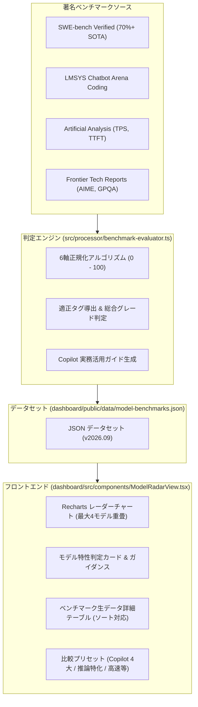

# AIモデル特性レーダー & 著名ベンチマーク評価 仕様書 (10_ai_model_benchmark_radar_spec.md)

## 1. 概要と目的

GitHub Copilot Analytics Dashboard の副機能（サブシステム）として、利用可能な各 AI モデル（Claude 3.7 Sonnet, Claude 3.5 Sonnet, GPT-4o, o1, o3-mini, Gemini 2.0 Flash, Gemini 2.5 Pro, DeepSeek R1 等）の技術的特性・強みを 6 軸レーダーチャートで視覚化し、実務における最適モデルの選定や使い分けを支援する「**AIモデル特性レーダー (AI Model Radar & Benchmark)**」を規定する。

著名な最新ベンチマーク指標（SWE-bench Verified, AIME 2024, LMSYS Chatbot Arena, Artificial Analysis 等）を取り込み、自動的に 0〜100 の正規化スコアおよび特性タグ・推奨ユースケース・利用指針を判定する。

---

## 2. アーキテクチャと配置

### 2.1 ダッシュボード統合方式
- **表示モード (`DashboardAppMode`)**:
  - `'live_metrics'`: API 連携リアルタイムメトリクスモード
  - `'monthly_report'`: CSV 取り込み Monthly Usage Report モード
  - `'model_radar'`: **AIモデル特性レーダー & ベンチマーク評価モード（新設）**
- **ナビゲーション**:
  - ヘッダーバーの `ModeSwitcher` よりワンクリックで切り替え。
  - Live Metrics タブバーの「モデル特性レーダー」ボタン、または「ユーザー別モデル推移 (UserTrendViewer)」の各モデル凡例からもジャンプ可能。

### 2.2 データフロー


---

## 3. レーダーチャート 6 軸評価メトリクス定義

| 軸キー | 軸名 (表示ラベル) | 重み | 参照ベンチマーク | 算出ロジック・意図 |
| :--- | :--- | :--- | :--- | :--- |
| `coding_swe` | Coding & SWE (実務開発力) | 25% | SWE-bench Verified (85%), HumanEval+ (15%) | GitHub Issue を自律解決・PR 作成する実装力。75% を最高基準として正規化。 |
| `reasoning_logic` | Reasoning & Logic (論理推論力) | 25% | AIME 2024 (65%), GPQA Diamond (35%) | 思考チェーン（CoT）による高難度アルゴリズム、数学的推論、エッジケース検証力。 |
| `arena_elo` | Community & Elo (総合・指示追従) | 15% | LMSYS Chatbot Arena (Coding) | 実世界ユーザーによるブラインド勝率レーティング (1220〜1460 を正規化)。 |
| `speed_latency` | Speed & Latency (応答即時性) | 10% | Tokens / sec (TPS), TTFT | 出力トークン生成速度。30〜180+ tps を対数・区分線形スケーリング。 |
| `cost_efficiency` | Cost Efficiency (費用対効果) | 10% | Pricing per 1M tokens (Input/Output) | 入力・出力の合算単価に対する逆数評価。安価なモデルほど高得点。 |
| `architecture_design` | Architecture & Context (設計・長文把握) | 15% | Context Window (128K〜2M), SWE multi-file | 大規模リポジトリの一括把握、複数ファイル跨ぎのリファクタリング適性。 |

---

## 4. 自動判定タグと推奨ユースケース

### 4.1 判定タグ基準
- **`Complex Refactoring`**: `swe_bench_verified >= 62%` または `architecture_design >= 85`
- **`Algorithm Specialist`**: `reasoning_logic >= 85` または `aime_2024 >= 75%`
- **`Fast Inline Suggestion`**: `speed_latency >= 80` または `output_speed_tps >= 100 tps`
- **`Cost Saver`**: `cost_efficiency >= 80`
- **`Ultra-Long Context`**: `context_window_k >= 1000K (1M tokens)`
- **`High-Precision Coding`**: `coding_swe >= 85`
- **`Agent & Multi-Turn`**: `arena_elo >= 85`

### 4.2 GitHub Copilot 提供全AIモデルの判定プロファイル
1. **Claude 3.7 Sonnet (Hybrid Reasoning)**:
   - Grade: **S** (Score: 86)
   - 特性: SWE-bench Verified 70.3% の圧倒的実装力。ハイブリッド思考推論。
   - 推奨: 大規模リファクタリング、複数ファイル改修、Agent モード開発。
2. **Claude 3.5 Sonnet**:
   - Grade: **A+** (Score: 80)
   - 特性: 安定した高品質コード補完と高い指示追従性。
   - 推奨: 日常的なコーディング、PR レビュー、堅実なアーキテクチャ設計。
3. **OpenAI o1 (Full Reasoning)**:
   - Grade: **A+** (Score: 81)
   - 特性: AIME 2024 88.5%, GPQA 75.8% の究極推論力。
   - 推奨: 難読バグ特定、並行・排他制御ロジック検証、複雑なアルゴリズム考案。
4. **OpenAI o3-mini (Reasoning High)**:
   - Grade: **S** (Score: 86)
   - 特性: 高速レスポンス (78 tps) と強烈な数学・推論力を両立したコスパ最強推論モデル。
   - 推奨: 日常開発での思考チェーン相談、難関例外・テストの自動設計。
5. **GPT-4o (Omni)**:
   - Grade: **A** (Score: 75)
   - 特性: 速度・精度の万能バランス。
   - 推奨: アプリケーション開発全般、README/仕様書作成、一般的な質疑応答。
6. **GPT-4o mini**:
   - Grade: **B+** (Score: 68)
   - 特性: 超低コスト ($0.15/$0.60 per 1M) & 145 tps の超高速レスポンス。
   - 推奨: インライン提案、定型コード補正、軽量テストケース量産。
7. **Gemini 2.0 Flash**:
   - Grade: **A+** (Score: 78)
   - 特性: 185 tps の爆速レスポンス、1M コンテキスト、極めて高いコスト効率。
   - 推奨: 高速インラインコード補完、大量テスト生成、全社定常利用。
8. **Gemini 2.5 Pro (Ultra-Context)**:
   - Grade: **S** (Score: 87)
   - 特性: 2M 超長文コンテキスト、SWE-bench 66.8% の高精度。
   - 推奨: リポジトリ丸ごと読み込みによる設計書からのコード書き起こし、大規模マイグレーション。
9. **DeepSeek R1 (Open Reasoning / 外部対照)**:
   - Grade: **S** (Score: 84)
   - 特性: オープンウェイト最高峰の数学・論理推論力（比較対照用）。

---

## 5. 出典メタデータとお題・現場での見え方・エンジニアの声 (※ SNSの噂)

### 5.1 著名ベンチマーク出典の多面解説 (`BenchmarkSourceMeta`)
各ベンチマークの数値だけでなく、「何を出題しているのか」「現場でどう見えるのか」「エンジニア間で何が語られているのか」をカード形式で可視化する。

1. **SWE-bench Verified Leaderboard**:
   - **出題お題 (`target_problem`)**: 実世界オープンソース（Django, SymPy等）のリアルな Issue/PR。コードベース探索からテスト合格パッチ自律生成までを判定。
   - **現場での見え方 (`performance_view`)**: 「自律型エージェントとしての実務即戦力度」に直結。部分点なしの厳格採点。
   - **現場の声 (`community_rumor`)**: ※ SNSの噂: プロンプトチューニング疑惑や日本語指示でのニュアンス汲み取り課題、Verified 化による悪問排除などの評判。
2. **LMSYS Chatbot Arena (Coding)**:
   - **出題お題 (`target_problem`)**: 世界中のエンジニアが直面した実践プログラミング課題に対する2モデルのブラインド比較投票。
   - **現場での見え方 (`performance_view`)**: 人間プログラマーが読んだときの納得感・コードの綺麗さ・モダンな記法・説明のわかりやすさ等の主観的満足度。
   - **現場の声 (`community_rumor`)**: ※ SNSの噂: 回答が長く見た目がリッチなモデルへの投票バイアス、1行修正派とチュートリアル派の乖離など。
3. **Artificial Analysis**:
   - **出題お題 (`target_problem`)**: 各APIエンドポイントの出力速度 (TPS)、初回トークン遅延 (TTFT)、100万トークン単価の実測。
   - **現場での見え方 (`performance_view`)**: 思考を止めない即時性（DX）とAPI運用コストの現実的バランス。
   - **現場の声 (`community_rumor`)**: ※ SNSの噂: 公式発表速度と実測値のギャップ検証、推論モデルの待ち時間体感、Flash系の病みつき速度。
4. **Frontier AI Technical Reports (AIME / GPQA / HumanEval+)**:
   - **出題お題 (`target_problem`)**: 全米数学招待試験 (AIME)、大学院レベル科学多肢選択 (GPQA)、基本関数実装 (HumanEval+)。
   - **現場での見え方 (`performance_view`)**: 並行処理デッドロックや高度な型パズル等の極限難問における思考チェーンの到達点。
   - **現場の声 (`community_rumor`)**: ※ SNSの噂: 事前学習へのデータ漏洩（リーク）議論、AIME 90%超モデルが初歩的CSSで躓くギャップなど。

### 5.2 リアルなエンジニアの声・現場の評判 (`EngineerBuzz`)
モデル詳細カードに「エンジニアの生の声・コミュニティの噂」コンポーネントを統合。
- **キャッチコピー (`headline`)**: 現場での通り名・総括（例: 「リファクタリングの神。ただしThinking全開時はトークン消費と回答長に注意」）
- **ポジティブな実感 (`community_sentiments`)**: 複数ファイル改修精度、型解決力、テスト自己修正力など現場の共感ポイント。
- **囁かれる注意点・ボヤキ (`caution_rumor`)**: クォータ消費の早さ、思考待ち時間、非推奨APIのハルシネーションなど。
- **注釈表記の義務 (`source_note`)**: 必ず「`※ SNS上のエンジニアの声・コミュニティの噂・所感`」または「`※ SNSの噂`」の注釈バッジを明示する。

---

## 6. コマンドライン・運用仕様

- **ベンチマーク更新・再評価**:
  ```bash
  npm run benchmark:update
  ```
  著名ベンチマーク最新値をロードし、評価エンジンにより各モデルのレーダースコア・総合スコア・判定タグ・エンジニアの声（※ SNSの噂）を再計算して `dashboard/public/data/model-benchmarks.json` を再生成する。

- **品質ゲート**:
  ```bash
  npm run typecheck && npm test && npm run secret-scan && npm run build
  ```
