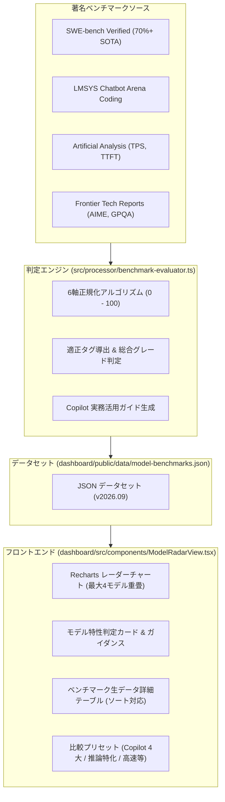

# AIモデル特性レーダー & 著名ベンチマーク評価 仕様書 (10_ai_model_benchmark_radar_spec.md)

## 1. 概要と目的

GitHub Copilot Analytics Dashboard の副機能（サブシステム）として、利用可能な各 AI モデルの技術的特性・強みを 6 軸レーダーチャートで視覚化し、実務における最適モデルの選定や使い分けを支援する「**AIモデル特性レーダー (AI Model Radar & Benchmark)**」を規定する。

GitHub Copilot 公式ドキュメントに準拠し、公式サポートモデル（OpenAI, Anthropic, Google, Microsoft, xAI, Moonshot AI）を完全網羅するとともに、各モデルの **コンテキスト長（通常窓・1M対応）** および **コスト単価（Input / Output / Prompt Caching / Long Context 単価）** を掲載する。さらに公式ドキュメント（[supported-models](https://docs.github.com/ja/copilot/reference/ai-models/supported-models) および [models-and-pricing](https://docs.github.com/ja/copilot/reference/copilot-billing/models-and-pricing)）への引用リンクを参考情報として常時掲載する。

著名な最新ベンチマーク指標（SWE-bench Verified, AIME 2024, LMSYS Chatbot Arena, Artificial Analysis 等）を取り込み、自動的に 0〜100 の正規化スコアおよび特性タグ・推奨ユースケース・利用指針・リアルなエンジニアの声（※ SNSの噂注釈付き）を判定・提示する。

---

## 2. アーキテクチャと配置

### 2.1 ダッシュボード統合方式
- **表示モード (`DashboardAppMode`)**:
  - `'live_metrics'`: API 連携リアルタイムメトリクスモード
  - `'monthly_report'`: CSV 取り込み Monthly Usage Report モード
  - `'model_radar'`: **AIモデル特性レーダー & ベンチマーク評価モード（新設）**
- **ナビゲーション**:
  - ヘッダーバーの `ModeSwitcher` よりワンクリックで切り替え。
  - Live Metrics タブバーの「モデル特性レーダー」ボタン、または「ユーザー別モデル推移 (UserTrendViewer)」の各モデル凡例からもジャンプ可能。

### 2.2 データフロー


### 2.3 保持ナレッジモデル全件選択・未利用モデル0%表示仕様
- **ナレッジモデル一覧の永続保持**:
  - 分析対象データ（Live Metrics や Monthly Usage Report CSV）内に特定の AI モデルの利用実績が存在しない場合であっても、システムがナレッジとして保持する全モデル（Copilot 公式提供モデル＋比較対照モデル）は **一切除外されることなく、モデル選択チップス・プリセット・詳細比較テーブルのすべてで常時選択・表示可能** とする。
- **未利用モデルの 0% 表示**:
  - 分析対象データ内に利用リクエストがないモデルは、社内利用シェアを **`0%`（0 req）** として表示する。
  - フォーカス中モデル詳細カードにおいて「社内利用なし (0%) / 導入・切替検討ナレッジ」のステータスバッジおよびガイダンスを提示し、組織内での採用検討やモデル切り替えのためのベンチマーク・特性評価ナレッジとして参照可能とする。
- **名寄せ正規化 (`normalizeModelId`)**:
  - ログやCSVデータ上の表記揺れ（例: `Claude 3.7 Sonnet`, `GPT-4o mini`, `o1 (推論)`, `Gemini 2.0 Flash` 等）を共通のナレッジモデルID（`claude-3-7-sonnet`, `gpt-4o-mini`, `o1`, `gemini-2-0-flash` 等）へ堅牢にマッピングする。

### 2.4 モデル詳細カードのクイック切り替えナビゲーション仕様
- **最上部配置**:
  - 「詳細カード切り替え:」セレクタは、詳細カードウィジェットの最下部ではなく、カード最上部（モデル名・総合グレードヘッダーの直上）に配置する。
- **左右移動ナビゲーション**:
  - 複数モデルが選択されている場合、前後のモデルへ手軽にステップ移動できる左右ボタン（`<` / `>`）を提供する。
  - 単一モデル選択時は無効化（disabled）され、不要な誤操作を防止する。
- **モデル名プルダウン選択**:
  - モデル名表示部をクリックすることで、現在選択中のモデル一覧をドロップダウン（プルダウン）で展開し、任意のモデルへワンクリックでジャンプ可能とする。
  - プルダウン内には各モデルのテーマカラー・モデル名・Tier・総合グレードおよび現在選択中のチェックマークを表示する。
  - 現在位置が視覚的に把握できるようインデックスカウンター（例: `1 / 4`）を併記する。

---

## 3. レーダーチャート 6 軸評価メトリクス定義

| 軸キー | 軸名 (表示ラベル) | 重み | 参照ベンチマーク | 算出ロジック・意図 |
| :--- | :--- | :--- | :--- | :--- |
| `coding_swe` | Coding & SWE (実務開発力) | 25% | SWE-bench Verified (85%), HumanEval+ (15%) | GitHub Issue を自律解決・PR 作成する実装力。75% を最高基準として正規化。 |
| `reasoning_logic` | Reasoning & Logic (論理推論力) | 25% | AIME 2024 (65%), GPQA Diamond (35%) | 思考チェーン（CoT）による高難度アルゴリズム、数学的推論、エッジケース検証力。 |
| `arena_elo` | Community & Elo (総合・指示追従) | 15% | LMSYS Chatbot Arena (Coding) | 実世界ユーザーによるブラインド勝率レーティング (1220〜1460 を正規化)。 |
| `speed_latency` | Speed & Latency (応答即時性) | 10% | Tokens / sec (TPS), TTFT | 出力トークン生成速度。30〜180+ tps を対数・区分線形スケーリング。 |
| `cost_efficiency` | Cost Efficiency (費用対効果) | 10% | Pricing per 1M tokens (Input/Output) | 入力・出力の合算単価に対する逆数評価。安価なモデルほど高得点。 |
| `architecture_design` | Architecture & Context (設計・長文把握) | 15% | Context Window (128K〜2M), SWE multi-file | 大規模リポジトリの一括把握、複数ファイル跨ぎのリファクタリング適性。 |

---

## 4. 自動判定タグと推奨ユースケース

### 4.1 判定タグ基準
- **`Complex Refactoring`**: `swe_bench_verified >= 62%` または `architecture_design >= 85`
- **`Algorithm Specialist`**: `reasoning_logic >= 85` または `aime_2024 >= 75%`
- **`Fast Inline Suggestion`**: `speed_latency >= 80` または `output_speed_tps >= 100 tps`
- **`Cost Saver`**: `cost_efficiency >= 80`
- **`Ultra-Long Context`**: `context_window_k >= 1000K (1M tokens)`
- **`High-Precision Coding`**: `coding_swe >= 85`
- **`Agent & Multi-Turn`**: `arena_elo >= 85`

### 4.2 GitHub Copilot 公式サポートモデル体系 (2026年最新)

GitHub Copilot 公式ドキュメント（[Supported models](https://docs.github.com/ja/copilot/reference/ai-models/supported-models) および [Models and pricing](https://docs.github.com/ja/copilot/reference/copilot-billing/models-and-pricing)）に準拠した全モデル（27モデル＋クラシック/外部対照）の仕様・単価体系を網羅。

#### 1. OpenAI (10モデル)
| モデルID | モデル名 | Tier | Status | Context | In単価 (/1M) | Out単価 (/1M) | キャッシュ単価 | 備考 |
| :--- | :--- | :--- | :--- | :--- | :--- | :--- | :--- | :--- |
| `gpt-6-astra` | GPT-6 Astra | Powerful | GA | 272K (1M) | $10.00 | $50.00 | $2.50 | 2026最上位推論・極限思考フラッグシップ |
| `gpt-5-6-sol` | GPT-5.6 Sol | Powerful | GA | 272K | $4.00 | $20.00 | $1.00 | GPT-5.6世代のPowerful主力 |
| `gpt-5-6-terra` | GPT-5.6 Terra | Versatile | GA | 128K | $2.00 | $12.00 | $0.50 | 高速万能モデル |
| `gpt-5-6-luna` | GPT-5.6 Luna | Lightweight | GA | 128K | $0.20 | $1.20 | $0.05 | 超高速インライン補完・低コスト |
| `gpt-5-5` | GPT-5.5 | Powerful | GA | 200K | $5.00 | $30.00 | $1.25 | フロンティア推論モデル |
| `gpt-5-4` | GPT-5.4 | Versatile | GA | 128K | $2.50 | $15.00 | $0.62 | バランスモデル |
| `gpt-5-4-mini` | GPT-5.4 mini | Versatile | GA | 128K | $0.75 | $4.50 | $0.18 | 高速・高コスパ |
| `gpt-5-4-nano` | GPT-5.4 nano | Lightweight | GA | 128K | $0.20 | $1.25 | $0.05 | 超軽量インライン |
| `gpt-5-3-codex` | GPT-5.3-Codex | Versatile | LTS | 128K | $1.75 | $14.00 | $0.43 | LTS長期安定提供コード特化 |
| `gpt-5-mini` | GPT-5 mini | Lightweight | GA | 128K | $0.25 | $2.00 | $0.06 | 定番高速モデル |

#### 2. Anthropic (10モデル)
| モデルID | モデル名 | Tier | Status | Context | In単価 (/1M) | Out単価 (/1M) | キャッシュ読取/書込 | 備考 |
| :--- | :--- | :--- | :--- | :--- | :--- | :--- | :--- | :--- |
| `claude-sonnet-5` | Claude Sonnet 5 | Powerful | GA | 200K (1M) | $2.00 | $10.00 | $0.20 / $2.50 | 全社標準の次世代絶対的主力 |
| `claude-opus-5` | Claude Opus 5 | Powerful | GA | 200K (1M) | $5.00 | $25.00 | $0.50 / $6.25 | 深層思考・極限アーキテクチャ設計 |
| `claude-fable-5-1` | Claude Fable 5.1 | Powerful | GA | 200K (1M) | $10.00 | $50.00 | $1.00 / $12.50 | EFS/ZDR対応最高峰安全性モデル |
| `claude-fable-5` | Claude Fable 5 | Powerful | GA | 200K (1M) | $10.00 | $50.00 | $1.00 / $12.50 | 超安全エンタープライズ推論 |
| `claude-opus-4-8` | Claude Opus 4.8 | Powerful | GA | 200K | $5.00 | $25.00 | $0.50 / $6.25 | 重厚推論モデル |
| `claude-opus-4-8-fast` | Claude Opus 4.8 Fast | Powerful | GA | 200K | $10.00 | $50.00 | $1.00 / $12.50 | Opus最高速版 |
| `claude-opus-4-7` | Claude Opus 4.7 | Powerful | GA | 200K | $5.00 | $25.00 | $0.50 / $6.25 | 高度推論 |
| `claude-sonnet-4-6` | Claude Sonnet 4.6 | Versatile | GA | 200K | $3.00 | $15.00 | $0.30 / $3.75 | 実務バランスモデル |
| `claude-sonnet-4` | Claude Sonnet 4 | Versatile | GA | 200K | $3.00 | $15.00 | $0.30 / $3.75 | 安定コード補完 |
| `claude-haiku-4-5` | Claude Haiku 4.5 | Lightweight | GA | 200K | $1.00 | $5.00 | $0.10 / $1.25 | 超軽量・高速 |

#### 3. Google (4モデル)
| モデルID | モデル名 | Tier | Status | Context | In単価 (/1M) | Out単価 (/1M) | 備考 |
| :--- | :--- | :--- | :--- | :--- | :--- | :--- | :--- |
| `gemini-3-8-flash` | Gemini 3.8 Flash | Versatile | GA | 1M Tok | $0.75 | $3.75 | 最新Flash (プロモ価格中) / 100万トークン |
| `gemini-3-7-flash` | Gemini 3.7 Flash | Versatile | GA | 1M Tok | $0.75 | $3.75 | 思考CoT・高速コード生成 |
| `gemini-3-6-flash` | Gemini 3.6 Flash | Versatile | GA | 1M Tok | $0.75 | $3.75 | 1M長文コンテキスト万能 |
| `gemini-3-5-flash` | Gemini 3.5 Flash | Versatile | GA | 1M Tok | $1.50 | $9.00 | 定番Flash |

#### 4. Microsoft / xAI / Moonshot AI (5モデル)
| モデルID | モデル名 | 提供元 | Tier | Status | Context | In/Out 単価 (/1M) | 備考 |
| :--- | :--- | :--- | :--- | :--- | :--- | :--- | :--- |
| `mai-code-1-1-flash` | MAI-Code-1.1-Flash | Microsoft | Lightweight | GA | 128K | $0.20 / $1.20 | Microsoft謹製超高速コード特化 |
| `grok-4-6` | Grok 4.6 | xAI | Versatile | GA | 200K | $2.00 / $6.00 | 最新Grok・高精度実務補完 |
| `grok-4-5` | Grok 4.5 | xAI | Versatile | GA | 200K | $2.00 / $6.00 | 万能コード補完 |
| `kimi-k3` | Kimi K3 | Moonshot AI | Powerful | GA | 1M | $3.00 / $15.00 | 長文コンテキスト推論特化 |
| `kimi-k2-7-code` | Kimi K2.7 Code | Moonshot AI | Versatile | GA | 256K | $0.95 / $4.00 | 256Kコード特化・高コスパ |

#### 5. クラシック・過去世代モデル & 外部対照
Claude 3.7 Sonnet, Claude 3.5 Sonnet, GPT-4o, GPT-4o mini, o1, o3-mini, Gemini 2.0 Flash, Gemini 2.5 Pro, DeepSeek R1（過去分析データ対照用）。

### 4.3 公式ドキュメント引用と参考情報
ユーザー画面（ヘッダーバナー、フォーカス詳細カード、出典セクション）において、以下の公式ドキュメントへのリンクを参考情報として常時掲載する。
- 📘 **GitHub Copilot サポートAIモデル一覧**: `https://docs.github.com/ja/copilot/reference/ai-models/supported-models`
- 💳 **GitHub Copilot モデル別課金・単価表**: `https://docs.github.com/ja/copilot/reference/copilot-billing/models-and-pricing`

### 4.4 モデル一覧表示・選択整理仕様（メーカー別・カテゴリ別）
大量のモデル（全38モデル）を直感的に選択・比較できるよう、モデル選択チップスおよび生データ詳細比較テーブルの両エリアにおいて、メーカー別およびカテゴリ別の体系的整理を提供する。
1. **モデル選択パネルの整理構造**:
   - **表示モード切り替え (`groupingMode`)**:
     - **メーカー別表示 (Vendor Grouping)**: OpenAI、Anthropic、Google、Microsoft、xAI、Moonshot AI、その他ごとにカードを分離し、カード内に Tier（Powerful / Versatile / Lightweight）のサブヘッダーを設けてスコア順にモデルチップを配置。
     - **カテゴリ別表示 (Category/Tier Grouping)**: Powerful（最上位推論）、Versatile（実務バランス）、Lightweight（高速補完）ごとに大枠を分離し、内部で各メーカーごとに整理。
   - **双方向フィルタ**:
     - **メーカー絞り込み**: 特定メーカーのみを抽出表示（全選択/全解除ボタン付き）。
     - **カテゴリ絞り込み**: 特定Tierのみを抽出表示。
   - **実績シェア表示**: 社内実績がないモデルも保持ナレッジとして 0% で表示し、全モデル選択可能。
2. **生データ比較テーブル（一覧表示部）の整理**:
   - テーブルヘッダー直下に「メーカー絞り込み」と「カテゴリ絞り込み」のピルボタンを常設。
   - ソート基準（総合スコア、SWE-bench、速度、コスト、Context窓、社内シェア）と連動し、絞り込まれた対象モデルを素早く多軸比較可能。

---

## 5. 出典メタデータとお題・現場での見え方・エンジニアの声 (※ SNSの噂)

### 5.1 著名ベンチマーク出典の多面解説 (`BenchmarkSourceMeta`)
各ベンチマークの数値だけでなく、「何を出題しているのか」「現場でどう見えるのか」「エンジニア間で何が語られているのか」をカード形式で可視化する。

1. **SWE-bench Verified Leaderboard**:
   - **出題お題 (`target_problem`)**: 実世界オープンソース（Django, SymPy等）のリアルな Issue/PR。コードベース探索からテスト合格パッチ自律生成までを判定。
   - **現場での見え方 (`performance_view`)**: 「自律型エージェントとしての実務即戦力度」に直結。部分点なしの厳格採点。
   - **現場の声 (`community_rumor`)**: ※ SNSの噂: プロンプトチューニング疑惑や日本語指示でのニュアンス汲み取り課題、Verified 化による悪問排除などの評判。
2. **LMSYS Chatbot Arena (Coding)**:
   - **出題お題 (`target_problem`)**: 世界中のエンジニアが直面した実践プログラミング課題に対する2モデルのブラインド比較投票。
   - **現場での見え方 (`performance_view`)**: 人間プログラマーが読んだときの納得感・コードの綺麗さ・モダンな記法・説明のわかりやすさ等の主観的満足度。
   - **現場の声 (`community_rumor`)**: ※ SNSの噂: 回答が長く見た目がリッチなモデルへの投票バイアス、1行修正派とチュートリアル派の乖離など。
3. **Artificial Analysis**:
   - **出題お題 (`target_problem`)**: 各APIエンドポイントの出力速度 (TPS)、初回トークン遅延 (TTFT)、100万トークン単価の実測。
   - **現場での見え方 (`performance_view`)**: 思考を止めない即時性（DX）とAPI運用コストの現実的バランス。
   - **現場の声 (`community_rumor`)**: ※ SNSの噂: 公式発表速度と実測値のギャップ検証、推論モデルの待ち時間体感、Flash系の病みつき速度。
4. **Frontier AI Technical Reports (AIME / GPQA / HumanEval+)**:
   - **出題お題 (`target_problem`)**: 全米数学招待試験 (AIME)、大学院レベル科学多肢選択 (GPQA)、基本関数実装 (HumanEval+)。
   - **現場での見え方 (`performance_view`)**: 並行処理デッドロックや高度な型パズル等の極限難問における思考チェーンの到達点。
   - **現場の声 (`community_rumor`)**: ※ SNSの噂: 事前学習へのデータ漏洩（リーク）議論、AIME 90%超モデルが初歩的CSSで躓くギャップなど。

### 5.2 リアルなエンジニアの声・現場の評判 (`EngineerBuzz`)
モデル詳細カードに「エンジニアの生の声・コミュニティの噂」コンポーネントを統合。
- **キャッチコピー (`headline`)**: 現場での通り名・総括（例: 「リファクタリングの神。ただしThinking全開時はトークン消費と回答長に注意」）
- **ポジティブな実感 (`community_sentiments`)**: 複数ファイル改修精度、型解決力、テスト自己修正力など現場の共感ポイント。
- **囁かれる注意点・ボヤキ (`caution_rumor`)**: クォータ消費の早さ、思考待ち時間、非推奨APIのハルシネーションなど。
- **注釈表記の義務 (`source_note`)**: 必ず「`※ SNS上のエンジニアの声・コミュニティの噂・所感`」または「`※ SNSの噂`」の注釈バッジを明示する。

---

## 6. コマンドライン・運用仕様

- **ベンチマーク更新・再評価**:
  ```bash
  npm run benchmark:update
  ```
  著名ベンチマーク最新値をロードし、評価エンジンにより各モデルのレーダースコア・総合スコア・判定タグ・エンジニアの声（※ SNSの噂）を再計算して `dashboard/public/data/model-benchmarks.json` を再生成する。

- **品質ゲート**:
  ```bash
  npm run typecheck && npm test && npm run secret-scan && npm run build
  ```
