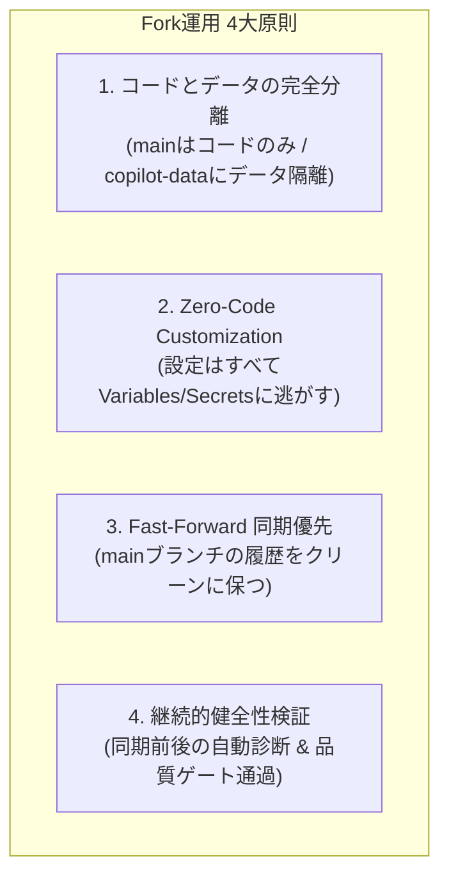

[English](12_fork_sync_and_customization_ops_spec.md) | [日本語](12_fork_sync_and_customization_ops_spec.ja.md)

---

# SDD-12: Fork先変更反映 & 運用保守仕様書 (Fork Synchronization & Operations Specification)

- **文書番号**: SPEC-COPILOT-012
- **ステータス**: Approved / Active
- **対象バージョン**: 2026.09-LTS
- **作成日**: 2026-09-16
- **関連文書**: [SDD-05 (データ永続化 & Fork非競合ストレージ仕様書)](05_data_storage_and_fork_isolation_spec.ja.md), [SDD-08 (自動化ワークフロー仕様書)](08_automation_workflow_spec.ja.md)

---

## 1. 概要と基本原則 (Overview & Core Principles)

### 1.1 背景
`github-copilot-dashboard` は、多くの企業や組織の GitHub Enterprise / Organization で Fork され、各組織独自の Copilot 利用分析・FinOps コスト按分基盤として運用されます。
本家リポジトリ（Upstream: `sun-flat-yamada/github-copilot-dashboard`）では、新規AIモデル（Claude Sonnet 5、GPT-6、Gemini 3.x 等）への追従、ベンチマーク更新、FinOps 分析ロジックの改善、UI/UX の向上、セキュリティパッチが継続的にリリースされます。

Fork 先運用者がこれらの最新更新を安全かつ迅速に取り込み、日々の自動集計や蓄積済みデータに影響を与えることなく運用を継続するための標準仕様および運用手順を本仕様書で規定します。

### 1.2 4大運用原則 (Four Core Principles)



1. **コードとデータの完全分離 (Code-Data Decoupling)**:
   - `main` ブランチはコードファイルのみを保持し、データファイル（`data/`）は一切コミットしません（SDD-05準拠）。
   - 蓄積データはすべて独立した orphan ブランチ（`copilot-data`）に追記型で保存されるため、コード同期時にデータ競合が発生する余地を物理的に排除します。
2. **Zero-Code Customization (設定とコードの分離)**:
   - 組織名、Enterpriseスラッグ、ユーザー属性マッピング、認証トークンなどは、すべて GitHub Actions の Variables および Secrets に注入します。
   - Git で管理されるソースコードを書き換えない運用を徹底することで、本家更新を 100% 無競合（Conflict-Free）で同期可能とします。
3. **Fast-Forward 同期優先 (Fast-Forward First)**:
   - Fork 先の `main` ブランチは本家の `main` と完全に同一のコミット履歴を維持することを原則とします。
4. **継続的健全性検証 (Continuous Verification)**:
   - 同期実行の前後に診断ツール（`npm run fork:verify`）を実行し、Git 設定、リモート構成、データ隔離状態、秘密情報の有無を自動検証します。

---

## 2. Fork先での設定・独自カスタマイズ運用方式 (Configuration & Customization)

### 2.1 原則: Zero-Code Customization (推奨・標準)
社内固有の情報は、Git コミットではなく以下の GitHub Actions Variables / Secrets に登録します：

| 設定種別 | 項目名 | 格納場所 | 内容・目的 |
|---|---|---|---|
| **Secret** | `COPILOT_READ_TOKEN` | Settings > Secrets > Actions | API読み取り用 Fine-grained PAT または GitHub App トークン |
| **Variable** | `COPILOT_USER_MAPPING` | Settings > Variables > Actions | 氏名・社内部署・Cost Center上書きのJSON配列（機密性が極めて高い場合はSecret可） |
| **Variable** | `COPILOT_ORGS` | Settings > Variables > Actions | 分析対象のOrganization名（カンマ区切り） |
| **Variable** | `COPILOT_ENTERPRISE` | Settings > Variables > Actions | 分析対象のEnterpriseスラッグ（Enterprise一括集計時） |
| **Variable** | `MOCK_MODE` | Settings > Variables > Actions | 実APIトークンなしで動作検証する場合は `true` |

この方式を採る限り、Fork 先の `main` ブランチ上のファイル差分はゼロとなり、本家からの更新をボタン 1 つで適用できます。

---

### 2.2 例外: コード改修（UI/独自機能）が必要な場合の2層ブランチ戦略
社内ポータルへの埋め込み対応、独自ロゴ/ヘッダーの変更、追加分析ロジックの実装など、ソースコード改修が不可避な場合は、以下の **「クリーン `main` ＋ 独自改修ブランチ」** の 2 層構成を採用します。

```text
[Upstream: sun-flat-yamada/github-copilot-dashboard]
  main ───●───●───● (新機能・バグ修正)
          │   │   │ (Fast-Forward 同期)
          ▼   ▼   ▼
[Fork: my-org/github-copilot-dashboard]
  main ───●───●───● (常に Upstream と 100% 同一)
          │       │
          │       └────────┐ (merge main)
          ▼                ▼
  fork/custom ───■───■────▲ (社内独自UI・拡張機能)
                 (独自改修)
```

- **`main` ブランチ**: 独自コミットを一切打たず、常に Upstream のミラーとして運用。
- **`fork/custom` ブランチ**: `main` から分岐し、社内独自の改修コミットを蓄積。
- **同期運用**:
  1. まず `main` を Upstream と Fast-Forward 同期。
  2. `fork/custom` ブランチに切り替え、`git merge main` を実行。
  3. GitHub Pages のビルド対象ブランチを `fork/custom` に設定（必要に応じてワークフロー内のトリガーブランチを調整）。

---

## 3. Upstream 更新の同期手順 (Upstream Synchronization Procedures)

### 3.1 アプローチ A: GitHub Web UI による同期 (1-Click Sync Fork)
コード無改修（Zero-Code Customization）で運用している場合に最も手軽な方法です。

1. Fork 先リポジトリのトップページ（`https://github.com/<your-org>/github-copilot-dashboard`）を開きます。
2. ブランチが `main` になっていることを確認します。
3. リポジトリ上部に表示される **「Sync fork」** ドロップダウンをクリックします。
4. **「Update branch」** をクリックします。
   - コンフリクトがない場合、自動的に Fast-Forward またはマージコミットが生成され同期が完了します。
5. **Actions** タブを開き、同期トリガーによる CI 検査（`test-and-preview.yml` 等）が通過したことを確認します。

---

### 3.2 アプローチ B: Git CLI による標準同期手順 (Recommended Operator Runbook)
CLI 環境や AI エージェント（`fork-sync-agent`）が同期を行う場合の標準運用手順です。

#### ステップ 1: リモートリポジトリの設定確認
```bash
git remote -v
```
`upstream` が未登録の場合は追加します：
```bash
git remote add upstream https://github.com/sun-flat-yamada/github-copilot-dashboard.git
```

#### ステップ 2: 同期前の健全性診断 (Pre-flight Check)
作業ツリーのクリーン度およびリポジトリ状態を検査します：
```bash
npm run fork:verify
```
未コミットの変更がある場合や、`main` にデータファイルが混入している場合は、後述のトラブルシューティングに従って解消します。

#### ステップ 3: Upstream の最新情報を取得 & 差分確認
```bash
git fetch upstream main

# コミットログ差分の確認
git log HEAD..upstream/main --oneline

# 変更ファイル概要の確認
git diff HEAD..upstream/main --stat
```

#### ステップ 4: Fast-Forward マージの実行
```bash
git checkout main
git merge upstream/main --ff-only
```
> [!NOTE]
> `--ff-only` を指定することで、Fork 側で予期せぬローカルコミットが存在した場合に意図しないマージコミットの発生を防ぎます。

#### ステップ 5: 依存関係更新 & 品質ゲート検証
```bash
# 依存関係の最新化
npm ci

# プロジェクト全体の品質ゲート検証
npm run typecheck
npm test
npm run secret-scan
npm run build
```

#### ステップ 6: Fork 先リモート（origin）へのプッシュ
```bash
git push origin main
```

#### ステップ 7: デプロイパイプラインの動作確認
GitHub Actions の最新実行ステータスを確認するか、手動トリガーで動作検証します：
```bash
# GitHub CLI を使用する場合
gh workflow run copilot-analysis-cron.yml
gh run watch
```

---

### 3.3 アプローチ C: GitHub Actions 自動同期ワークフロー (Scheduled Sync)
本家更新の検知と同期を自動化したい場合は、定期実行ワークフローを導入できます。

```yaml
name: Scheduled Upstream Sync

on:
  schedule:
    # 毎週月曜 UTC 01:00 (JST 10:00) に同期チェック
    - cron: '0 1 * * 1'
  workflow_dispatch:

permissions:
  contents: write
  pull-requests: write

jobs:
  sync:
    runs-on: ubuntu-latest
    steps:
      - name: Checkout main
        uses: actions/checkout@v4
        with:
          ref: main
          fetch-depth: 0

      - name: Configure Git
        run: |
          git config user.name "github-actions[bot]"
          git config user.email "github-actions[bot]@users.noreply.github.com"
          git remote add upstream https://github.com/sun-flat-yamada/github-copilot-dashboard.git

      - name: Sync and Fast-Forward
        run: |
          git fetch upstream main
          if git merge-base --is-ancestor upstream/main HEAD; then
            echo "✅ Already up-to-date with upstream."
            exit 0
          fi
          git merge upstream/main --ff-only
          git push origin main
          echo "✅ Successfully synced and pushed upstream updates."
```

---

## 4. 同期後健全性検証チェックリスト (Post-Sync Health Check)

同期が完了した後、運用者は以下の 5 項目を必ず確認します：

```text
[同期後検証チェックリスト]
☐ 1. データ保全性チェック: copilot-data ブランチの履歴と最新パーティションが存在すること
☐ 2. セキュリティ & PII 監査: npm run secret-scan が 0 件で合格すること
☐ 3. 型安全性 & 自動テスト: npm run typecheck && npm test が全件合格すること
☐ 4. パイプライン実行確認: copilot-analysis-cron.yml が正常完了（緑アイコン）であること
☐ 5. GitHub Pages 表示確認: 公開URLにアクセスし、ダッシュボードの新機能や集計結果が正しく描画されること
```

上記チェックは、診断スクリプトによって自動一括実行が可能です：
```bash
npm run fork:verify
```

---

## 5. トラブルシューティング & 障害復旧 (Troubleshooting & Remediation)

### ケース 1: Fork 先の `main` ブランチに誤ってデータ（`data/`）をコミットしてしまった
- **事象**: `main` ブランチに `data/` や `dashboard/public/data/` が追跡され、Upstream との同期時にコンフリクトが発生する。
- **原因**: ローカルでパイプラインを手動実行した際、`.gitignore` の指定漏れや強制追加（`git add -f`）でコミットしてしまった。
- **復旧手順**:
  ```bash
  # 1. 作業ディレクトリ内のデータを保持したまま、Git追跡のみを解除
  git rm -r --cached data/ dashboard/public/data/ 2>/dev/null || true

  # 2. .gitignore が最新であることを確認
  git checkout upstream/main -- .gitignore

  # 3. 追跡解除をコミット
  git commit -m "fix: untrack data files from main branch (restore fork isolation)"

  # 4. copilot-data ブランチのデータは独立しているため影響なし
  ```

---

### ケース 2: Fork 側で不要なローカルコミットが存在し `--ff-only` が失敗する
- **事象**: `fatal: Not possible to fast-forward, aborting.` が発生する。
- **原因**: Fork 先の `main` ブランチで直接ファイルの変更・コミットを行ってしまった。
- **復旧手順**:
  1. 独自変更を残す必要がない場合（Upstreamと完全に一致させる場合）:
     ```bash
     git fetch upstream
     git reset --hard upstream/main
     git push origin main --force-with-lease
     ```
  2. 独自変更を保持したい場合:
     ```bash
     # 1. 独自変更を別ブランチへ退避
     git branch fork/custom-backup
     
     # 2. main を Upstream にリセット
     git reset --hard upstream/main
     git push origin main --force-with-lease
     
     # 3. 退避した独自変更を fork/custom ブランチで再構成
     git checkout -b fork/custom fork/custom-backup
     ```

---

### ケース 3: GitHub Actions のプッシュ権限エラー (403: Resource not accessible)
- **事象**: `copilot-analysis-cron.yml` の「Commit and Push to 'copilot-data' branch」ステップで `403 Forbidden` となる。
- **原因**: Fork リポジトリでは、初期状態で GitHub Actions の書き込み権限が無効化されている場合がある。
- **解決手順**:
  1. Fork リポジトリの **Settings** > **Actions** > **General** を開く。
  2. **Workflow permissions** セクションで **「Read and write permissions」** を選択する。
  3. **「Allow GitHub Actions to create and approve pull requests」** にチェックを入れる。
  4. **Save** をクリックする。

---

### ケース 4: GitHub Pages が 404 になる、または更新されない
- **事象**: `https://<org>.github.io/github-copilot-dashboard/` にアクセスしても 404 が返る。
- **解決手順**:
  1. **Settings** > **Pages** を開く。
  2. **Build and deployment** > **Source** を **「GitHub Actions」** に切り替える（`Deploy from a branch` ではなく `GitHub Actions` を選択）。
  3. **Actions** タブから `copilot-analysis-cron.yml` を手動実行（Run workflow）する。

---

## 6. Fork先から Upstream への機能還元 (Contributing Back to Upstream)

Fork 先で開発した汎用的なバグ修正、新しいモデルのベンチマーク定義、UI 改善などを本家に還元する（Pull Request を作成する）際の手順：

1. **トピックブランチの作成**:
   Upstream の最新 `main` から分岐したクリーンなブランチを作成します：
   ```bash
   git checkout -b feature/my-improvement upstream/main
   ```
2. **社内情報・PII の完全排除**:
   - `COPILOT_USER_MAPPING` に含まれる実際の氏名・部署・社員番号がテストコードやモックデータに混入していないことを確認。
   - `npm run secret-scan` を実行し、合格することを確認。
3. **コミット & PR 作成**:
   ```bash
   git push origin feature/my-improvement
   ```
   GitHub UI 上で `sun-flat-yamada/github-copilot-dashboard:main` をターゲットにした Pull Request を作成します。
   （※ `data/` ディレクトリは追跡されていないため、PR の差分にデータファイルが含まれる心配はありません）
