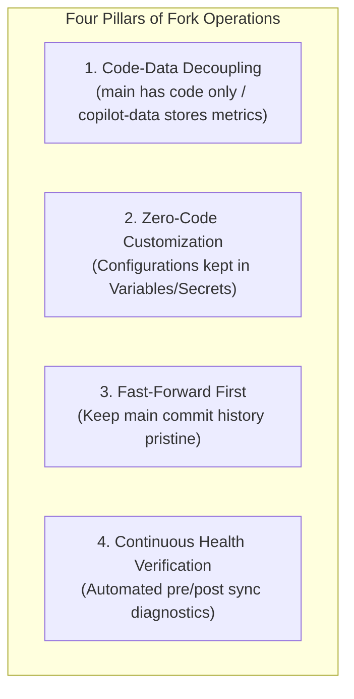

[English](12_fork_sync_and_customization_ops_spec.md) | [日本語](12_fork_sync_and_customization_ops_spec.ja.md)

---

# SDD-12: Fork Synchronization & Operations Specification

- **Document Number**: SPEC-COPILOT-012
- **Status**: Approved / Active
- **Target Version**: 2026.09-LTS
- **Date**: 2026-09-16
- **Related Specs**: [SDD-05 (Data Storage & Fork Isolation Spec)](05_data_storage_and_fork_isolation_spec.md), [SDD-08 (Automation Workflow Spec)](08_automation_workflow_spec.md), [SDD-13 (Fork Restricted Environment Setup Guide)](13_fork_restricted_environment_setup_guide.md)

---

## 1. Overview & Core Principles

### 1.1 Background
`github-copilot-dashboard` is forked and operated across many enterprise organizations and GitHub Enterprise environments as an internal Copilot utilization analytics and FinOps cost allocation platform.
The upstream repository (`sun-flat-yamada/github-copilot-dashboard`) continuously releases enhancements including support for frontier AI models (Claude Sonnet 5, GPT-6, Gemini 3.x), benchmark score updates, FinOps logic improvements, dashboard UI/UX refinements, and security patches.

This specification establishes standard operating procedures and guidelines for downstream fork maintainers to safely, cleanly, and continuously incorporate upstream updates without disrupting daily batch runs or accumulated historical metrics.

### 1.2 Four Core Principles



1. **Code-Data Decoupling**:
   - The `main` branch contains source code only. No runtime data files (`data/`) are ever committed to `main` (per SDD-05).
   - All collected and aggregated metrics reside exclusively in the dedicated orphan branch (`copilot-data`), physically eliminating merge conflicts during code synchronization.
2. **Zero-Code Customization (Configuration as Data)**:
   - Organization names, Enterprise slugs, user attribute mappings, and credentials must be injected dynamically via GitHub Actions Variables and Secrets.
   - Preserving zero diffs on tracked Git files allows 100% conflict-free upstream synchronization.
3. **Fast-Forward First**:
   - Downstream forks maintain a `main` branch whose commit history mirrors upstream `main` via fast-forward merges.
4. **Continuous Health Verification**:
   - Maintainers and agents run automated health checks (`npm run fork:verify`) before and after synchronization to validate Git remotes, data isolation, and security hygiene.

---

## 2. Configuration & Customization Strategy for Downstream Forks

### 2.1 Standard: Zero-Code Customization (Recommended)
Organization-specific details are registered as GitHub Actions Variables or Secrets rather than hardcoded in Git commits:

| Category | Name | Configuration Location | Purpose |
|---|---|---|---|
| **Secret** | `COPILOT_READ_TOKEN` | Settings > Secrets > Actions | Fine-grained PAT or GitHub App token with Copilot metrics/seats read permissions |
| **Variable** | `COPILOT_USER_MAPPING` | Settings > Variables > Actions | JSON array mapping logins to display names, departments, and cost center overrides |
| **Variable** | `COPILOT_ORGS` | Settings > Variables > Actions | Target organization slugs (comma-separated) |
| **Variable** | `COPILOT_ENTERPRISE` | Settings > Variables > Actions | Target Enterprise slug (for enterprise-wide aggregation) |
| **Variable** | `COPILOT_COST_CENTER_BUDGETS` | Settings > Variables > Actions | JSON array of `{ cost_center_id?, cost_center_name?, spending_limit_usd, free_tier_budget_usd }` declaring per-cost-center budget ceilings (the GitHub API exposes no budget endpoint, so this must be supplied manually to enable FinOps budget-vs-actual views in real-data mode) |
| **Variable** | `MOCK_MODE` | Settings > Variables > Actions | Set to `true` to test full UI/pipeline with simulated 2026 data without API tokens |

With Zero-Code Customization, the fork's `main` branch has zero file diffs against upstream, enabling 1-click updates.

---

### 2.2 Dual-Branch Strategy for Code-Level Customizations
When internal enterprise requirements demand custom frontend changes (custom branding, internal headers, proprietary SSO wrappers), maintain a **Clean `main` + Customization Branch** topology:

```text
[Upstream: sun-flat-yamada/github-copilot-dashboard]
  main ───●───●───● (New Features, Bug Fixes)
          │   │   │ (Fast-Forward Sync)
          ▼   ▼   ▼
[Fork: my-org/github-copilot-dashboard]
  main ───●───●───● (100% Mirror of Upstream)
          │       │
          │       └────────┐ (merge main)
          ▼                ▼
  fork/custom ───■───■────▲ (Internal Customizations)
```

- **`main` Branch**: Never contains internal commits; always synchronized cleanly with upstream.
- **`fork/custom` Branch**: Branched from `main` to hold internal commits.
- **Synchronization Flow**:
  1. Fast-forward `main` to latest `upstream/main`.
  2. Switch to `fork/custom` and run `git merge main`.
  3. Deploy GitHub Pages from `fork/custom` if needed.

---

### 2.3 Operational Checklist for `fork/custom` Deployments
Once code-level customizations exist on `fork/custom`, scheduled/CI workflows must be
explicitly pointed at that branch — otherwise the daily cron and Pages deploy silently
keep running `main`'s (upstream) code, and fork-only fixes or features never reach
production. In practice, the following four settings need to change **together**;
missing any one of them results in a partial, confusing rollout:

1. **Retarget workflow trigger refs**: In every workflow that should run the
   customized code, update the `push:`/`pull_request:` branch filters and the
   `actions/checkout` `ref:` from `main` to `fork/custom`.
2. **Set the repository's Default Branch to `fork/custom`**
   (**Settings** > **General** > **Default branch**). The `schedule:` trigger always
   reads the workflow *definition* from the Default Branch, regardless of the `ref:`
   used inside the job — retargeting only the checkout step is not sufficient and is
   a common source of "the workflow still runs the old code" confusion.
3. **Update the deployment environment's branch policy** (e.g. **Settings** >
   **Environments** > `github-pages` > **Deployment branches and tags**) to explicitly
   allow `fork/custom`. This is independent of the Default Branch setting above;
   without it, the deploy job fails with *"Branch is not allowed to deploy to
   github-pages due to environment protection rules."*
4. **Wire through any new environment variables** introduced by the customization
   (e.g. a new `COPILOT_*` variable read only by fork-only code) into the retargeted
   workflow's `env:` block. A variable that exists only in application code but is
   never passed through the workflow silently has no effect in CI.

> [!TIP]
> Keep `test-and-preview.yml`'s `push` trigger on **both** `main` and `fork/custom`
> (in addition to retargeting `pull_request`). This provides an immediate CI signal
> right after every upstream fast-forward sync, on top of normal fork-side
> development, without requiring a separate workflow.

See [SDD-13](13_fork_restricted_environment_setup_guide.md) for the equivalent
checklist under GitHub EMU / policy-restricted organizations, where some of these
settings may be locked down and require an administrator exception request.

---

## 3. Upstream Synchronization Procedures

### 3.1 Approach A: GitHub Web UI (1-Click Sync Fork)
Ideal for standard forks using Zero-Code Customization:

1. Open your fork repository on GitHub (`https://github.com/<your-org>/github-copilot-dashboard`).
2. Ensure the active branch is `main`.
3. Click the **"Sync fork"** dropdown above the file browser.
4. Click **"Update branch"**.
   - If there are no divergent commits, GitHub automatically fast-forwards or merges upstream changes.
5. Review the **Actions** tab to ensure the CI validation workflow (`test-and-preview.yml`) succeeds.

---

### 3.2 Approach B: Git CLI Standard Operator Runbook
Recommended for engineers, DevOps pipelines, and AI coding agents (`fork-sync-agent`):

#### Step 1: Verify Remote Configuration
```bash
git remote -v
```
If `upstream` is missing, configure it:
```bash
git remote add upstream https://github.com/sun-flat-yamada/github-copilot-dashboard.git
```

#### Step 2: Pre-flight Health Check
Inspect the repository health and verify working tree cleanliness:
```bash
npm run fork:verify
```

#### Step 3: Fetch Upstream & Review Diffs
```bash
git fetch upstream main

# Review incoming commit summary
git log HEAD..upstream/main --oneline

# Review changed files
git diff HEAD..upstream/main --stat
```

#### Step 4: Fast-Forward Merge
```bash
git checkout main
git merge upstream/main --ff-only
```

#### Step 5: Update Dependencies & Execute Quality Gates
```bash
npm ci
npm run typecheck
npm test
npm run secret-scan
npm run build
```

#### Step 6: Push to Fork Remote
```bash
git push origin main
```

#### Step 7: Trigger Pipeline Verification
Validate workflow execution via GitHub CLI or the GitHub Web UI:
```bash
gh workflow run copilot-analysis-cron.yml
gh run watch
```

---

### 3.3 Approach C: Scheduled Automatic Sync (GitHub Actions)
For continuous hands-off synchronization, an automated workflow can run weekly:

```yaml
name: Scheduled Upstream Sync

on:
  schedule:
    - cron: '0 1 * * 1'
  workflow_dispatch:

permissions:
  contents: write
  pull-requests: write

jobs:
  sync:
    runs-on: ubuntu-latest
    steps:
      - name: Checkout main
        uses: actions/checkout@v4
        with:
          ref: main
          fetch-depth: 0

      - name: Configure Git
        run: |
          git config user.name "github-actions[bot]"
          git config user.email "github-actions[bot]@users.noreply.github.com"
          git remote add upstream https://github.com/sun-flat-yamada/github-copilot-dashboard.git

      - name: Sync and Fast-Forward
        run: |
          git fetch upstream main
          if git merge-base --is-ancestor upstream/main HEAD; then
            echo "✅ Already up-to-date with upstream."
            exit 0
          fi
          git merge upstream/main --ff-only
          git push origin main
          echo "✅ Successfully synced and pushed upstream updates."
```

---

### 3.4 Initial DEMO Dataset Provisioning & Synchronization for Forks
When creating a fork via GitHub's Web UI, "Copy the main branch only" is enabled by default. Consequently, newly created forks lack the `copilot-data` orphan branch and any pre-existing metric datasets.
To enable immediate dashboard previews, local development, and QA testing in downstream forks without waiting for real production telemetry runs, a turnkey CLI script is provided.

#### 3.4.1 Turnkey Provisioning Command (`npm run demo:setup`)
```bash
# Fetch data/demo/ from upstream and push to your fork's copilot-data branch
npm run demo:setup -- --push
```

The setup script automatically performs the following:
1. Connects to the upstream repository (`sun-flat-yamada/github-copilot-dashboard`) and extracts the `data/demo/` partition from `copilot-data`.
2. Seamlessly falls back to the local synthesis engine (`scripts/generate-demo-data.ts`) if upstream is unreachable or network-restricted.
3. Initializes or updates your fork's `copilot-data` branch in an isolated temporary worktree, and pushes to `origin/copilot-data` when `--push` is specified.
4. Stages the demo dataset directly into `dashboard/public/data/demo/` for instant offline testing.

#### 3.4.2 CLI Options & Flags
- `npm run demo:setup -- --push`: Full end-to-end setup including remote push to `origin/copilot-data` (Recommended).
- `npm run demo:setup -- --local`: Local development preview only (skips committing/pushing to remote branches).
- `npm run demo:setup -- --upstream <git-url>`: Custom upstream repository URL override.
- `npm run demo:import`: Direct alias for `demo:setup`.

#### 3.4.3 Post-Import Verification
Verify that the DEMO partition is properly provisioned using the diagnostic suite:
```bash
npm run fork:verify
```
When `✅ DEMO Dataset Partition (data/demo/): Present` is reported, you can launch `npm run preview` and toggle the "DEMO (Mock)" badge in the top navigation header to explore the live simulation metrics.

---

## 4. Post-Sync Health Check Checklist

Maintainers should verify these 5 checkpoints following synchronization:

```text
[Post-Sync Verification Checklist]
☐ 1. Data Integrity: Historical data in copilot-data orphan branch is intact and unbroken.
☐ 2. Security & Zero-Leakage: npm run secret-scan exits with code 0 (zero leaks).
☐ 3. Type Safety & Tests: npm run typecheck && npm test all pass cleanly.
☐ 4. Pipeline Execution: copilot-analysis-cron.yml finishes with green status.
☐ 5. GitHub Pages Deployment: Live URL correctly displays updated UI and recent metrics.
```

Execute all checks at once with:
```bash
npm run fork:verify
```

---

## 5. Troubleshooting & Remediation

### Case 1: Data Files Accidentally Committed to `main`
- **Symptom**: `data/` or `dashboard/public/data/` files appear in `main` git status, causing conflicts during upstream merge.
- **Cause**: Manual local run of data pipeline without clean `.gitignore` enforcement.
- **Remediation**:
  ```bash
  git rm -r --cached data/ dashboard/public/data/ 2>/dev/null || true
  git checkout upstream/main -- .gitignore
  git commit -m "fix: untrack data files from main branch (restore fork isolation)"
  ```

---

### Case 2: Diverged `main` Prevents Fast-Forward Merge
- **Symptom**: `fatal: Not possible to fast-forward, aborting.`
- **Cause**: Unintended direct commits exist on the fork's local/remote `main`.
- **Remediation**:
  1. If no local changes need to be preserved:
     ```bash
     git fetch upstream
     git reset --hard upstream/main
     git push origin main --force-with-lease
     ```
  2. If local changes must be preserved:
     ```bash
     git branch fork/custom-backup
     git reset --hard upstream/main
     git push origin main --force-with-lease
     git checkout -b fork/custom fork/custom-backup
     ```

---

### Case 3: GitHub Actions Push Permission Error (403 Forbidden)
- **Symptom**: `copilot-analysis-cron.yml` fails on "Commit and Push to data branch (Fork-Safe Storage)" step with HTTP 403.
- **Cause**: Default Actions write permissions are disabled in fork settings.
- **Remediation**:
  1. Go to repository **Settings** > **Actions** > **General**.
  2. Under **Workflow permissions**, select **"Read and write permissions"**.
  3. Check **"Allow GitHub Actions to create and approve pull requests"**.
  4. Click **Save**.

---

### Case 4: GitHub Pages 404 or Outdated Content
- **Symptom**: Visiting the dashboard URL returns 404 or shows stale pre-sync UI.
- **Remediation**:
  1. Go to **Settings** > **Pages**.
  2. Under **Build and deployment** > **Source**, verify it is set to **"GitHub Actions"**.
  3. In the **Actions** tab, manually trigger `copilot-analysis-cron.yml` via "Run workflow".

---

## 6. Contributing Back to Upstream

When submitting upstream contributions (general bug fixes, new model benchmarks, analytics features):

1. **Create Clean Topic Branch**:
   ```bash
   git checkout -b feature/my-improvement upstream/main
   ```
2. **Zero-PII, Secret & Real-Data Audit** (mandatory, both must exit 0):
   - Ensure no real employee names, emails, tokens, or organization-specific usage/billing data are included in code, test fixtures, or docs.
   - Run `npm run secret-scan` (generic secret/PII pattern scan across the whole working tree).
   - Run `npm run upstream:audit -- upstream/main feature/my-improvement` (see [Section 6.1](#61-upstream-data-leak-guard-npm-run-upstreamaudit) below) — this specifically diffs the candidate branch against `upstream/main` and fails if any file in that diff matches a real-data protection pattern (`AIUsageReport*.csv`, `*<yyyymm>.csv`, `data/`, user-mapping/org-chart dumps, etc.), in addition to re-running the secret scan.
3. **Open Pull Request**:
   - If this repository is a native GitHub fork of upstream, push the branch to `origin` and open a PR from the GitHub UI as usual.
   - If this repository was created via the mirror-based procedure ([SDD-13](13_fork_restricted_environment_setup_guide.md)) and is therefore *not* fork-network-linked to upstream, a conventional cross-repo PR (`head: <this-repo>:branch` → `base: <upstream-repo>:main`) is not available. Instead, push the audited branch directly into the upstream repository using a personal (non-EMU) GitHub identity that has write access there (see [SDD-13 §5](13_fork_restricted_environment_setup_guide.md#5-known-limitations)), then open a same-repository PR:
     ```bash
     gh auth switch --user <personal-upstream-identity>
     git push <upstream-remote-with-write-access> feature/my-improvement
     gh pr create --repo sun-flat-yamada/github-copilot-dashboard \
       --base main --head feature/my-improvement \
       --title "..." --body "..."
     gh auth switch --user <your-normal-fork-identity>
     ```
     Switch back to the normal EMU/fork-side identity immediately after opening the PR to avoid accidentally operating on the wrong repository context in subsequent commands.

### 6.1 Upstream Data-Leak Guard (`npm run upstream:audit`)

`scripts/audit-upstream-contribution.ts` is a dedicated guard against organization-specific data ever riding along in an upstream contribution — a stricter, contribution-scoped complement to the general-purpose `npm run secret-scan`:

- It computes the file list of `git diff <base>...<candidate>` (default `upstream/main` vs `HEAD`) — i.e., exactly the files a PR built from `candidate` would introduce.
- Every changed file path is checked against the same real-data patterns enforced by `.gitignore` (`AIUsageReport*.csv`, `*<yyyymm>.csv` in both `YYYYMM` and `YYYY-MM` forms, `data/`, `dashboard/public/data/`) plus PII/secret filename patterns (`user_mapping.*`, `copilot_user_mapping*`, `internal_org_chart.*`, `secrets.*`, `credentials.json`, etc.).
- It also re-runs `runSecretScan()` for full-content secret detection.
- Exits non-zero (and prints every violating file + matched rule) if anything is found; exits 0 only when the candidate diff is provably free of both real-data files and hardcoded secrets.

```bash
npm run upstream:audit                              # HEAD vs upstream/main (defaults)
npm run upstream:audit -- upstream/main my-branch    # explicit base/candidate refs
```

Treat a non-zero exit as a hard blocker — never push to upstream or open the PR until this passes.
