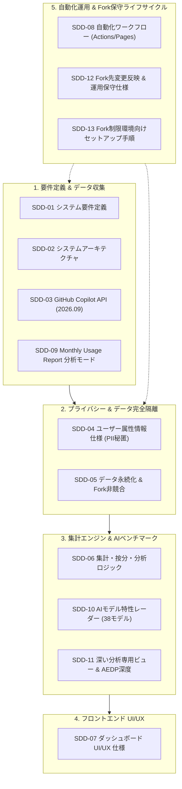

# 📖 SDD (仕様駆動開発) 設計仕様書一覧

[English](README.md) | [日本語](README.ja.md)

本ディレクトリは、**github-copilot-dashboard** の正式なシステム設計仕様書を格納しています。本プロジェクトのすべての機能・データ仕様・セキュリティ方針・運用手順は、**仕様駆動開発 (Specification-Driven Development: SDD)** に則り厳格に策定・管理されています。

---

## 🏛️ 仕様ドメイン & アーキテクチャ構成図

全13件の仕様書は、以下の6つのエンジニアリングドメインに分類・体系化されています：

---

## 📋 全仕様書一覧インデックス

| 番号 | タイトル | 言語リンク | 対象ドメインと要点 | ステータス |
| :--- | :--- | :--- | :--- | :--- |
| **SDD-01** | システム要件定義書 | [JA](01_requirements_specification.ja.md) \| [EN](01_requirements_specification.md) | 業務要件、機能要件、セキュリティ・運用要件 | 正式運用 (2026.09) |
| **SDD-02** | システムアーキテクチャ設計書 | [JA](02_system_architecture.ja.md) \| [EN](02_system_architecture.md) | 全体構成図、データフロー、フォールバック設計 | 正式運用 (2026.09) |
| **SDD-03** | GitHub API 仕様書 (2026.09) | [JA](03_github_copilot_api_spec_2026.ja.md) \| [EN](03_github_copilot_api_spec_2026.md) | Copilot Metrics, Seats, Cost Centers API定義 | 正式運用 (2026.09) |
| **SDD-04** | ユーザー属性情報仕様書 | [JA](04_user_attribute_mapping_spec.ja.md) \| [EN](04_user_attribute_mapping_spec.md) | PII秘匿化、Variables注入、JSON/CSV複数形式、GPG暗号化運用 | 正式運用 (2026.09) |
| **SDD-05** | データ永続化 & Fork非競合仕様書 | [JA](05_data_storage_and_fork_isolation_spec.ja.md) \| [EN](05_data_storage_and_fork_isolation_spec.md) | orphanブランチ分離 (`copilot-data`)、日付追記型パーティション | 正式運用 (2026.09) |
| **SDD-06** | 集計・按分・分析ロジック仕様書 | [JA](06_aggregation_and_billing_logic_spec.ja.md) \| [EN](06_aggregation_and_billing_logic_spec.md) | 3軸按分、マルチモデル日次集計、グループ内ランキング、予算計算 | 正式運用 (2026.09) |
| **SDD-07** | ダッシュボード UI/UX 仕様書 | [JA](07_dashboard_ui_ux_spec.ja.md) \| [EN](07_dashboard_ui_ux_spec.md) | レスポンシブ設計、80%×80% 異常検知モーダル、Recharts可視化 | 正式運用 (2026.09) |
| **SDD-08** | 自動化ワークフロー仕様書 | [JA](08_automation_workflow_spec.ja.md) \| [EN](08_automation_workflow_spec.md) | Actions cron、GitHub Pages完全無料ホスティング、エラー自動処理 | 正式運用 (2026.09) |
| **SDD-09** | Monthly Usage Report 分析モード仕様書 | [JA](09_monthly_usage_report_mode_spec.ja.md) \| [EN](09_monthly_usage_report_mode_spec.md) | 月次CSVレポート直接解析、月度正規化、過去トレンド保持 | 正式運用 (2026.09) |
| **SDD-10** | AIモデル特性レーダー & 著名ベンチマーク評価仕様書 | [JA](10_ai_model_benchmark_radar_spec.ja.md) \| [EN](10_ai_model_benchmark_radar_spec.md) | 6軸レーダーチャート、38モデルベンチマーク評価、トークン単価 | 正式運用 (2026.09) |
| **SDD-11** | 深い分析専用ビュー仕様書 | [JA](11_deep_analysis_view_spec.ja.md) \| [EN](11_deep_analysis_view_spec.md) | AI活用非効率パターン診断、AEDP自律駆動深度評価 | 正式運用 (2026.09) |
| **SDD-12** | Fork先変更反映 & 運用保守仕様書 | [JA](12_fork_sync_and_customization_ops_spec.ja.md) \| [EN](12_fork_sync_and_customization_ops_spec.md) | 本家同期手順 (Web UI/CLI)、2層ブランチ運用、健全性診断 | 正式運用 (2026.09) |
| **SDD-13** | Fork制限環境向けセットアップ手順書 | [JA](13_fork_restricted_environment_setup_guide.ja.md) \| [EN](13_fork_restricted_environment_setup_guide.md) | EMU・ポリシー制限によりGitHub Forkを使えない組織向けのミラー複製手順 | 正式運用 (2026.09) |

---

## 🧭 ロール別推奨リーディングパス

利用者の役割や目的に応じたおすすめの確認順序です：

### 1. プラットフォーム管理者・Fork運用担当者
1. [SDD-01 要件定義書](01_requirements_specification.ja.md) & [SDD-02 アーキテクチャ設計書](02_system_architecture.ja.md)
2. [SDD-04 ユーザー属性情報仕様書](04_user_attribute_mapping_spec.ja.md) (PII登録・GPG暗号化運用)
3. [SDD-08 自動化ワークフロー仕様書](08_automation_workflow_spec.ja.md) (Actions cron & Pages設定)
4. [SDD-12 Fork先変更反映仕様書](12_fork_sync_and_customization_ops_spec.ja.md) (またはEMU環境向け [SDD-13](13_fork_restricted_environment_setup_guide.ja.md))

### 2. FinOps担当・経営企画・経理
1. [SDD-06 集計・按分・分析ロジック仕様書](06_aggregation_and_billing_logic_spec.ja.md) (3軸コスト按分・予算管理)
2. [SDD-09 Monthly Usage Report 分析モード仕様書](09_monthly_usage_report_mode_spec.ja.md) (月次CSV取り込み)
3. [SDD-10 AIモデル特性レーダー](10_ai_model_benchmark_radar_spec.ja.md) & [モデル価格表](../models_pricing.md)

### 3. セキュリティ監査・コンプライアンス担当
1. [SDD-04 ユーザー属性情報仕様書](04_user_attribute_mapping_spec.ja.md) (Git履歴へのPII流出防止・暗号化)
2. [SDD-05 データ永続化仕様書](05_data_storage_and_fork_isolation_spec.ja.md) (orphanブランチ分離)
3. [SECURITY.md](../../SECURITY.md) & 自動スキャナー (`npm run secret-scan`, `npm run upstream:audit`)

### 4. フロントエンド・パイプライン開発者
1. [SDD-03 GitHub API 仕様書](03_github_copilot_api_spec_2026.ja.md) & [SDD-06 集計ロジック](06_aggregation_and_billing_logic_spec.ja.md)
2. [SDD-07 ダッシュボード UI/UX 仕様書](07_dashboard_ui_ux_spec.ja.md)
3. [SDD-11 深い分析専用ビュー仕様書](11_deep_analysis_view_spec.ja.md)

---

## ✍️ 仕様書の追加・更新ガイドライン

新規機能や仕様変更を起票する際は以下を遵守してください：
1. **日英バイリンガル必須**: 英語 (`XX_<feature>.md`) と日本語 (`XX_<feature>.ja.md`) の両方を必ず同時に整備してください。
2. **連番採番**: `docs/specifications/` 直下に `SDD-14`, `SDD-15` と連番で配置します。
3. **インデックス更新**: 本ファイルおよび関連するドキュメント一覧を同期してください。
4. **シークレット・PIIの完全排除**: サンプルコードや説明文に本物のトークンや実在の社内人名を含めてはなりません。
