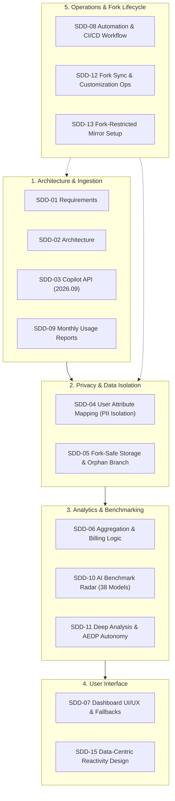

# 📖 SDD (Specification-Driven Development) Specifications

[English](README.md) | [日本語](README.ja.md)

This directory houses the formal architectural and engineering specifications for **github-copilot-dashboard**. Every feature, data contract, security policy, and operational runbook in this repository is strictly governed by Specification-Driven Development (SDD).

---

## 🏛️ Specification Domains & Architecture Map

The specifications are organized into six cohesive engineering domains:

---

## 📋 Full Specifications Index

| ID | Title | Available Languages | Domain & Focus | Status |
| :--- | :--- | :--- | :--- | :--- |
| **SDD-01** | Requirements Specification | [EN](01_requirements_specification.md) \| [JA](01_requirements_specification.ja.md) | Business, functional, security, and operational requirements | Active (2026.09) |
| **SDD-02** | System Architecture Specification | [EN](02_system_architecture.md) \| [JA](02_system_architecture.ja.md) | Overall topology, data pipelines, fallback architecture | Active (2026.09) |
| **SDD-03** | GitHub Copilot API Specification (2026.09) | [EN](03_github_copilot_api_spec_2026.md) \| [JA](03_github_copilot_api_spec_2026.ja.md) | Metrics, Seats, and Cost Centers API definitions | Active (2026.09) |
| **SDD-04** | User Attribute Mapping Specification | [EN](04_user_attribute_mapping_spec.md) \| [JA](04_user_attribute_mapping_spec.ja.md) | PII isolation, variable injection, multi-format (JSON/CSV), GPG encryption | Active (2026.09) |
| **SDD-05** | Data Storage & Fork Isolation Specification | [EN](05_data_storage_and_fork_isolation_spec.md) \| [JA](05_data_storage_and_fork_isolation_spec.ja.md) | Orphan branch segregation (`copilot-data`), append-only date partitioning | Active (2026.09) |
| **SDD-06** | Aggregation & Billing Logic Specification | [EN](06_aggregation_and_billing_logic_spec.md) \| [JA](06_aggregation_and_billing_logic_spec.ja.md) | 3-axis allocation, multi-model daily trends, intra-group rankings, budgets | Active (2026.09) |
| **SDD-07** | Dashboard UI/UX Specification | [EN](07_dashboard_ui_ux_spec.md) \| [JA](07_dashboard_ui_ux_spec.ja.md) | Responsive layout, 80%×80% anomaly modal, Recharts visual design | Active (2026.09) |
| **SDD-08** | Automation & CI/CD Workflow Specification | [EN](08_automation_workflow_spec.md) \| [JA](08_automation_workflow_spec.ja.md) | Actions cron, GitHub Pages zero-infra deployment, graceful fallbacks | Active (2026.09) |
| **SDD-09** | Monthly Usage Report Mode Specification | [EN](09_monthly_usage_report_mode_spec.md) \| [JA](09_monthly_usage_report_mode_spec.ja.md) | Enterprise CSV usage report ingestion, month normalization, historical trends | Active (2026.09) |
| **SDD-10** | AI Model Benchmark Radar Specification | [EN](10_ai_model_benchmark_radar_spec.md) \| [JA](10_ai_model_benchmark_radar_spec.ja.md) | 6-axis radar charts, 38 frontier models evaluation, token pricing | Active (2026.09) |
| **SDD-11** | Deep Analytics View Specification | [EN](11_deep_analysis_view_spec.md) \| [JA](11_deep_analysis_view_spec.ja.md) | Inefficient AI pattern diagnostics, AEDP autonomy depth metrics | Active (2026.09) |
| **SDD-12** | Fork Synchronization & Operations Specification | [EN](12_fork_sync_and_customization_ops_spec.md) \| [JA](12_fork_sync_and_customization_ops_spec.ja.md) | Upstream sync runbooks (UI/CLI), dual-branch model, health audit | Active (2026.09) |
| **SDD-13** | Fork-Restricted Environment Setup Guide | [EN](13_fork_restricted_environment_setup_guide.md) \| [JA](13_fork_restricted_environment_setup_guide.ja.md) | Mirror-based duplication procedure for EMU and restricted enterprises | Active (2026.09) |
| **SDD-14** | Development Workflow & Git Ops Specification | [EN](14_development_workflow_and_git_ops_spec.md) \| [JA](14_development_workflow_and_git_ops_spec.ja.md) | Multi-agent parallel Worktree operations, Issue driven, PR & Rebase merge, permission model | Active (2026.09) |
| **SDD-15** | Data-Centric Reactivity Design Specification | [EN](15_data_centric_reactivity_design_spec.md) \| [JA](15_data_centric_reactivity_design_spec.ja.md) | Cross-View tracking of active selected data (source/scope/tags), React implementation conventions, known anti-patterns | Active (2026.09) |

---

## 🧭 Recommended Reading Paths

Depending on your role, we recommend reviewing specifications in the following order:

### 1. Platform Operators & Fork Maintainers
1. [SDD-01 Requirements](01_requirements_specification.md) & [SDD-02 Architecture](02_system_architecture.md)
2. [SDD-04 User Attribute Mapping](04_user_attribute_mapping_spec.md) (PII setup & encryption)
3. [SDD-08 Automation Workflow](08_automation_workflow_spec.md) (Cron & Pages)
4. [SDD-12 Fork Sync & Customization Ops](12_fork_sync_and_customization_ops_spec.md) (or [SDD-13](13_fork_restricted_environment_setup_guide.md) for EMU)

### 2. FinOps, Accounting & Management
1. [SDD-06 Aggregation & Billing Logic](06_aggregation_and_billing_logic_spec.md) (3-axis cost allocation & budgets)
2. [SDD-09 Monthly Usage Report Mode](09_monthly_usage_report_mode_spec.md) (Enterprise CSV ingestion)
3. [SDD-10 AI Model Benchmark Radar](10_ai_model_benchmark_radar_spec.md) & [Model Pricing](../models_pricing.md)

### 3. Security & Compliance Teams
1. [SDD-04 User Attribute Mapping](04_user_attribute_mapping_spec.md) (Zero PII Git storage, GPG encryption)
2. [SDD-05 Data Storage & Fork Isolation](05_data_storage_and_fork_isolation_spec.md) (Orphan branch separation)
3. [SECURITY.md](../../SECURITY.md) & Local Scanner (`npm run secret-scan`, `npm run upstream:audit`)

### 4. Frontend & Data Pipeline Engineers
1. [SDD-03 GitHub Copilot API](03_github_copilot_api_spec_2026.md) & [SDD-06 Aggregation](06_aggregation_and_billing_logic_spec.md)
2. [SDD-07 Dashboard UI/UX](07_dashboard_ui_ux_spec.md) & [SDD-15 Data-Centric Reactivity Design](15_data_centric_reactivity_design_spec.md)
3. [SDD-11 Deep Analytics View](11_deep_analysis_view_spec.md)

---

## ✍️ Contribution Guidelines for Specifications

When proposing a new feature or architectural change:
1. **Bilingual Standard**: Always provide both English (`XX_<feature>.md`) and Japanese (`XX_<feature>.ja.md`) specifications.
2. **Numbering & Naming**: Follow sequential numbering (`SDD-15`, `SDD-16`, etc.) under `docs/specifications/`.
3. **Traceability**: Update this index whenever a new specification is approved.
4. **Zero Secrets**: Never include real tokens, credentials, or internal org PII in specification examples.
